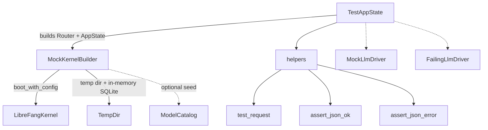

# Testing Utilities

# librefang-testing — Test Infrastructure

Provides mock infrastructure for testing API routes, kernel operations, and LLM interactions without starting a full daemon or requiring network access.

## Architecture


```mermaid
graph TD
    TA[TestAppState] -->|"builds Router + AppState"| MKB[MockKernelBuilder]
    MKB -->|"boot_with_config"| K[LibreFangKernel]
    MKB -->|"temp dir + in-memory SQLite"| TMP[TempDir]
    MKB -.->|"optional seed"| MC[ModelCatalog]
    TA --> H[helpers]
    H --> test_request
    H --> assert_json_ok
    H --> assert_json_error
    TA -.-> MLD[MockLlmDriver]
    TA -.-> FLD[FailingLlmDriver]
```

The module has four components that layer on each other:

1. **`MockKernelBuilder`** — boots a real `LibreFangKernel` with minimal config (in-memory SQLite, temp directory, networking disabled).
2. **`TestAppState`** — wraps the kernel in a production-equivalent `AppState` and exposes an axum `Router` for route-level testing.
3. **`MockLlmDriver` / `FailingLlmDriver`** — fake LLM providers that return canned responses or always-error, with call recording for assertions.
4. **Helper functions** — `test_request`, `assert_json_ok`, `assert_json_error` for building HTTP requests and asserting on responses.

---

## MockKernelBuilder

Boots a real `LibreFangKernel` instance suitable for testing. Uses in-memory SQLite and a temporary directory, with networking disabled to eliminate external dependencies.

### Basic usage

```rust
let (kernel, _tmp) = MockKernelBuilder::new().build();
// _tmp must stay in scope — dropping it deletes the temp directory
```

`build()` returns `(Arc<LibreFangKernel>, TempDir)`. The `TempDir` guard must remain alive for the lifetime of the test. The kernel has `set_self_handle` called on it, so internal `kernel_handle()` lookups (used by `send_message_*`, agent forking) work the same as in production.

### Custom configuration

```rust
let (kernel, _tmp) = MockKernelBuilder::new()
    .with_config(|cfg| {
        cfg.default_model.provider = "test".into();
    })
    .build();
```

`with_config` accepts a closure that mutates the `KernelConfig` before boot. The builder sets sensible defaults first (`home_dir`, `data_dir`, `network_enabled = false`, SQLite path), then applies your closure, then boots.

### Catalog seeding

```rust
let (kernel, _tmp) = MockKernelBuilder::new()
    .with_catalog_seed(test_catalog_baseline())
    .build();
```

By default, `LibreFangKernel::boot_with_config` runs `sync_registry` which fetches from `github.com/librefang-registry`. This is flaky on CI (rate limits, network partitions). `with_catalog_seed` replaces whatever catalog the network fetch produced with a deterministic set of providers and models.

**`test_catalog_baseline()`** returns a minimal `(Vec<ProviderInfo>, Vec<ModelCatalogEntry>)` containing the `openai` provider and `gpt-4o-mini` model. This covers the model IDs referenced by the `librefang-api` integration test suite. Add entries to it as tests grow.

### Convenience function

`test_kernel()` is equivalent to `MockKernelBuilder::new().build()`.

### Process-shared secrets

The builder installs two process-wide environment variables via `Once`-guarded initialization:

| Variable | Purpose |
|---|---|
| `LIBREFANG_VAULT_KEY` | Stable vault master key (prevents parallel tests racing on the keyring file) |
| `LIBREFANG_STATE_SECRET` | OAuth state HMAC secret (required when `external_auth.enabled = true`) |

Both are set to 32 zero bytes (base64-encoded). The value is irrelevant; only stability matters. They are set only if the variable is not already present in the environment, so you can override them.

---

## TestAppState

Wraps `MockKernelBuilder` output into a production-equivalent `AppState` and provides an axum `Router` wired with all API routes.

### Basic usage

```rust
let test = TestAppState::new();
let router = test.router();

// Use tower::ServiceExt to send requests
let response = router
    .oneshot(test_request(Method::GET, "/api/health", None))
    .await
    .unwrap();

let json = assert_json_ok(response).await;
```

### Construction options

| Method | Description |
|---|---|
| `new()` | Default mock kernel |
| `with_builder(builder)` | Custom `MockKernelBuilder` |
| `from_kernel(kernel, tmp)` | Wrap an existing kernel (you hold the `TempDir`) |

### Auth configuration

```rust
let test = TestAppState::new()
    .with_api_key("test-secret-key");

let test = TestAppState::new()
    .with_user_api_keys(vec![ApiUserAuth { /* ... */ }]);
```

`with_api_key` sets the global API key on the auth middleware's runtime lock. `with_user_api_keys` sets the per-user key list. These live on `AppState` runtime locks — they are **not** written to disk. If a test exercises config-reload from disk, bake keys into the kernel config via `MockKernelBuilder::with_config` instead.

### Config file snapshot

```rust
let test = TestAppState::new()
    .with_config_path(PathBuf::from("/tmp/test_config.toml"));
```

Serializes the kernel's internal `KernelConfig` to a TOML file at the given path. Useful for tests that exercise `POST /api/config/reload`.

### Router coverage

`router()` returns an axum `Router` nested under `/api` with routes for:

- System: `health`, `health/detail`, `status`, `version`, `metrics`
- Agents CRUD: `agents`, `agents/{id}`, `agents/{id}/message`, `agents/{id}/stop`, `agents/{id}/model`, `agents/{id}/mode`
- Sessions: `agents/{id}/session`, `agents/{id}/sessions`, `agents/{id}/session/reset`, `sessions`
- Tools & Skills: `agents/{id}/tools`, `agents/{id}/skills`, `tools`, `tools/{name}`, `skills`, `skills/create`, `commands`
- Config: `config`, `config/schema`, `config/set`, `config/reload`
- Memory: `memory/search`, `memory/stats`
- Budget: `usage`, `usage/summary`
- Models & Providers: `models`, `providers`
- Profiles: `profiles`, `profiles/{name}`

### Accessing internals

- `app_state()` — returns `Arc<AppState>`
- `tmp_path()` — returns the temp directory path
- `into_parts()` — returns `(Arc<AppState>, TempDir, Option<PathBuf>)` for full ownership

### AppState wiring details

`build_state` constructs `AppState` with production-equivalent wiring: idempotency store backed by the kernel's SQLite pool, rate limiters, webhook store, media driver cache, trusted proxy config (disabled by default), and all the `DashMap` caches. This ensures tests exercise the same code paths as production.

---

## MockLlmDriver

A configurable fake LLM provider implementing the `LlmDriver` trait. Returns canned responses, records all calls, and supports streaming.

### Canned responses

```rust
let driver = MockLlmDriver::new(vec![
    "First response".into(),
    "Second response".into(),
]);

// Or a single repeating response:
let driver = MockLlmDriver::with_response("Always this");
```

Responses are returned in order. When the list is exhausted, the driver wraps around to the last response indefinitely.

### Call recording

```rust
let driver = MockLlmDriver::with_response("hi");
// ... invoke driver.complete() ...

let calls = driver.recorded_calls();
assert_eq!(calls.len(), 1);
assert_eq!(calls[0].model, "gpt-4o-mini");
assert_eq!(calls[0].message_count, 3);
assert_eq!(calls[0].tool_count, 0);
```

Each `RecordedCall` captures: `model`, `message_count`, `tool_count`, and `system` prompt.

### Custom token usage and stop reason

```rust
let driver = MockLlmDriver::with_response("hi")
    .with_tokens(100, 50)
    .with_stop_reason(StopReason::MaxTokens);
```

Defaults are `input_tokens = 10`, `output_tokens = 5`, `stop_reason = EndTurn`.

### Streaming

`stream()` simulates streaming by sending a `TextDelta` event followed by `ContentComplete`. The underlying `complete()` call is recorded the same way.

### FailingLlmDriver

```rust
let driver = FailingLlmDriver::new("Something went wrong");
```

Always returns `LlmError::Api { status: 500, ... }` from `complete()`. `is_configured()` returns `false`. Use this for testing error handling paths.

---

## Helper functions

### test_request

```rust
pub fn test_request(method: Method, path: &str, body: Option<&str>) -> Request<Body>
```

Builds an HTTP request. When `body` is `Some`, sets `content-type: application/json`.

```rust
let req = test_request(Method::GET, "/api/health", None);
let req = test_request(Method::POST, "/api/agents", Some(r#"{"name": "test"}"#));
```

### assert_json_ok

```rust
pub async fn assert_json_ok(response: Response<Body>) -> serde_json::Value
```

Asserts status is `200 OK` and parses the body as JSON. Returns the `serde_json::Value`. Panics with the response body on failure.

### assert_json_error

```rust
pub async fn assert_json_error(response: Response<Body>, expected_status: StatusCode) -> serde_json::Value
```

Asserts status matches `expected_status` and parses the body as JSON. Returns the `serde_json::Value`. Panics with the response body on failure.

---

## Typical test patterns

### Route-level integration test

```rust
#[tokio::test]
async fn test_health_endpoint() {
    let test = TestAppState::new();
    let router = test.router();

    let response = router
        .oneshot(test_request(Method::GET, "/api/health", None))
        .await
        .unwrap();

    let json = assert_json_ok(response).await;
    assert_eq!(json["status"], "ok");
}
```

### Kernel-level test with custom config

```rust
#[tokio::test]
async fn test_custom_behavior() {
    let (kernel, _tmp) = MockKernelBuilder::new()
        .with_config(|cfg| {
            cfg.some_feature = true;
        })
        .build();

    // exercise kernel directly
}
```

### Testing with a seeded model catalog

```rust
let (kernel, _tmp) = MockKernelBuilder::new()
    .with_catalog_seed(test_catalog_baseline())
    .build();
// kernel.model_catalog_ref() now has gpt-4o-mini available
```

### Testing LLM interactions

```rust
let driver = MockLlmDriver::with_response("Summary text");
// inject driver into kernel/session under test
let result = some_function_that_calls_llm(&driver).await;
assert_eq!(driver.call_count(), 1);
assert_eq!(driver.recorded_calls()[0].message_count, 2);
```

---

## Re-exports

The crate root re-exports the primary API:

```rust
pub use helpers::{assert_json_error, assert_json_ok, test_request};
pub use mock_driver::{FailingLlmDriver, MockLlmDriver};
pub use mock_kernel::{test_catalog_baseline, CatalogSeed, MockKernelBuilder};
pub use test_app::TestAppState;
```