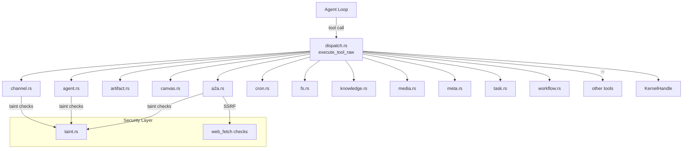

# Tool Execution

# Tool Execution Module

The `tool_runner` module implements the execution layer for all built-in agent tools. Each tool is a function that receives a JSON input payload, optional kernel handle, and contextual parameters, then returns `Result<String, ToolError>`. The dispatcher (`dispatch.rs`) routes tool invocations from the agent loop to the appropriate handler.

## Architecture Overview

## Error Contract

All tools return `ToolResult` (`Result<String, ToolError>`). This was migrated from `Result<String, String>` in PR #3576. The `ToolError` enum preserves human-readable messages while adding structured context for the HTTP layer:

| Variant | HTTP mapping | When used |
|---|---|---|
| `MissingParameter(name)` | 400 | Required parameter absent |
| `InvalidParameter { name, reason }` | 400 | Bad value, SSRF block, validation failure |
| `PermissionDenied(msg)` | 403 | Taint violation, trust gate, depth exceeded |
| `NotFound { kind, id }` | 404 | Cron job / agent not found |
| `Unavailable(capability)` | 501 | Kernel handle missing or wrong type |
| `Upstream { message, source }` | 502 | Downstream kernel / network failure |
| `Internal(msg)` | 500 | Unexpected panic, serialization failure |

The `ToolError::upstream` and `ToolError::upstream_msg` constructors wrap external errors while preserving the source chain for diagnostics.

## Security Model

Tools apply three layers of security before executing side effects.

### Taint Sinks

`check_taint_outbound_text` scans free-text fields (messages, prompts, conversation keys) for secrets/credentials before they leave the agent boundary. `check_taint_net_fetch` scans URLs for credential leaks in query strings.

Taint checks intentionally run **before** trust/authorization gates so data-exfiltration attempts always surface with the taint violation reason rather than being masked by a generic permission denial.

### SSRF Protection

`web_fetch::check_ssrf` blocks private/metadata IPs on any URL parameter before outbound requests. Tools that accept URLs (`a2a_discover`, `a2a_send`, `web_fetch`) all pass through this check.

### Trust Gates

For A2A communication, the target URL must exist in `kernel.list_a2a_agents()` — an operator-approved allowlist. An agent cannot send to an arbitrary non-private URL even if SSRF checks pass (Bug #3786).

## Submodule Reference

### `a2a.rs` — Cross-Instance Agent Communication

Two tools for the A2A (Agent-to-Agent) protocol:

- **`tool_a2a_discover`** — Fetches an agent card from a remote URL. SSRF check on the URL, no kernel required.
- **`tool_a2a_send`** — Sends a task to a remote A2A agent. Requires a kernel handle. Resolves the target by `agent_url` (direct, with SSRF + canonicalization) or `agent_name` (kernel lookup). Validates three taint sinks in order: `message`, `url`, and `session_id`. Then checks the trust gate against the approved agent list.

Key security ordering in `tool_a2a_send`: taint checks on message → taint check on URL → taint check on session_id → trust gate on target URL. This ensures a tainted-message attempt always reports data-exfil, not authorization denial.

### `agent.rs` — Inter-Agent Operations

Five tools for agents operating within the same instance:

- **`tool_agent_find`** — Searches agents by name, tag, tool, or description. Returns JSON array of matches.
- **`tool_agent_send`** — Sends a message to another agent. Supports `conversation_key` for multi-turn threads. Checks taint on `message` and `conversation_key`. Enforces inter-agent call depth via `AGENT_CALL_DEPTH` thread-local to prevent infinite A→B→C chains; returns `PermissionDenied` (not `Upstream`) so callers don't treat it as a transient 5xx failure. Uses cascade-aware kernel methods when the caller is known (issue #3044).
- **`tool_agent_spawn`** — Creates a child agent from a manifest. Builds a TOML manifest from parameters, expands parent tool names into resource-level capabilities via `tools_to_parent_capabilities`, then calls `spawn_agent_checked` for capability inheritance validation. Auto-adds `shell_exec` to tools when shell commands are specified.
- **`tool_agent_list`** — Lists all running agents.
- **`tool_agent_kill`** — Terminates an agent by ID or name.

#### Capability Inheritance

`tools_to_parent_capabilities` maps tool names to their implied resource-level capabilities:

| Tool pattern | Implied capability |
|---|---|
| `web_*` or `*` | `NetConnect("*")` |
| `shell_exec` or `*` | `ShellExec("*")` |
| `agent_spawn` or `*` | `AgentSpawn` |
| `agent_*` or `*` | `AgentMessage("*")` |
| `memory_*` or `*` | `MemoryRead("*")` + `MemoryWrite("*")` |

Without this expansion, `validate_capability_inheritance` would reject legitimate child capabilities because `ToolInvoke("web_fetch")` and `NetConnect("*")` are different enum variants.

### `artifact.rs` — Artifact Store Reading

- **`tool_read_artifact`** — Reads bytes from an artifact identified by its `sha256:` handle. Supports `offset` and `length` parameters (defaults: 0 and 4096). Length is clamped to `MAX_READ_LENGTH`. Reads run on `spawn_blocking` to avoid blocking the Tokio runtime. Returns UTF-8 text with lossy decoding for binary blobs.

### `canvas.rs` — HTML Canvas Presentation

- **`tool_canvas_present`** — Sanitizes agent-generated HTML and writes it to `workspace/output/` as a standalone HTML file.

The sanitizer (`sanitize_canvas_html`, public API) enforces:

- **Tag allowlist**: ~40 safe HTML tags (structural, formatting, media). Everything else is stripped.
- **Attribute filtering**: Removes `on*` event handlers and `style` attributes. Validates `href`/`src` URLs against `javascript:`, `vbscript:`, and non-image `data:` schemes.
- **Size limits**: Configurable via `CANVAS_MAX_BYTES` thread-local (default 512 KB). Checked both before and after sanitization.
- **Dangerous tag rejection**: Immediately rejects content containing `<script`, `<iframe`, `<form`, `<input`, etc.
- **Entity preservation**: Valid HTML entities pass through; malformed `&` sequences are escaped.

The sanitizer is `pub` because it's re-exported and tested independently — its `Result<_, String>` signature is preserved for backward compatibility, with errors mapped to `ToolError::InvalidParameter` at the tool boundary.

### `channel.rs` — Multi-Channel Messaging

- **`tool_channel_send`** — Sends messages, media, files, or polls through configured channels (email, Telegram, Slack, Discord, etc.).

This tool handles five distinct payload types, checked in priority order:

1. **Image** (`image_url`) — sends with optional caption; taint-checks the caption
2. **File by URL** (`file_url`) — sends with optional caption and filename
3. **File by path** (`file_path`) — reads from workspace, detects MIME type from extension, enforces 10 MB limit
4. **Poll** (`poll_question`) — requires 2–10 `poll_options`; optional quiz mode with correct answer index
5. **Text** (`message`) — plain text, with email subject support for the `email` channel

After a successful send, the tool mirrors the message into the recipient agent's session via `mirror_channel_send_to_session`, creating a `SessionId::for_sender_scope` entry so the recipient has context about what was sent.

Still uses `Result<String, String>` (not yet migrated to `ToolError`).

### `cron.rs` — Scheduled Jobs

Three tools wrapping `KernelHandle::cron_*` methods:

- **`tool_cron_create`** — Creates a cron job. Overrides `peer_id` with the authenticated `sender_id` to prevent injection. Requires `caller_agent_id`.
- **`tool_cron_list`** — Lists jobs owned by the calling agent.
- **`tool_cron_cancel`** — Cancels a job after verifying ownership (queries `cron_list` then checks the job ID exists in the agent's set).

All three require a kernel handle and `caller_agent_id`. Missing agent ID returns `MissingParameter("agent_id")` — surfaced as a 400 at the HTTP layer because a missing `X-LibreFang-Agent-Id` header is a user-input gap, not a server bug.

### `definitions.rs` — Tool Schema Registry

`builtin_tool_definitions()` returns the full set of ~75 tool schemas (cached via `OnceLock`). Each `ToolDefinition` contains `name`, `description`, and `input_schema` (JSON Schema).

`ALWAYS_NATIVE_TOOLS` defines the ~23 tools always included in LLM requests regardless of lazy-loading settings. This avoids ~6k tokens of schema overhead per turn for rarely-used tools (issue #3044). The remaining tools are discoverable via `tool_load` and `tool_search`.

`select_native_tools()` filters the full definition list down to the always-native subset and warns if any expected tool is missing from the definitions.

## Execution Context

Tools receive context through two patterns:

1. **Direct parameters** — `input: &serde_json::Value`, `kernel: Option<&Arc<dyn KernelHandle>>`
2. **Tool-specific context** — `caller_agent_id`, `sender_id`, `workspace_root`, `parent_allowed_tools`, `additional_roots`

The dispatcher (`execute_tool_raw` in `dispatch.rs`) extracts these from `ToolExecContext` and passes them to the appropriate handler. Tools that don't need a kernel use `require_kernel` (untyped) or `require_kernel_typed` (typed trait). Tools that must have an agent identity use `caller_agent_id` with the `caller_agent_id_missing` helper.

## Adding a New Tool

1. Create a function in the appropriate submodule (or a new file) with signature `async fn tool_xxx(input: &serde_json::Value, ...) -> ToolResult`.
2. Add a `ToolDefinition` entry in `definitions.rs` with the tool name, description, and JSON Schema.
3. If the tool should always be available without lazy-loading, add its name to `ALWAYS_NATIVE_TOOLS`.
4. Wire the tool into `execute_tool_raw` in `dispatch.rs`.
5. Apply security checks as needed:
   - Taint checks on free-text outbound fields
   - SSRF checks on URL parameters
   - Trust gates for external communication targets
   - Capability checks for privileged operations