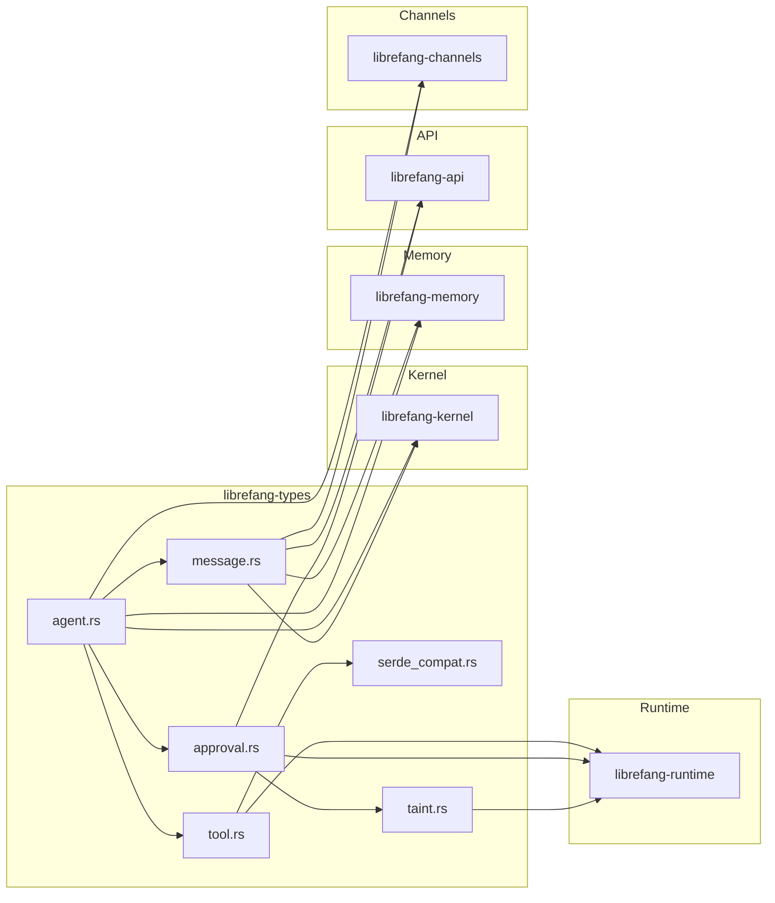

# Type Definitions

# LibreFang Type Definitions (`librefang-types`)

## Overview

The `librefang-types` crate is the canonical source of truth for all shared data structures in the LibreFang Agent Operating System. Every other crate in the workspace—kernel, runtime, memory substrate, API server, channels, and drivers—depends on these types. The crate contains no business logic; it defines only the shapes of data, serialization contracts, and validation rules.

The crate version is derived from the workspace `Cargo.toml` at compile time and exported as the `VERSION` constant.

## Module Organization

```
librefang-types/src/
├── lib.rs              # Crate root, VERSION, truncate_str()
├── agent.rs            # Agent identity, manifests, scheduling, modes
├── approval.rs         # Execution approval, TOTP, channel rules
├── capability.rs       # Capability grants and glob matching
├── comms.rs            # Inter-agent communication types
├── config.rs           # Global configuration types
├── error.rs            # LibreFangError enum
├── event.rs            # Event bus types
├── goal.rs             # Goal representation
├── i18n.rs             # Internationalization message lookup
├── manifest_signing.rs # HMAC-based manifest signature verification
├── media.rs            # Media requests (TTS, images, video)
├── memory.rs           # Memory substrate types, vector operations
├── message.rs          # Message types, TokenUsage
├── model_catalog.rs     # Provider and model registry
├── registry_schema.rs  # Registry schema definitions
├── scheduler.rs        # Cron scheduling, job definitions
├── serde_compat.rs     # Lenient deserializers for graceful migration
├── subagent.rs          # Subagent spawning and lifecycle
├── taint.rs            # Taint tracking for data flow analysis
├── tool.rs             # ToolDefinition, ToolResult, ToolCall
├── tool_compat.rs      # Tool name normalization
├── tool_policy.rs      # Tool execution policies
├── webhook.rs          # Webhook payloads
└── workflow_template.rs # Workflow template types
```

## Core Utilities

### `truncate_str()`

```rust
pub fn truncate_str(s: &str, max_bytes: usize) -> &str
```

Safely truncates a string to at most `max_bytes` bytes, **without splitting a UTF-8 character**. This function exists because naive byte-slice truncation (`&s[..max_bytes]`) panics when `max_bytes` falls mid-character—exactly what happened in production with em dashes (3-byte UTF-8 sequences) in kernel and session logs.

```rust
// Safe: stops before the em dash
truncate_str("summary — with details", 19)  // → "summary " (20th byte is mid-char)

// Unsafe alternatives would panic:
"summary — with details".as_bytes()[19..]  // panics: not a valid UTF-8 boundary
```

## Agent Module (`agent.rs`)

### Identity Types

| Type | Purpose |
|------|---------|
| `UserId` | Unique user identifier (UUID v4) |
| `AgentId` | Unique agent instance identifier (UUID v4 or v5) |
| `SessionId` | Unique session identifier |

**Deterministic ID Derivation**

`AgentId` provides two deterministic constructors used by Hand agents:

- `AgentId::from_hand_id(hand_id)` — UUID v5 (SHA-1) with a fixed namespace, so the same `hand_id` always maps to the same UUID across restarts
- `AgentId::from_hand_agent(hand_id, role, instance_id)` — extends the above to support multiple instances of the same hand; `instance_id = None` uses the legacy format for backward compatibility (no orphaned cron jobs or memory keys)

`SessionId::for_channel(agent_id, channel)` derives a deterministic UUID v5 per `(agent, channel)` pair, ensuring sessions persist correctly across daemon restarts:

```rust
let telegram_session = SessionId::for_channel(agent, "telegram");
let cron_session    = SessionId::for_channel(agent, "cron");
```

### Lifecycle State

```rust
pub enum AgentState {
    Created,    // Spawned but not yet running
    Running,    // Actively processing events
    Suspended,  // Paused
    Terminated, // Cannot be resumed
    Crashed,    // Awaiting recovery
}
```

### Permission Modes

```rust
pub enum AgentMode {
    Observe,  // Read-only, no tools
    Assist,   // Only read-only tools (file_read, file_list, memory_*, web_*)
    Full,     // All granted tools
}
```

`AgentMode::filter_tools()` applies these restrictions to a `Vec<ToolDefinition>`:

```rust
// In Assist mode, shell_exec is stripped
let tools = mode.filter_tools(all_tools);
```

### Scheduling Modes

```rust
pub enum ScheduleMode {
    Reactive,                          // Wake on message/event (default)
    Periodic { cron: String },          // Wake on cron expression
    Proactive { conditions: Vec<String> }, // Monitor thresholds
    Continuous { check_interval_secs }, // Persistent loop
}
```

### Agent Manifest

The `AgentManifest` is the complete configuration for an agent, typically loaded from a TOML file on disk. Key fields:

```toml
name = "support-bot"
version = "1.0.0"
module = "builtin:chat"

[model]
provider = "anthropic"
model = "claude-sonnet-4-20250514"
system_prompt = "You are a helpful support agent."

[model.fallback_models]
# Fallback chain tried in order on primary failure

[resources]
max_memory_bytes = 536_870_912  # 512 MB

[capabilities]
tools = ["file_read", "memory_recall"]
network = ["api.anthropic.com:443"]

[autonomous]
quiet_hours = "0 22 * * *"    # No activity 10pm–midnight
max_iterations = 50
heartbeat_interval_secs = 30
```

**Tool Profiles** expand to tool lists and implied capabilities:

| Profile | Tool Count | Network | Shell | Agent Comms |
|---------|-----------|---------|-------|-------------|
| `Minimal` | 2 | ❌ | ❌ | ❌ |
| `Coding` | 5 | ✅ | ✅ | ❌ |
| `Research` | 4 | ✅ | ❌ | ❌ |
| `Messaging` | 5 | ❌ | ❌ | ✅ |
| `Automation` | 11 | ✅ | ✅ | ✅ |
| `Full` | wildcard | ✅ | ✅ | ✅ |

**Resource Quotas** cap an agent's consumption:

```rust
pub struct ResourceQuota {
    pub max_memory_bytes: u64,            // Default: 256 MB
    pub max_cpu_time_ms: u64,              // Default: 30 seconds
    pub max_tool_calls_per_minute: u32,   // Default: 60
    pub max_llm_tokens_per_hour: u64,     // 0 = unlimited
    pub max_cost_per_hour_usd: f64,       // 0.0 = unlimited
    pub max_cost_per_day_usd: f64,
    pub max_cost_per_month_usd: f64,
}
```

**Autonomous Configuration** guards continuous agents:

```rust
pub struct AutonomousConfig {
    pub quiet_hours: Option<String>,       // Cron for no-activity periods
    pub max_iterations: u32,               // Per invocation
    pub max_restarts: u32,                 // Before permanent stop
    pub heartbeat_interval_secs: u64,      // Default: 30
    pub heartbeat_timeout_secs: Option<u32>, // Override default 2x interval
    pub heartbeat_channel: Option<String>, // Notification channel
}
```

### Model Routing

`ModelRoutingConfig` auto-selects models based on prompt complexity:

```rust
pub struct ModelRoutingConfig {
    pub simple_model: String,    // Used below simple_threshold
    pub medium_model: String,     // Between thresholds
    pub complex_model: String,     // Above complex_threshold
    pub simple_threshold: u32,    // Token count (default: 100)
    pub complex_threshold: u32,   // Token count (default: 500)
}
```

### `extra_params` for Provider Extensions

`ModelConfig` supports provider-specific extension parameters via `extra_params`, which are flattened into the API request body:

```rust
pub struct ModelConfig {
    // ... standard fields ...
    
    /// Provider-specific parameters merged into API request body.
    /// Serialized last, so these take precedence over standard fields.
    #[serde(default, flatten)]
    pub extra_params: HashMap<String, serde_json::Value>,
}
```

Example: Qwen 3.6's `enable_memory` parameter:

```toml
[model]
provider = "qwen"
model = "qwen3.6"
enable_memory = true
memory_max_window = 50
```

## Approval Module (`approval.rs`)

The approval system pauses agents when they attempt dangerous operations and waits for human authorization.

### Risk Levels

```rust
pub enum RiskLevel {
    Low,
    Medium,
    High,
    Critical,
}
```

Each level maps to an emoji for dashboard/chat display (`RiskLevel::emoji()`).

### Approval Decisions

```rust
pub enum ApprovalDecision {
    Approved,
    Denied,
    TimedOut,
    ModifyAndRetry { feedback: String },  // Human requests changes
    Skipped,                              // Timeout fallback
}
```

The `ModifyAndRetry` variant is the key distinction from simple approve/deny—it lets a human guide the agent without blocking it entirely.

### Approval Policy

```rust
pub struct ApprovalPolicy {
    pub require_approval: Vec<String>,    // Tools needing approval
    pub timeout_secs: u64,                // Auto-deny window (10–300s)
    pub auto_approve_autonomous: bool,
    pub trusted_senders: Vec<String>,     // Skip approval for these users
    pub channel_rules: Vec<ChannelToolRule>,
    pub timeout_fallback: TimeoutFallback,
    pub second_factor: SecondFactor,      // TOTP support
    pub totp_tools: Vec<String>,          // Tools requiring TOTP
    pub routing: Vec<ApprovalRoutingRule>,
}
```

**Boolean Shorthand**: The `require_approval` field accepts a boolean in config:

```toml
require_approval = false  # → empty list, no approvals needed
require_approval = true   # → default set ["shell_exec", "file_write", "file_delete", "apply_patch"]
```

### Channel Tool Rules

Per-channel authorization controls which tools execute based on where the request originated:

```rust
pub struct ChannelToolRule {
    pub channel: String,           // "telegram", "discord", etc.
    pub allowed_tools: Vec<String>,
    pub denied_tools: Vec<String>, // Takes precedence over allowed
}
```

Glob patterns work in allow/deny lists (`file_*`, `*_exec`).

### TOTP Second Factor

```rust
pub enum SecondFactor {
    None,
    Totp,
}
```

When enabled, critical tool approvals require a valid TOTP code. A configurable grace period avoids repeated prompts:

```toml
[approval]
second_factor = "totp"
totp_issuer = "LibreFang"
totp_grace_period_secs = 300  # 5-minute window after successful verify
totp_tools = ["shell_exec", "file_delete"]  # Specific tools only
```

### Timeout Fallback

```rust
pub enum TimeoutFallback {
    Deny,     // Default: reject
    Skip,     // Agent continues without the tool
    Escalate { extra_timeout_secs: u64 },  // Re-notify
}
```

## Taint Tracking (`taint.rs`)

Taint tracking enforces data flow security. Labels mark sensitive data (e.g., `PASSWORD`, `API_KEY`), and sinks check whether tainted data would be exfiltrated:

```rust
// Example: network fetch blocks if URL contains a tainted secret
check_taint_net_fetch(url, &taint_labels)?;

// Example: shell exec blocks if command contains tainted data
check_taint_shell_exec(&mut cmd, &taint_labels)?;
```

## Message Types (`message.rs`)

The message system represents all communication within the system. Key types include:

- `Message` variants for user, assistant, system, and tool messages
- `TokenUsage` for tracking LLM consumption
- Text extraction helpers for session persistence

## Serialization Compatibility (`serde_compat.rs`)

Lenient deserializers allow the codebase to evolve without breaking existing persisted data:

- `map_lenient` — ignores unknown fields in maps
- `vec_lenient` — tolerates malformed list entries
- `exec_policy_lenient` — accepts both boolean and table forms

## Tool Definitions (`tool.rs`)

```rust
pub struct ToolDefinition {
    pub name: String,
    pub description: String,
    pub input_schema: serde_json::Value,
}

pub struct ToolResult {
    pub success: bool,
    pub output: Option<String>,
    pub error: Option<String>,
    pub metadata: HashMap<String, serde_json::Value>,
}

pub struct ToolCall {
    pub id: String,
    pub name: String,
    pub arguments: serde_json::Value,
}
```

Special states like `waiting_approval()` create results that pause the agent loop until human resolution.

## Media Types (`media.rs`)

Request types for media generation:

- `MediaImageRequest` — image generation
- `MediaTtsRequest` — text-to-speech
- `MediaVideoRequest` — video generation

Each validates input constraints (e.g., TTS speed range, image dimensions).

## Scheduler (`scheduler.rs`)

```rust
pub enum Job {
    Cron { name, schedule, action },
    AgentTurn { agent_id, timeout },
    OneShot { name, at, action },
    Periodic { name, interval, action },
}
```

Validation ensures cron expressions are parseable, names are safe, and timeouts are reasonable.

## Integration with Other Crates



**Key dependencies:**

| Crate | Uses From librefang-types |
|-------|---------------------------|
| `librefang-kernel` | `AgentId`, `AgentState`, `AgentManifest`, `SessionId`, `Message` |
| `librefang-runtime` | `ToolDefinition`, `ToolResult`, `ToolCall`, `ApprovalDecision`, taint checks |
| `librefang-memory` | `Message`, `SessionId`, memory types |
| `librefang-api` | `ApprovalRequest`, `ApprovalResponse`, `AgentManifest` |
| `librefang-channels` | `Message`, `i18n::get_message()`, `SessionId` |
| `librefang-hands` | `AgentId::from_hand_id()`, `AgentId::from_hand_agent()` |

## Versioning and Migration

The `serde_compat` module is critical for graceful schema evolution. When a new field is added to a struct, existing persisted JSON/TOML without that field deserializes correctly via `#[serde(default)]`. The lenient deserializers additionally ignore unknown fields, allowing forward compatibility.

## Validation Patterns

Types that cross trust boundaries (e.g., approval requests from external channels) implement `validate()` methods:

```rust
impl ApprovalRequest {
    pub fn validate(&self) -> Result<(), String> {
        // Check string lengths, character constraints, range bounds
    }
}

impl ChannelToolRule {
    pub fn validate(&self) -> Result<(), String>;
}

impl ApprovalPolicy {
    pub fn validate(&self) -> Result<(), String>;
}
```

These prevent malformed data from entering the system even if the wire protocol is violated.