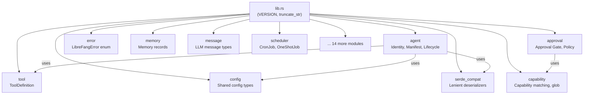
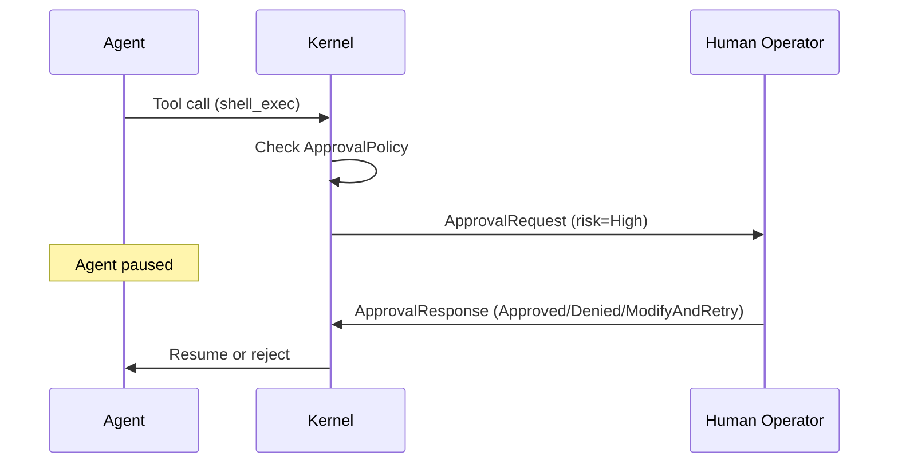

# Type Definitions

# `librefang-types` — Core Type Definitions

## Purpose

This crate defines every shared data structure used across the LibreFang Agent Operating System — the kernel, runtime, memory substrate, wire protocol, channels, and tooling. It contains **no business logic**: only types, traits, constants, and a small set of pure utility functions.

Every other crate in the workspace depends on `librefang-types`. Changes here ripple outward, so backward-compatible serde defaults and `#[serde(default)]` annotations are used liberally to tolerate missing fields from older configurations.

## Module Map



The full submodule list:

| Module | Purpose |
|--------|---------|
| `agent` | Agent identity, manifest, lifecycle states, scheduling, experiments |
| `approval` | Execution approval gate — requests, policy, audit, TOTP |
| `capability` | Capability matching and glob patterns |
| `comms` | Inter-agent communication primitives |
| `config` | Shared configuration types (`ExecPolicy`, `ThinkingConfig`, `ResponseFormat`, etc.) |
| `error` | Unified `LibreFangError` enum |
| `event` | Event bus types |
| `goal` | Goal/task tracking |
| `i18n` | Internationalization support |
| `manifest_signing` | Cryptographic manifest signing and verification |
| `media` | Media/attachment types |
| `memory` | Memory substrate records and extraction |
| `message` | LLM message types (`TokenUsage`, etc.) |
| `model_catalog` | LLM model catalog entries |
| `registry_schema` | Agent registry serialization |
| `scheduler` | Cron and one-shot job definitions |
| `serde_compat` | Lenient deserializers for evolving schemas |
| `subagent` | Sub-agent spawning types |
| `taint` | Input taint tracking and validation |
| `tool` | `ToolDefinition` and schema normalization |
| `tool_compat` | Tool name migration helpers |
| `tool_policy` | Per-tool execution policies |
| `webhook` | Webhook payload types |
| `workflow_template` | Workflow/template definitions |

---

## Core Identity Types

### `AgentId`

A UUID-based unique identifier for agent instances. Supports two generation modes:

- **Random** (`AgentId::new()`) — UUID v4, for standard agents.
- **Deterministic** (`AgentId::from_hand_id()` / `AgentId::from_hand_agent()`) — UUID v5 with a fixed namespace, so the same logical entity always maps to the same UUID across daemon restarts.

```rust
// Random — unique each time
let id = AgentId::new();

// Deterministic — same input always yields the same UUID
let hand_agent = AgentId::from_hand_agent("researcher", "analyst", None);
let instance_agent = AgentId::from_hand_agent("researcher", "analyst", Some(instance_uuid));
```

The `from_hand_agent` method has a backward-compatibility contract: when `instance_id` is `None`, it hashes `"{hand_id}:{role}"` (the legacy format). When `Some`, it hashes `"{hand_id}:{role}:{instance_id}"`. This ensures existing single-instance hands retain their original IDs after upgrades.

### `UserId`

Wrapper around a UUID v4. Used to identify human operators.

### `SessionId`

Identifies a conversation session. Two construction modes:

- **Random** (`SessionId::new()`) — fresh session per call.
- **Deterministic** (`SessionId::for_channel(agent_id, channel)`) — UUID v5 derived from agent ID + channel name, so the same agent-channel pair always resumes the same session across restarts.

### `SessionLabel`

A validated human-readable label for sessions (e.g., `"support inbox"`, `"research"`). Constraints:

- 1–128 characters after trimming
- Only alphanumeric characters, spaces, hyphens, and underscores
- Rejected if empty, too long, or containing special characters

---

## Agent Manifest System

`AgentManifest` is the central configuration object that defines everything about an agent. It's typically loaded from TOML on disk and deserialized with lenient defaults.

### Key Fields

| Field | Type | Purpose |
|-------|------|---------|
| `name` | `String` | Human-readable agent name |
| `module` | `String` | Agent module path (WASM/Python/builtin) |
| `schedule` | `ScheduleMode` | How the agent wakes up |
| `session_mode` | `SessionMode` | Session reuse strategy for automated invocations |
| `model` | `ModelConfig` | Primary LLM configuration |
| `fallback_models` | `Vec<FallbackModel>` | Chain of fallback LLMs |
| `resources` | `ResourceQuota` | Memory, CPU, token, and cost limits |
| `capabilities` | `ManifestCapabilities` | Declared capability grants |
| `profile` | `Option<ToolProfile>` | Named tool preset |
| `tools` | `HashMap<String, ToolConfig>` | Per-tool configuration |
| `tool_allowlist` / `tool_blocklist` | `Vec<String>` | Tool filtering |
| `exec_policy` | `Option<ExecPolicy>` | Shell execution policy override |
| `autonomous` | `Option<AutonomousConfig>` | 24/7 agent guardrails |
| `routing` | `Option<ModelRoutingConfig>` | Auto model selection by complexity |
| `thinking` | `Option<ThinkingConfig>` | Per-agent extended thinking override |
| `response_format` | `Option<ResponseFormat>` | LLM structured output |
| `allowed_plugins` | `Vec<String>` | Plugin allowlist |
| `context_injection` | `Vec<ContextInjection>` | Extra context prepended to sessions |
| `is_hand` | `bool` | Whether spawned by a Hand |

### TOML Deserialization

The manifest uses `#[serde(default)]` on every field plus custom lenient deserializers from the `serde_compat` module. This means:

- **Missing fields** get sensible defaults
- **Type mismatches** (e.g., a string where a list is expected) silently fall back to defaults instead of failing
- **Unknown fields** are ignored

The `model.system_prompt` field supports both single-line and multi-line TOML strings. Multi-line prompts with triple quotes (`"""`) are the recommended format from the dashboard wizard, preserving newlines, embedded quotes, and code blocks.

The `model` field accepts either `model` or `name` as the model identifier key (via `#[serde(alias = "name")]`).

---

## Tool Profiles

`ToolProfile` is a named preset that expands to a concrete tool list and derived capabilities:

| Profile | Tools |
|---------|-------|
| `Minimal` | `file_read`, `file_list` |
| `Coding` | `file_read`, `file_write`, `file_list`, `shell_exec`, `web_fetch` |
| `Research` | `web_fetch`, `web_search`, `file_read`, `file_write` |
| `Messaging` | `agent_send`, `agent_list`, `channel_send`, `memory_store`, `memory_list`, `memory_recall` |
| `Automation` | All of Coding + Messaging |
| `Full` / `Custom` | `["*"]` (all tools) |

Each profile's `implied_capabilities()` method derives a `ManifestCapabilities` struct — for example, `Coding` implies `network: ["*"]` and `shell: ["*"]`, while `Messaging` implies `agent_spawn: true`.

---

## Agent Lifecycle & Modes

### `AgentState`

```rust
pub enum AgentState {
    Created,    // Spawned but not yet started
    Running,    // Actively processing
    Suspended,  // Paused
    Terminated, // Cannot be resumed
    Crashed,    // Awaiting recovery
}
```

### `AgentMode` — Permission Levels

Controls what tools an agent can access:

| Mode | Behavior |
|------|----------|
| `Observe` | No tools at all |
| `Assist` | Read-only tools only: `file_read`, `file_list`, `memory_list`, `memory_recall`, `web_fetch`, `web_search`, `agent_list` |
| `Full` | All granted tools (default) |

`AgentMode::filter_tools()` applies the restriction to a `Vec<ToolDefinition>` at runtime.

### `ScheduleMode`

| Variant | Trigger |
|---------|---------|
| `Reactive` | Message/event arrival (default) |
| `Periodic { cron }` | Cron schedule |
| `Proactive { conditions }` | Condition threshold monitoring |
| `Continuous { check_interval_secs }` | Persistent loop (default: 300s) |

### `SessionMode`

Controls session behavior for non-channel (automated) invocations:

- `Persistent` — reuse the agent's session (default, backward-compatible)
- `New` — fresh session per invocation

---

## Model Configuration

### `ModelConfig`

Primary LLM settings per agent:

- `provider`, `model` (or `name` alias) — which LLM to use
- `max_tokens`, `temperature` — generation parameters
- `system_prompt` — agent's persona/instructions
- `api_key_env`, `base_url` — provider-specific overrides
- `extra_params` — `HashMap<String, serde_json::Value>` flattened into the API request body via `#[serde(flatten)]`. Used for provider-specific features (e.g., Qwen's `enable_memory`). Conflicting keys override standard fields.

### `ModelRoutingConfig`

Auto-selects between cheap/mid/expensive models based on prompt token count:

```toml
[routing]
simple_model = "claude-haiku-4-5-20251001"
medium_model = "claude-sonnet-4-20250514"
complex_model = "claude-sonnet-4-20250514"
simple_threshold = 100
complex_threshold = 500
```

### `FallbackModel`

Defines a fallback chain. If the primary model fails, each fallback is tried in order. Has the same fields as `ModelConfig` minus `system_prompt`/`max_tokens`/`temperature`.

### `AutonomousConfig`

Guardrails for 24/7 autonomous agents:

- `quiet_hours` — cron expression for downtime
- `max_iterations` — per-invocation loop cap (default: 50)
- `max_restarts` — crash recovery limit (default: 10)
- `heartbeat_interval_secs` — health check frequency (default: 30)
- `heartbeat_timeout_secs` — optional per-agent timeout override
- `heartbeat_keep_recent` — how many NO_REPLY turns to keep
- `heartbeat_channel` — where to send heartbeat alerts

---

## Approval System

The approval module implements a human-in-the-gate system for dangerous operations. When an agent attempts a tool in the approval list, execution pauses until a human responds.

### Core Flow



### `ApprovalDecision`

| Variant | Serializable As | Behavior |
|---------|----------------|----------|
| `Approved` | `"approved"` | Proceed |
| `Denied` | `"denied"` | Block, agent notified |
| `TimedOut` | `"timed_out"` | Auto-deny after timeout |
| `Skipped` | `"skipped"` | Skip tool, agent continues |
| `ModifyAndRetry { feedback }` | `{"type":"modify_and_retry","feedback":"..."}` | Human requests modification |

Simple variants serialize as plain strings for backward compatibility. `ModifyAndRetry` serializes as an object. The custom deserializer handles both formats transparently.

### `ApprovalPolicy`

Configured globally and optionally per-agent:

- **`require_approval`** — list of tool names (or `true`/`false` shorthand). Default: `["shell_exec", "file_write", "file_delete", "apply_patch"]`
- **`timeout_secs`** — auto-deny window (10–300 seconds, default 60)
- **`auto_approve`** — shorthand: if `true`, clears the require list at boot
- **`trusted_senders`** — user IDs that bypass the approval gate
- **`channel_rules`** — per-channel tool allow/deny lists with glob support
- **`timeout_fallback`** — behavior on timeout: `Deny`, `Skip`, or `Escalate`
- **`second_factor`** — TOTP verification: `None`, `Totp`, `Login`, or `Both`
- **`totp_tools`** — which tools require TOTP (empty = all in `require_approval`)
- **`totp_grace_period_secs`** — skip re-verification within this window (max 3600)
- **`routing`** — route specific tool approvals to specific notification targets

### `ChannelToolRule`

Per-channel tool authorization with glob patterns:

```toml
[[approval.channel_rules]]
channel = "telegram"
allowed_tools = ["file_*"]
denied_tools = ["shell_exec"]
```

Evaluation rules:
1. If the tool matches any denied pattern → **denied** (deny-wins)
2. If there's an allow list, the tool must match at least one pattern → otherwise **denied**
3. Empty allow + no deny match → **no opinion** (falls through to default policy)

Wildcard patterns use `capability::glob_matches` — supports a single `*` (e.g., `"file_*"`, `"*_exec"`, `"*"`).

### `RiskLevel`

| Level | Emoji | Meaning |
|-------|-------|---------|
| `Low` | ℹ️ | Informational |
| `Medium` | ⚠️ | Caution |
| `High` | 🚨 | Dangerous operation |
| `Critical` | ☠️ | Destructive/unrecoverable |

### Validation

Both `ApprovalRequest` and `ApprovalPolicy` expose `validate()` methods that check field bounds (tool name length, description length, timeout range, sender counts, etc.). The kernel calls these before persisting or acting on untrusted input.

---

## Session Management

`SessionId::for_channel(agent_id, channel)` derives a deterministic UUID v5 session key. This is the mechanism by which the same Telegram/Discord/WhatsApp conversation always resumes the same agent context across daemon restarts.

The `SessionMode` field on the manifest controls behavior for non-channel invocations (cron ticks, triggers, `agent_send` calls):

- `Persistent` — always resume the existing session
- `New` — create a fresh session each time

---

## Resource Quotas

`ResourceQuota` defines per-agent limits:

| Field | Default |
|-------|---------|
| `max_memory_bytes` | 256 MB |
| `max_cpu_time_ms` | 30,000 ms |
| `max_tool_calls_per_minute` | 60 |
| `max_llm_tokens_per_hour` | 0 (unlimited) |
| `max_network_bytes_per_hour` | 100 MB |
| `max_cost_per_hour_usd` | 0.0 (unlimited) |
| `max_cost_per_day_usd` | 0.0 (unlimited) |
| `max_cost_per_month_usd` | 0.0 (unlimited) |

---

## Prompt Experiments (A/B Testing)

The types define a complete A/B testing framework for prompt variants:

- **`PromptExperiment`** — defines an experiment with traffic splits, success criteria, and variants
- **`ExperimentVariant`** — maps to a `PromptVersion`
- **`SuccessCriteria`** — configurable pass conditions (user helpful, no tool errors, non-empty, custom score)
- **`ExperimentVariantMetrics`** — aggregated results per variant
- **`ExperimentStatus`** — lifecycle: `Draft` → `Running` → `Paused` → `Completed`

---

## Hook Events

`HookEvent` defines interception points in the agent loop:

| Event | When |
|-------|------|
| `BeforeToolCall` | Before a tool executes; handler can block |
| `AfterToolCall` | After tool completion |
| `BeforePromptBuild` | Before system prompt construction |
| `AgentLoopEnd` | After the agent loop completes |

---

## Agent Identity

`AgentIdentity` provides visual metadata for dashboard display:

```toml
[identity]
emoji = "🤖"
avatar_url = "https://example.com/bot.png"
color = "#FF5C00"
archetype = "assistant"
vibe = "friendly"
greeting_style = "warm"
```

`AgentEntry` stores the full runtime state of a registered agent: its ID, manifest, lifecycle state, mode, parent/children relationships, session, tags, identity, and onboarding status.

---

## Utility Functions

### `truncate_str`

```rust
pub fn truncate_str(s: &str, max_bytes: usize) -> &str
```

Truncates a string to at most `max_bytes` without splitting a UTF-8 character boundary. Walks backward from the cut point to the nearest character boundary. This was introduced to fix production panics caused by multi-byte characters (em dashes, CJK, emoji) being split mid-sequence.

Used throughout the kernel and session management for constraining output to wire-protocol limits.

---

## Serde Compatibility (`serde_compat`)

The `serde_compat` module provides lenient deserializers that tolerate type mismatches by falling back to defaults:

- `vec_lenient` — deserializes `Vec<T>`, returning empty vec on failure
- `map_lenient` — deserializes `HashMap<K, V>`, returning empty map on failure
- `exec_policy_lenient` — parses `ExecPolicy` from string shorthand or full table

These are applied to manifest fields that evolved over time (e.g., `fallback_models`, `skills`, `metadata`) to ensure old config files load without errors on newer versions.

---

## Version Constant

```rust
pub const VERSION: &str = env!("CARGO_PKG_VERSION");
```

Injected from the workspace `Cargo.toml` at compile time. Used as the default `AgentManifest::version` and exposed to the runtime for diagnostics.

---

## Integration Points

The types crate is consumed by:

- **`librefang-kernel`** — reads `AgentManifest` from TOML, stores `AgentEntry` in the registry, evaluates `ApprovalPolicy`
- **`librefang-runtime`** — uses `ModelConfig` to configure LLM drivers, `ResourceQuota` for enforcement
- **`librefang-runtime-wasm`** — checks `ManifestCapabilities` via `capability::capability_matches`
- **`librefang-runtime-mcp`** — converts `ToolDefinition` schemas, scans for taint
- **`librefang-channels`** — uses `SessionId::for_channel` for session binding
- **`librefang-api`** — serializes types over HTTP/websocket
- **`librefang-skills`** — maps tool names via `tool_compat`
- **Dashboard/UI** — consumes JSON-serialized types via the API