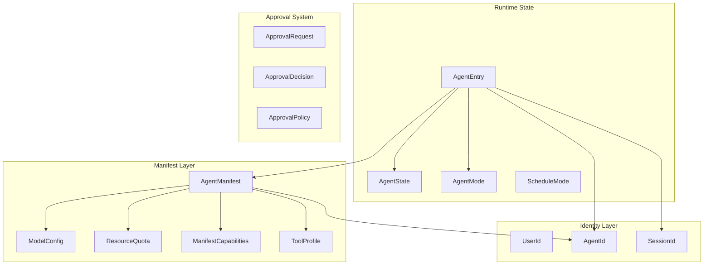

# Types & Configuration

# Types & Configuration

The `librefang-types` crate defines the shared vocabulary for the entire LibreFang agent OS. Every other crate — the kernel runtime, channel bridges, API server, ACP adapter, scheduler — depends on these types to communicate. The crate has no runtime dependencies beyond serialization; it intentionally owns no I/O, no async runtimes, and no database connections.

## Architecture



## Identity Types

All entity identifiers use newtype wrappers around `Uuid` for type safety. The system favors **deterministic UUID v5 derivation** over random UUIDs wherever the same logical entity must be recognized across daemon restarts.

### `UserId`

Wraps a `Uuid` with two construction paths:

| Method | UUID version | Use case |
|---|---|---|
| `UserId::new()` | v4 (random) | Ephemeral / internal callers |
| `UserId::from_name(name)` | v5 (deterministic) | Users from configuration files |

`from_name` hashes against the fixed namespace `LIBREFANG_USER_NAMESPACE`. The same name always maps to the same `UserId`, so audit-log entries survive daemon restarts. Renaming a user produces a different ID — this is intentional (rename = new identity). The namespace constant must never be changed; doing so rotates every existing `UserId` and breaks cross-restart correlation.

### `AgentId`

Deterministic derivation uses typed prefixes within a single namespace to prevent collisions between agents, hands, and hand-roles that share names:

| Method | Input format | When to use |
|---|---|---|
| `AgentId::new()` | Random v4 | Ephemeral agents |
| `AgentId::from_name(name)` | `"agent:{name}"` | Named agents from config |
| `AgentId::from_hand_id(hand_id)` | `"{hand_id}"` | Hand instances (legacy compat) |
| `AgentId::from_hand_agent(hand_id, role, instance_id)` | `"{hand_id}:{role}"` or `"{hand_id}:{role}:{instance_id}"` | Multi-agent hand roles |

The `from_hand_agent` method preserves backward compatibility: when `instance_id` is `None`, it uses the legacy `"{hand_id}:{role}"` format so existing single-instance hands keep their original agent IDs (preventing orphaned cron jobs and memory keys). When `instance_id` is `Some`, the format becomes `"{hand_id}:{role}:{instance_id}"` for unique per-instance IDs.

### `SessionId`

The most nuanced identity type, with several derivation strategies:

```
SessionId::new()                        → random v4
SessionId::for_channel(agent, channel)  → deterministic v5, CHANNEL_SESSION_NAMESPACE
SessionId::for_cron_run(agent, run_key) → deterministic v5, CRON_RUN_SESSION_NAMESPACE
SessionId::from_route_key(agent, channel, account, conversation) → conditional
```

**Namespace isolation**: `CHANNEL_SESSION_NAMESPACE` and `CRON_RUN_SESSION_NAMESPACE` are disjoint by construction. A `for_cron_run` ID can never collide with a `for_channel` ID, even if input strings coincide.

**`from_route_key` backward compatibility**: When `account` is empty, the result is identical to `for_channel(agent, scope)` — preserving existing session IDs for channels that never carried an account dimension. When `account` is non-empty, a `v2:` byte prefix is mixed in to ensure the hash space is disjoint from the legacy format.

**Session resolution precedence** (from highest to lowest):

1. **Explicit `session_id_override`** from the dispatch caller — always wins.
2. **Per-trigger override** (`Trigger.session_mode`) — honored for event triggers and `agent_send`.
3. **Channel branch** — always uses `SessionId::for_channel(agent, "channel:chat")`, overriding both per-trigger and manifest values when a non-empty `SenderContext.channel` is present.
4. **Cron path** — synthesizes `SenderContext { channel: "cron" }` and takes the channel branch; per-job `session_mode = "new"` creates isolated sessions via `for_cron_run`.
5. **Manifest `session_mode`** — final fallback.

## AgentManifest

The central configuration document that defines everything about an agent. Parsed from `agent.toml` files on disk.

### Key Configuration Sections

**Model configuration** (`ModelConfig`):

```toml
[model]
provider = "groq"
model = "llama-3.3-70b-versatile"   # alias: "name" also accepted
max_tokens = 4096
temperature = 0.7
system_prompt = """
You are a helpful assistant.
Multi-line prompts are supported.
"""
context_window = 32768              # optional override
max_output_tokens = 2048            # optional override
api_key_env = "GROQ_API_KEY"        # optional env var name
base_url = "http://localhost:11434" # optional provider URL override

# Provider-specific parameters flattened into API request body
enable_memory = true
memory_max_window = 50
```

The `extra_params` field (flattened via `#[serde(flatten)]`) merges arbitrary key-value pairs directly into the API request body. This supports provider-specific extensions like Qwen's `enable_memory`. If a key conflicts with a standard field, the `extra_params` value takes precedence (serialized last).

**Fallback model chain** (`fallback_models`): Tried in order if the primary model fails. Each `FallbackModel` entry has the same `provider`/`model`/`api_key_env`/`base_url`/`extra_params` shape as the primary config.

**Tool profiles** (`ToolProfile`):

| Profile | Tools included | Use case |
|---|---|---|
| `Minimal` | `file_read`, `file_list` | Observation-only |
| `Coding` | 5 tools including `shell_exec`, `web_fetch` | Code agents |
| `Research` | `web_fetch`, `web_search`, `file_read`, `file_write` | Information gathering |
| `Messaging` | `agent_send`, `channel_send`, `memory_*` | Communication agents |
| `Automation` | All 12 standard tools | General-purpose automation |
| `Full` / `Custom` | `"*"` (all tools) | Unrestricted |

Profiles expand to both tool lists and implied `ManifestCapabilities` (network, shell, agent_spawn, etc.) via `ToolProfile::implied_capabilities()`.

**Tool filtering pipeline**: Applied in order:
1. `tools_disabled` — if `true`, no tools available (overrides everything)
2. `tool_allowlist` — if non-empty, only these tools pass
3. `tool_blocklist` — removes specific tools from the remaining set
4. `AgentMode` filtering — `Observe` removes all, `Assist` keeps read-only tools only, `Full` passes everything

**Resource quotas** (`ResourceQuota`):

| Field | Default | Notes |
|---|---|---|
| `max_memory_bytes` | 256 MB | WASM memory cap |
| `max_cpu_time_ms` | 30,000 | Per-invocation CPU time |
| `max_tool_calls_per_minute` | 60 | Rate limit |
| `max_llm_tokens_per_hour` | `None` | Inherits global `[budget]` default |
| `max_network_bytes_per_hour` | 100 MB | Network I/O |
| `max_cost_per_hour_usd` | 0.0 | 0.0 = unlimited |
| `max_cost_per_day_usd` | 0.0 | 0.0 = unlimited |
| `max_cost_per_month_usd` | 0.0 | 0.0 = unlimited |

Use `effective_token_limit()` to get the hourly token cap as a plain `u64`. Both `None` and `Some(0)` yield `0` (unlimited).

**Scheduling** (`ScheduleMode`):

```rust
enum ScheduleMode {
    Reactive,                                              // event-driven (default)
    Periodic { cron: String },                             // cron schedule
    Proactive { conditions: Vec<String> },                 // condition monitoring
    Continuous { check_interval_secs: u64 },               // persistent loop (default: 300s)
}
```

**Autonomous configuration** (`AutonomousConfig`): Guardrails for 24/7 agents including quiet hours (cron expression), iteration caps (`DEFAULT_MAX_ITERATIONS = 50`), restart limits, heartbeat tuning, and per-agent timeout overrides.

**Workspaces** (`workspaces` map):

```toml
[workspaces]
library = { path = "shared/library", mode = "rw" }
vault   = { mount = "/Users/me/Obsidian", mode = "r" }
```

Each `WorkspaceDecl` has exactly one target: `path` (relative to `workspaces_dir`, kernel creates it) or `mount` (absolute host path, must be in `allowed_mount_roots`). The kernel rejects declarations where both or neither are set at boot validation.

**Concurrent invocations** (`max_concurrent_invocations`): Caps concurrent trigger-dispatch fan-out per agent. Does **not** throttle channel messages, cron jobs, or `agent_send`. Caps > 1 require `session_mode = "new"` on the manifest; `persistent` + cap > 1 is auto-clamped to 1. The per-agent semaphore is sized on first dispatch and not invalidated by hot-reload.

**Skill workshop** (`SkillWorkshopConfig`): Controls passive after-turn capture of reusable workflows. Default off (opt-in per agent). When enabled, detects teaching signals in multi-turn interactions and stores draft skills in `pending/` for human review. Candidates go through the same `SkillVerifier::scan_prompt_content` gate as marketplace skills regardless of `approval_policy`.

| Field | Default | Purpose |
|---|---|---|
| `enabled` | `false` | Master switch |
| `auto_capture` | `true` | Run heuristic/LLM capture pass |
| `approval_policy` | `Pending` | `Pending` (human review) or `Auto` (auto-promote) |
| `review_mode` | `Heuristic` | `Heuristic`, `ThresholdLlm`, or `None` (dry-run) |
| `max_pending` | 20 | Per-agent candidate cap (LRU eviction) |
| `max_pending_age_days` | `None` | Optional TTL for pending candidates |

## AgentEntry

The runtime representation of a registered agent in the kernel's registry. Wraps an `AgentManifest` with lifecycle state, metadata, and session bookkeeping:

```
AgentEntry
├── id: AgentId
├── name: String
├── manifest: AgentManifest
├── state: AgentState          (Created | Running | Suspended | Terminated | Crashed)
├── mode: AgentMode            (Observe | Assist | Full)
├── session_id: SessionId
├── identity: AgentIdentity    (emoji, avatar, color, archetype, vibe, greeting_style)
├── force_session_wipe: bool   → next LLM call clears history, keeps session_id
├── resume_pending: bool       → agent interrupted, expected to continue on same transcript
├── has_processed_message: bool → sticky flag set on first real dispatch
└── ...timestamps, parent/children, tags, onboarding state
```

The `has_processed_message` flag is critical for the heartbeat monitor: it distinguishes agents that have genuinely been alive from agents spawned but never given work. Without it, idle agents would enter crash-recovery loops.

## Approval System

The approval module (`approval.rs`) handles human-in-the-loop gating for dangerous operations. When an agent attempts a restricted tool (e.g. `shell_exec`), the kernel creates an `ApprovalRequest`, pauses the agent, and waits for an `ApprovalResponse`.

### `ApprovalDecision`

Custom serialization that produces either a plain string or a structured object:

```json
"approved"                                          // simple variant
{"type": "modify_and_retry", "feedback": "Use -R"}  // structured variant
```

Variants: `Approved`, `Denied`, `TimedOut`, `ModifyAndRetry { feedback }`, `Skipped`.

### `TimeoutFallback`

```rust
enum TimeoutFallback {
    Deny,                              // default: auto-deny on timeout
    Skip,                              // skip tool, agent continues
    Escalate { extra_timeout_secs: u64 },  // re-notify with extended timeout
}
```

### Channel Tool Rules

`ChannelToolRule` applies per-channel allow/deny lists with glob patterns:

```toml
[[approval.channel_rules]]
channel = "telegram"
allowed_tools = ["file_*", "web_fetch"]
denied_tools = ["shell_exec"]
```

Deny-wins when both lists match. Patterns support single `*` wildcards via `glob_matches()`.

### Second Factor

`SecondFactor` controls where TOTP is enforced: `None`, `Totp` (approvals only), `Login` (dashboard only), or `Both`. Check with `requires_login_totp()` and `requires_approval_totp()`.

### Notification Routing

`NotificationTarget` specifies delivery channels for approval alerts:

```rust
NotificationTarget {
    channel_type: "telegram",    // transport
    recipient: "@admin_chat",    // destination
    thread_id: Some("123"),      // optional thread/topic
}
```

`ApprovalRoutingRule` maps tool-name globs to notification targets. `AgentNotificationRule` adds per-agent-pattern overrides.

## Validation Patterns

Most configuration types include a `validate()` method that checks field lengths, character sets, and semantic constraints. For example, `ApprovalRequest::validate()` enforces:

- `tool_name`: 1–64 chars, alphanumeric + underscores only
- `description`: max 1024 chars
- `action_summary`: max 512 chars
- `timeout_secs`: 10–300 seconds

`SessionLabel::new()` validates length (1–128 chars) and character set (alphanumeric, spaces, hyphens, underscores only).

## Serde Compatibility

The crate includes lenient deserialization helpers via `crate::serde_compat`:

- `vec_lenient` — accepts both TOML arrays and single values for vector fields
- `map_lenient` — graceful handling of map field edge cases
- `exec_policy_lenient` — accepts string shorthands or full tables for exec policy

These ensure backward compatibility when `agent.toml` formats evolve.