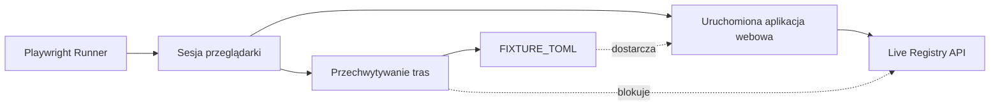

# web — e2e

# web — e2e

Zestaw testów end-to-end dla frontendu webowego LibreFang, zbudowany w oparciu o Playwright. Zestaw weryfikuje renderowanie, nawigację, internacjonalizację oraz przepływ danych rejestru w całej aplikacji w rzeczywistej przeglądarce.

## Przeznaczenie

Te testy sprawdzają w pełni zbudowaną i uruchomioną aplikację webową — a nie odizolowane komponenty. Walidują one, że:

- Strony renderują oczekiwaną strukturę DOM po hydracji
- Zapytania o dane rejestru kończą się sukcesem i wypełniają interfejs użytkownika
- Internacjonalizacja działa we wszystkich skonfigurowanych ustawieniach regionalnych
- Elementy interaktywne (rozwijane menu, okno dialogowe wyszukiwania, przełącznik języków) zachowują się poprawnie
- Niestandardowe potoki renderowania (podświetlanie składni TOML) generują oczekiwane klasy tokenów

## Pliki testowe

| Plik | Obszar pokrycia |
|------|-----------------|
| `homepage.spec.ts` | Struktura strony głównej, rozwijane menu Marketplace, przełączanie języków |
| `registry.spec.ts` | Strony list rejestru, strony szczegółowe, okno dialogowe wyszukiwania Cmd/Ctrl+K |
| `detail-dom.spec.ts` | DOM strony szczegółowej: podświetlanie TOML, kotwicze linki, sekcja powiązanych elementów |
| `i18n.spec.ts` | Renderowanie ustawień regionalnych chińskich, tagi linków hreflang |

## Architektura



Zestaw uruchamia rzeczywistą przeglądarkę pod adresem serwera aplikacji. Tylko `detail-dom.spec.ts` przechwytuje ruch sieciowy; pozostałe specyfikacje polegają na dostępności live serwera rejestru.

## Przechwytywanie sieci

`detail-dom.spec.ts` unika zależności zewnętrznych, zastępując dwa źródła manifestów nadrzędnych deterministyczną fixture TOML:

```ts
const FIXTURE_TOML = `# Fixture manifest used by detail-dom e2e tests.
id = "fixture-hand"
name = "Fixture Hand"
description = "Deterministic manifest for Playwright"

[metadata]
category = "test"
version = "0.0.1"
`
```

Dwie trasy są przechwytywane w `beforeEach`:

- `**/stats.librefang.ai/api/registry/raw**` — podstawowe API rejestru (jeszcze nie uruchomione)
- `**/raw.githubusercontent.com/librefang/librefang-registry/**` — zapasowy GitHub raw (z limitami zapytań w CI)

Obie odpowiadają statusem `200` z treścią fixture, co pozwala na testowanie podświetlacza TOML bez niestabilnych warunków sieciowych.

## Scenariusze testowe szczegółowo

### Strona główna

- **Hero i nawigacja**: Sprawdza, czy tytuł dokumentu zawiera „LibreFang", czy element `h1` jest widoczny oraz czy renderują się przyciski rozwijanych menu `Marketplace` i `Features`.
- **Rozwijane menu Marketplace**: Kliknięcie w menu rozwija osiem linków do kategorii rejestru (Hands, Agents, Skills, MCP, Plugins, Providers, Workflows, Channels). Asercja linku jest ograniczona do elementu `<nav>`, aby uniknąć naruszenia trybu ścisłego Playwright — sekcja `#evolution` na stronie głównej również zawiera link `/skills`.
- **Przełączanie języków**: Nawiguje do `/skills`, otwiera przełącznik języków, wybiera 简体中文 i sprawdza, czy URL zmienia się na `/zh/skills`. To weryfikuje, że zmiana ustawień regionalnych zachowuje bieżącą ścieżkę.

### Rejestr

- **Lista umiejętności**: Nawiguje do `/skills`, potwierdza nagłówek `h1` i czeka na pojawienie się co najmniej jednego linku karty (`a[href*="/skills/"]`) z 15-sekundowym limitem czasu, aby uwzględnić zapytanie o dane rejestru.
- **Strona szczegółowa**: Prowadzi za pierwszym linkiem karty, sprawdza, czy `h1` się renderuje, i weryfikuje blok komendy `librefang skill install`.
- **Okno dialogowe wyszukiwania**: Naciska Cmd+K (macOS) lub Ctrl+K (inne platformy), aby otworzyć okno dialogowe wyszukiwania, sprawdza widoczność pola wyszukiwania, następnie naciska Escape i sprawdza, czy okno się zamyka.

### DOM strony szczegółowej

Te testy wykorzystują kategorię `/hands`, ponieważ manifesty umiejętności są dostarczane jako `SKILL.md` (frontmatter YAML), a nie TOML. Tylko kategorie oparte na TOML uruchamiają renderer `.toml-highlight`.

- **Podświetlanie TOML**: Po nawigacji do strony szczegółowej czeka na hydrację `.toml-highlight`, a następnie sprawdza obecność co najmniej jednego elementu span `.tk-header`, `.tk-key` i `.tk-str` — klas tokenów generowanych przez niestandardowy podświetlacz TOML.
- **Kotwiczny link kopiowania**: Klika w link kotwiczny `#manifest` i sprawdza, czy URL kończy się `#manifest`.
- **Powiązane elementy**: Sprawdza widoczność elementu `h2` sekcji `#related`. Używa `.first()`, ponieważ puste okno dialogowe wyszukiwania może również renderować bloki „More <cat>".

### Internacjonalizacja

- **zh strona główna**: Nawiguje do `/zh/`, sprawdza `<html lang="zh">` oraz to, że rozwijane menu Features renderuje się jako `功能`.
- **zh lista umiejętności**: Nawiguje do `/zh/skills` i sprawdza, czy `h1` zawiera `技能`.
- **Tagi hreflang**: Na angielskiej stronie głównej weryfikuje istnienie elementów `link[hreflang]` dla wszystkich siedmiu ustawień regionalnych (`en`, `zh`, `zh-TW`, `ja`, `ko`, `de`, `es`) plus kanoniczny link `x-default`.

## Obsługa wieloplatformowa

Test okna dialogowego wyszukiwania obsługuje macOS i inne platformy w sposób jawny:

```ts
const mod = process.platform === 'darwin' ? 'Meta' : 'Control'
await page.keyboard.press(`${mod}+KeyK`)
```

Zapewnia to działanie Cmd+K na runnerach CI z macOS oraz Ctrl+K na runnerach CI z Linuxem.

## Konwencje

- **Limity czasu**: Czekanie na widoczność kart używa 15-sekundowego limitu czasu we wszystkich specyfikacjach, aby uwzględnić wolne zapytania rejestru w CI.
- **Zgodność z trybem ścisłym**: Selektory, które mogą pasować do wielu elementów, używają `.first()` lub są ograniczone do kontenera nadrzędnego (np. `getByRole('navigation')`).
- **Kody ustawień regionalnych**: Zestaw odwołuje się do siedmiu ustawień regionalnych — `en`, `zh`, `zh-TW`, `ja`, `ko`, `de`, `es` — plus `x-default`.
- **Izolacja fixture**: Fixture TOML jest samowystarczalna i nie odwołuje się do żadnego zewnętrznego serwisu, co sprawia, że testy `detail-dom` są w pełni hermetyczne.

## Uruchamianie testów

Standardowe wywołanie Playwright z katalogu `web/`:

```bash
npx playwright test          # run all e2e specs
npx playwright test --ui     # interactive mode
npx playwright test homepage # run a single spec by name
```

Serwer aplikacji musi być uruchomiony i dostępny. Testy zakładają domyślną konfigurację Playwright do rozwiązywania bazowego adresu URL.
