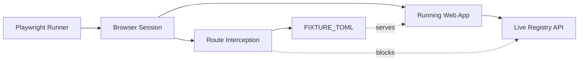

# web — e2e

# web — e2e

End-to-end test suite for the LibreFang web frontend, built with Playwright. The suite verifies rendering, navigation, internationalization, and registry data flows across the application in a real browser.

## Purpose

These tests exercise the fully built and running web app — not isolated components. They validate that:

- Pages render the expected DOM structure after hydration
- Registry data fetches resolve and populate the UI
- Internationalization works across all configured locales
- Interactive elements (dropdowns, search dialog, language switcher) behave correctly
- Custom rendering pipelines (TOML syntax highlighting) produce expected token classes

## Test Files

| File | Coverage Area |
|------|---------------|
| `homepage.spec.ts` | Landing page structure, Marketplace dropdown, language switching |
| `registry.spec.ts` | Registry list pages, detail pages, Cmd/Ctrl+K search dialog |
| `detail-dom.spec.ts` | Detail-page DOM: TOML highlighting, anchor links, related-items section |
| `i18n.spec.ts` | Chinese locale rendering, hreflang link tags |

## Architecture



The suite launches a real browser against the app server. Only `detail-dom.spec.ts` intercepts network traffic; the other specs rely on the live registry backend being available.

## Network Interception

`detail-dom.spec.ts` avoids external dependencies by stubbing the two upstream manifest sources with a deterministic TOML fixture:

```ts
const FIXTURE_TOML = `# Fixture manifest used by detail-dom e2e tests.
id = "fixture-hand"
name = "Fixture Hand"
description = "Deterministic manifest for Playwright"

[metadata]
category = "test"
version = "0.0.1"
`
```

Two routes are intercepted in `beforeEach`:

- `**/stats.librefang.ai/api/registry/raw**` — the primary registry API (not yet live)
- `**/raw.githubusercontent.com/librefang/librefang-registry/**` — the GitHub raw fallback (rate-limited on CI)

Both respond with `200` and the fixture body, allowing the TOML highlighter to be tested without flaky network conditions.

## Test Scenarios in Detail

### Homepage

- **Hero and nav**: Asserts the document title contains "LibreFang", an `h1` is visible, and both `Marketplace` and `Features` dropdown buttons render.
- **Marketplace dropdown**: Clicking the dropdown reveals the eight registry category links (Hands, Agents, Skills, MCP, Plugins, Providers, Workflows, Channels). The link assertion is scoped to the `<nav>` element to avoid tripping Playwright strict mode — the homepage `#evolution` section also contains a `/skills` link.
- **Language switch**: Navigates to `/skills`, opens the language switcher, selects 简体中文, and asserts the URL changes to `/zh/skills`. This verifies that locale switching preserves the current path.

### Registry

- **Skills list**: Navigates to `/skills`, confirms the `h1` heading, and waits for at least one card link (`a[href*="/skills/"]`) to appear with a 15-second timeout to accommodate the registry fetch.
- **Detail page**: Follows the first card link, asserts the `h1` renders, and checks for the `librefang skill install` command block.
- **Search dialog**: Presses Cmd+K (macOS) or Ctrl+K (other platforms) to open the search dialog, asserts the search input is visible, then presses Escape and asserts it closes.

### Detail Page DOM

These tests use the `/hands` category because skill manifests ship as `SKILL.md` (YAML frontmatter), not TOML. Only TOML-backed categories exercise the `.toml-highlight` renderer.

- **TOML highlighting**: After navigating to a detail page, waits for `.toml-highlight` to hydrate, then asserts presence of at least one `.tk-header`, `.tk-key`, and `.tk-str` span — the token classes emitted by the custom TOML highlighter.
- **Anchor copy-link**: Clicks the `#manifest` anchor link and asserts the URL ends with `#manifest`.
- **Related items**: Asserts the `#related` section's `h2` is visible. Uses `.first()` because the search dialog's empty state may also render "More <cat>" blocks.

### Internationalization

- **zh homepage**: Navigates to `/zh/`, asserts `<html lang="zh">` and that the Features dropdown renders as `功能`.
- **zh skills list**: Navigates to `/zh/skills` and asserts the `h1` contains `技能`.
- **hreflang tags**: On the English homepage, verifies `link[hreflang]` elements exist for all seven locales (`en`, `zh`, `zh-TW`, `ja`, `ko`, `de`, `es`) plus the `x-default` canonical link.

## Cross-Platform Handling

The search dialog test handles macOS vs. other platforms explicitly:

```ts
const mod = process.platform === 'darwin' ? 'Meta' : 'Control'
await page.keyboard.press(`${mod}+KeyK`)
```

This ensures Cmd+K works on macOS CI runners and Ctrl+K works on Linux CI runners.

## Conventions

- **Timeouts**: Card visibility waits use a 15-second timeout across all specs to accommodate slow registry fetches on CI.
- **Strict mode compliance**: Selectors that could match multiple elements use `.first()` or are scoped to a parent container (e.g., `getByRole('navigation')`).
- **Locale codes**: The suite references seven locales — `en`, `zh`, `zh-TW`, `ja`, `ko`, `de`, `es` — plus `x-default`.
- **Fixture isolation**: The TOML fixture is self-contained and does not reference any external service, making `detail-dom` tests fully hermetic.

## Running the Tests

Standard Playwright invocation from the `web/` directory:

```bash
npx playwright test          # run all e2e specs
npx playwright test --ui     # interactive mode
npx playwright test homepage # run a single spec by name
```

The app server must be running and reachable. Tests assume default Playwright configuration for base URL resolution.