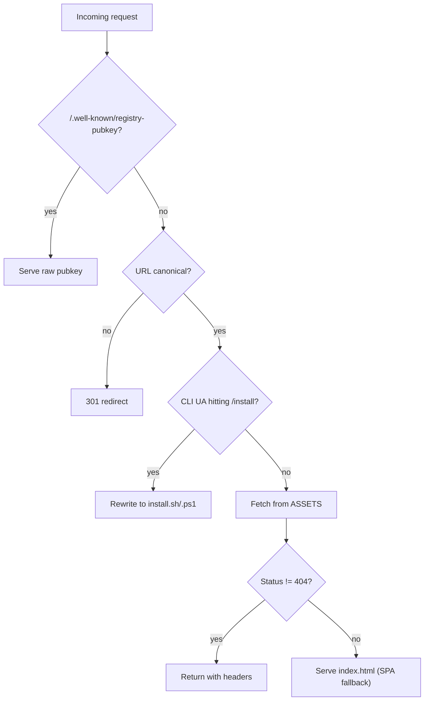

# web — public

# web/public — Cloudflare Pages Edge & Static Assets

## Purpose

This directory holds the static assets and edge worker for the LibreFang marketing/docs site hosted on Cloudflare Pages. The `_worker.js` file runs in Advanced Mode, taking over routing entirely (Cloudflare's `_redirects` and `_headers` files are ignored when a worker is present). It provides SPA fallback routing, security headers, URL canonicalization, CLI installer content negotiation, and serves the plugin registry's TOFU public key.

The installers (`install.sh`, `install.ps1`) are fetched directly by users running the one-liner install commands and are designed to work when piped from `curl`/`wget` or `irm`/`iex`.

---

## Files Overview

| File | Role |
|---|---|
| `_worker.js` | Cloudflare Pages Advanced Mode worker — routing, headers, installer negotiation |
| `install.sh` | POSIX shell installer for Linux/macOS/WSL |
| `install.ps1` | PowerShell installer for Windows |
| `install-manifest.json` | Static manifest describing available release assets (auto-generated by release workflow) |
| `404.html` | Standalone 404 page (self-contained HTML/CSS, no SPA involvement) |
| `feed.xml` | Atom feed for the changelog, consumed by RSS readers and the `/changelog/` page |

---

## `_worker.js` — Edge Routing

The worker's `fetch` handler processes every request through a fixed sequence of checks. Order matters: each stage either returns a response or falls through.



### Well-Known Registry Public Key

Served **before** any asset or SPA fallback so daemons fetching the key don't receive HTML:

```
GET /.well-known/registry-pubkey → ClGa0Ucap8NdrKAy1rw9Tt6A9I8eg4zJ53+xIuKMuq0=
```

This is the raw 32-byte Ed25519 public key (base64-encoded) for the LibreFang daemon's plugin registry TOFU resolver — see `crates/librefang-runtime/src/plugin_manager.rs::resolve_registry_pubkey` and `docs/architecture/plugin-signing.md`.

**Critical:** This constant is a mirror of `REGISTRY_PUBLIC_KEY` in `web/workers/{registry,marketplace}-worker/wrangler.toml`. Key rotation requires updating **both** locations in lockstep, via `web/workers/keygen.mjs`.

### URL Canonicalization

`canonicalPath()` enforces a consistent URL shape before serving content. The rules:

| Pattern | Action | Example |
|---|---|---|
| Locale root without trailing slash | Add slash | `/zh` → `/zh/` |
| Multi-segment path with trailing slash | Strip slash | `/zh/skills/` → `/zh/skills` |
| Root `/` | No change | — |
| Blessed single-segment paths (`/deploy/`, `/changelog/`, `/privacy/`) | Kept as-is | `/deploy/` stays `/deploy/` |

Supported locales: `zh-TW`, `zh`, `ja`, `ko`, `de`, `es`.

Redirects are 301 and preserve query string and hash fragment.

### CLI Installer Negotiation

The `/install` path has no file extension by design — it lets the install one-liners work without users knowing the suffix. The worker inspects `User-Agent` and rewrites to the appropriate installer:

```js
const CLI_INSTALLER_UA = /(curl|wget|fetch|libfetch|httpie)/i;
const POWERSHELL_INSTALLER_UA = /(powershell|pwsh)/i;
```

| Client | Rewrite target |
|---|---|
| `curl`, `wget`, `fetch`, `libfetch`, `httpie` | `/install.sh` |
| `powershell`, `pwsh` | `/install.ps1` |
| Browser or unknown | Falls through to SPA (no rewrite) |

The rewrite happens **before** the asset fetch (which would 404 on `/install`) and **before** the SPA fallback (which would hand a CLI tool an HTML page, causing `sh: newline unexpected`).

### Security Headers

Applied to **every** response via `addHeaders()`:

```
X-Content-Type-Options: nosniff
X-Frame-Options: DENY
X-XSS-Protection: 1; mode=block
Referrer-Policy: strict-origin-when-cross-origin
Permissions-Policy: camera=(), microphone=(), geolocation=()
Content-Security-Policy: default-src 'self'; ...
```

The CSP allows specific origins for analytics (`googletagmanager.com`, `cloudflareinsights.com`), the visit counter workers (`librefang-counter.suzukaze-haduki.workers.dev`, `counter.librefang.ai`), Google Fonts, and backend API hosts (`api.github.com`, `marketplace.librefang.ai`, `stats.librefang.ai`).

### Asset Caching

Paths under `/assets/` receive an immutable cache directive:

```
Cache-Control: public, max-age=31536000, immutable
```

This is safe because the build tool content-hashes these files — a new deployment produces new filenames, so the old entries can be cached forever.

### SPA Fallback

When `env.ASSETS.fetch()` returns 404 for a request, the worker serves `index.html` with status 200. This is what makes client-side routing work for the React dashboard.

---

## `install.sh` — POSIX Shell Installer

Designed for `curl -fsSL https://librefang.ai/install | sh` on Linux, macOS, and WSL. The script is written to run under `set -eu` and handles being piped (no controlling tty for interactive prompts).

### Environment Variables

| Variable | Default | Purpose |
|---|---|---|
| `LIBREFANG_INSTALL_DIR` | `~/.librefang/bin` | Custom install directory |
| `LIBREFANG_VERSION` | latest | Pin to a specific version tag |
| `LIBREFANG_PREFERRED_VERSION` | — | Soft preference; falls back if that release lacks a package for this platform |
| `LIBREFANG_AUTO_START` | `1` | Auto-start daemon after install (`1`/`true`/`yes`/`on`) |
| `LIBREFANG_OS_RELEASE` | `/etc/os-release` | Test hook for distro detection |
| `LIBREFANG_NIXOS_MARKER` | `/etc/NIXOS` | Test hook for NixOS detection |
| `LIBREFANG_INSTALLER_SOURCE_ONLY` | — | Test hook; source the script without running `install()` |

### Platform & Distro Detection

Architecture detection maps `uname -m`:

- `x86_64`, `amd64` → `x86_64`
- `aarch64`, `arm64` → `aarch64`

Platform selection on Linux prefers the **fully static musl** build (`*-unknown-linux-musl`) with a **gnu** fallback (`*-unknown-linux-gnu`). The fallback is suppressed on NixOS because the dynamically-linked gnu binary cannot find its ELF interpreter at the FHS path NixOS doesn't provide.

Distro detection reads `/etc/os-release` fields (`ID`, `ID_LIKE`) by parsing rather than sourcing, avoiding execution of a root-owned file inside the installer. The `/etc/NIXOS` marker file overrides any inherited container base layer ID.

### Release Resolution

`fetch_release_tags()` queries the GitHub API for the 30 most recent releases. The resolver walks the list and picks the newest release that has both the archive and its `.sha256` checksum uploaded — this skips "stuck" releases whose assets are still uploading.

### Install Safety

- **Checksum verification** via SHA256 before extraction
- **Rollback**: if the new binary fails `--version`, the previous binary is restored
- **PATH management**: adds `INSTALL_DIR` to the user's PATH if not already present

### Desktop App Hints

When a graphical session is detected (`DISPLAY` or `WAYLAND_DISPLAY` set, or `XDG_SESSION_TYPE` is `x11`/`wayland`), the script prints guidance about WebKitGTK dependencies for the Tauri-based desktop app. On Debian-family systems it probes `pkg-config` and `apt-cache policy` to report which `webkit2gtk-4.x` series is available.

---

## `install.ps1` — PowerShell Installer

Designed for `irm https://librefang.ai/install.ps1 | iex` on Windows. Handles piped execution where some detection methods can fail.

### Architecture Detection

Uses four fallback methods in order:

1. `[System.Runtime.InteropServices.RuntimeInformation]::OSArchitecture`
2. `$env:PROCESSOR_ARCHITECTURE`
3. WMI `Win32_Processor.Architecture` (9 = AMD64, 12 = ARM64)
4. `[IntPtr]::Size` (8 = 64-bit)

Maps to `x86_64` or `aarch64`, targeting `*-pc-windows-msvc`.

### Version Resolution

`Resolve-InstallableVersion` mirrors the shell installer's logic: `LIBREFANG_VERSION` is a hard pin; otherwise it walks releases checking for both the `.zip` and `.sha256` via `Test-ReleaseHasPackage` (which checks the release's assets array rather than a HEAD probe, since HEAD behavior against GitHub's download redirect is unreliable on PowerShell 5.1).

### Install Safety

- **Checksum verification** via `Get-FileHash`
- **Atomic replace with rollback** (`Install-WithRollback`): backs up existing binary, replaces it, runs `--version` to verify, rolls back on failure, and removes broken binary on fresh installs
- **Sidecar binary**: copies `librefang-sidecar-telegram.exe` from the archive when present (backward compatible with older archives)
- **PATH management**: updates `[Environment]::GetEnvironmentVariable("Path", "User")` and tells the user how to refresh the current session
- **Auto-init**: runs `librefang init` automatically
- **Auto-start**: registers a boot service and starts the daemon when `LIBREFANG_AUTO_START` is enabled

---

## `install-manifest.json` — Static Release Manifest

Auto-generated by the release workflow and published as a static file. Describes the current release channel version, installer paths, and per-target asset URLs with checksum links.

Structure:

```json
{
  "repo": "librefang/librefang",
  "version": "v0.3.57-20260313",
  "channels": { "stable": "v0.3.57-20260313" },
  "installers": { "shell": "/install.sh", "powershell": "/install.ps1" },
  "assets": {
    "x86_64-unknown-linux-gnu": { "url": "...", "checksum_url": "...", "archive": "tar.gz" },
    ...
  }
}
```

Six targets are listed: `x86_64` and `aarch64` for `unknown-linux-gnu`, `apple-darwin`, and `pc-windows-msvc`.

> **Note:** The installers do not consume this manifest at runtime — they query the GitHub API directly. The manifest exists for tooling and documentation purposes.

---

## `feed.xml` — Changelog Atom Feed

A static Atom feed listing all LibreFang releases with their changelog entries. Each `<entry>` contains:

- `<id>` — anchor URL on the changelog page (e.g., `#2026-4-15`)
- `<title>` — version tag (e.g., `LibreFang 2026.4.15`)
- `<updated>` — ISO 8601 release date
- `<content type="text">` — full changelog markdown in CDATA

Entries are ordered newest-first and cover both CalVer releases (`2026.M.DD`) and legacy SemVer releases (`0.6.x`). The feed is regenerated by the release workflow.

---

## `404.html` — Not Found Page

A fully self-contained static HTML page (inline CSS, no external dependencies or JavaScript) served when Cloudflare Pages cannot match a route and the worker's SPA fallback is not appropriate. Styled with the LibreFang dark theme (`#070b14` background, `#06b6d4` accent).

---

## Connection to the Rest of the Codebase

| Concern | Link |
|---|---|
| Plugin registry TOFU | `REGISTRY_PUBLIC_KEY` mirrors the key in `web/workers/registry-worker/wrangler.toml` and `web/workers/marketplace-worker/wrangler.toml`; consumed by `crates/librefang-runtime/src/plugin_manager.rs::resolve_registry_pubkey` |
| Key rotation | `web/workers/keygen.mjs` generates a new keypair; output must update both `wrangler.toml` files and the constant in `_worker.js` |
| Release pipeline | `install-manifest.json` and `feed.xml` are regenerated by the release CI workflow |
| Installer assets | `install.sh` and `install.ps1` fetch release archives from `github.com/librefang/librefang/releases` |
| Plugin signing docs | `docs/architecture/plugin-signing.md` documents the TOFU trust model |
| Desktop app dependencies | Installer hints reference the Tauri 2 desktop app's WebKitGTK requirements (see `flake.nix` `webkitgtk_4_1` input) |

## Operational Notes

- **Deploying changes to `_worker.js`** requires a Cloudflare Pages deployment. Local testing requires `wrangler pages dev`.
- **Adding a new locale** requires adding its code to the `LOCALES` array in `_worker.js` so canonicalization handles it correctly.
- **CSP changes** must account for all origins the frontend connects to (analytics, fonts, API hosts, counter workers). Missing an origin will silently break a feature.
- **`_redirects` and `_headers` are ignored** when `_worker.js` is present — all routing and header logic lives in the worker.