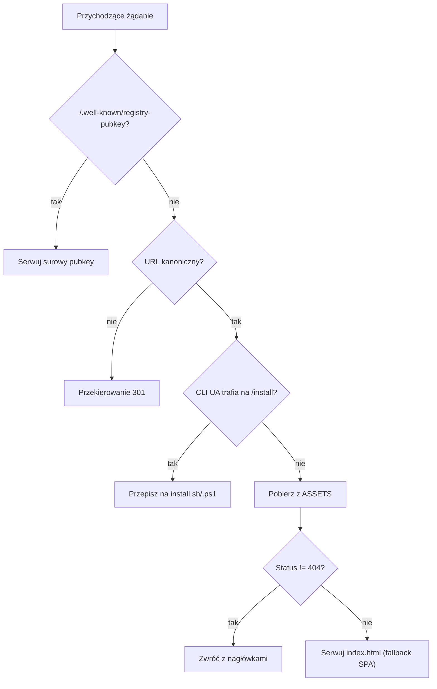

# web — public

# web/public — Cloudflare Pages Edge & Statyczne Zasoby

## Przeznaczenie

Ten katalog zawiera statyczne zasoby i workera edge dla strony marketingowej/dokumentacyjnej LibreFang hostowanej na Cloudflare Pages. Plik `_worker.js` działa w trybie Advanced Mode, przejmując pełną kontrolę nad routingiem (pliki `_redirects` i `_headers` Cloudflare'a są ignorowane, gdy obecny jest worker). Zapewnia routing fallback SPA, nagłówki bezpieczeństwa, kanonizację URL, negocjację zawartości instalatora CLI oraz udostępnia klucz publiczny TOFU rejestru wtyczek.

Instalatory (`install.sh`, `install.ps1`) są pobierane bezpośrednio przez użytkowników uruchamiających jednowierszowe komendy instalacyjne i są zaprojektowane do pracy po przesyłaniu potokowym z `curl`/`wget` lub `irm`/`iex`.

---

## Przegląd plików

| Plik | Rola |
|---|---|
| `_worker.js` | Worker Cloudflare Pages w trybie Advanced Mode — routing, nagłówki, negocjacja instalatora |
| `install.sh` | Instalator powłoki POSIX dla Linux/macOS/WSL |
| `install.ps1` | Instalator PowerShell dla Windows |
| `install-manifest.json` | Statyczny manifest opisujący dostępne zasoby wydania (autogenerowany przez workflow wydania) |
| `404.html` | Samodzielna strona 404 (samowystarczalny HTML/CSS, bez udziału SPA) |
| `feed.xml` | Kanał Atom dla dziennika zmian, konsumowany przez czytniki RSS i stronę `/changelog/` |

---

## `_worker.js` — Routing Edge

Procedura obsługi `fetch` workera przetwarza każde żądanie przez stałą sekwencję sprawdzeń. Kolejność ma znaczenie: każdy etap albo zwraca odpowiedź, albo przekazuje żądanie dalej.



### Well-Known — Klucz publiczny rejestru

Serwowany **przed** jakimkolwiek zasobem lub fallbackiem SPA, aby demony pobierające klucz nie otrzymały HTML:

```
GET /.well-known/registry-pubkey → ClGa0Ucap8NdrKAy1rw9Tt6A9I8eg4zJ53+xIuKMuq0=
```

To jest surowy 32-bajtowy klucz publiczny Ed25519 (zakodowany w base64) dla resolvera TOFU rejestru wtyczek demona LibreFang — patrz `crates/librefang-runtime/src/plugin_manager.rs::resolve_registry_pubkey` i `docs/architecture/plugin-signing.md`.

**Krytyczne:** Ta stała jest kopią `REGISTRY_PUBLIC_KEY` w `web/workers/{registry,marketplace}-worker/wrangler.toml`. Rotacja klucza wymaga zaktualizowania **obu** lokalizacji jednocześnie, za pomocą `web/workers/keygen.mjs`.

### Kanonizacja URL

`canonicalPath()` wymusza spójny kształt URL przed serwowaniem treści. Reguły:

| Wzorzec | Akcja | Przykład |
|---|---|---|
| Korzeń lokalizacji bez końcowego ukośnika | Dodaj ukośnik | `/zh` → `/zh/` |
| Ścieżka wielosegmentowa z końcowym ukośnikiem | Usuń ukośnik | `/zh/skills/` → `/zh/skills` |
| Korzeń `/` | Bez zmian | — |
| Uprawnione ścieżki jedosegmentowe (`/deploy/`, `/changelog/`, `/privacy/`) | Zachowane bez zmian | `/deploy/` pozostaje `/deploy/` |

Obsługiwane lokalizacje: `zh-TW`, `zh`, `ja`, `ko`, `de`, `es`.

Przekierowania są typu 301 i zachowują ciąg zapytania oraz fragment hash.

### Negocjacja instalatora CLI

Ścieżka `/install` nie ma rozszerzenia pliku celowo — pozwala to jednowierszowym komendom instalacyjnym działać bez znajomości sufiksu przez użytkownika. Worker sprawdza `User-Agent` i przepisuje na odpowiedni instalator:

```js
const CLI_INSTALLER_UA = /(curl|wget|fetch|libfetch|httpie)/i;
const POWERSHELL_INSTALLER_UA = /(powershell|pwsh)/i;
```

| Klient | Cel przepisania |
|---|---|
| `curl`, `wget`, `fetch`, `libfetch`, `httpie` | `/install.sh` |
| `powershell`, `pwsh` | `/install.ps1` |
| Przeglądarka lub nieznany | Przechodzi dalej do SPA (bez przepisywania) |

Przepisanie następuje **przed** pobraniem zasobu (które zwróciłoby 404 dla `/install`) i **przed** fallbackiem SPA (który przekazałby narzędziu CLI stronę HTML, powodując `sh: newline unexpected`).

### Nagłówki bezpieczeństwa

Aplikowane do **każdej** odpowiedzi przez `addHeaders()`:

```
X-Content-Type-Options: nosniff
X-Frame-Options: DENY
X-XSS-Protection: 1; mode=block
Referrer-Policy: strict-origin-when-cross-origin
Permissions-Policy: camera=(), microphone=(), geolocation=()
Content-Security-Policy: default-src 'self'; ...
```

CSP pozwala na specyficzne originy dla analityki (`googletagmanager.com`, `cloudflareinsights.com`), workerów licznika odwiedzin (`librefang-counter.suzukaze-haduki.workers.dev`, `counter.librefang.ai`), Google Fonts oraz hostów API backendu (`api.github.com`, `marketplace.librefang.ai`, `stats.librefang.ai`).

### Pamięć podręczna zasobów

Ścieżki w `/assets/` otrzymują dyrektywę niezmiennej pamięci podręcznej:

```
Cache-Control: public, max-age=31536000, immutable
```

Jest to bezpieczne, ponieważ narzędzie buildowe haszuje zawartością te pliki — nowe wdrożenie tworzy nowe nazwy plików, więc stare wpisy mogą być buforowane w nieskończoność.

### Fallback SPA

Gdy `env.ASSETS.fetch()` zwraca 404 dla żądania, worker serwuje `index.html` ze statusem 200. To jest mechanizm, który umożliwia działanie routingu po stronie klienta dla panelu React.

---

## `install.sh` — Instalator powłoki POSIX

Zaprojektowany dla `curl -fsSL https://librefang.ai/install | sh` na Linuxie, macOS i WSL. Skrypt jest napisany tak, aby działał pod `set -eu` i obsługiwać przesyłanie potokowe (brak kontrolującego tty dla interaktywnych promptów).

### Zmienne środowiskowe

| Zmienna | Domyślna | Przeznaczenie |
|---|---|---|
| `LIBREFANG_INSTALL_DIR` | `~/.librefang/bin` | Niestandardowy katalog instalacji |
| `LIBREFANG_VERSION` | latest | Przypięcie do konkretnego tagu wersji |
| `LIBREFANG_PREFERRED_VERSION` | — | Miękka preferencja; wraca do innej, jeśli dany wydanie nie ma pakietu dla tej platformy |
| `LIBREFANG_AUTO_START` | `1` | Automatyczny start demona po instalacji (`1`/`true`/`yes`/`on`) |
| `LIBREFANG_OS_RELEASE` | `/etc/os-release` | Test hook dla wykrywania dystrybucji |
| `LIBREFANG_NIXOS_MARKER` | `/etc/NIXOS` | Test hook dla wykrywania NixOS |
| `LIBREFANG_INSTALLER_SOURCE_ONLY` | — | Test hook; źródłowe załadowanie skryptu bez uruchamiania `install()` |

### Wykrywanie platformy i dystrybucji

Wykrywanie architektury mapuje `uname -m`:

- `x86_64`, `amd64` → `x86_64`
- `aarch64`, `arm64` → `aarch64`

Wybór platformy na Linuxie preferuje **w pełni statyczną kompilację musl** (`*-unknown-linux-musl`) z **fallbackiem gnu** (`*-unknown-linux-gnu`). Fallback jest pomijany na NixOS, ponieważ dynamicznie linkowany binarny gnu nie może znaleźć swojego interpretera ELF w ścieżce FSH, której NixOS nie udostępnia.

Wykrywanie dystrybucji odczytuje pola `/etc/os-release` (`ID`, `ID_LIKE`) przez parsowanie zamiast źródłowe ładowanie, unikając wykonania pliku własności roota wewnątrz instalatora. Plik markerowy `/etc/NIXOS` nadpisuje jakikolwiek odziedziczony ID warstwy bazowej kontenera.

### Rozwiązywanie wydania

`fetch_release_tags()` odpytuje API GitHuba o 30 najnowszych wydań. Resolver przechodzi przez listę i wybiera najnowsze wydanie, które ma zarówno archiwum, jak i jego sumę kontrolną `.sha256` — to pomija „zacięte" wydania, których zasoby nadal się przesyłają.

### Bezpieczeństwo instalacji

- **Weryfikacja sumy kontrolnej** przez SHA256 przed ekstrakcją
- **Rollback**: jeśli nowy binarny zawiedzie `--version`, poprzedni binarny jest przywrócony
- **Zarządzanie PATH**: dodaje `INSTALL_DIR` do PATH użytkownika, jeśli nie jest już obecny

### Podpowiedzi aplikacji desktopowej

Gdy wykryta jest sesja graficzna (ustawione `DISPLAY` lub `WAYLAND_DISPLAY`, albo `XDG_SESSION_TYPE` to `x11`/`wayland`), skrypt wyświetla wskazówki dotyczące zależności WebKitGTK dla aplikacji desktopowej opartej na Tauri. Na systemach z rodziny Debian sprawdza `pkg-config` i `apt-cache policy`, aby zgłosić, która seria `webkit2gtk-4.x` jest dostępna.

---

## `install.ps1` — Instalator PowerShell

Zaprojektowany dla `irm https://librefang.ai/install.ps1 | iex` na Windows. Obsługuje wykonanie potokowe, gdzie niektóre metody wykrywania mogą zawieść.

### Wykrywanie architektury

Używa czterech metod fallback w kolejności:

1. `[System.Runtime.InteropServices.RuntimeInformation]::OSArchitecture`
2. `$env:PROCESSOR_ARCHITECTURE`
3. WMI `Win32_Processor.Architecture` (9 = AMD64, 12 = ARM64)
4. `[IntPtr]::Size` (8 = 64-bit)

Mapuje na `x86_64` lub `aarch64`, celując w `*-pc-windows-msvc`.

### Rozwiązywanie wersji

`Resolve-InstallableVersion` odzwierciedla logikę instalatora powłoki: `LIBREFANG_VERSION` to twarde przypięcie; w przeciwnym razie przechodzi przez wydania sprawdzając obecność zarówno `.zip`, jak i `.sha256` przez `Test-ReleaseHasPackage` (który sprawdza tablicę zasobów wydania zamiast sondowania HEAD, ponieważ zachowanie HEAD względem przekierowania pobierania GitHuba jest niegodne zaufania w PowerShell 5.1).

### Bezpieczeństwo instalacji

- **Weryfikacja sumy kontrolnej** przez `Get-FileHash`
- **Atomowe zastąpienie z rollbackiem** (`Install-WithRollback`): kopiuje zapasowo istniejący binarny, zastępuje go, uruchamia `--version` do weryfikacji, wycofuje w przypadku błędu i usuwa zepsuty binarny przy świeżej instalacji
- **Binarny sidecar**: kopiuje `librefang-sidecar-telegram.exe` z archiwum, gdy jest obecny (wstecznie kompatybilny ze starszymi archiwami)
- **Zarządzanie PATH**: aktualizuje `[Environment]::GetEnvironmentVariable("Path", "User")` i informuje użytkownika, jak odświeżyć bieżącą sesję
- **Auto-init**: automatycznie uruchamia `librefang init`
- **Auto-start**: rejestruje usługę rozruchową i uruchamia demona, gdy `LIBREFANG_AUTO_START` jest włączone

---

## `install-manifest.json` — Statyczny manifest wydania

Autogenerowany przez workflow wydania i publikowany jako plik statyczny. Opisuje aktualną wersję kanału wydania, ścieżki instalatorów i URL-e zasobów dla poszczególnych celów z linkami do sum kontrolnych.

Struktura:

```json
{
  "repo": "librefang/librefang",
  "version": "v0.3.57-20260313",
  "channels": { "stable": "v0.3.57-20260313" },
  "installers": { "shell": "/install.sh", "powershell": "/install.ps1" },
  "assets": {
    "x86_64-unknown-linux-gnu": { "url": "...", "checksum_url": "...", "archive": "tar.gz" },
    ...
  }
}
```

Wymienionych jest sześć celów: `x86_64` i `aarch64` dla `unknown-linux-gnu`, `apple-darwin` oraz `pc-windows-msvc`.

> **Uwaga:** Instalatory nie konsumują tego manifestu w czasie wykonywania — odpytują bezpośrednio API GitHuba. Manifest istnieje dla celów narzędziowych i dokumentacyjnych.

---

## `feed.xml` — Kanał Atom dziennika zmian

Statyczny kanał Atom listujący wszystkie wydania LibreFang z ich wpisami w dzienniku zmian. Każdy `<entry>` zawiera:

- `<id>` — URL kotwicy na stronie dziennika zmian (np. `#2026-4-15`)
- `<title>` — tag wersji (np. `LibreFang 2026.4.15`)
- `<updated>` — data wydania w formacie ISO 8601
- `<content type="text">` — pełny markdown dziennika zmian w CDATA

Wpisy są uporządkowane od najnowszego i obejmują zarówno wydania CalVer (`2026.M.DD`), jak i starsze wydania SemVer (`0.6.x`). Kanał jest regenerowany przez workflow wydania.

---

## `404.html` — Strona Nie Znaleziono

W pełni samowystarczalna statyczna strona HTML (inline CSS, brak zewnętrznych zależności lub JavaScript) serwowana, gdy Cloudflare Pages nie może dopasować trasy i fallback SPA workera nie jest odpowiedni. Stylizowana w ciemnym motywie LibreFang (tło `#070b14`, akcent `#06b6d4`).

---

## Powiązanie z resztą bazy kodu

| Obszar | Powiązanie |
|---|---|
| TOFU rejestru wtyczek | `REGISTRY_PUBLIC_KEY` odzwierciedla klucz w `web/workers/registry-worker/wrangler.toml` i `web/workers/marketplace-worker/wrangler.toml`; konsumowany przez `crates/librefang-runtime/src/plugin_manager.rs::resolve_registry_pubkey` |
| Rotacja klucza | `web/workers/keygen.mjs` generuje nową parę kluczy; wynik musi zaktualizować oba pliki `wrangler.toml` oraz stałą w `_worker.js` |
| Potok wydania | `install-manifest.json` i `feed.xml` są regenerowane przez workflow CI wydania |
| Zasoby instalatora | `install.sh` i `install.ps1` pobierają archiwa wydań z `github.com/librefang/librefang/releases` |
| Dokumentacja podpisywania wtyczek | `docs/architecture/plugin-signing.md` dokumentuje model zaufania TOFU |
| Zależności aplikacji desktopowej | Podpowiedzi instalatora odnoszą się do wymagań WebKitGTK aplikacji desktopowej Tauri 2 (patrz `flake.nix` input `webkitgtk_4_1`) |

## Uwagi operacyjne

- **Wdrażanie zmian w `_worker.js`** wymaga wdrożenia Cloudflare Pages. Testowanie lokalne wymaga `wrangler pages dev`.
- **Dodanie nowej lokalizacji** wymaga dodania jej kodu do tablicy `LOCALES` w `_worker.js`, aby kanonizacja obsługiwała ją poprawnie.
- **Zmiany CSP** muszą uwzględniać wszystkie originy, z którymi łączy się frontend (analityka, fonty, hosty API, workery licznika). Brak originu cicho zepsuje funkcję.
- **`_redirects` i `_headers` są ignorowane**, gdy obecny jest `_worker.js` — cała logika routingu i nagłówków znajduje się w workerze.
