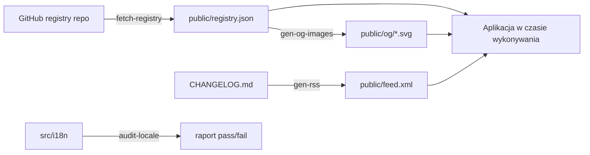

# web — skrypty

# Skrypty web

Narzędzia czasu budowania i deweloperskie dla aplikacji webowej LibreFang. Te skrypty uruchamiane są przez `pnpm` scripts (zazwyczaj hooki `prebuild`) oraz wywołania CLI — **nie są** dołączane do aplikacji w czasie wykonywania.

## Przegląd

| Skrypt | Przeznaczenie | Wyzwalacz |
|---|---|---|
| `fetch-registry.ts` | Pobiera dane rejestru z GitHuba, generuje `public/registry.json` | `pnpm fetch-registry` |
| `gen-og-images.ts` | Generuje karty SVG OpenGraph dla każdej kategorii i pozycji | `pnpm build` (prebuild) |
| `gen-rss.ts` | Konwertuje `CHANGELOG.md` na kanał Atom w `public/feed.xml` | `pnpm build` (prebuild) |
| `audit-locale-completeness.ts` | Sprawdza, czy drzewa tłumaczeń odpowiadają kluczom angielskim | `pnpm i18n:audit <locale\|--all>` |
| `worker.test.ts` | Testuje routing instalacji oparty na UA w Cloudflare Pages `_worker.js` | `pnpm test` |



---

## fetch-registry.ts

Pobiera pliki manifestowe z repozytorium GitHub `librefang/librefang-registry` i zapisuje skonsolidowany `public/registry.json`. To jest pomost między zewnętrznym monorepo rejestru a danymi statycznymi aplikacji webowej.

### Jak to działa

1. **Wyliczanie katalogu** — `fetchDir(path)` wywołuje GitHub Contents API, aby wyliczyć katalogi lub pliki `.toml` w każdej kategorii (`hands`, `channels`, `providers`, `workflows`, `agents`, `plugins`, `skills`, `mcp`). Błąd 404 dla opcjonalnych kategorii jest ignorowany.
2. **Analiza manifestów** — `fetchBatch()` przetwarza pozycje w porcjach po 10 z `Promise.all`, delegując do jednego z dwóch pobieraczy:
   - `fetchToml` → `parseToml()`: parser TOML zorientowany na linie dla plików `HAND.toml`, `agent.toml`, `plugin.toml`, `MCP.toml` oraz samodzielnych plików `.toml`. Wyodrębnia `id`, `name`, `description`, `category`, `icon`, `tags` oraz sekcje `[i18n.<lang>]` z zlokalizowanymi parami name/description.
   - `fetchSkillMd()`: analizuje YAML frontmatter z plików `SKILL.md`. Skille zawsze mają `category = "skills"` oraz `icon = ""`.
3. **Wynik** — zapisuje obiekt JSON z jedną tablicą na kategorię oraz polami `*Count` i znacznikiem czasu ISO `fetchedAt`.

### Szczegóły analizy TOML

`parseToml()` korzysta z podejścia **zorientowanego na linie**, a nie z przechwytującego wyrażenia regularnego dla sekcji `[i18n.<lang>]`. Jest to celowe — naiwne wyrażenie regularne „treść między dwoma nagłówkami" zawodzi, gdy wartość zawiera znak `[` (np. `tags = ["popular"]`). Parser:

- Dopasowuje tylko nagłówki najwyższego poziomu `[i18n.<lang>]` (bez kropek w tokenie języka), ignorując zagnieżdżone podsekcje takie jak `[i18n.zh.agents.main]`.
- Skanuje w przód od każdego nagłówka do następnej linii zaczynającej się od `[`, zbierając pierwsze przypisania `name` i `description`.

### Ograniczanie liczby zapytań GitHub API

Ustaw `GITHUB_TOKEN` w środowisku, aby uwierzytelnić żądania i uniknąć limitu 60 zapytań/godzinę dla anonimowych użytkowników:

```bash
GITHUB_TOKEN=ghp_xxx pnpm fetch-registry
```

---

## gen-og-images.ts

Generuje obrazy podglądu OpenGraph jako SVG (1200×630), aby udostępnianie linków do `/skills`, `/channels` itp. na Twitterze/Slacku/Discordzie pokazywało kartę specyficzną dla kategorii zamiast domyślnego obrazu.

### Eksporty

- **`CATEGORIES`** — tablica 8 obiektów `CategoryDef`, po jednym dla każdej kategorii rejestru. Każdy ma `slug`, `title`, `subtitle`, kolor `accent` i glif `icon`. Kolory accent są wybierane z palety Tailwind dla rozróżnienia wizualnego w kanałach społecznościowych.
- **`render(def: CategoryDef): string`** — czysta funkcja generująca SVG na poziomie kategorii. Testowana bezpośrednio.

### Generowanie obrazów

`main()` uruchamia się przy wykonaniu jako skrypt (strzeżone przez `import.meta.url === file://${process.argv[1]}`):

1. Zapisuje 8 SVG kategorii do `public/og/<slug>.svg`.
2. Jeśli `public/registry.json` istnieje, iteruje każdą tablicę kategorii i zapisuje `public/og/<slug>/<id>.svg` dla każdej pozycji.
3. **Bezpieczeństwo**: identyfikatory pozycji są walidowane względem `/^[a-z0-9][a-z0-9_-]*$/i` przed użyciem w ścieżkach plików. Zapobiega to przechodzeniu ścieżek poprzez spreparowane wpisy rejestru zawierające `..` lub ścieżki bezwzględne.
4. Tekst rejestru jest uciekany przez `esc()`, aby zapobiec wstrzykiwaniu SVG/XML z treści wprowadzanej przez użytkowników. Ikony z prefiksem `lucide:` mają zastępczo glif kategorii, ponieważ komponenty React nie mogą renderować do statycznego SVG.

### Dlaczego SVG zamiast PNG?

Każdy główny konsument OG akceptuje SVG. Pliki SVG są ~50× mniejsze niż odpowiednie PNG, znajdują się w repozytorium jako czytelny tekst i są niezależne od rozdzielczości na wyświetlaczach o wysokiej gęstości pikseli.

---

## gen-rss.ts

Analizuje `CHANGELOG.md` i generuje kanał Atom do `public/feed.xml`. Dziennik zmian używa konwencji wersjonowanych nagłówków H2: `## [2026.4.15] - 2026-04-15`.

### Eksporty

- **`parseEntries(md: string, max: number): Entry[]`** — skanuje w poszukiwaniu nagłówków `## [version] - date`, a następnie wycina treść między kolejnymi nagłówkami. Zwraca wpisy w kolejności dokumentu (od najnowszego).
- **`escapeXml(s: string): string`** — ucieka `& < > "`.
- **`renderEntry(e: Entry): string`** — owija treść markdown w CDATA wewnątrz Atom `<entry>`. Kotwica wersji używa myślników (`2026-4-15` → `#2026-4-15`), aby dopasować generowanie ID nagłówków.
- **`buildFeed(md, opts?)`** — składa pełny XML Atom. Akceptuje nadpisanie `site`, `author` i `max` do celów testowych. Zwraca `{ xml, entries }`, aby wywołujący mogli sprawdzić oba.

Ciąg autora domyślnie to `LibreFang <noreply@librefang.ai>` — nawiasy ostrokątne są uciekane w XML w wyniku, aby uniknąć wygenerowania nieprawidłowego Atom.

---

## audit-locale-completeness.ts

Narzędzie CLI sprawdzające, czy drzewo tłumaczeń danej lokalizacji ma tę samą strukturę liści co angielski (`en`).

### Użycie

```bash
pnpm i18n:audit zh          # sprawdź jedną lokalizację
pnpm i18n:audit --all       # sprawdź każdą nieangielską lokalizację
```

Wyświetla użycie i kończy z kodem 2, jeśli nie podano argumentu lub podano za dużo argumentów.

### Jak to działa

`leafPaths()` rekursywnie przechodzi przez obiekt tłumaczeń i zwraca tablicę ścieżek z kropkami do każdej wartości liścia. Tablice są traktowane jako liście z sufiksem `[length=N]`, aby wykryć niezgodności długości tablic. Skrypt porównuje zbiór ścieżek angielskich z docelową lokalizacją i zgłasza brakujące ścieżki. Kończy z kodem 1, jeśli jakakolwiek lokalizacja jest niekompletna lub nieznana.

Importuje `languages` i `rawTranslations` z `../src/i18n`, więc ten skrypt weryfikuje rzeczywiste dane tłumaczeń konsumowane w czasie wykonywania.

---

## worker.test.ts

Testuje Cloudflare Pages `_worker.js` (znajdujący się w `public/_worker.js`), który obsługuje negocjację treści opartą na user-agent dla endpointu `/install`.

### Testowana logika routingu

Worker sprawdza nagłówek `User-Agent` w żądaniach do `/install` i przepisuje ścieżkę:

| User-Agent zawiera | Serwowany plik |
|---|---|
| `curl` | `install.sh` |
| `Wget` | `install.sh` |
| `PowerShell/7` | `install.ps1` |
| `WindowsPowerShell/5` | `install.ps1` |
| Przeglądarka lub brak UA | Przechodzi do SPA (HTML) |

Kluczowe przypadki brzegowe objęte testami:
- **Windows PowerShell 5.1** wysyła UA z prefiksem `Mozilla/5.0`, ale nadal musi otrzymać `.ps1`, a nie skrypt powłoki. Wyrażenie regularne sprawdza tokeny narzędzi CLI, a nie prefiks Mozilla.
- **Bezpośrednie żądania `/install.sh`** pomijają przepisanie całkowicie (pobranie pojedynczego zasobu, bez przeskoku).
- **Nierelacyjne ścieżki z curl UA** (np. `/about`) nie są błędnie kierowane.

### Aparat testowy

- `makeEnv()` tworzy atrapy powiązania `ASSETS.fetch` oparte na mapie ścieżka-odpowiedź.
- `req()` konstruuje obiekty `Request` z opcjonalnym User-Agent.
- `calledPaths()` wyodrębnia ścieżkę z każdego wywołania `ASSETS.fetch`, aby sprawdzać decyzje routingu.

---

## Testowanie

Wszystkie pliki testowe używają **Vitest** i są współlokowane z testowanym obiektem (`*.test.ts`). Czyste funkcje (`render`, `parseEntries`, `escapeXml`, `renderEntry`, `buildFeed`) są eksportowane specjalnie, aby umożliwić testowanie jednostkowe bez dostępu do systemu plików lub sieci.

```bash
pnpm test              # uruchom wszystkie testy skryptów
pnpm test -- --reporter=verbose
```
