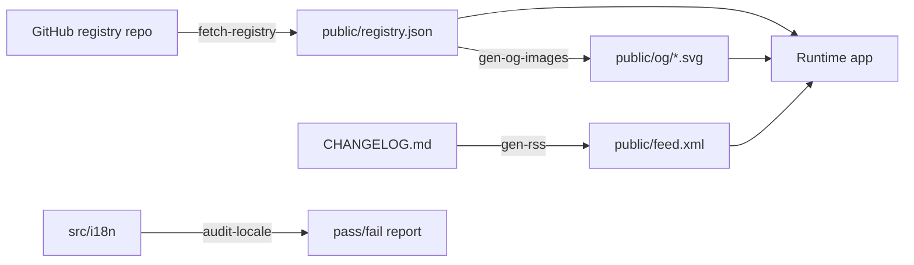

# web — scripts

# Web Scripts

Build-time and developer tooling for the LibreFang web application. These scripts run via `pnpm` scripts (typically `prebuild` hooks) and CLI invocations — they are **not** bundled into the runtime app.

## Overview

| Script | Purpose | Trigger |
|---|---|---|
| `fetch-registry.ts` | Pull registry data from GitHub, emit `public/registry.json` | `pnpm fetch-registry` |
| `gen-og-images.ts` | Generate per-category and per-item OpenGraph SVG cards | `pnpm build` (prebuild) |
| `gen-rss.ts` | Convert `CHANGELOG.md` into an Atom feed at `public/feed.xml` | `pnpm build` (prebuild) |
| `audit-locale-completeness.ts` | Verify translation locale trees match English keys | `pnpm i18n:audit <locale\|--all>` |
| `worker.test.ts` | Test the Cloudflare Pages `_worker.js` UA-based install routing | `pnpm test` |



---

## fetch-registry.ts

Fetches manifest files from the `librefang/librefang-registry` GitHub repository and writes a consolidated `public/registry.json`. This is the bridge between the external registry monorepo and the web app's static data.

### How it works

1. **Directory listing** — `fetchDir(path)` calls the GitHub Contents API to enumerate directories or `.toml` files under each category (`hands`, `channels`, `providers`, `workflows`, `agents`, `plugins`, `skills`, `mcp`). A 404 is silently ignored for optional categories.
2. **Manifest parsing** — `fetchBatch()` processes items in chunks of 10 with `Promise.all`, delegating to one of two fetchers:
   - `fetchToml` → `parseToml()`: line-oriented TOML parser for `HAND.toml`, `agent.toml`, `plugin.toml`, `MCP.toml`, and standalone `.toml` files. Extracts `id`, `name`, `description`, `category`, `icon`, `tags`, and `[i18n.<lang>]` sections with localized name/description pairs.
   - `fetchSkillMd()`: parses YAML frontmatter from `SKILL.md` files. Skills always have `category = "skills"` and `icon = ""`.
3. **Output** — writes a JSON object with one array per category plus `*Count` fields and a `fetchedAt` ISO timestamp.

### TOML parsing details

`parseToml()` uses a **line-oriented** approach rather than a capturing regex for `[i18n.<lang>]` sections. This is deliberate — a naive "content between two headers" regex breaks when a value contains a `[` character (e.g. `tags = ["popular"]`). The parser:

- Matches only top-level `[i18n.<lang>]` headers (no dots in the lang token), ignoring nested subsections like `[i18n.zh.agents.main]`.
- Scans forward from each header until the next `[`-prefixed line, collecting the first `name` and `description` assignments.

### GitHub API rate limiting

Set `GITHUB_TOKEN` in the environment to authenticate requests and avoid the 60 requests/hour anonymous limit:

```bash
GITHUB_TOKEN=ghp_xxx pnpm fetch-registry
```

---

## gen-og-images.ts

Generates OpenGraph preview images as SVG (1200×630) so that sharing links to `/skills`, `/channels`, etc. on Twitter/Slack/Discord shows a category-specific card instead of a generic default.

### Exports

- **`CATEGORIES`** — array of 8 `CategoryDef` objects, one per registry category. Each has a `slug`, `title`, `subtitle`, `accent` colour, and `icon` glyph. Accents are chosen from the Tailwind palette for visual distinction in social feeds.
- **`render(def: CategoryDef): string`** — pure function producing the category-level SVG. Tested directly.

### Image generation

`main()` runs when executed as a script (guarded by `import.meta.url === file://${process.argv[1]}`):

1. Writes 8 category SVGs to `public/og/<slug>.svg`.
2. If `public/registry.json` exists, iterates each category array and writes `public/og/<slug>/<id>.svg` for every item.
3. **Security**: item IDs are validated against `/^[a-z0-9][a-z0-9_-]*$/i` before being used in file paths. This prevents path traversal via crafted registry entries containing `..` or absolute paths.
4. Registry text is escaped via `esc()` to prevent SVG/XML injection from user-contributed content. Icons using the `lucide:` prefix fall back to the category glyph since React components can't render into static SVG.

### Why SVG over PNG?

Every major OG consumer accepts SVG. SVGs are ~50× smaller than equivalent PNGs, live in the repo as readable text, and are resolution-independent on high-DPI displays.

---

## gen-rss.ts

Parses `CHANGELOG.md` and emits an Atom feed to `public/feed.xml`. The changelog uses a convention of versioned H2 headings: `## [2026.4.15] - 2026-04-15`.

### Exports

- **`parseEntries(md: string, max: number): Entry[]`** — scans for `## [version] - date` headings, then slices the body between consecutive headings. Returns entries in document order (newest first).
- **`escapeXml(s: string): string`** — escapes `& < > "`.
- **`renderEntry(e: Entry): string`** — wraps the markdown body in CDATA inside an Atom `<entry>`. The version anchor uses dashes (`2026-4-15` → `#2026-4-15`) to match heading ID generation.
- **`buildFeed(md, opts?)`** — assembles the full Atom XML. Accepts `site`, `author`, and `max` overrides for testing. Returns `{ xml, entries }` so callers can inspect both.

The author string defaults to `LibreFang <noreply@librefang.ai>` — the angle brackets are XML-escaped in output to avoid producing invalid Atom.

---

## audit-locale-completeness.ts

CLI tool that checks whether a locale's translation tree has the same leaf structure as English (`en`).

### Usage

```bash
pnpm i18n:audit zh          # check one locale
pnpm i18n:audit --all       # check every non-English locale
```

Prints usage and exits with code 2 if no argument or too many arguments are given.

### How it works

`leafPaths()` recursively walks a translation object and returns an array of dot-paths to every leaf value. Arrays are treated as leaves with a `[length=N]` suffix so array length mismatches are caught. The script compares the English path set against the target locale's and reports any missing paths. Exits with code 1 if any locale is incomplete or unknown.

Imports `languages` and `rawTranslations` from `../src/i18n`, so this script validates the actual translation data consumed at runtime.

---

## worker.test.ts

Tests the Cloudflare Pages `_worker.js` (located at `public/_worker.js`) that powers the `/install` endpoint's user-agent-based content negotiation.

### Routing logic under test

The worker inspects the `User-Agent` header on requests to `/install` and rewrites the path:

| User-Agent contains | Served file |
|---|---|
| `curl` | `install.sh` |
| `Wget` | `install.sh` |
| `PowerShell/7` | `install.ps1` |
| `WindowsPowerShell/5` | `install.ps1` |
| Browser or no UA | Falls through to SPA (HTML) |

Key edge cases covered:
- **Windows PowerShell 5.1** sends a `Mozilla/5.0`-prefixed UA but must still get `.ps1`, not the shell script. The regex checks CLI tool tokens, not the Mozilla prefix.
- **Direct `/install.sh` requests** bypass the rewrite entirely (single asset fetch, no hop).
- **Unrelated paths with curl UA** (e.g. `/about`) are not misrouted.

### Test harness

- `makeEnv()` creates a mock `ASSETS.fetch` binding backed by a path-to-response map.
- `req()` constructs `Request` objects with optional User-Agent.
- `calledPaths()` extracts the pathname from each `ASSETS.fetch` call to assert routing decisions.

---

## Testing

All test files use **Vitest** and co-locate with their subject (`*.test.ts`). The pure functions (`render`, `parseEntries`, `escapeXml`, `renderEntry`, `buildFeed`) are exported specifically to enable unit testing without filesystem or network access.

```bash
pnpm test              # run all script tests
pnpm test -- --reporter=verbose
```