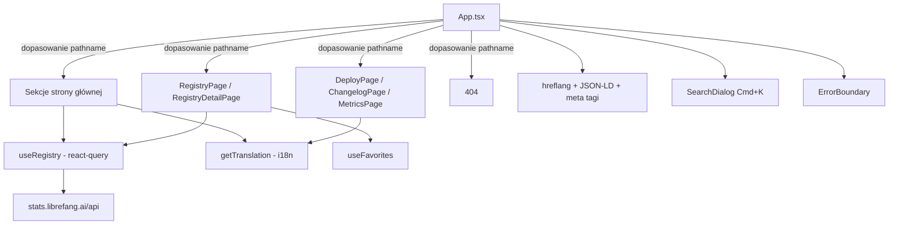

# web — src

# web — src

Źródło frontendowe witryny LibreFang. Aplikacja SPA w React, która z jednego pakietu obsługuje trzy różne powierzchnie: stronę główną marketingową, leniwie ładowaną przeglądarkę rejestru (8 kategorii) oraz samodzielne strony dla deploy/changelog/metrics. Routing oparty na ścieżkach odbywa się poprzez `window.location.pathname` — nie ma client-side routera takiego jak react-router. Stan zarządzany przez lekki sklep Zustand, dane serwera przez TanStack Query, a internacjonalizacja przez niestandardowy system scalania tłumaczeń obsługujący 9 locale.

## Przegląd architektury

## Routing

`App` to jedyny punkt wejścia. Po zamontowaniu sprawdza `window.location.pathname` dokładnie raz (przechwycone w inicjalizatorach `useState`) i renderuje pasującą powierzchnię. Nie ma manipulacji API historii do nawigacji — wszystkie linki między stronami to zwykłe tagi `<a href>`, powodujące pełne przeładowania stron. Jest to celowe: strona jest statycznie hostowana na Cloudflare Pages, a pełne nawigacje utrzymują ciepły cache pakietu bez złożoności client-side routera.

### Wykrywanie tras

| Wzorzec | Funkcja dopasowująca | Wynik |
|---|---|---|
| `/`, `/{locale}` | `isHomepagePath` | Strona główna |
| `/{locale}?/deploy` | `localeRouteRe('deploy')` | `DeployPage` |
| `/{locale}?/changelog` | `localeRouteRe('changelog')` | `ChangelogPage` |
| `/{locale}?/metrics` | regex na `metrics` | `MetricsPage` |
| `/{locale}?/{category}` lub `/{category}/{id}` | `detectRegistryRoute` | `RegistryPage` lub `RegistryDetailPage` |
| cokolwiek innego | fallback | Strona 404 |

`detectRegistryRoute` usuwa opcjonalny prefiks locale, sprawdza pierwszy segment względem `REGISTRY_ROUTES` i weryfikuje identyfikatory elementów wzorcem `/^[a-z0-9][a-z0-9_-]*$/i` w celu ochrony przed path traversal. Obsługiwane kategorie: `skills`, `mcp`, `plugins`, `hands`, `agents`, `providers`, `workflows`, `channels`.

### Obsługa locale

`getCurrentLang` analizuje prefiks ścieżki. Obsługiwane locale: `en` (domyślne), `zh`, `zh-TW`, `de`, `ja`, `ko`, `es`, `pl`, `uk`. Wartość `lang` w sklepie jest synchronizowana z URL przy montowaniu i przy `popstate`. Linki w całej aplikacji obliczają `langPrefix` (`''` dla angielskiego, `/{locale}` w przeciwnym razie), aby prefiksować wewnętrzne URL.

## Leniwe ładowanie

Tylko sekcje strony głównej są dołączane do początkowego pakietu. Wszystko inne to `React.lazy` + `Suspense`:

- `DeployPage`, `ChangelogPage`, `MetricsPage`
- `RegistryPage`, `RegistryDetailPage`
- `SearchDialog`, `InstallBanner`

Fallback suspense to wyśrodkowany spinner (`suspenseFallback` w `App`). `SearchDialog` i `InstallBanner` używają fallback `null`, ponieważ montują się tylko po wyzwoleniu.

## Sekcje strony głównej

Strona główna składa się z ~14 komponentów sekcji, z których każdy otrzymuje obiekt tłumaczenia `t` poprzez `SectionProps`:

| Komponent | Przeznaczenie |
|---|---|
| `Hero` | Animowany nagłówek, efekt pisania terminala, pasek statystyk |
| `Architecture` | Rozwijany akordeon 5 warstw systemu; pobiera dane kanałów/hands z rejestru |
| `Hands` | Karuzela z przewijaniem poziomym hands z rejestru |
| `BrowseRegistry` | Siatka 8 kart linkujących do każdej kategorii rejestru |
| `Workflows` | Karty funkcji dla wzorców workflow |
| `Evolution` | Sekcja samorozwijających się umiejętności |
| `Performance` | Tabela porównawcza (LibreFang vs inne) |
| `Install` | Polecenia instalacji wykrywające system operacyjny z przyciskiem kopiowania |
| `Downloads` | Zasoby wydań GitHub pobierane ze stats API, kategoryzowane według platformy |
| `Docs` | Karty kategorii dokumentacji |
| `EveryApiPartner` | Wezwanie do integracji partnerskiej |
| `FAQ` | Akordeon pytań i odpowiedzi |
| `GitHubStats` | Metryki GitHub na żywo + wykres historii gwiazdek + obraz kontrybutorów |
| `Footer` | Linki i branding |

### Kluczowe hooki i narzędzia w App.tsx

**`useTyping(texts, speed, pause)`** — Przechodzi przez tablicę ciągów znaków z efektem maszyny do pisania (wpisz → pauza → usuń → następny). Zwraca aktualnie wyświetlany podciąg.

**`FadeIn`** — Wrapper wokół `motion.div`, który animuje opacity/translateY przy przewinięciu w pole widzenia (`whileInView`, odpala raz).

**`isPopular` / `sortByPopularity`** — Elementy oznaczone `popular` w tablicy `tags` rejestru są sortowane jako pierwsze i wizualnie oznaczane 🔥.

**`trackEvent(action, label)`** — Uruchamia `window.gtag('event', ...)`, jeśli Google Analytics jest załadowane. Wywoływane z handlerów `onClick` na CTA.

**`categorizeAssets(assets)`** — Dopasowuje regexem nazwy plików zasobów wydań GitHub do koszyków Desktop (.dmg, .exe, .AppImage, .deb, .rpm) i CLI (.tar.gz, .zip według platformy). Pomija pliki sum kontrolnych `.sha256`.

## Komponenty

### `SiteHeader`

Stała nawigacja górna, identyczna bajt po bajcie na wszystkich stronach. Prop `isSubpage` wpływa tylko na cele linków (międzystronicowe `#anchor` vs płynne przewijanie na tej samej stronie) i wyłącza scroll-spy IntersectionObserver. Dwa menu rozwijane: „Marketplace" (linki do 8 stron kategorii rejestru) i „Learn" (linki do sekcji strony głównej). Zawiera również przełącznik języka (9 locale), przełącznik motywu (light/dark) oraz wyzwalacz wyszukiwania. Mobilne menu hamburger replikuje wszystkie elementy nawigacji.

### `SearchDialog`

Globalna nakładka wyszukiwania Cmd/Ctrl+K. Przeszukuje wszystkie elementy rejestru oraz 8 kotwic sekcji strony głównej.

**Potok oceniania:**
1. Zapytanie jest debouncowane 80ms (`debouncedQuery`)
2. Każdy trafny kandydat jest oceniany poprzez `scoreHit` (elementy) lub `scoreText` (kotwice)
3. Dokładne dopasowanie ID = 1000, prefiks = 500, podciąg = 200/150, dopasowanie tagu = 30
4. Fuzzy subsequence fallback (`fuzzySubseq`) dla tolerancji literówek
5. Popularne elementy otrzymują bonus +5
6. Wyniki ograniczone do 40, maksymalnie 5 na kategorię (`PER_CATEGORY_CAP`)
7. Puste zapytanie pokazuje kotwice + popularne elementy

Nawigacja klawiaturą: ↑/↓ aby się poruszać, Enter aby otworzyć, Esc aby zamknąć. Handler wklejania wykrywa URL lub ciągi `category/id` i nawiguje bezpośrednio.

### `RegistryIcon`

Mapuje ciągi ikon TOML rejestru na komponenty React. Obsługuje format `lucide:<kebab-name>` (50+ zmapowanych ikon) i wraca do renderowania starszych glifów emoji jako tekstu dla zgodności wstecznej. Nieznane nazwy lucide domyślnie renderują `<Box />`.

### `Breadcrumbs`

Renderuje ścieżkę `Home / Category / Item` w treści strony (nie w nagłówku). Pierwszy segment zawsze linkuje do strony głównej uwzględniającej locale.

### `ErrorBoundary`

Klasowy boundary błędów obejmujący całą aplikację. Przy nieprzechwyconych błędach:
1. Loguje do konsoli
2. Wysyła raport `sendBeacon` na `stats.librefang.ai/api/errors` z wiadomością, stosem, pathname, językiem i UA (obciętym do 256 znaków)
3. Renderuje kartę odzyskiwania z przyciskami reload/home

Błędy raportowania są cicho połykane — raportowanie błędów nigdy nie może kaskadowo powodować awarii.

### `InstallBanner`

Prompt instalacji PWA. Przechwytuje `beforeinstallprompt`, wyświetla baner na dole ekranu i wywołuje `event.prompt()` po kliknięciu. Odrzucenie jest utrwalane w `localStorage` pod kluczem `librefang.install.dismissed`.

### `BrandIcons`

Wbudowane inline ikony SVG dla GitHub i Twitter/X (lucide-react usunął ikony brandowe). Kompatybilne drop-in z sygnaturami komponentów lucide (props `size`, `className`).

## Zarządzanie stanem

### Sklep (`store.ts`)

Sklep Zustand z:
- `lang` — aktualny kod locale
- `theme` — `'light' | 'dark'`
- `switchLang(lang)` — aktualizuje sklep i synchronizuje z URL/ścieżką
- `toggleTheme()` — przełącza motyw i utrwala preferencję
- `detectLang()` — początkowe wykrywanie locale ze ścieżki

### Dane rejestru (`useRegistry.ts`)

Hook TanStack Query pobierający dane rejestru ze stats API. Zwraca typowane dane rejestru z tablicami dla każdej kategorii oraz zagregowanymi liczbami (`handsCount`, `channelsCount` itd.). `getLocalizedDesc` i `getLocalizedName` rozwiązują polace specyficzne dla locale z elementów z fallbackiem do angielskiego.

## SEO i metadane

Trzy bloki `useEffect` w `App` zarządzają SEO dynamicznie:

**Tagi hreflang** — Przy każdej zmianie strony/locale, przestarzałe tagi `<link rel="alternate">` są usuwane i nowe są wstrzykiwane dla `x-default`, `en` i wszystkich 9 locale. Ścieżki są normalizowane przez usunięcie prefiksu locale przed ponownym prefiksowaniem.

**Dane strukturalne JSON-LD** — Pojedynczy tag `<script id="ld-json">` jest przepisywany przy zmianie trasy:
- Szczegóły rejestru: `SoftwareSourceCode` z linkiem codeRepository
- Lista rejestru: `CollectionPage` z opisem kategorii
- Strona główna: `SoftwareApplication` z ofertami (cena: 0), systemami operacyjnymi, sameAs GitHub

**Meta tagi** — `<title>`, `<meta name="description">` i Open Graph (`og:title`, `og:description`, `og:image`) są aktualizowane według trasy. Strony szczegółów rejestru otrzymują specyficzne dla kategorii obrazy OG z `librefang.ai/og/{category}/{id}.svg`.

## Internacjonalizacja

Tłumaczenia znajdują się w `i18n.ts`. `getTranslation(lang)` zwraca scalony obiekt `Translation`. System scalania (`mergeTranslation` → `mergeObject`) nakłada klucze specyficzne dla locale na bazę angielską, więc częściowe tłumaczenia elegancko fallbackują. Wszystkie komponenty sekcji otrzymują `t: Translation` i uzyskują dostęp do głęboko zagnieżdżonych kluczy (np. `t.hero.title1`, `t.architecture.layers[0].label`).

Część treści sekcji (np. etykiety `Downloads`) używa inline tablic wyszukiwania `Record<string, Record<string, string>>` indeksowanych według locale, oddzielonych od głównego pliku tłumaczeń.

## Narzędzia (`lib/utils.ts`)

- `cn(...classes)` — scalacz klas Tailwind (wzorzec clsx/classnames)
- `useFavorites` — ulubione z obsługą localStorage z powiadomieniem pub/sub
- `useMarketplace` — hook danych specyficznych dla marketplace używany przez strony rejestru

## Strony (leniwie ładowane)

| Strona | Przeznaczenie |
|---|---|
| `RegistryPage` | Lista wszystkich elementów w kategorii z filtrowaniem, sortowaniem, ulubionymi |
| `RegistryDetailPage` | Widok szczegółów pojedynczego elementu z pełnymi metadanymi, linkami do źródła |
| `DeployPage` | Formularze wdrażania jednym kliknięciem dla Fly.io, Railway, Render, GCP, Docker |
| `ChangelogPage` | Wersjonowane informacje o wydaniach z osi czasu |
| `MetricsPage` | Panel metryk użycia/społeczności na żywo |

## Uwagi dotyczące współpracy

- **Dodawanie sekcji strony głównej:** Utwórz komponent akceptujący `SectionProps`, dodaj go do JSX w return strony głównej `App`, dodaj klucze tłumaczeń pod pasującą przestrzenią nazw i dodaj link kotwicy w tablicy `anchorLinks` `SiteHeader`.
- **Dodawanie kategorii rejestru:** Dodaj klucz do typu `RegistryCategory`, zaktualizuj `REGISTRY_ROUTES`, dodaj do tablicy `cats` `BrowseRegistry`, dodaj do `CATEGORIES` `SearchDialog`, dodaj do `featureLinks` `SiteHeader` i dodaj wpisy tłumaczeń pod `t.registry.categories`.
- **Dodawanie locale:** Dodaj kod do `LOCALES` w `App.tsx`, dodaj wykrywanie w `getCurrentLang`, dodaj do `languages` w `i18n.ts`, dodaj do pętli hreflang i dostarcz tłumaczenia.
- **Rozmiar pakietu:** Utrzymuj stronę główną lekką. Wszystko, co jest potrzebne tylko na podstronach, powinno być ładowane przez `lazy()`. Obecny podział oszczędza ~40KB na początkowym pakiecie dla odwiedzających stronę główną.
