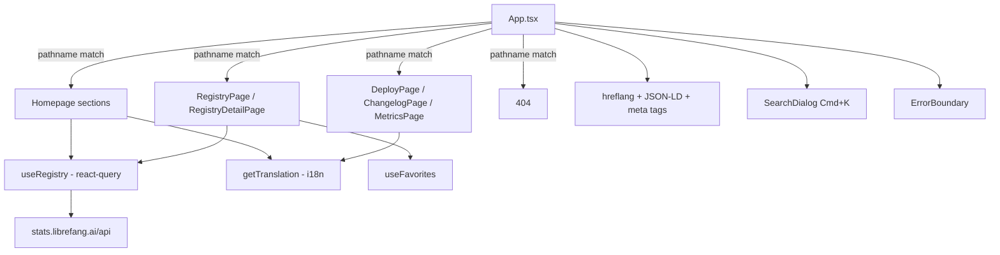

# web — src

# web — src

The frontend source for the LibreFang website. A React SPA that serves three distinct surfaces from a single bundle: the marketing homepage, a lazy-loaded registry browser (8 categories), and standalone pages for deploy/changelog/metrics. Routing is path-based via `window.location.pathname` — there is no client-side router like react-router. State is managed through a lightweight Zustand store, server data through TanStack Query, and internationalisation through a custom translation-merge system supporting 9 locales.

## Architecture Overview

## Routing

`App` is the single entry point. On mount it inspects `window.location.pathname` exactly once (captured in `useState` initializers) and renders the matching surface. There is no history API manipulation for navigation — all cross-page links are plain `<a href>` tags, causing full page loads. This is intentional: the site is statically hosted on Cloudflare Pages and full navigations keep the bundle cache warm without client-side router complexity.

### Route detection

| Pattern | Match function | Result |
|---|---|---|
| `/`, `/{locale}` | `isHomepagePath` | Homepage |
| `/{locale}?/deploy` | `localeRouteRe('deploy')` | `DeployPage` |
| `/{locale}?/changelog` | `localeRouteRe('changelog')` | `ChangelogPage` |
| `/{locale}?/metrics` | regex on `metrics` | `MetricsPage` |
| `/{locale}?/{category}` or `/{category}/{id}` | `detectRegistryRoute` | `RegistryPage` or `RegistryDetailPage` |
| anything else | fallback | 404 page |

`detectRegistryRoute` strips an optional locale prefix, checks the first segment against `REGISTRY_ROUTES`, and validates item IDs against `/^[a-z0-9][a-z0-9_-]*$/i` to guard against path traversal. Supported categories: `skills`, `mcp`, `plugins`, `hands`, `agents`, `providers`, `workflows`, `channels`.

### Locale handling

`getCurrentLang` parses the path prefix. Supported locales: `en` (default), `zh`, `zh-TW`, `de`, `ja`, `ko`, `es`, `pl`, `uk`. The store's `lang` is synced from the URL on mount and on `popstate`. Links throughout the app compute a `langPrefix` (`''` for English, `/{locale}` otherwise) to prefix internal URLs.

## Lazy Loading

Only homepage sections ship in the initial bundle. Everything else is `React.lazy` + `Suspense`:

- `DeployPage`, `ChangelogPage`, `MetricsPage`
- `RegistryPage`, `RegistryDetailPage`
- `SearchDialog`, `InstallBanner`

The suspense fallback is a centered spinner (`suspenseFallback` in `App`). `SearchDialog` and `InstallBanner` use `null` fallbacks since they mount only when triggered.

## Homepage Sections

The homepage composes ~14 section components, each receiving the translation object `t` via `SectionProps`:

| Component | Purpose |
|---|---|
| `Hero` | Animated headline, typing terminal effect, stats bar |
| `Architecture` | Expandable accordion of 5 system layers; pulls channel/hand data from registry |
| `Hands` | Horizontal-scroll carousel of registry hands |
| `BrowseRegistry` | 8-card grid linking to each registry category |
| `Workflows` | Feature cards for workflow patterns |
| `Evolution` | Self-evolving skills section |
| `Performance` | Comparison table (LibreFang vs others) |
| `Install` | OS-detected install commands with copy button |
| `Downloads` | GitHub release assets fetched from stats API, categorised by platform |
| `Docs` | Documentation category cards |
| `EveryApiPartner` | Partner integration callout |
| `FAQ` | Accordion of Q&A |
| `GitHubStats` | Live GitHub metrics + star history chart + contributor image |
| `Footer` | Links and branding |

### Key hooks and utilities in App.tsx

**`useTyping(texts, speed, pause)`** — Cycles through an array of strings with a typewriter effect (type → pause → delete → next). Returns the currently displayed substring.

**`FadeIn`** — Wrapper around `motion.div` that animates opacity/translateY on scroll-into-view (`whileInView`, fires once).

**`isPopular` / `sortByPopularity`** — Items tagged `popular` in their registry `tags` array are sorted first and visually marked with 🔥.

**`trackEvent(action, label)`** — Fires `window.gtag('event', ...)` if Google Analytics is loaded. Called from `onClick` handlers on CTAs.

**`categorizeAssets(assets)`** — Regex-matches GitHub release asset filenames into Desktop (.dmg, .exe, .AppImage, .deb, .rpm) and CLI (.tar.gz, .zip per platform) buckets. Skips `.sha256` checksum files.

## Components

### `SiteHeader`

Fixed top navigation, byte-for-byte identical across all pages. The `isSubpage` prop only affects link targets (cross-page `#anchor` vs same-page smooth scroll) and disables the IntersectionObserver scroll-spy. Two dropdown menus: "Marketplace" (links to the 8 registry category pages) and "Learn" (links to homepage sections). Also contains the language switcher (9 locales), theme toggle (light/dark), and search trigger. The mobile hamburger menu replicates all nav items.

### `SearchDialog`

Global Cmd/Ctrl+K search overlay. Searches across all registry items plus 8 homepage section anchors.

**Scoring pipeline:**
1. Query is debounced 80ms (`debouncedQuery`)
2. Each candidate hit is scored via `scoreHit` (items) or `scoreText` (anchors)
3. Exact ID match = 1000, prefix = 500, substring = 200/150, tag match = 30
4. Fuzzy subsequence fallback (`fuzzySubseq`) for typo tolerance
5. Popular items get +5 bonus
6. Results capped at 40, max 5 per category (`PER_CATEGORY_CAP`)
7. Empty query shows anchors + popular items

Keyboard navigation: ↑/↓ to move, Enter to open, Esc to close. Paste handler detects URLs or `category/id` strings and navigates directly.

### `RegistryIcon`

Maps registry TOML icon strings to React components. Supports the `lucide:<kebab-name>` format (50+ mapped icons) and falls back to rendering legacy emoji glyphs as text for backwards compatibility. Unknown lucide names default to `<Box />`.

### `Breadcrumbs`

Renders a `Home / Category / Item` trail in page content (not in the header). First segment always links to the locale-aware homepage.

### `ErrorBoundary`

Class-based error boundary wrapping the entire app. On uncaught errors it:
1. Logs to console
2. Sends a `sendBeacon` report to `stats.librefang.ai/api/errors` with message, stack, pathname, lang, and UA (truncated to 256 chars)
3. Renders a recovery card with reload/home buttons

Reporting failures are silently swallowed — error reporting must never cascade a crash.

### `InstallBanner`

PWA install prompt. Captures `beforeinstallprompt`, shows a banner at the bottom of the screen, and calls `event.prompt()` on click. Dismissal is persisted in `localStorage` under `librefang.install.dismissed`.

### `BrandIcons`

Inlined SVG icons for GitHub and Twitter/X (lucide-react removed brand icons). Drop-in compatible with lucide component signatures (`size`, `className` props).

## State Management

### Store (`store.ts`)

Zustand store with:
- `lang` — current locale code
- `theme` — `'light' | 'dark'`
- `switchLang(lang)` — updates store and syncs to URL/path
- `toggleTheme()` — flips theme and persists preference
- `detectLang()` — initial locale detection from path

### Registry Data (`useRegistry.ts`)

TanStack Query hook fetching registry data from the stats API. Returns typed registry data with arrays for each category plus aggregate counts (`handsCount`, `channelsCount`, etc.). `getLocalizedDesc` and `getLocalizedName` resolve locale-specific fields from items with fallback to English.

## SEO and Metadata

Three `useEffect` blocks in `App` manage SEO dynamically:

**hreflang tags** — On every page/locale change, stale `<link rel="alternate">` tags are removed and new ones injected for `x-default`, `en`, and all 9 locales. Paths are normalised by stripping the locale prefix before re-prefixing.

**JSON-LD structured data** — A single `<script id="ld-json">` tag is rewritten on route change:
- Registry detail: `SoftwareSourceCode` with codeRepository link
- Registry list: `CollectionPage` with category description
- Homepage: `SoftwareApplication` with offers (price: 0), operating systems, sameAs GitHub

**Meta tags** — `<title>`, `<meta name="description">`, and Open Graph (`og:title`, `og:description`, `og:image`) are updated per route. Registry detail pages get category-specific OG images from `librefang.ai/og/{category}/{id}.svg`.

## Internationalisation

Translations live in `i18n.ts`. `getTranslation(lang)` returns a merged `Translation` object. The merge system (`mergeTranslation` → `mergeObject`) overlays locale-specific keys on top of the English base, so partial translations fall back gracefully. All section components receive `t: Translation` and access deeply nested keys (e.g., `t.hero.title1`, `t.architecture.layers[0].label`).

Some section content (like `Downloads` labels) uses inline `Record<string, Record<string, string>>` lookup tables keyed by locale, separate from the main translation file.

## Utilities (`lib/utils.ts`)

- `cn(...classes)` — Tailwind class merger (clsx/classnames pattern)
- `useFavorites` — localStorage-backed favorites with pub/sub notification
- `useMarketplace` — marketplace-specific data hook used by registry pages

## Pages (lazy-loaded)

| Page | Purpose |
|---|---|
| `RegistryPage` | Lists all items in a category with filtering, sorting, favorites |
| `RegistryDetailPage` | Single item detail view with full metadata, source links |
| `DeployPage` | One-click deploy forms for Fly.io, Railway, Render, GCP, Docker |
| `ChangelogPage` | Versioned release notes with timeline |
| `MetricsPage` | Live usage/community metrics dashboard |

## Contributing Notes

- **Adding a homepage section:** Create a component accepting `SectionProps`, add it to the JSX in `App`'s homepage return, add translation keys under a matching namespace, and add an anchor link in `SiteHeader`'s `anchorLinks` array.
- **Adding a registry category:** Add the key to `RegistryCategory` type, update `REGISTRY_ROUTES`, add to `BrowseRegistry`'s `cats` array, add to `SearchDialog`'s `CATEGORIES`, add to `SiteHeader`'s `featureLinks`, and add translation entries under `t.registry.categories`.
- **Adding a locale:** Add the code to `LOCALES` in `App.tsx`, add detection in `getCurrentLang`, add to `languages` in `i18n.ts`, add to the hreflang loop, and provide translations.
- **Bundle size:** Keep the homepage lean. Anything only needed on subpages should be `lazy()`-loaded. The current split saves ~40KB on the initial bundle for homepage visitors.