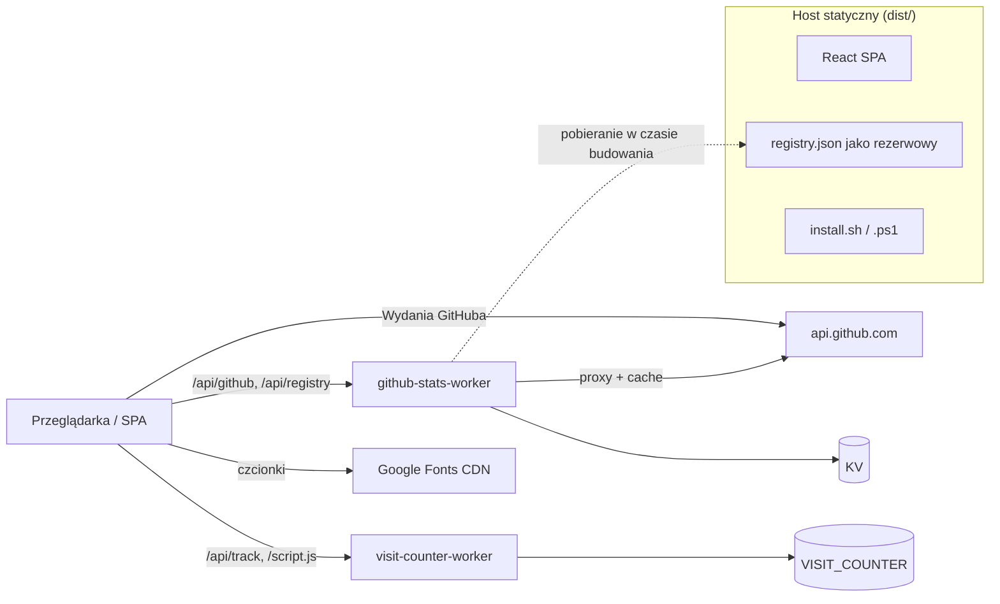

# web — web

# Moduł Web — Strona marketingowa LibreFang

## Przeznaczenie

Ten moduł to publiczna strona marketingowa oraz punkt wejścia instalatora dla LibreFang. **Nie** jest to główny kod w języku Rust. Pełni funkcje:

- Lokalizowanej jednostronicowej strony docelowej pod adresem `https://librefang.ai`
- Skryptów instalacyjnych (`install.sh`, `install.ps1`) oraz metadanych instalatora
- Dwóch Cloudflare Workers obsługujących statystyki GitHuba oraz licznik odwiedzin
- Zasobów PWA, metadanych SEO, mapy witryny i kanału RSS

Główne repozytorium znajduje się w innym miejscu (`https://github.com/librefang/librefang`); ten moduł jedynie korzysta z jego API i artefaktów do pobrania.

## Architektura

Wdrożenie produkcyjne składa się z trzech niezależnie dostarczanych części:



Frontend jest celowo minimalistyczny: większość danych dynamicznych jest pobierana w czasie rzeczywistym, a nie trzymana w lokalnym stanie aplikacji. Store zustand przechowuje wyłącznie stan języka/UI oraz leniwe ładowanie czcionek.

## Stos technologiczny

| Warstwa | Wybór |
|---|---|
| UI | React 19, TypeScript (tryb ścisły) |
| Build | Vite 8 z ręcznym dzieleniem na chunki opartym na Rolldown |
| Stylowanie | Tailwind CSS v4 przez `@tailwindcss/postcss` + autoprefixer |
| Stan | zustand |
| Pobieranie danych | `@tanstack/react-query` |
| Animacja | framer-motion |
| Walidacja | zod |
| Nazwy klas | `clsx` + `tailwind-merge` (przez `src/lib/utils.ts`) |
| Ikony | lucide-react |
| Edge | Cloudflare Workers + KV |

## Kluczowe komponenty

### Kod źródłowy frontendu (`src/`)

- **`App.tsx`** — Zarządza sekcjami strony (Header, Hero, Funkcje, Porównanie, Instalacja, FAQ itd.), żądaniami statystyk GitHuba, żądaniami licznika odwiedzin oraz wykrywaniem języka na podstawie prefiksu ścieżki.
- **`main.tsx`** — Punkt wejścia React; rejestruje provider React Query.
- **`i18n.ts`** — `rawTranslations` dla każdej obsługiwanej lokalizacji, lista `languages` oraz funkcja pomocnicza `getTranslation(lang)`, która głęboko łączy lokalizację z angielską, aby brakujące klucze miały wartości zastępcze.
- **`store.ts`** — Store zustand dla stanu języka. Leniwie wstrzykuje odpowiedni arkusz stylów Google Fonts (Noto Sans SC/TC/JP/KR) tylko wtedy, gdy aktywna jest lokalizacja CJK. Lokalizacje nie-CJK korzystają z podstawowych czcionek `Inter` + `JetBrains Mono` i nie ładują dodatkowych zasobów.
- **`useRegistry.ts`** — Hook danych rejestru. Odpytuje zdalny punkt końcowy i w razie niepowodzenia przechodzi na statyczny `public/registry.json`.
- **`lib/utils.ts`** — Funkcja pomocnicza `clsx` + `tailwind-merge` dla nazw klas.
- **`index.css`** — Style globalne i style komponentów Tailwind.
- **`components/SearchDialog.tsx`** — Zarządza obsługą prefiksów ścieżek dla wyszukiwania z uwzględnieniem lokalizacji.

### Skrypty czasu budowania (`scripts/`)

Trzy preskrypty uruchamiają się automatycznie przed `dev` i `build` (patrz `predev` / `prebuild` w `package.json`):

1. **`fetch-registry.ts`** — Pobiera dane rejestru agentów i zapisuje `public/registry.json`. Jest to statyczna kopia zapasowa wykorzystywana przez `useRegistry.ts`, gdy aktywny API jest niedostępny.
2. **`gen-og-images.ts`** — Generuje obrazy Open Graph.
3. **`gen-rss.ts`** — Generuje kanał Atom `/feed.xml` powiązany z `index.html`.

Niezależny skrypt narzędziowy:

- **`audit-locale-completeness.ts`** — Uruchamiany przez `pnpm i18n:audit <locale>` (lub `--all`). Porównuje `rawTranslations[locale]` z `rawTranslations.en` i raportuje nieprzetłumaczone klucze. Uruchom przed otwarciem PR z tłumaczeniem.

### Zasoby statyczne (`public/`)

- `install.sh`, `install.ps1`, `install-manifest.json` — dystrybucja instalatora
- `registry.json` — wygenerowana kopia zapasowa rejestru
- `_headers`, `_redirects` — nagłówki bezpieczeństwa, reguły CSP, polityki cache, przekierowania dla hostów statycznych, które je obsługują
- `sitemap.xml`, `robots.txt`, obraz OG, favicon, ikony PWA, maskotka

> **Ograniczenie utrzymania:** skrypty instalacyjne i metadane istnieją **jednocześnie** w katalogu głównym repozytorium i w `public/`. Edycja jednej kopii bez drugiej jest prawie zawsze błędem.

### Cloudflare Workers (`workers/`)

**`github-stats-worker`**
- `GET /api/github` — agreguje gwiazdki, forki, issues, PR-y, pobrania
- Buforuje odpowiedzi w KV, zapisuje dzienne migawki przez wyzwalacz cron
- Powiązania: `KV`; opcjonalny sekret `GITHUB_TOKEN`

**`visit-counter-worker`**
- `GET /api` — bieżące statystyki odwiedzin dla frontendu
- `POST /api/track` — rejestruje wizytę
- `GET /script.js` — osadzony skrypt śledzenia (ładowany przez `index.html`)
- Powiązanie: `VISIT_COUNTER`

Wdrożenie workerów **nie** jest powiązane z buildem frontendu — jest to osobny krok operacyjny:

```bash
cd workers/github-stats-worker
wrangler deploy
wrangler secret put GITHUB_TOKEN

cd ../visit-counter-worker
wrangler deploy
```

Przed wdrożeniem na inne konto Cloudflare, zamień `account_id` i identyfikatory przestrzeni nazw KV w każdym `wrangler.toml`.

## Internacjonalizacja

Strona obsługuje dziewięć lokalizacji, wykrywanych wyłącznie na podstawie prefiksu ścieżki URL:

| Prefiks | Lokalizacja |
|---|---|
| `/` | Angielski |
| `/zh/` | Chiński uproszczony |
| `/zh-TW/` | Chiński tradycyjny |
| `/de/` | Niemiecki |
| `/ja/` | Japoński |
| `/ko/` | Koreański |
| `/es/` | Hiszpański |
| `/pl/` | Polski |
| `/uk/` | Ukraiński |

Wykrywanie odbywa się w dwóch miejscach, które muszą pozostać zsynchronizowane:

1. **Skrypt bootstrap w `index.html`** — uruchamia się przed hydratacją React. Ustawia `document.documentElement.lang`, `window.__INITIAL_LANG__` i nadpisuje `<meta name="description">` / opisy OG / Twitter na zlokalizowany ciąg znaków, aby roboty indeksujące i podglądy linków widziały poprawny język bez wykonywania JS. Uwaga: `/zh-TW` jest dopasowywany **przed** `/zh`, ponieważ ten drugi jest prefiksem pierwszego.
2. **`src/store.ts`** — wykrywanie ścieżki w czasie rzeczywistym przekazujące dane do store'a zustand.

Lokalizacje CJK (zh, zh-TW, ja, ko) uruchamiają leniwe ładowanie Noto Sans SC/TC/JP/KR przez drugi skrypt bootstrap w `index.html` oraz równoległy mechanizm w store.

### Dodawanie nowego języka

Podczas wprowadzania lokalizacji zaktualizuj **wszystkie** z tych elementów:

1. `src/i18n.ts` — dodaj tłumaczenia i wpis `languages`
2. `src/store.ts` — dodaj wykrywanie ścieżki
3. `index.html` — dodaj do skryptu bootstrap wykrywającego język oraz do mapy meta-opisów
4. `src/components/SearchDialog.tsx` — dodaj obsługę prefiksu ścieżki
5. `public/sitemap.xml` — dodaj nowy URL
6. Uruchom `pnpm i18n:audit <locale>`, gdy tłumaczenia mają być ukończone

## Build i paczka

`vite.config.ts` definiuje jawne vendor chunks przez formę funkcyjną `manualChunks` (Rolldown w Vite 8 odrzuca formę obiektową):

- `vendor-react` — `react` + `react-dom`
- `vendor-motion` — `framer-motion`
- `vendor-query` — `@tanstack/react-query`

Serwer deweloperski działa na porcie `3002` z `host: true`.

PWA jest rejestrowane z `index.html` (`navigator.serviceWorker.register('/sw.js')`); sam service worker jest generowany przez konfigurację `vite-plugin-pwa` powiązaną z README (rejestracja wtyczki nie jest obecna w obecnym fragmencie `vite.config.ts` — zweryfikuj przed poleganiem na niej).

## Rozwój lokalny

```bash
pnpm install
pnpm dev          # uruchamia predev (generacja rejestru/OG/RSS), a następnie vite
pnpm build        # uruchamia prebuild, wynik w dist/
pnpm preview      # serwuje build produkcyjny
pnpm fetch-registry
pnpm gen-og
pnpm gen-rss
pnpm i18n:audit <locale> | --all
```

Uwaga: **`dev` i `build` celują w zewnętrzne punkty końcowe produkcyjne**, chyba że edytujesz kod źródłowy. Jeśli którykolwiek z nich jest niedostępny, odpowiednie sekcje UI degradują się z elegancją, ale pokazują puste dane:

- `api.github.com/repos/librefang/librefang/releases/latest` — sekcja Hero
- `stats.librefang.ai/api/github` — statystyki społeczności GitHub
- `stats.librefang.ai/api/registry` — rejestr agentów (z kopią zapasową `public/registry.json`)
- `counter.librefang.ai/api` oraz `/script.js` — licznik odwiedzin
- `fonts.googleapis.com` / `fonts.gstatic.com` — Inter, JetBrains Mono, czcionki CJK
- Google Analytics (`G-9Q0WS7SHZ6`) — `gtag`

## Testowanie i jakość

| Polecenie | Co robi |
|---|---|
| `pnpm lint` | `tsc --noEmit` typecheck (tryb ścisły, `noUncheckedIndexedAccess`, `noUnusedLocals/Parameters`) |
| `pnpm test` | Uruchomienie Vitest — pobiera `src/**/*.{test,spec}.{ts,tsx}` oraz `scripts/**/*.{test,spec}.ts` |
| `pnpm test:watch` | Vitest w trybie watch |
| `pnpm test:e2e` | Pakiet Playwright z `e2e/`; buduje i serwuje podgląd na `127.0.0.1:4174` |

ESLint (`eslint.config.js`) aplikuje `js.configs.recommended`, `react-hooks` oraz `react-refresh` (preset Vite), z `no-unused-vars` zezwalającym na identyfikatory zaczynające się od wielkiej litery lub podkreślnika.

Lighthouse CI (`lighthouserc.json`) audytuje stronę główną oraz `/skills`, `/agents` i `/hands` pod kątem wydajności (ostrzeżenie ≥ 0.85), dostępności (błąd ≥ 0.9), dobrych praktyk (ostrzeżenie ≥ 0.9) oraz SEO (błąd ≥ 0.9), pomijając `uses-http2`.

## Utrzymanie treści

- **Kopiowanie / tłumaczenia** → `src/i18n.ts` (surowe tłumaczenia, nawigacja, FAQ, teksty sekcji GitHub/społeczność/docs, wpisy przełącznika języków)
- **Struktura strony / sekcje** → `src/App.tsx`
- **Metadane SEO, GA, skrypt licznika odwiedzin, wykrywanie bootstrap, JSON-LD** → `index.html`
- **Zasoby instalatora** — utrzymuj skrypty w katalogu głównym repozytorium, kopie w `public/` oraz `public/install-manifest.json` w synchronizacji
- **Zasoby statyczne** → `public/`

## Ograniczenia operacyjne

Kilka niezmienników łatwo złamać bez zauważenia — miej je na uwadze:

- **Podwójne kopie instalatora**: skrypty w katalogu głównym i skrypty w `public/` muszą pozostać zsynchronizowane z `public/install-manifest.json`.
- **Zahardkodowane domeny API** w `src/App.tsx` i `index.html`. Jeśli domeny workerów ulegną zmianie, zaktualizuj oba miejsca oraz allowlistę CSP w `public/_headers`.
- **CSP** w `public/_headers` zablokuje każdy nowy skrypt lub zasób zewnętrzny nie znajdujący się jawnie na allowliście.
- **Ścieżki lokalizacji** są rozproszone w `sitemap.xml`, skrypcie bootstrap w `index.html`, `src/store.ts` i `src/components/SearchDialog.tsx`.
- **Wdrożenie workerów** to ręczny krok `wrangler deploy`, niezależny od `pnpm build`.

## Relacja z resztą bazy kodu

Ten moduł jest liściem: nie ma wewnętrznych zależności wejściowych ani wyjściowych względem innych modułów LibreFang. Konsumuje trzy zewnętrzne powierzchnie projektu głównego — API wydań GitHuba, URL-e pobierania binariów powiązane w `install-manifest.json` oraz (transytywnie, przez stats worker) metadane repozytorium GitHub. Zmiany nazw plików instalatora, lokalizacji artefaktów wydań lub schematu rejestru w głównym repozytorium będą wymagały skoordynowanych aktualizacji tutaj, przede wszystkim w `scripts/fetch-registry.ts`, `public/install-manifest.json` oraz skryptach instalacyjnych.
