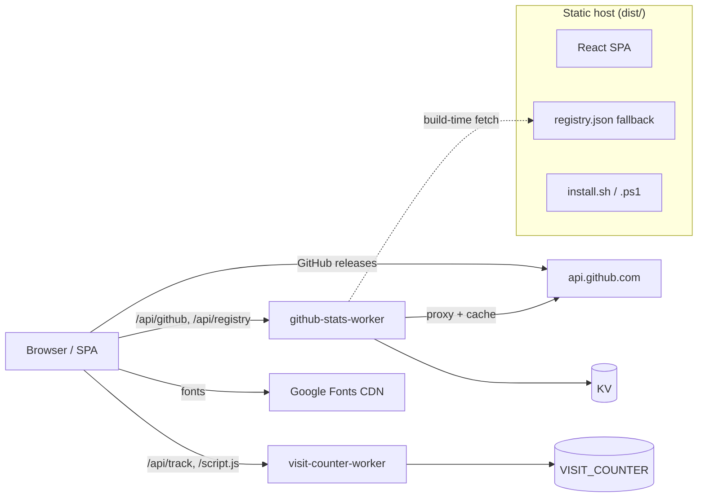

# web — web

# Web Module — LibreFang Marketing Site

## Purpose

This module is the public-facing marketing website and installer entry point for LibreFang. It is **not** the core Rust codebase. It serves:

- A localized single-page landing site at `https://librefang.ai`
- Install scripts (`install.sh`, `install.ps1`) and install metadata
- Two Cloudflare Workers backing GitHub stats and visit counting
- PWA assets, SEO metadata, sitemap, and RSS feed

The core repository lives elsewhere (`https://github.com/librefang/librefang`); this module only consumes its APIs and download artifacts.

## Architecture

The production deployment has three independently shipped parts:



The frontend is intentionally thin: most dynamic data is fetched at runtime rather than held in local application state. The zustand store only carries language/UI state and lazy font loading.

## Tech Stack

| Layer | Choice |
|---|---|
| UI | React 19, TypeScript (strict) |
| Build | Vite 8 with Rolldown-based manual chunking |
| Styling | Tailwind CSS v4 via `@tailwindcss/postcss` + autoprefixer |
| State | zustand |
| Data fetching | `@tanstack/react-query` |
| Animation | framer-motion |
| Validation | zod |
| Classnames | `clsx` + `tailwind-merge` (via `src/lib/utils.ts`) |
| Icons | lucide-react |
| Edge | Cloudflare Workers + KV |

## Key Components

### Frontend source (`src/`)

- **`App.tsx`** — Owns the page sections (Header, Hero, Features, Comparison, Install, FAQ, etc.), GitHub stats requests, visit counter requests, and path-prefix-based language detection.
- **`main.tsx`** — React entrypoint; mounts the React Query provider.
- **`i18n.ts`** — `rawTranslations` for every supported locale, plus the `languages` list and the `getTranslation(lang)` helper that deep-merges a locale over English so missing keys fall back.
- **`store.ts`** — Zustand store for language state. Lazily injects the appropriate Google Fonts stylesheet (Noto Sans SC/TC/JP/KR) only when a CJK locale is active. Non-CJK locales use the base `Inter` + `JetBrains Mono` fonts and load no extra resources.
- **`useRegistry.ts`** — Registry data hook. Hits the remote endpoint and falls back to the static `public/registry.json` on failure.
- **`lib/utils.ts`** — `clsx` + `tailwind-merge` className helper.
- **`index.css`** — Global styles and Tailwind component styles.
- **`components/SearchDialog.tsx`** — Owns path-prefix handling for locale-aware search.

### Build-time scripts (`scripts/`)

Three pre-scripts run automatically before both `dev` and `build` (see `predev` / `prebuild` in `package.json`):

1. **`fetch-registry.ts`** — Fetches agent registry data and writes `public/registry.json`. This is the static fallback consumed by `useRegistry.ts` when the live API is unavailable.
2. **`gen-og-images.ts`** — Generates Open Graph images.
3. **`gen-rss.ts`** — Generates the `/feed.xml` Atom changelog referenced from `index.html`.

A standalone utility script:

- **`audit-locale-completeness.ts`** — Invoked via `pnpm i18n:audit <locale>` (or `--all`). Compares `rawTranslations[locale]` against `rawTranslations.en` and reports untranslated keys. Run this before opening a translation PR.

### Static assets (`public/`)

- `install.sh`, `install.ps1`, `install-manifest.json` — installer distribution
- `registry.json` — generated registry fallback
- `_headers`, `_redirects` — security headers, CSP rules, cache policies, redirects for static hosts that support them
- `sitemap.xml`, `robots.txt`, OG image, favicon, PWA icons, mascot

> **Maintenance constraint:** installer scripts and metadata exist in **both** the repo root and `public/`. Editing one copy without the other is almost always a bug.

### Cloudflare Workers (`workers/`)

**`github-stats-worker`**
- `GET /api/github` — aggregates stars, forks, issues, PRs, downloads
- Caches responses in KV, records daily snapshots via a cron trigger
- Bindings: `KV`; optional secret `GITHUB_TOKEN`

**`visit-counter-worker`**
- `GET /api` — current visit stats for the frontend
- `POST /api/track` — records a visit
- `GET /script.js` — embeddable tracking script (loaded by `index.html`)
- Binding: `VISIT_COUNTER`

Worker deployment is **not** wired into the frontend build — it is a separate operational step:

```bash
cd workers/github-stats-worker
wrangler deploy
wrangler secret put GITHUB_TOKEN

cd ../visit-counter-worker
wrangler deploy
```

Replace `account_id` and KV namespace IDs in each `wrangler.toml` before deploying to a different Cloudflare account.

## Internationalization

The site supports nine locales, detected purely from URL path prefix:

| Prefix | Locale |
|---|---|
| `/` | English |
| `/zh/` | Simplified Chinese |
| `/zh-TW/` | Traditional Chinese |
| `/de/` | Deutsch |
| `/ja/` | Japanese |
| `/ko/` | Korean |
| `/es/` | Spanish |
| `/pl/` | Polish |
| `/uk/` | Ukrainian |

Detection happens in two places that must stay in sync:

1. **`index.html` bootstrap script** — runs before React hydrates. Sets `document.documentElement.lang`, `window.__INITIAL_LANG__`, and rewrites the `<meta name="description">` / OG / Twitter descriptions to the localized string so crawlers and link unfurls see the correct language without executing JS. Note that `/zh-TW` is matched **before** `/zh` because the latter is a prefix of the former.
2. **`src/store.ts`** — runtime path detection feeding the zustand store.

CJK locales (zh, zh-TW, ja, ko) trigger lazy loading of Noto Sans SC/TC/JP/KR via a second bootstrap script in `index.html` and a parallel mechanism in the store.

### Adding a new language

When introducing a locale, update **all** of these:

1. `src/i18n.ts` — add translations and a `languages` entry
2. `src/store.ts` — add path detection
3. `index.html` — add to both the language-detection bootstrap script and the meta-description map
4. `src/components/SearchDialog.tsx` — add path-prefix handling
5. `public/sitemap.xml` — add the new URL
6. Run `pnpm i18n:audit <locale>` once translations are intended to be complete

## Build & Bundle

`vite.config.ts` defines explicit vendor chunks via the function form of `manualChunks` (Rolldown in Vite 8 rejects the object form):

- `vendor-react` — `react` + `react-dom`
- `vendor-motion` — `framer-motion`
- `vendor-query` — `@tanstack/react-query`

The dev server runs on port `3002` with `host: true`.

PWA is registered from `index.html` (`navigator.serviceWorker.register('/sw.js')`); the service worker itself is generated by `vite-plugin-pwa` configuration referenced from the README (the plugin registration is not present in the current `vite.config.ts` snippet — verify before relying on it).

## Local Development

```bash
pnpm install
pnpm dev          # runs predev (registry/OG/RSS generation), then vite
pnpm build        # runs prebuild, outputs dist/
pnpm preview      # serves the production build
pnpm fetch-registry
pnpm gen-og
pnpm gen-rss
pnpm i18n:audit <locale> | --all
```

Note that **`dev` and `build` target production external endpoints** unless you edit the source. If any of these are down, the affected UI sections degrade gracefully but show empty data:

- `api.github.com/repos/librefang/librefang/releases/latest` — Hero section
- `stats.librefang.ai/api/github` — GitHub community stats
- `stats.librefang.ai/api/registry` — agent registry (with `public/registry.json` fallback)
- `counter.librefang.ai/api` and `/script.js` — visit counter
- `fonts.googleapis.com` / `fonts.gstatic.com` — Inter, JetBrains Mono, CJK fonts
- Google Analytics (`G-9Q0WS7SHZ6`) — `gtag`

## Testing & Quality

| Command | What it does |
|---|---|
| `pnpm lint` | `tsc --noEmit` typecheck (strict mode, `noUncheckedIndexedAccess`, `noUnusedLocals/Parameters`) |
| `pnpm test` | Vitest run — picks up `src/**/*.{test,spec}.{ts,tsx}` and `scripts/**/*.{test,spec}.ts` |
| `pnpm test:watch` | Vitest in watch mode |
| `pnpm test:e2e` | Playwright suite from `e2e/`; builds then previews on `127.0.0.1:4174` |

ESLint (`eslint.config.js`) applies `js.configs.recommended`, `react-hooks`, and `react-refresh` (Vite preset), with `no-unused-vars` permitting identifiers starting with uppercase or underscore.

Lighthouse CI (`lighthouserc.json`) audits the root plus `/skills`, `/agents`, and `/hands` against performance (warn ≥ 0.85), accessibility (error ≥ 0.9), best-practices (warn ≥ 0.9), and SEO (error ≥ 0.9), skipping `uses-http2`.

## Content Maintenance

- **Copy / translations** → `src/i18n.ts` (raw translations, navigation, FAQ, GitHub/community/docs section text, language switcher entries)
- **Page structure / sections** → `src/App.tsx`
- **SEO metadata, GA, visit-counter script, bootstrap detection, JSON-LD** → `index.html`
- **Installer resources** → keep repo-root scripts, `public/` copies, and `public/install-manifest.json` in sync
- **Static assets** → `public/`

## Operational Constraints

Several invariants are easy to break silently — keep them in mind:

- **Dual installer copies**: root scripts and `public/` scripts must stay aligned with `public/install-manifest.json`.
- **Hardcoded API domains** in `src/App.tsx` and `index.html`. If worker domains change, update both, plus the CSP allowlist in `public/_headers`.
- **CSP** in `public/_headers` will block any new third-party script or asset origin not explicitly allowlisted.
- **Locale paths** are spread across `sitemap.xml`, the `index.html` bootstrap script, `src/store.ts`, and `src/components/SearchDialog.tsx`.
- **Worker deployment** is a manual `wrangler deploy` step, independent of `pnpm build`.

## Relationship to the Rest of the Codebase

This module is a leaf: it has no inbound or outbound internal dependencies on other LibreFang modules. It consumes three external surfaces of the core project — the GitHub releases API, the binary download URLs referenced by `install-manifest.json`, and (transitively, via the stats worker) the GitHub repository metadata. Changes to installer filenames, release artifact locations, or the registry schema in the core repository will require coordinated updates here, primarily in `scripts/fetch-registry.ts`, `public/install-manifest.json`, and the installer scripts.