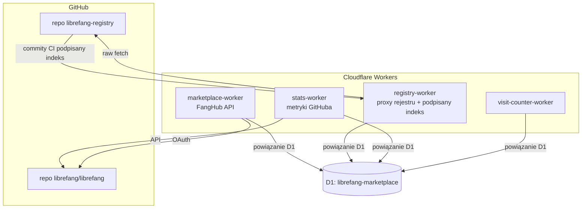

# web — workers

# web/workers

Cloudflare Workers obsługujące obecność LibreFang w sieci: API rynku FangHub, proxy rejestru wtyczek, zbieranie statystyk GitHuba oraz lekki licznik odwiedzin. Wszystkie cztery workery to pojedyncze pliki ES modułów wdrażane przez Wrangler, współdzielące jedną bazę D1 (SQLite).

## Architektura



Wszystkie workery są powiązane z tą samą bazą D1 (`database_id: 1bbf40ca-...`). Każdy worker jest właścicielem odrębnych tabel, ale może odczytywać tabele współdzielone (np. `kv_store`, `visit_counts`).

---

## Workery

### marketplace-worker (`librefang-marketplace`)

Rejestr pakietów FangHub. Obsługuje uwierzytelnianie GitHub OAuth, CRUD pakietów, publikowanie wersji z podpisywaniem Ed25519, przekierowania pobierania z asynchronicznym grupowym zliczaniem oraz śledzenie gwiazdek.

**Kluczowe endpointy:**

| Ścieżka | Metoda | Obsługa | Autoryzacja |
|---|---|---|---|
| `/v1/packages` | GET | `handleListPackages` | Publiczny |
| `/v1/packages` | POST | `handleCreatePackage` | Ciasteczko |
| `/v1/packages/{slug}` | GET/PUT/DELETE | `handleGetPackage` / `handleUpdatePackage` / `handleDeletePackage` | Publiczny / Właściciel / Właściciel |
| `/v1/packages/{slug}/versions` | GET/POST | `handleListVersions` / `handlePublishVersion` | Publiczny / Właściciel |
| `/v1/download/{slug}/{version}` | GET | `handleDownload` | Publiczny (przekierowanie 302) |
| `/v1/packages/{slug}/star` | POST/DELETE | `handleStar` | Ciasteczko |
| `/v1/pubkey` | GET | `handlePubkey` | Publiczny |
| `/v1/download/{slug}/{version}/signature` | GET | `handleVersionSignature` | Publiczny |
| `/auth/github`, `/auth/github/callback`, `/auth/me`, `/auth/logout` | GET | Przepływ OAuth | — |

**Model autoryzacji:** Bezstanowy JWT HS256 przechowywany w ciasteczku HttpOnly `mp_token`. `authenticate()` wyciąga i weryfikuje JWT przy każdym chronionym żądaniu. Tokeny JWT wygasają po 30 dniach. Rekordy użytkowników GitHuba są upsertowane do tabeli `users` przy każdym wywołaniu zwrotnym.

**Zliczanie pobierań:** Pobrania nie są zliczane synchronicznie. `handleDownload` uruchamia `ctx.waitUntil()`, który wykonuje upsert do `download_counts_pending` (kluczowane wg pakiet, wersja, tydzień ISO). Cotygodniowy cron (`flushDownloadCounts`) zeruje `weekly_downloads`, a następnie agreguje oczekujące liczniki do `total_downloads`, `weekly_downloads` oraz kolumn `downloads` dla poszczególnych wersji.

**Lista dozwolonych hostów bundle:** `handlePublishVersion` odrzuca wartości `bundle_url`, które nie pasują do `ALLOWED_BUNDLE_LOCATIONS`. Jest to kontrola krytyczna dla bezpieczeństwa — bez niej autor mógłby skierować podpis rejestru na URL kontrolowany przez atakującego. Walidacja używa sparsowanych krotek `(host, pathRegex)` zamiast dopasowywania prefiksów ciągu, aby zapobiec obejściu poprzez normalizację URL WHATWG. Dozwolone hosty:

- `github.com` — ścieżka musi pasować do `/^\/[^/]+\/[^/]+\/releases\/download\//` (tylko niezmienn zasoby wydania)
- `objects.githubusercontent.com` — CDN zasobów GitHuba
- `marketplace.librefang.ai` — ścieżka musi znajdować się pod `/bundles/`

URL-e z danymi uwierzytelniającymi, fragmentami hash lub schematami innymi niż HTTPS są odrzucane.

### registry-worker (`librefang-registry`)

Proxy repozytorium GitHuba `librefang/librefang-registry`. Serwuje dwa odrębne ładunki:

1. **Ładunek dashboardu** (`GET /api/registry`) — JSON w postaci słownika (hands/channels/plugins/skills/...) konsumowany przez UI rynku. Przechowywany w D1 `kv_store['registry_data']`.
2. **Ładunek demona** (`GET /api/registry/index.json`) — płaska tablica JSON wpisów `{name, version?, description?, needs?}`. To, co jest podpisywane Ed25519 i co demon weryfikuje.

**Przepływ synchronizacji (`doSyncFromRepo`):** Pobiera równolegle trzy pliki z `raw.githubusercontent.com` — `plugins-index.json`, `plugins-index.json.sig` i `registry-index.json` — i zapisuje je dosłownie w D1. Worker nie wykonuje podpisywania; jest czystym transportem. Podpis jest generowany przez CI GitHub Actions repozytorium rejestru, które przechowuje klucz prywatny Ed25519 jako sekret Actions.

**Dwa wyzwalacze synchronizacji:**

- **Wymuszone odświeżenie** (`POST /api/registry/refresh`): Wywoływane przez GitHub Action repozytorium rejestru po pushu. Uwierzytelniane przez bearer token (`REGISTRY_REFRESH_TOKEN`) porównywany za pomocą `constantTimeEqual()`. Zwraca 503, dopóki token nie jest skonfigurowany.
- **Cron zapasowy** (`scheduled`): Codziennie o 02:00 UTC. Bez autoryzacji (worker wywołuje sam siebie). Zabezpieczenie przed awariami CI.

**Warstwy cachowania:**

- **Cache API** — `caches.default` z TTL 1h dla danych rejestru, 6h dla metadanych commitów, 10m dla trendów. Ścieżka wymuszonego odświeżenia czyści klucz cache danych rejestru po zapisie do D1, aby dashboard natychmiast widział świeże dane.
- **Okno nieświeżości** — Jeśli dane D1 są młodsze niż `REGISTRY_STALE_TTL` (24h), worker serwuje je nawet gdy przesłano `?refresh=1`. Pełna odbudowa wykonuje 30+ subzapytań do GitHuba, co przekracza budżet subzapytań na żądanie w darmowym planie Workers; tylko uruchomienia cron mają wyższy limit.

**Inne endpointy rejestru:** Proxy surowych plików (`/api/registry/raw`), metadane commitów (`/api/registry/commit`), śledzenie kliknięć (`/api/registry/click` → D1 `registry_clicks`), trendy (`/api/registry/trending`), zagregowane metryki (`/api/registry/metrics`) oraz raportowanie błędów UI (`/api/errors` POST/GET → D1 `ui_errors`, automatycznie czyszczone po 30 dniach).

### stats-worker (`librefang-github-stats`)

Zbiera metryki GitHuba dla głównego repozytorium `librefang/librefang`. Codzienny cron o 00:00 UTC wywołuje `recordDailyStats()`, który pobiera metadane repozytorium i liczbę otwartych PR-ów, a następnie wykonuje upsert do `github_stats_history` kluczowany po dacie.

**Endpointy:**

- `GET /api/github` — Bieżące statystyki (gwiazdki, forki, issue, PR-y, pobrania, 30-dniowa historia gwiazdek). TTL 30min w Cache API. `?refresh=1` omija cache.
- `GET /api/releases` — Najnowsze 20 wydań (proxy z GitHub API). Cache 30min.

Liczby PR-ów są wydobywane z paginacji nagłówka `Link` GitHuba (`parseLinkHeaderCount`) zamiast zliczania strony wyników, co unika problemów z limitami zapytań w repozytoriach z wieloma otwartymi PR-ami.

### visit-counter-worker (`librefang-visit-counter`)

Minimalny licznik odwiedzin stron. Dwa specjalne wiersze w `visit_counts`: `__total__` (wszechczasowe) i bieżąca data (dzienna). `GET /script.js` zwraca wbudowany skrypt śledzący, który wysyła POST do `/api/track` z `keepalive: true` dla niezawodności przy zamykaniu strony.

---

## Podpisywanie wtyczek

Istnieją dwie odrębne architektury podpisywania, obie wykorzystujące tę samą parę kluczy Ed25519 (wygenerowaną przez `keygen.mjs`):

### Podpisywanie indeksu rejestru (registry-worker)

Worker **nie przechowuje klucza prywatnego**. Łańcuch zaufania to:

1. CI repozytorium rejestru buduje `plugins-index.json` (płaska tablica wpisów wtyczek).
2. CI podpisuje go lokalnie kluczem prywatnym Ed25519 (przechowywanym jako sekret GitHub Actions).
3. CI commituje zarówno `plugins-index.json`, jak i `plugins-index.json.sig` do repozytorium, a następnie wywołuje `POST /api/registry/refresh`.
4. Worker pobiera commitowane pliki i zapisuje je dosłownie w D1.
5. Demon pobiera `GET /api/registry/index.json` i `GET /api/registry/index.json.sig`, weryfikując podpis względem przypiętego przez TOFU klucza publicznego.

Worker weryfikuje, że indeks jest tablicą JSON, dane rejestru są obiektem JSON, a podpis ma 86 lub 88 znaków base64 (64 surowe bajty dla Ed25519). Zniekształcone ładunki są odrzucane przed zapisem do D1.

### Podpisywanie bundle (marketplace-worker)

Worker przechowuje klucz prywatny jako sekret Cloudflare (`REGISTRY_PRIVATE_KEY`). W momencie publikacji, `handlePublishVersion` konstruuje ciąg kanoniczny:

```
<slug>@<version>|<bundle_url>|<bundle_sha256>
```

podpisuje go za pomocą `signWithRegistryKey()` i zapisuje podpis base64 w `package_versions.bundle_sig`. Demon pobiera `GET /v1/download/{slug}/{version}/signature`, rekonstruuje ten sam ciąg kanoniczny lokalnie i weryfikuje.

### Dystrybucja klucza publicznego

Oba workery eksponują surowy 32-bajtowy klucz publiczny Ed25519 (base64) na swoich odpowiednich endpointach:

- `marketplace-worker`: `GET /v1/pubkey`
- `registry-worker`: `GET /.well-known/registry-pubkey` oraz `GET /api/registry/pubkey` (alias `/api/*` istnieje, ponieważ domena niestandardowa kieruje tylko `/api/*` do workera)

Demon używa TOFU (trust on first use): pobiera klucz publiczny przy pierwszym kontakcie, cachuje go w `~/.librefang/registry.pub` i przypina dla wszystkich kolejnych weryfikacji.

### Łagodna degradacja

Podpisywanie jest w pełni opcjonalne. Gdy klucze nie są skonfigurowane:

- `REGISTRY_PRIVATE_KEY` nieustawiony → `signWithRegistryKey()` zwraca `null`; kolumny `bundle_sig` są zapisywane jako `NULL`; cron pomija przechowywanie podpisów.
- `REGISTRY_PUBLIC_KEY` nieustawiony → endpointy klucza publicznego i podpisu zwracają HTTP 503.
- Wszystkie istniejące endpointy (`/api/registry`, `/v1/packages`, `/v1/download/...`) pozostają funkcjonalne.
- Demon przechodzi na weryfikację bundle wyłącznie SHA-256.

### Zarządzanie kluczami

Użyj `node web/workers/keygen.mjs` aby wygenerować parę kluczy. Skrypt wypisuje:

- `REGISTRY_PUBLIC_KEY` — surowy 32-bajtowy klucz publiczny, base64. Niejawny. Trafia do `[vars]` w `wrangler.toml` dla obu workerów.
- `REGISTRY_PRIVATE_KEY` — PKCS#8 DER, base64. Tajny. Wdrażany przez `wrangler secret put` do obu workerów.

Aby uzyskać informacje o rotacji, inicjalizacji i pełnym modelu zaufania po stronie demona, patrz [`SIGNING.md`](./SIGNING.md) oraz `docs/architecture/plugin-signing.md`.

---

## Współdzielony schemat D1

Zdefiniowany w `marketplace-worker/schema.sql`. Tabele są podzielone wg właściciela workera:

| Worker | Tabele |
|---|---|
| marketplace-worker | `users`, `packages`, `package_versions`, `stars`, `download_counts_pending` |
| registry-worker | `registry_clicks`, `ui_errors`, `kv_store` |
| stats-worker | `github_stats_history` |
| visit-counter-worker | `visit_counts` |

`kv_store` to ogólnego przeznaczenia tabela klucz-wartość używana dla stanu typu singleton: `registry_data` (ładunek dashboardu), `plugins_index` (ładunek demona), `plugins_index_sig` (podpis Ed25519) i powiązanych znaczników czasu.

Kolumna `bundle_sig` w `package_versions` została dodana dla podpisywania. Dla istniejących baz danych, D1 ignoruje zduplikowane instrukcje `ALTER TABLE`, więc migracja jest idempotentna:

```sql
ALTER TABLE package_versions ADD COLUMN bundle_sig TEXT;
```

---

## Wdrażanie

Każdy worker ma swój własny `wrangler.toml` i jest wdrażany niezależnie:

```bash
cd web/workers/registry-worker      && wrangler deploy
cd web/workers/marketplace-worker    && wrangler deploy
cd web/workers/stats-worker          && wrangler deploy
cd web/workers/visit-counter-worker  && wrangler deploy
```

**Sekrety** (wdrażane przez `wrangler secret put`):

| Sekret | Worker | Przeznaczenie |
|---|---|---|
| `REGISTRY_PRIVATE_KEY` | marketplace-worker, registry-worker* | Klucz prywatny Ed25519 PKCS#8 do podpisywania |
| `REGISTRY_REFRESH_TOKEN` | registry-worker | Bearer token dla endpointu wymuszonego odświeżenia |
| `JWT_SECRET` | marketplace-worker | Klucz podpisywania HS256 dla tokenów sesyjnych JWT |
| `GITHUB_CLIENT_SECRET` | marketplace-worker | Sekret aplikacji GitHub OAuth |
| `GITHUB_TOKEN` | registry-worker, stats-worker | Token GitHub API (wyższe limity zapytań) |

*Uwaga: W obecnym projekcie, `registry-worker` nie używa `REGISTRY_PRIVATE_KEY` do podpisywania — serwuje jedynie pre-podpisany indeks commitowany przez CI. Sekret jest wymieniony dla wstecznej kompatybilności i potencjalnego przyszłego użycia.

**Zmienne** (w `wrangler.toml`, niejawne):

- `REGISTRY_PUBLIC_KEY` — surowy 32-bajtowy klucz publiczny Ed25519, base64. Obecnie `joY8IYrUbbACfKRyp2CTcEbcEty8wcBwP1MTxU+vjaM=` dla obu workerów podpisujących.
- `GITHUB_CLIENT_ID` — ID klienta aplikacji OAuth.
- `GITHUB_REDIRECT_URI`, `AUTH_SUCCESS_REDIRECT` — URL-e przepływu OAuth.

**Wyzwalacze cron:**

| Worker | Harmonogram (UTC) | Akcja |
|---|---|---|
| stats-worker | `0 0 * * *` (codziennie o północy) | `recordDailyStats` |
| registry-worker | `0 2 * * *` (codziennie o 02:00) | `doSyncFromRepo` (zapasowy) |
| marketplace-worker | `0 1 * * SUN` (cotygodniowo w niedzielę o 01:00) | `flushDownloadCounts` |

---

## Uwagi dotyczące bezpieczeństwa

- **Lista dozwolonych hostów bundle** (`isAllowedBundleHost`): Zapobiega uzyskiwaniu przez autorów podpisów rejestru na modyfikowalnych lub kontrolowanych przez atakującego URL-ach. Używa walidacji sparsowanego URL-a, a nie prefiksów ciągu, aby opierać się atakom normalizacji WHATWG.
- **Porównanie tokenów w stałym czasie** (`constantTimeEqual`): Sprawdzenie bearer tokena wymuszonego odświeżenia iteruje przez pełną długość obu ciągów bez wczesnego powrotu, składając deltę długości do akumulatora niezgodności.
- **Worker rejestru jako czysty transport**: Worker nigdy nie przechowuje materiału klucza podpisywania rejestru. Korzeń zaufania to ochrona gałęzi repozytorium rejestru + sekret Actions, a nie klucz trzymany przez workera. Eliminuje to lukę orakula podpisującego-wszystko obecną we wcześniejszych projektach.
- **Walidacja wejścia**: Wartości SHA-256 są walidowane jako dokładnie 64 małe znaki hex. Komunikaty raportów błędów mają ograniczoną długość. Ścieżki rejestru są walidowane względem `CATEGORY_RE` i odrzucają traversację `..`.
- **CORS**: marketplace-worker ogranicza origins do `https://librefang.ai` z danymi uwierzytelniającymi. Pozostałe workery używają `*` (tylko do odczytu danych publicznych).
