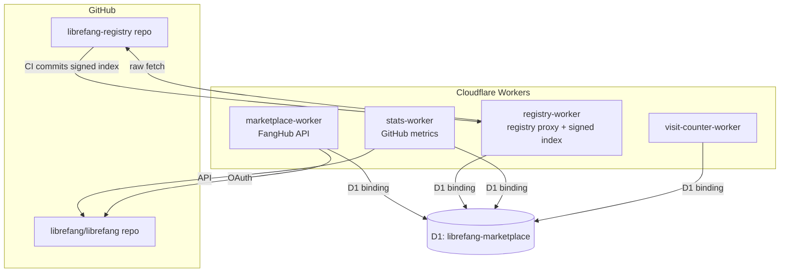

# web — workers

# web/workers

Cloudflare Workers powering the LibreFang web presence: the FangHub marketplace API, the plugin registry proxy, GitHub stats collection, and a lightweight visit counter. All four workers are single-file ES modules deployed via Wrangler and share a single D1 (SQLite) database.

## Architecture



All workers bind to the same D1 database (`database_id: 1bbf40ca-...`). Each worker owns distinct tables but can read shared ones (e.g., `kv_store`, `visit_counts`).

---

## Workers

### marketplace-worker (`librefang-marketplace`)

The FangHub package registry. Handles GitHub OAuth authentication, package CRUD, version publishing with Ed25519 signing, download redirects with async count batching, and star tracking.

**Key endpoints:**

| Route | Method | Handler | Auth |
|---|---|---|---|
| `/v1/packages` | GET | `handleListPackages` | Public |
| `/v1/packages` | POST | `handleCreatePackage` | Cookie |
| `/v1/packages/{slug}` | GET/PUT/DELETE | `handleGetPackage` / `handleUpdatePackage` / `handleDeletePackage` | Public / Owner / Owner |
| `/v1/packages/{slug}/versions` | GET/POST | `handleListVersions` / `handlePublishVersion` | Public / Owner |
| `/v1/download/{slug}/{version}` | GET | `handleDownload` | Public (302 redirect) |
| `/v1/packages/{slug}/star` | POST/DELETE | `handleStar` | Cookie |
| `/v1/pubkey` | GET | `handlePubkey` | Public |
| `/v1/download/{slug}/{version}/signature` | GET | `handleVersionSignature` | Public |
| `/auth/github`, `/auth/github/callback`, `/auth/me`, `/auth/logout` | GET | OAuth flow | — |

**Auth model:** Stateless HS256 JWT stored in an `mp_token` HttpOnly cookie. `authenticate()` extracts and verifies the JWT on every protected request. JWTs expire after 30 days. GitHub user records are upserted into the `users` table on each callback.

**Download counting:** Downloads are not counted synchronously. `handleDownload` fires a `ctx.waitUntil()` that upserts into `download_counts_pending` (keyed by package, version, ISO week). The weekly cron (`flushDownloadCounts`) resets `weekly_downloads` to zero, then folds pending counts into `total_downloads`, `weekly_downloads`, and per-version `downloads` columns.

**Bundle host allowlist:** `handlePublishVersion` rejects `bundle_url` values that don't match `ALLOWED_BUNDLE_LOCATIONS`. This is a security-critical check — without it, an author could point the registry signature at an attacker-controlled URL. The validation uses parsed `(host, pathRegex)` tuples rather than string-prefix matching to prevent WHATWG URL normalization bypasses. Allowed hosts:

- `github.com` — path must match `/^\/[^/]+\/[^/]+\/releases\/download\//` (immutable release assets only)
- `objects.githubusercontent.com` — GitHub's asset CDN
- `marketplace.librefang.ai` — path must be under `/bundles/`

URLs with credentials, hash fragments, or non-HTTPS schemes are rejected.

### registry-worker (`librefang-registry`)

Proxies the `librefang/librefang-registry` GitHub repo. Serves two distinct payloads:

1. **Dashboard payload** (`GET /api/registry`) — dict-shaped JSON (hands/channels/plugins/skills/...) consumed by the marketplace UI. Stored in D1 `kv_store['registry_data']`.
2. **Daemon payload** (`GET /api/registry/index.json`) — flat JSON array of `{name, version?, description?, needs?}` entries. This is what gets Ed25519-signed and what the daemon verifies.

**Sync flow (`doSyncFromRepo`):** Fetches three files from `raw.githubusercontent.com` in parallel — `plugins-index.json`, `plugins-index.json.sig`, and `registry-index.json` — and writes them verbatim to D1. The worker performs no signing; it is pure transport. The signature is produced by the registry repo's GitHub Actions CI, which holds the Ed25519 private key as an Actions secret.

**Two sync triggers:**

- **Forced refresh** (`POST /api/registry/refresh`): Invoked by the registry repo's GitHub Action after a push. Authenticated via bearer token (`REGISTRY_REFRESH_TOKEN`) compared with `constantTimeEqual()`. Returns 503 until the token is configured.
- **Cron backstop** (`scheduled`): Daily at 02:00 UTC. No auth (the worker calls itself). Guards against CI outages.

**Caching layers:**

- **Cache API** — `caches.default` with 1h TTL for registry data, 6h for commit metadata, 10m for trending. The forced-refresh path purges the registry data cache key after D1 write so the dashboard sees fresh data immediately.
- **Staleness window** — If D1 data is younger than `REGISTRY_STALE_TTL` (24h), the worker serves it even when `?refresh=1` is passed. A full rebuild makes 30+ GitHub subrequests, which exceeds the Workers free-tier per-request subrequest budget; only cron runs have the higher quota.

**Other registry endpoints:** Raw file proxy (`/api/registry/raw`), commit metadata (`/api/registry/commit`), click tracking (`/api/registry/click` → D1 `registry_clicks`), trending (`/api/registry/trending`), aggregate metrics (`/api/registry/metrics`), and UI error reporting (`/api/errors` POST/GET → D1 `ui_errors`, auto-pruned after 30 days).

### stats-worker (`librefang-github-stats`)

Collects GitHub metrics for the main `librefang/librefang` repo. Daily cron at 00:00 UTC calls `recordDailyStats()`, which fetches repo metadata and open PR count, then upserts into `github_stats_history` keyed by date.

**Endpoints:**

- `GET /api/github` — Current stats (stars, forks, issues, PRs, downloads, 30-day star history). 30min Cache API TTL. `?refresh=1` bypasses cache.
- `GET /api/releases` — Latest 20 releases (proxied from GitHub API). 30min cache.

PR counts are extracted from GitHub's `Link` header pagination (`parseLinkHeaderCount`) rather than counting a page of results, which avoids rate-limit issues on repos with many open PRs.

### visit-counter-worker (`librefang-visit-counter`)

Minimal page-visit counter. Two special rows in `visit_counts`: `__total__` (all-time) and the current date (daily). `GET /script.js` returns an inline tracking script that POSTs to `/api/track` with `keepalive: true` for reliability on page unload.

---

## Plugin Signing

Two distinct signing architectures exist, both using the same Ed25519 keypair (generated by `keygen.mjs`):

### Registry index signing (registry-worker)

The worker holds **no private key**. The trust chain is:

1. Registry repo CI builds `plugins-index.json` (flat array of plugin entries).
2. CI signs it locally with the Ed25519 private key (stored as a GitHub Actions secret).
3. CI commits both `plugins-index.json` and `plugins-index.json.sig` to the repo, then calls `POST /api/registry/refresh`.
4. The worker fetches the committed files and stores them verbatim in D1.
5. The daemon fetches `GET /api/registry/index.json` and `GET /api/registry/index.json.sig`, verifies the signature against the TOFU-pinned public key.

The worker validates that the index is a JSON array, the registry data is a JSON object, and the signature is 86 or 88 base64 characters (64 raw bytes for Ed25519). Malformed payloads are rejected before D1 write.

### Bundle signing (marketplace-worker)

The worker holds the private key as a Cloudflare secret (`REGISTRY_PRIVATE_KEY`). At publish time, `handlePublishVersion` constructs the canonical string:

```
<slug>@<version>|<bundle_url>|<bundle_sha256>
```

signs it with `signWithRegistryKey()`, and stores the base64 signature in `package_versions.bundle_sig`. The daemon fetches `GET /v1/download/{slug}/{version}/signature`, reconstructs the same canonical string locally, and verifies.

### Public key distribution

Both workers expose the raw 32-byte Ed25519 public key (base64) at their respective endpoints:

- `marketplace-worker`: `GET /v1/pubkey`
- `registry-worker`: `GET /.well-known/registry-pubkey` and `GET /api/registry/pubkey` (the `/api/*` alias exists because the custom domain only routes `/api/*` to the worker)

The daemon uses TOFU (trust on first use): it fetches the public key on first contact, caches it at `~/.librefang/registry.pub`, and pins it for all subsequent verifications.

### Graceful degradation

Signing is fully opt-in. When keys are unconfigured:

- `REGISTRY_PRIVATE_KEY` unset → `signWithRegistryKey()` returns `null`; `bundle_sig` columns are written as `NULL`; the cron skips signature storage.
- `REGISTRY_PUBLIC_KEY` unset → pubkey and signature endpoints return HTTP 503.
- All existing endpoints (`/api/registry`, `/v1/packages`, `/v1/download/...`) remain functional.
- The daemon falls back to SHA-256-only bundle verification.

### Key management

Use `node web/workers/keygen.mjs` to generate a keypair. The script outputs:

- `REGISTRY_PUBLIC_KEY` — raw 32-byte pubkey, base64. Non-secret. Goes in `wrangler.toml` `[vars]` for both workers.
- `REGISTRY_PRIVATE_KEY` — PKCS#8 DER, base64. Secret. Deploy via `wrangler secret put` to both workers.

For rotation, provisioning, and the full daemon-side trust model, see [`SIGNING.md`](./SIGNING.md) and `docs/architecture/plugin-signing.md`.

---

## Shared D1 Schema

Defined in `marketplace-worker/schema.sql`. Tables are partitioned by owning worker:

| Worker | Tables |
|---|---|
| marketplace-worker | `users`, `packages`, `package_versions`, `stars`, `download_counts_pending` |
| registry-worker | `registry_clicks`, `ui_errors`, `kv_store` |
| stats-worker | `github_stats_history` |
| visit-counter-worker | `visit_counts` |

`kv_store` is a general-purpose key-value table used for singleton state: `registry_data` (dashboard payload), `plugins_index` (daemon payload), `plugins_index_sig` (Ed25519 signature), and related timestamps.

The `bundle_sig` column on `package_versions` was added for signing. For existing databases, D1 ignores duplicate `ALTER TABLE` statements, so the migration is idempotent:

```sql
ALTER TABLE package_versions ADD COLUMN bundle_sig TEXT;
```

---

## Deployment

Each worker has its own `wrangler.toml` and deploys independently:

```bash
cd web/workers/registry-worker      && wrangler deploy
cd web/workers/marketplace-worker    && wrangler deploy
cd web/workers/stats-worker          && wrangler deploy
cd web/workers/visit-counter-worker  && wrangler deploy
```

**Secrets** (deploy with `wrangler secret put`):

| Secret | Worker | Purpose |
|---|---|---|
| `REGISTRY_PRIVATE_KEY` | marketplace-worker, registry-worker* | Ed25519 PKCS#8 private key for signing |
| `REGISTRY_REFRESH_TOKEN` | registry-worker | Bearer token for forced-refresh endpoint |
| `JWT_SECRET` | marketplace-worker | HS256 signing key for session JWTs |
| `GITHUB_CLIENT_SECRET` | marketplace-worker | GitHub OAuth app secret |
| `GITHUB_TOKEN` | registry-worker, stats-worker | GitHub API token (higher rate limits) |

*Note: As of the current design, `registry-worker` does not use `REGISTRY_PRIVATE_KEY` for signing — it only serves the pre-signed index committed by CI. The secret is listed for backward compatibility and potential future use.

**Vars** (in `wrangler.toml`, non-secret):

- `REGISTRY_PUBLIC_KEY` — raw 32-byte Ed25519 public key, base64. Currently `joY8IYrUbbACfKRyp2CTcEbcEty8wcBwP1MTxU+vjaM=` for both signing workers.
- `GITHUB_CLIENT_ID` — OAuth app client ID.
- `GITHUB_REDIRECT_URI`, `AUTH_SUCCESS_REDIRECT` — OAuth flow URLs.

**Cron triggers:**

| Worker | Schedule (UTC) | Action |
|---|---|---|
| stats-worker | `0 0 * * *` (daily midnight) | `recordDailyStats` |
| registry-worker | `0 2 * * *` (daily 02:00) | `doSyncFromRepo` (backstop) |
| marketplace-worker | `0 1 * * SUN` (weekly Sunday 01:00) | `flushDownloadCounts` |

---

## Security Considerations

- **Bundle URL allowlist** (`isAllowedBundleHost`): Prevents authors from getting registry-signed signatures on mutable or attacker-controlled URLs. Uses parsed URL validation, not string prefixes, to resist WHATWG normalization attacks.
- **Constant-time token comparison** (`constantTimeEqual`): The forced-refresh bearer token check iterates the full length of both strings without early return, folding the length delta into the mismatch accumulator.
- **Registry worker as pure transport**: The worker never holds registry signing key material. The trust root is the registry repo's branch protection + Actions secret, not a worker-held key. This eliminates the sign-anything oracle vulnerability present in earlier designs.
- **Input validation**: SHA-256 values are validated as exactly 64 lowercase hex characters. Error report messages are length-capped. Registry paths are validated against `CATEGORY_RE` and reject `..` traversal.
- **CORS**: marketplace-worker restricts origins to `https://librefang.ai` with credentials. Other workers use `*` (read-only public data).