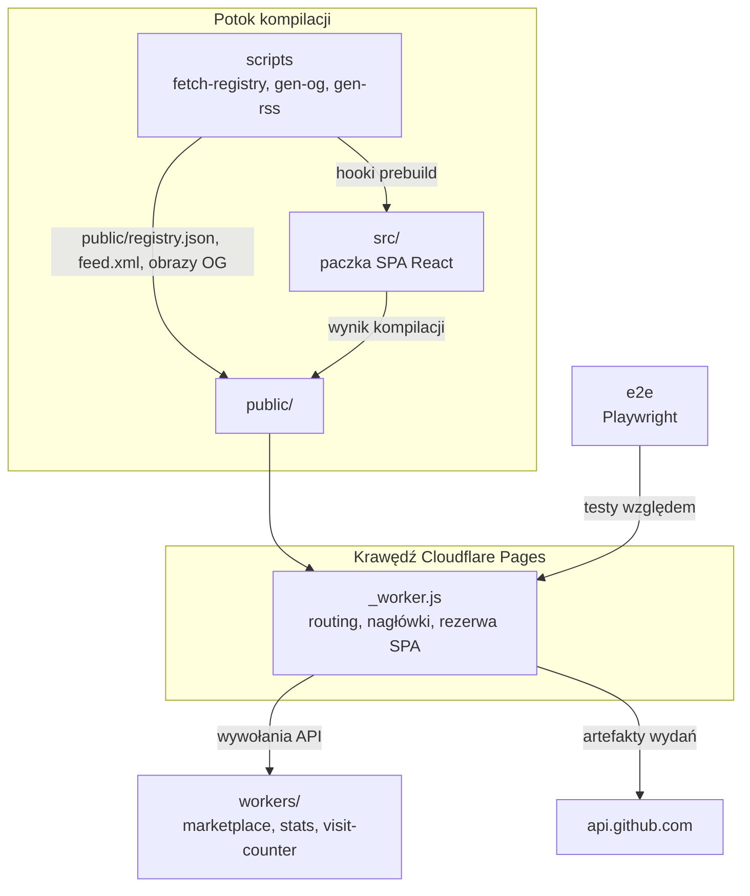

# web

# web — Witryna marketingowa i infrastruktura webowa LibreFang

## Przeznaczenie

Ta grupa modułów stanowi publiczną stronę internetową LibreFang. **Nie** jest to podstawowy kod w języku Rust — korzysta z API GitHuba i artefaktów wydań podstawowego projektu, aby dostarczać:

- Lokalizowaną witrynę jednostronicową (SPA) pod adresem `librefang.ai` (9 wersji językowych)
- Instalatory CLI z punktem końcowym `/install` obsługującym negocjację treści
- Przeglądarkę rejestru wtyczek i API marketplace FangHub
- Zbieranie statystyk GitHuba, licznik odwiedzin oraz kanały RSS/Atom

## Moduły podrzędne w skrócie

| Moduł podrzędny | Rola |
|---|---|
| [src](src.md) | SPA w React — strona główna, przeglądarka rejestru, strony wdrożenia/changelog/metryk. Routing przez `pathname`, stan przez Zustand + TanStack Query, i18n przez własny system scalania. |
| [public](public.md) | Edge worker Cloudflare Pages (`_worker.js`), skrypty instalacyjne, zasoby statyczne. Obsługuje rezerwę SPA, nagłówki bezpieczeństwa, kanonizację URL, negocjację treści CLI i klucz publiczny TOFU rejestru. |
| [workers](workers.md) | Cztery workery Cloudflare (marketplace, proxy rejestru, statystyki, licznik odwiedzin) współdzielące jedną bazę danych SQLite D1. |
| [scripts](scripts.md) | Narzędzia kompilacji: pobieranie danych rejestru, generowanie obrazów OG, generowanie kanału RSS, audyt kompletności lokalizacji, testy workerów. |
| [e2e](e2e.md) | Pakiet testów Playwright sprawdzający renderowanie, nawigację, i18n i przepływ danych rejestru względem pełnej skompilowanej aplikacji. |

## Jak to wszystko ze sobą współdziała

## Kluczowe przepływy między modułami

### Kompilacja → Wdrożenie

[scripts](scripts.md) uruchamia się jako hooki `prebuild`: `fetch-registry.ts` pobiera TOML z repozytorium GitHuba rejestru i generuje `public/registry.json`; `gen-rss.ts` konwertuje `CHANGELOG.md` na `public/feed.xml`; `gen-og-images.ts` tworzy karty SVG. Następnie SPA [src](src.md) się kompiluje, a cały wynik trafia do [public](public.md) pod wdrożenie Cloudflare Pages.

### Obsługa żądań na krawędzi

Każde żądanie trafia najpierw do `_worker.js` w [public](public.md). Sprawdza on znany publiczny klucz rejestru, kanonizuje adresy URL, negocjuje typ treści instalatora CLI (przekierowując `/install` na `.sh` lub `.ps1` na podstawie User-Agent), serwuje zasoby statyczne z niezmienialnym cache'owaniem i wraca do `index.html` dla tras po stronie klienta. Nagłówki bezpieczeństwa są stosowane uniwersalnie.

### Przepływ danych w czasie wykonywania

SPA [src](src.md) pobiera dane w czasie wykonywania z trzech źródeł: `api.github.com` dla danych wydań, [workers](workers.md) dla list marketplace i liczenia odwiedzin oraz wstępnie skompilowanego `registry.json` dla przeglądania wtyczek. Backend [workers](workers.md) agreguje metryki GitHuba według harmonogramu, proxy'uje commity rejestru z podpisami Ed25519 i obsługuje API marketplace FangHub — wszystko oparte na wspólnej bazie danych D1.

### Testowanie

[e2e](e2e.md) uruchamia Playwright względem pełnej skompilowanej i serwowanej witryny, sprawdzając, że SPA [src](src.md) poprawnie się hydratuje, dane rejestru z [scripts](scripts.md) wypełniają interfejs, i18n działa we wszystkich wersjach językowych, a podświetlanie składni TOML renderuje oczekiwane klasy tokenów.

## Krytyczne kontrakty między modułami

- **Klucz publiczny rejestru**: `REGISTRY_PUBLIC_KEY` w plikach `wrangler.toml` w [workers](workers.md) musi być zsynchronizowany z zakodowaną na sztywno stałą w `_worker.js` w [public](public.md). Rotacja wymaga aktualizacji obu za pomocą `workers/keygen.mjs`.
- **Manifest instalacyjny**: `install-manifest.json` w [public](public.md) jest generowany automatycznie przez przepływ wydań i konsumowany zarówno przez skrypty instalacyjne, jak i przez interfejs instalacyjny SPA w [src](src.md).
- **Lista dozwolonych CSP**: Nagłówki bezpieczeństwa w `_worker.js` w [public](public.md) muszą zawierać wszystkie originy workerów i hosty API, do których odwołuje się [src](src.md).
