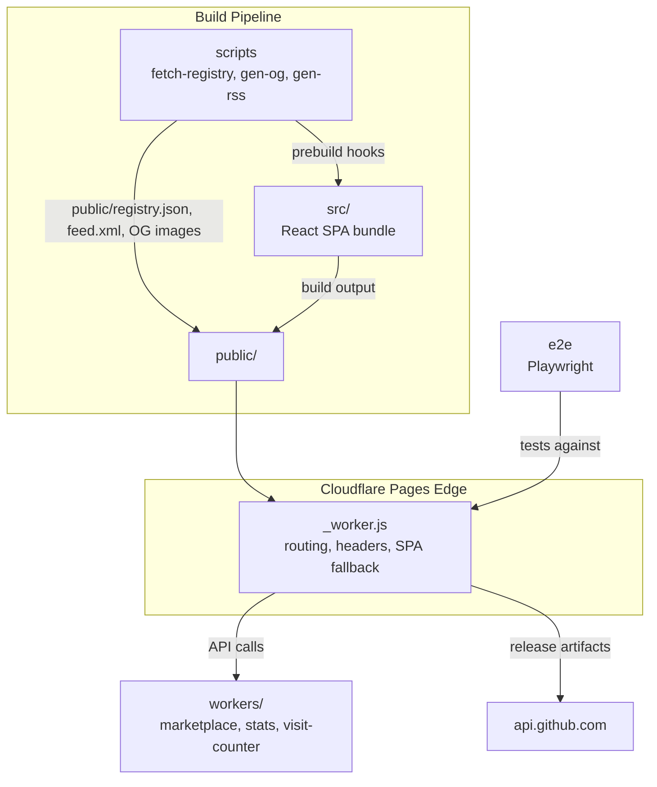

# web

# web — LibreFang Marketing Site & Web Infrastructure

## Purpose

This module group is the public-facing web presence for LibreFang. It is **not** the core Rust codebase — it consumes the core project's GitHub APIs and release artifacts to deliver:

- A localized single-page marketing site at `librefang.ai` (9 locales)
- CLI installers with content-negotiated `/install` endpoint
- A plugin registry browser and FangHub marketplace API
- GitHub stats collection, visit counting, and an RSS/Atom feed

## Sub-Modules at a Glance

| Sub-module | Role |
|---|---|
| [src](src.md) | React SPA — homepage, registry browser, deploy/changelog/metrics pages. Routing via `pathname`, state via Zustand + TanStack Query, i18n via custom merge system. |
| [public](public.md) | Cloudflare Pages edge worker (`_worker.js`), install scripts, static assets. Handles SPA fallback, security headers, URL canonicalization, CLI content negotiation, and the registry TOFU public key. |
| [workers](workers.md) | Four Cloudflare Workers (marketplace, registry proxy, stats, visit counter) sharing a single D1 SQLite database. |
| [scripts](scripts.md) | Build-time tooling: registry data fetching, OG image generation, RSS feed generation, locale completeness auditing, worker tests. |
| [e2e](e2e.md) | Playwright test suite validating rendering, navigation, i18n, and registry data flows against the fully built app. |

## How They Fit Together

## Key Cross-Module Workflows

### Build → Deploy

[scripts](scripts.md) runs as `prebuild` hooks: `fetch-registry.ts` pulls TOML from the GitHub registry repo and emits `public/registry.json`; `gen-rss.ts` converts `CHANGELOG.md` into `public/feed.xml`; `gen-og-images.ts` produces SVG cards. The [src](src.md) SPA then bundles, with all output landing in [public](public.md) for Cloudflare Pages deployment.

### Edge Request Handling

Every request hits [public](public.md)'s `_worker.js` first. It checks for the well-known registry pubkey, canonicalizes URLs, negotiates CLI installer content type (rewriting `/install` to `.sh` or `.ps1` based on User-Agent), serves static assets with immutable caching, and falls back to `index.html` for client-side routes. Security headers are applied universally.

### Runtime Data Flow

The [src](src.md) SPA fetches from three sources at runtime: `api.github.com` for release data, the [workers](workers.md) for marketplace listings and visit counting, and the pre-built `registry.json` for plugin browsing. The [workers](workers.md) backend aggregates GitHub metrics on a schedule, proxies registry commits with Ed25519 signing, and serves the FangHub marketplace API — all backed by a shared D1 database.

### Testing

[e2e](e2e.md) runs Playwright against the fully built and served site, validating that the [src](src.md) SPA hydrates correctly, registry data from [scripts](scripts.md) populates the UI, i18n works across all locales, and TOML syntax highlighting renders expected token classes.

## Critical Cross-Module Contracts

- **Registry public key**: The `REGISTRY_PUBLIC_KEY` in [workers](workers.md) `wrangler.toml` files must stay in sync with the hardcoded constant in [public](public.md)'s `_worker.js`. Rotation requires updating both via `workers/keygen.mjs`.
- **Install manifest**: [public](public.md)'s `install-manifest.json` is auto-generated by the release workflow and consumed by both install scripts and the SPA's install UI in [src](src.md).
- **CSP allowlist**: The security headers in [public](public.md)'s `_worker.js` must include all worker origins and API hosts referenced by [src](src.md).