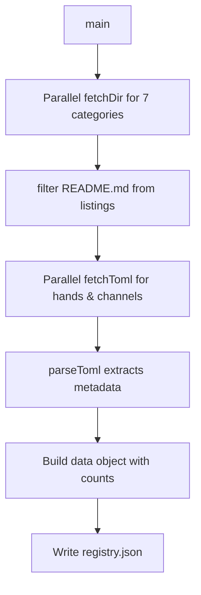

# Website — scripts

# Website — fetch-registry Script

Fetches catalog data from the librefang-registry GitHub repository and generates a static JSON file for the website.

## Overview

This build-time script populates `public/registry.json` with data about the plugin ecosystem. The website uses this file to display catalog statistics, plugin listings, and localized descriptions on the homepage and documentation pages.

The script runs via:

```bash
npx tsx scripts/fetch-registry.ts
```

## Execution Flow



## Key Functions

### `fetchDir(path: string): Promise<GHItem[]>`

Queries the GitHub API for directory contents at the given path. Filters results to include only directories and `.toml` files, excluding `README.md`.

Returns an array of `{ name: string; type: string }` objects.

### `fetchToml(path: string): Promise<Detail | null>`

Fetches a raw TOML file from the registry and passes the content to `parseToml`. Returns `null` on HTTP failure.

### `parseToml(text: string): Detail`

Extracts structured data from TOML content using regex patterns:

- **`id`, `name`, `description`, `category`, `icon`** — extracted via simple key matching
- **`tags`** — parsed from `tags = ["tag1", ...]` array syntax
- **`i18n`** — parsed from `[i18n.<locale>]` sections, extracting the `description` field per language

Returns a `Detail` object containing the plugin's metadata.

## Data Collected

The script gathers counts for all seven categories:

| Category | Detail Fetched | Data Source |
|----------|----------------|-------------|
| `hands` | Yes | `hands/<name>/HAND.toml` |
| `channels` | Yes | `channels/<name>` |
| `providers` | Count only | — |
| `integrations` | Count only | — |
| `workflows` | Count only | — |
| `agents` | Count only | — |
| `plugins` | Count only | — |

Currently, only `hands` and `channels` have their full metadata (including i18n descriptions) fetched. Other categories are tracked by count only.

## Output Format

Written to `public/registry.json`:

```json
{
  "hands": [Detail, Detail, ...],
  "channels": [Detail, Detail, ...],
  "handsCount": 42,
  "channelsCount": 8,
  "providersCount": 15,
  "integrationsCount": 23,
  "workflowsCount": 12,
  "agentsCount": 6,
  "pluginsCount": 95,
  "fetchedAt": "2025-01-15T10:30:00.000Z"
}
```

## Authentication

If the `GITHUB_TOKEN` environment variable is set, the script includes it in API requests to avoid rate limiting. For public repositories this is optional but recommended for CI environments.

```bash
GITHUB_TOKEN=ghp_xxx npx tsx scripts/fetch-registry.ts
```

## Registry Source

The script fetches from:
- **API**: `https://api.github.com/repos/librefang/librefang-registry/contents`
- **Raw files**: `https://raw.githubusercontent.com/librefang/librefang-registry/main`

Both URLs point to the `main` branch of the registry repository.