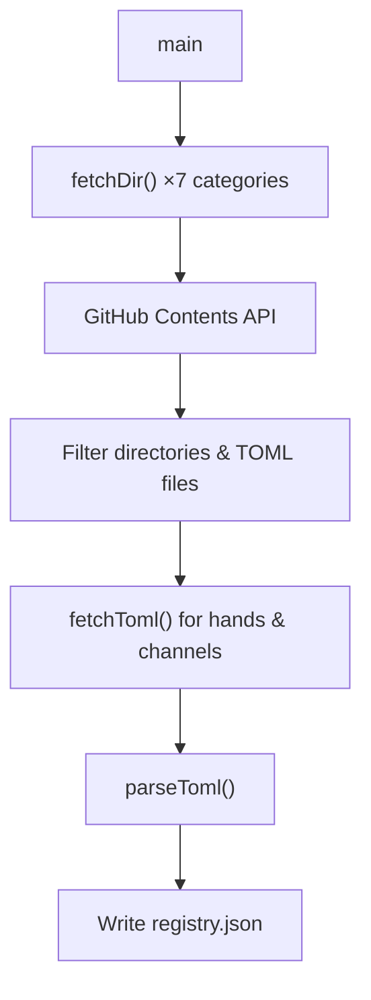

# Website — scripts

# Website — Scripts: `fetch-registry.ts`

Build-time script that pulls registry data from the `librefang/librefang-registry` GitHub repository and writes it to `public/registry.json` for static consumption by the website.

## Overview

The Librefang project maintains a separate registry repository containing TOML metadata files for various extension types (hands, channels, providers, etc.). This script resolves that remote data at build time so the website can serve it as a static JSON file without runtime API calls.

## Execution

```bash
# Direct
npx tsx scripts/fetch-registry.ts

# With GitHub token (avoids rate limits on CI)
GITHUB_TOKEN=ghp_... npx tsx scripts/fetch-registry.ts
```

The output is written to `web/public/registry.json`.

## How It Works



1. **Directory listing** — Calls `fetchDir()` for each of the seven registry categories against GitHub's Contents API. This returns all directories (for categories like `hands` and `agents` that are folder-based) or `.toml` files (for flat-file categories).

2. **Detail fetching** — For `hands` and `channels`, fetches the actual TOML content via `raw.githubusercontent.com` and parses it into structured `Detail` objects. Other categories currently only contribute a count.

3. **Serialization** — Assembles all data into a single object and writes it to `public/registry.json`.

## Key Functions

### `fetchDir(path: string): Promise<GHItem[]>`

Queries `https://api.github.com/repos/librefang/librefang-registry/contents/{path}` and returns items that are either directories or `.toml` files, excluding `README.md`. Returns an empty array on failure (non-throwing).

### `parseToml(text: string): Detail`

Minimal TOML parser that extracts:

| Field | Source |
|-------|--------|
| `id`, `name`, `description`, `category`, `icon` | Top-level `key = "value"` pairs |
| `tags` | `tags = ["...", "..."]` array |
| `i18n` | `[i18n.{lang}]` sections with `description` |

This is intentionally lightweight — it uses regex matching rather than a full TOML AST, which is sufficient for the flat structure the registry uses.

### `fetchToml(path: string): Promise<Detail | null>`

Fetches raw file content from GitHub and passes it through `parseToml`. Returns `null` on any HTTP error.

## Output Schema

The generated `registry.json` has this shape:

```ts
interface RegistryData {
  hands: Detail[]          // Full parsed TOML details
  channels: Detail[]       // Full parsed TOML details
  handsCount: number
  channelsCount: number
  providersCount: number
  integrationsCount: number
  workflowsCount: number
  agentsCount: number
  pluginsCount: number
  fetchedAt: string        // ISO 8601 timestamp
}

interface Detail {
  id: string
  name: string
  description: string
  category: string
  icon: string
  tags?: string[]
  i18n?: Record<string, { description: string }>
}
```

Only `hands` and `channels` currently produce full `Detail[]` arrays. All other categories contribute a count only.

## GitHub API Authentication

The script reads `process.env.GITHUB_TOKEN`. When present, it's sent as a `Bearer` token in the `Authorization` header. Unauthenticated requests are rate-limited to 60/hour by GitHub, so setting this token is recommended in CI environments.

## Registry Categories

| Category | Storage format | Fully parsed |
|----------|---------------|-------------|
| `hands` | `hands/{id}/HAND.toml` | ✅ |
| `channels` | `channels/{name}.toml` | ✅ |
| `providers` | `providers/{name}.toml` | Count only |
| `integrations` | `integrations/{name}.toml` | Count only |
| `workflows` | `workflows/{name}.toml` | Count only |
| `agents` | `agents/{id}/` (directory) | Count only |
| `plugins` | `plugins/{name}.toml` | Count only |

Extending a category to produce full details requires adding a `fetchToml` call in `main()` with the correct path pattern, then pushing the results into the output object.

## Error Handling

- `fetchDir` logs the failing path and status, then returns `[]` — the build continues with empty data for that category.
- `fetchToml` returns `null` on HTTP errors; these are filtered out with `.filter(Boolean)` before serialization.
- Uncaught errors in `main` are caught by `.catch(console.error)`.