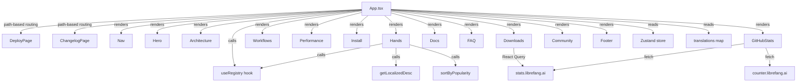

# Website — src

# Website — `web/src`

The marketing and documentation site for LibreFang. A single-page React application rendered at `librefang.ai` with client-side routing for locale prefixes, `/deploy`, and `/changelog`.

## Architecture



## Routing

Routing is purely path-based — no router library. `App` inspects `window.location.pathname` on mount:

| Path | Renders |
|------|---------|
| `/` | Main landing page (all sections) |
| `/zh`, `/zh-TW`, `/ja`, `/ko`, `/de`, `/es` | Same landing page, locale detected |
| `/deploy` | `DeployPage` component |
| `/changelog` | `ChangelogPage` component |

Language is detected by `getCurrentLang()`, which reads the URL prefix. The detected language is written into the Zustand store via `useAppStore.setState({ lang })` on mount and `popstate`.

## State Management

**File:** `store.ts` (imported as `useAppStore`)

The Zustand store holds:

- **`lang`** — current language code (`'en'`, `'zh'`, `'zh-TW'`, `'ja'`, `'ko'`, `'de'`, `'es'`)
- **`theme`** — `'dark'` or `'light'`
- **`switchLang(code)`** — changes `lang`, updates `document.documentElement.lang`, pushes a new history entry
- **`toggleTheme()`** — toggles between dark and light

Every section component reads `lang` and `theme` from this store as needed.

## Internationalization

**File:** `i18n.ts`

### Types

- **`Language`** — `{ code, name, url }` — one entry per supported locale
- **`Translation`** — a flat interface covering every translatable string across all sections (`nav`, `hero`, `stats`, `architecture`, `hands`, `performance`, `install`, `faq`, `community`, `meta`, `workflows`, `docs`, `githubStats`, `contributing`, `footer`)

### Supported Languages

| Code | Name | URL prefix |
|------|------|------------|
| `en` | English | `/` |
| `zh` | 简体中文 | `/zh` |
| `zh-TW` | 繁體中文 | `/zh-TW` |
| `ja` | 日本語 | `/ja` |
| `ko` | 한국어 | `/ko` |
| `de` | Deutsch | `/de` |
| `es` | Español | `/es` |

### How It Works

`App` resolves the translation object for the current language:

```ts
const t = translations[lang] || translations['en']!
```

Every section component receives `t: Translation` as a prop. Some sections (like `Downloads`) supplement the shared `Translation` type with inline locale maps for strings not in the shared schema.

## Data Fetching

### Registry — `useRegistry`

The `useRegistry` hook (from `useRegistry.ts`) fetches the hands and channels registry. It returns `{ data: RegistryData }` where `RegistryData` includes arrays of `hands` and `channels` with `id`, `name`, `category`, `tags`, and localized `description` fields.

Used by:
- **`App`** — passes `registry` to `Hero` for live stat counts
- **`Architecture`** — renders channels (layer 0) and hands (layer 1) from registry data
- **`Hands`** — renders the full hands carousel

### Releases — `Downloads`

The `Downloads` component uses `@tanstack/react-query` (`useQuery`) to fetch `https://stats.librefang.ai/api/releases`. The response is an array of GitHub release objects with `tag_name`, `assets`, and `html_url`. It takes the first release and passes its assets through `categorizeAssets()`.

### GitHub Stats — `GitHubStats`

Fetches two endpoints in parallel via `useEffect`:

1. `https://stats.librefang.ai/api/github` → stars, forks, issues, prs, downloads, lastUpdate, starHistory
2. `https://counter.librefang.ai/api` → docs visit count

## Section Components

All section components follow the pattern: accept `{ t: Translation }`, render a `<section>` with an `id` for anchor navigation, and use `FadeIn` for scroll-triggered entrance animations.

### `Nav`

Fixed top navigation bar. Key behaviors:
- Tracks scroll state to add a backdrop blur background (`scrolled`)
- Uses `IntersectionObserver` to highlight the currently visible section in the nav (`activeSection`)
- Language dropdown with click-outside and Escape-key dismissal
- Theme toggle button (sun/moon icon)
- Responsive: full nav on `md:` screens, hamburger menu on mobile
- Smooth-scrolls to `#anchor` links

### `Hero`

Full-viewport landing section with:
- **Typing animation** via `useTyping(t.hero.typing)` — cycles through translated strings, typing and deleting at configurable speed/pause
- Badge with version info
- CTA buttons: "Get Started" (anchors to `#install`) and "View on GitHub"
- Desktop-only terminal preview showing `librefang status` output
- Stats bar showing cold start, memory, hands count, providers count (hands/providers counts come from registry data when available)

### `useTyping(texts, speed, pause)`

Custom hook that animates typing and deleting through an array of strings. Returns the current display string. Parameters:
- `texts` — array of strings to cycle through
- `speed` — typing speed in ms (default 60)
- `pause` — pause at end of each string in ms (default 2000)

### `FadeIn`

A Framer Motion wrapper component. Props:
- `delay` — delay in milliseconds (converted to seconds internally)
- `className` — passed through to the `motion.div`

Animates from `{ opacity: 0, y: 24 }` to `{ opacity: 1, y: 0 }` with `whileInView`, firing once.

### `Architecture`

Five expandable layers (Channels → Hands → Kernel → Runtime → Hardware). Each layer row is a button that toggles an expanded detail panel. Layers 0 and 1 render live registry data (channels and hands respectively), sorted by popularity. Layers 2–4 render static `DetailGrid` components with technical feature names and translated descriptions.

### Popularity Sorting

Two helper functions:
- **`isPopular(item)`** — checks if `item.tags` includes `'popular'`
- **`sortByPopularity(items)`** — stable sort, popular items first. Used by `Architecture` and `Hands`.

### `Hands`

Horizontal-scroll carousel of hand cards. Each card links to `https://docs.librefang.ai/agent/hands#{hand.id}`. Category colors are mapped via `categoryColors`:

| Category | Color |
|----------|-------|
| content | amber |
| data | cyan |
| productivity | emerald |
| communication | purple |
| development | rose |
| research | blue |

Descriptions are localized via `getLocalizedDesc(hand, lang)` from `useRegistry.ts`.

### `Workflows`

Six workflow cards in a responsive grid. Icon assignment is positional (`workflowIcons` array mapped by index).

### `Performance`

Comparison table (LibreFang vs "Others"). Desktop renders an HTML `<table>`, mobile renders stacked cards.

### `Install`

Terminal-style code block with OS-specific install commands. Auto-detects OS from `navigator.userAgent`. Includes a copy-to-clipboard button and OS switcher tabs (macOS / Windows / Linux).

### `Downloads`

Categorizes release assets into Desktop App and CLI via `categorizeAssets()`, which matches filenames against regex patterns:

- **Desktop:** `.dmg` (Intel/ARM), `-setup.exe` (x64/ARM), `.AppImage`, `.deb`, `.rpm`
- **CLI:** `apple-darwin.tar.gz`, `unknown-linux-gnu.tar.gz`, `unknown-linux-musl.tar.gz`, `pc-windows-msvc.zip`, `linux-android.tar.gz`

A third column provides one-click deploy links (Fly.io, Railway, Render, GCP, Docker).

The SDK section shows copy-to-clipboard commands for pip, npm, cargo, and go.

### `categorizeAssets(assets)`

Takes `ReleaseAsset[]` and returns `DownloadItem[]` (Desktop + CLI). Each asset is matched against known filename patterns. SHA256 files are skipped.

### `FAQ`

Accordion. Only one item open at a time (`openIndex`). Uses `AnimatePresence` for smooth expand/collapse.

### `GitHubStats`

Fetches live GitHub metrics and renders:
- 7-stat grid (stars, forks, issues, PRs, downloads, docs visits, last update) with loading skeletons
- Star history bar chart (up to 30 bars)
- Contributors image from `contrib.rocks`

### `Community`

Four-card grid linking to GitHub PRs, Issues, Discussions, and Discord.

### `BackToTop`

Fixed button that appears after scrolling one viewport height. Smooth-scrolls to top.

### `trackEvent(action, label)`

Thin wrapper around `window.gtag()` for Google Analytics event tracking. Guards against SSR (`typeof window !== 'undefined'`). Used by `Hero` CTAs and `Install` copy button.

## Adding a New Language

1. Add an entry to the `languages` array in `i18n.ts` with `{ code, name, url }`
2. Add a corresponding entry in the `translations` record keyed by the same code
3. Add a path check in `getCurrentLang()` in `App.tsx`
4. Add URL prefix entries in any inline locale maps (e.g., `Downloads` labels)

## Adding a New Section

1. Define the section's strings in the `Translation` interface in `i18n.ts`
2. Add translations for every language in the `translations` record
3. Create a component accepting `{ t: Translation }` (and optionally `registry`)
4. Add the component to the `App` return tree
5. Add a nav link in the `links` array inside `Nav`
6. Ensure the section has an `id` attribute matching the nav `href`