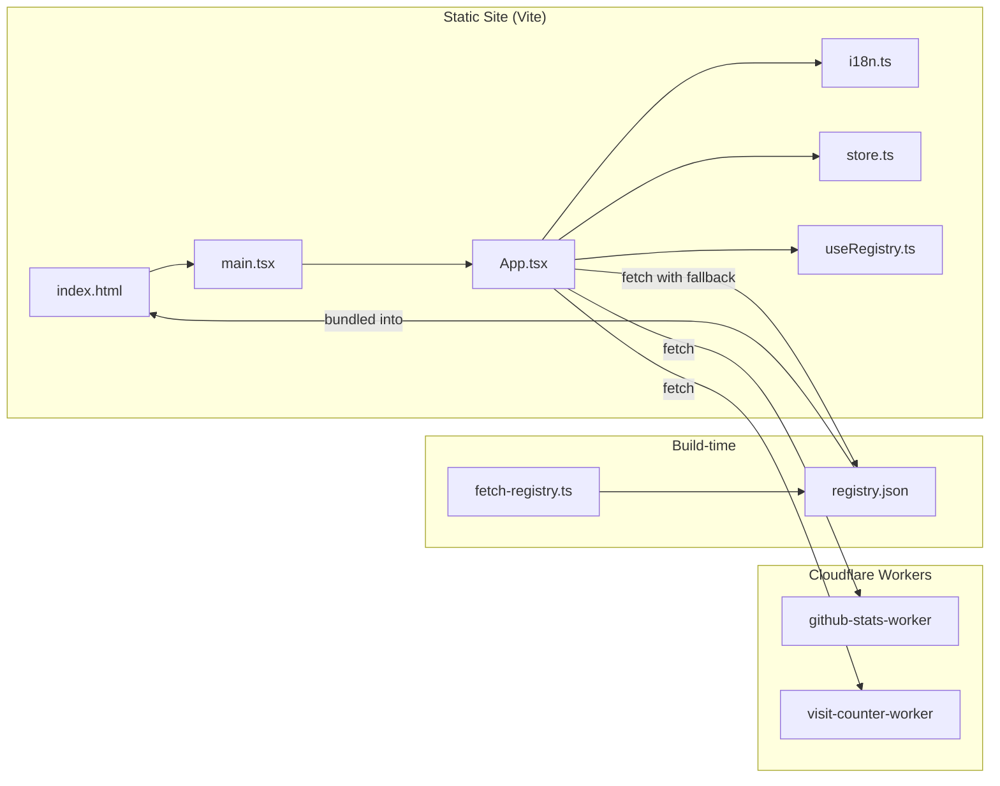

# Website — web

# Website — web

The LibreFang marketing site and install entrypoint. This is a React + TypeScript single-page application built with Vite, deployed as static assets alongside two Cloudflare Workers for analytics.

Live at `https://librefang.ai`.

## Architecture Overview



Three deployment units:

1. **Static Vite site** — landing page, localized routes, install scripts, PWA assets
2. **github-stats-worker** — proxies GitHub API, caches in KV, records daily snapshots
3. **visit-counter-worker** — tracks page visits, serves tracking script

## Quick Start

```bash
pnpm install
pnpm dev        # starts on port 3002
pnpm build      # outputs to dist/
pnpm preview    # serve the production build locally
```

Both `dev` and `build` automatically run `predev` / `prebuild`, which execute `scripts/fetch-registry.ts` to refresh `public/registry.json`.

## Key Files

| Path | Purpose |
|---|---|
| `src/App.tsx` | All page sections (Hero, Features, Comparison, Install, FAQ), data fetching, language detection |
| `src/i18n.ts` | Translations and language list for 7 locales |
| `src/store.ts` | Zustand store — language state, CJK font lazy-loading |
| `src/useRegistry.ts` | Hook that fetches registry from the worker API with `registry.json` fallback |
| `src/main.tsx` | React entrypoint, React Query provider setup |
| `src/lib/utils.ts` | `cn()` helper combining `clsx` + `tailwind-merge` |
| `src/index.css` | Tailwind directives and custom component styles |
| `scripts/fetch-registry.ts` | Build-time script that writes `public/registry.json` |
| `index.html` | SEO metadata, inline bootstrap scripts (language, theme, fonts), GA, visit counter |

## Internationalization

Seven locales via path-prefix routing:

| Prefix | Language |
|---|---|
| `/` | English |
| `/zh/` | Simplified Chinese |
| `/zh-TW/` | Traditional Chinese |
| `/de/` | Deutsch |
| `/ja/` | Japanese |
| `/ko/` | Korean |
| `/es/` | Spanish |

Detection happens in two places:

1. **`index.html` inline script** — runs before React hydrates, sets `window.__INITIAL_LANG__` and `document.documentElement.lang`
2. **`src/store.ts`** — React-level language state derived from the current path

The `index.html` bootstrap also loads the appropriate CJK Google Font (Noto Sans SC/TC/JP/KR) when the detected locale requires one. Non-CJK locales use the base `Inter` + `Outfit` stack.

### Adding a New Language

1. Add translations and a `languages` entry in `src/i18n.ts`
2. Add path-prefix detection in `src/store.ts`
3. Add path-prefix detection in the inline script inside `index.html`
4. Add the new URL to `public/sitemap.xml`

## Data Fetching and External Services

### GitHub Stats

`src/App.tsx` requests `https://stats.librefang.ai/api/github` (proxied through the github-stats-worker) for stars, forks, issues, and release info. The Hero section also directly calls `https://api.github.com/repos/librefang/librefang/releases/latest`.

### Registry

`src/useRegistry.ts` fetches agent registry data from `https://stats.librefang.ai/api/registry`. If the remote is unavailable, it falls back to the build-time `public/registry.json` generated by `scripts/fetch-registry.ts`.

### Visit Counter

`index.html` loads `https://counter.librefang.ai/script.js` (async). `src/App.tsx` also calls `GET https://counter.librefang.ai/api` for display data.

### Google Analytics

`index.html` includes `gtag` with measurement ID `G-9Q0WS7SHZ6`.

All external endpoints are hardcoded to production domains. Local development hits production services unless you modify the source.

## Build Configuration

### Vite (`vite.config.ts`)

- Dev server on port `3002`, host exposed (`host: true`)
- Manual chunks: `vendor-react`, `vendor-motion`, `vendor-query`
- Single entry: `./index.html`

### TypeScript (`tsconfig.json`)

Strict mode with `noUnusedLocals`, `noUnusedParameters`, `noUncheckedIndexedAccess`. Targets ES2020 with bundler module resolution. Separate config (`tsconfig.node.json`) covers `vite.config.ts`.

### Tailwind (`tailwind.config.js`)

Dark mode via `class` strategy. Custom theme tokens:

- **Colors**: `surface` (CSS variable–based), custom `cyan` and `amber` shades
- **Fonts**: `sans` stack includes Inter + all four Noto Sans CJK variants; `mono` uses JetBrains Mono

### ESLint (`eslint.config.js`)

Flat config format. Applies `react-hooks` and `react-refresh` plugin rules to all JS/TS/JSX/TSX files. Ignores `dist/`.

## Cloudflare Workers

### github-stats-worker

| | |
|---|---|
| Endpoint | `GET /api/github` |
| KV Binding | `KV` |
| Secret | `GITHUB_TOKEN` (optional, raises rate limits) |
| Cron | Records daily history snapshots |

Aggregates stars, forks, issues, PRs, and downloads from the GitHub API, caches in KV.

### visit-counter-worker

| | |
|---|---|
| Endpoints | `GET /api`, `POST /api/track`, `GET /script.js` |
| KV Binding | `VISIT_COUNTER` |

Serves the embeddable tracking script and a stats API for the frontend.

### Deployment

Each worker has its own `wrangler.toml`. Before deploying:

1. Replace `account_id` and KV namespace IDs
2. If domains change, update `src/App.tsx`, `index.html`, and `public/_headers` (CSP allowlist)
3. Set secrets: `wrangler secret put GITHUB_TOKEN`

```bash
cd workers/github-stats-worker && wrangler deploy
cd workers/visit-counter-worker && wrangler deploy
```

Worker deployment is manual — not wired into the frontend build.

## Static Assets and Installers

`public/` contains files served as-is:

- `install.sh` / `install.ps1` — public installer scripts
- `install-manifest.json` — installer channels and binary download metadata
- `favicon.svg`, `logo.png`, `og-image.svg` — branding
- `manifest.webmanifest` — PWA manifest
- `robots.txt`, `sitemap.xml` — SEO
- `_headers`, `_redirects` — security headers, CSP, caching rules for compatible hosts

### Installer File Synchronization

Some install-related files exist in **both** the repository root and `public/`. When modifying installers, always update both copies and `public/install-manifest.json`.

## Content Maintenance Guide

### Landing page copy or visuals
- Translations: `src/i18n.ts`
- Layout and sections: `src/App.tsx`
- Assets: replace in `public/`

### Release or installer metadata
- `public/install-manifest.json`
- Root-level and `public/` installer scripts (keep in sync)
- Verify install URLs shown in the UI match actual endpoints

### Analytics infrastructure
- Worker code: `workers/`
- Frontend endpoints: `src/App.tsx`
- CSP allowlist: `public/_headers`

### SEO metadata
- `<title>`, `<meta>`, OG/Twitter cards, structured data: `index.html`
- Sitemap: `public/sitemap.xml`

## Common Pitfalls

- **Split installer files** — root and `public/` copies must match; changing only one is a bug
- **Hardcoded API domains** — stats and counter URLs in the frontend point to production; changing worker domains requires CSP updates
- **CSP regressions** — `public/_headers` blocks unlisted third-party origins; new external scripts/fonts need explicit allowlisting
- **Locale path coverage** — new languages require updates in four separate locations (`i18n.ts`, `store.ts`, `index.html` bootstrap, `sitemap.xml`)

## Command Reference

| Command | Description |
|---|---|
| `pnpm dev` | Start dev server on port 3002 (runs registry fetch first) |
| `pnpm build` | Production build to `dist/` (runs registry fetch first) |
| `pnpm preview` | Serve the production build locally |
| `pnpm fetch-registry` | Manually refresh `public/registry.json` |
| `pnpm lint` | Type-check with `tsc --noEmit` |