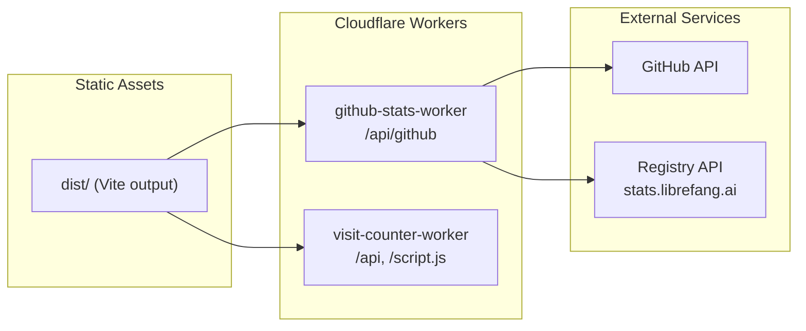

# Website — web

# Librefang Website (`web/`)

## Overview

The website is a React-based single-page marketing site that serves as the public face of Librefang. It presents product positioning, installation flows, community statistics, and localized content across seven languages.

Unlike the core Rust codebase, this repository is purely a frontend application. It aggregates dynamic data from multiple sources—GitHub APIs, Cloudflare Workers, and a registry service—while remaining a thin client that does not manage application state.

## Architecture

The site is split into three runtime components:



**Static Vite site** — Serves all page content, marketing copy, and install scripts. The build outputs to `dist/`.

**GitHub stats worker** — Proxies GitHub API requests with KV caching and daily history recording.

**Visit counter worker** — Tracks page visits and serves an embeddable tracking script.

## Tech Stack

| Category | Technology |
|----------|------------|
| Framework | React 19 |
| Language | TypeScript (strict mode) |
| Build tool | Vite 7 |
| Styling | Tailwind CSS 3 |
| State | zustand |
| Data fetching | @tanstack/react-query |
| Animations | framer-motion |
| Validation | zod |
| Icons | lucide-react |
| Workers | Cloudflare Workers + Wrangler |

## Source Code Organization

```
src/
├── App.tsx          # Page structure, sections, data fetching orchestration
├── main.tsx         # React entrypoint with React Query provider setup
├── i18n.ts          # Translations and language configuration
├── store.ts         # Zustand store for language state and CJK font loading
├── useRegistry.ts   # Registry data hook with remote fetch and fallback
├── index.css        # Global styles, Tailwind directives, component classes
└── lib/
    └── utils.ts     # cn() helper combining clsx and tailwind-merge

scripts/
└── fetch-registry.ts  # Build-time script to populate public/registry.json

public/
├── _headers         # Security headers, CSP, cache policies
├── _redirects       # Static hosting redirects
├── registry.json    # Build-time fallback registry data
├── install.sh       # Shell installer script
├── install.ps1      # PowerShell installer script
├── install-manifest.json  # Install metadata and binary URLs
├── sw.js            # Service worker (generated by vite-plugin-pwa)
└── manifest.webmanifest   # PWA manifest

workers/
├── github-stats-worker/
│   ├── src/index.ts
│   └── wrangler.toml
└── visit-counter-worker/
    ├── src/index.ts
    └── wrangler.toml
```

## Key Components

### `src/App.tsx`

The main page component that assembles the landing page from individual sections (Header, Hero, Features, Comparison, Install, FAQ, etc.). It orchestrates:

- Language detection from URL path
- GitHub stats requests via `@tanstack/react-query`
- Visit counter requests
- Registry data display

### `src/store.ts`

Zustand store managing:

- Current language selection
- CJK font injection based on locale

The store lazily injects Google Fonts stylesheets (Noto Sans SC, TC, JP, or KR) only when the user switches to or lands on a CJK locale (zh, zh-TW, ja, ko). Non-CJK locales use the base `Outfit` font without additional font loads.

### `src/useRegistry.ts`

Custom hook that fetches agent registry data:

1. Attempts to fetch from `https://stats.librefang.ai/api/registry`
2. Falls back to `public/registry.json` if the remote is unavailable

The registry data is refreshed at build time via the `prebuild` script, ensuring the static fallback stays reasonably fresh.

### `src/i18n.ts`

Contains all page copy, translations, and language metadata:

- 7 languages: en, zh, zh-TW, ja, ko, de, es
- Navigation labels, FAQ content, feature descriptions
- Docs and community section text
- Language switcher entries

### `src/lib/utils.ts`

Provides the `cn()` utility function:

```typescript
import { clsx } from 'clsx'
import { twMerge } from 'tailwind-merge'

export function cn(...inputs: ClassValue[]) {
  return twMerge(clsx(inputs))
}
```

This merges Tailwind classes intelligently, resolving conflicts where later classes override earlier ones.

## Internationalization

### Path-Prefix Routing

The site uses URL path prefixes for language routing:

| Path | Language |
|------|----------|
| `/` | English |
| `/zh/` | Simplified Chinese |
| `/zh-TW/` | Traditional Chinese |
| `/ja/` | Japanese |
| `/ko/` | Korean |
| `/de/` | German |
| `/es/` | Spanish |

### Language Detection

Language is detected in two places:

1. **Bootstrap script in `index.html`** — Runs before React hydration to set `document.documentElement.lang` and `window.__INITIAL_LANG__`

2. **`src/store.ts`** — Reads the initial language and manages switching

### CJK Font Loading

Fonts are loaded lazily based on locale:

```typescript
const fontMap = {
  'zh': 'Noto+Sans+SC',
  'zh-TW': 'Noto+Sans+TC',
  'ja': 'Noto+Sans+JP',
  'ko': 'Noto+Sans+KR'
}
```

When a CJK locale is detected, the appropriate Google Fonts stylesheet is injected into the document head.

## Data Fetching

The site uses `@tanstack/react-query` for all remote data:

```typescript
// Example from App.tsx
const { data: githubStats } = useQuery({
  queryKey: ['github-stats'],
  queryFn: () => fetch('https://stats.librefang.ai/api/github').then(r => r.json()),
  staleTime: 5 * 60 * 1000, // 5 minutes
})
```

### Query Configuration

- **GitHub stats**: 5-minute stale time, retries on failure
- **Registry data**: Uses `useRegistry` hook with built-in fallback
- **Visit counter**: Embedded script handles this independently

## State Management

The site uses two state management patterns:

**Zustand** (`src/store.ts`) — For language state and font loading side effects. This is intentionally minimal since the app is read-heavy.

**React Query** (`src/main.tsx`) — For server state. All data fetching flows through React Query with automatic caching and retry logic.

## Build and Deployment

### Development

```bash
pnpm install
pnpm dev
```

The `predev` script runs `tsx scripts/fetch-registry.ts` automatically, ensuring the local fallback is available.

### Production Build

```bash
pnpm build
```

The `prebuild` script runs the same registry fetch, then Vite produces the `dist/` directory.

### Output Chunks

The production build creates vendor chunks for better caching:

- `vendor-react` — React and ReactDOM
- `vendor-motion` — Framer Motion animations
- `vendor-query` — TanStack React Query

### Preview

```bash
pnpm preview
```

Serves the production build locally for verification.

## External Services

The site depends on these runtime services:

| Service | Endpoint | Purpose |
|---------|----------|---------|
| GitHub API | `api.github.com` | Release data for the Hero section |
| GitHub stats worker | `stats.librefang.ai/api/github` | Aggregated community stats |
| Registry API | `stats.librefang.ai/api/registry` | Agent registry data |
| Visit counter worker | `counter.librefang.ai/api` | Visit tracking |
| Google Fonts | `fonts.googleapis.com` | Typography |
| Google Analytics | `googletagmanager.com` | Analytics |

If any service is unavailable, related data sections render as empty or use fallback values.

## Cloudflare Workers

### `workers/github-stats-worker`

Aggregates GitHub stars, forks, issues, PRs, and downloads with KV caching. A cron trigger records daily history.

**Deployment:**

```bash
cd workers/github-stats-worker
wrangler deploy
wrangler secret put GITHUB_TOKEN  # Optional, raises rate limits
```

### `workers/visit-counter-worker`

Tracks site visits and exposes two endpoints:

- `GET /api` — Returns current visit counts
- `POST /api/track` — Records a new visit
- `GET /script.js` — Serves the embeddable tracking script

**Deployment:**

```bash
cd workers/visit-counter-worker
wrangler deploy
```

**Note:** Update `account_id` and KV namespace IDs in `wrangler.toml` before deploying to a different Cloudflare account.

## Adding a New Language

When adding a language, update these locations:

1. **`src/i18n.ts`** — Add translations and a `languages` entry
2. **`src/store.ts`** — Add path detection and font loading
3. **`index.html`** — Add to the bootstrap language detection script
4. **`public/sitemap.xml`** — Add the new URL

## Static Hosting Configuration

The `public/` directory includes hosting configuration files:

**`public/_headers`** — Security headers, CSP rules, cache policies for static assets

**`public/_redirects`** — URL redirects for the hosting platform

When deploying to a new platform, ensure these files are served alongside static assets.

## PWA Configuration

PWA support is configured in `vite.config.ts` via `vite-plugin-pwa`:

- Auto-updating service worker registration
- Pre-caching for common static assets
- `manifest.webmanifest` output
- App metadata (name, theme color, icons)

The service worker is registered in `index.html`:

```javascript
if ('serviceWorker' in navigator) {
  navigator.serviceWorker.register('/sw.js').catch(() => {})
}
```

## Maintenance Considerations

**Content updates** — Most page copy lives in `src/i18n.ts`. Section structure and layout logic are in `src/App.tsx`.

**Installer updates** — Keep `public/install.sh`, `public/install.ps1`, and `public/install-manifest.json` synchronized. Some files may also exist in the repository root.

**Stats API changes** — Update hardcoded endpoints in `src/App.tsx` and `index.html`. Remember to update CSP allowlists in `public/_headers` if domains change.

**Third-party scripts** — Any new scripts added to `index.html` must be allowlisted in the CSP configuration in `public/_headers`.

**Locale changes** — Update `sitemap.xml` and the initial language detection logic when modifying locale paths.

## Registry Data Fallback

The registry data uses a dual-fetch strategy:

```typescript
// From useRegistry.ts (conceptual)
async function fetchRegistry() {
  try {
    const response = await fetch('https://stats.librefang.ai/api/registry')
    return await response.json()
  } catch {
    // Fetch from public/registry.json
    const response = await fetch('/registry.json')
    return await response.json()
  }
}
```

The `scripts/fetch-registry.ts` script populates the static fallback during build:

```bash
pnpm fetch-registry
```

This runs automatically via `predev` and `prebuild` scripts.