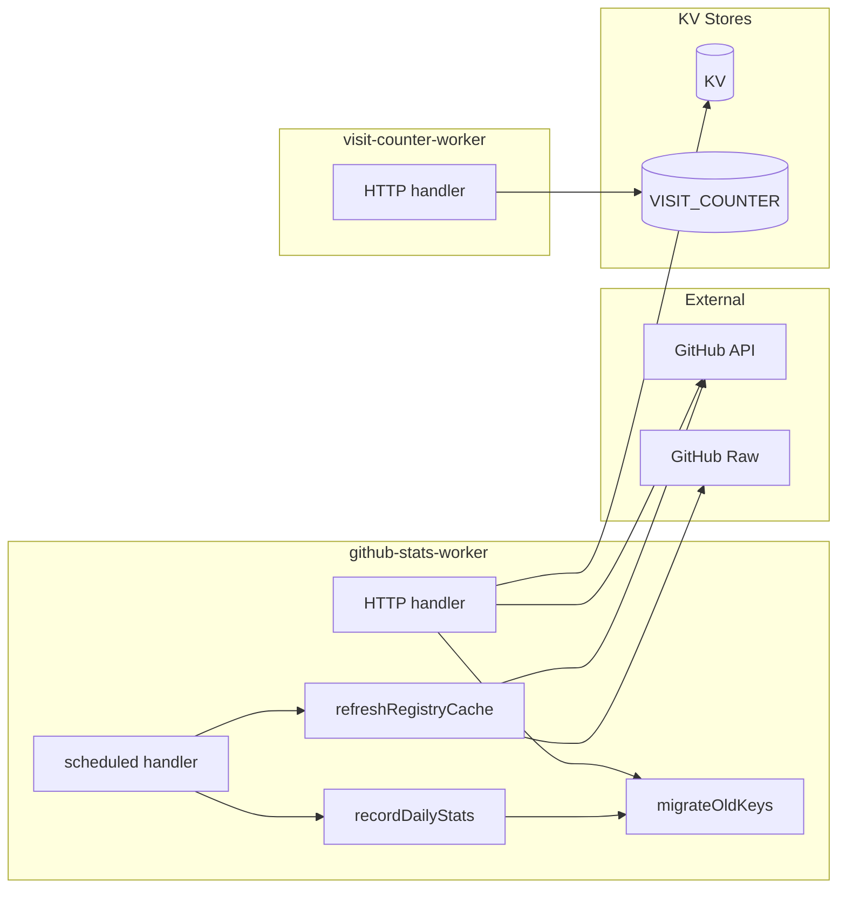

# Website — workers

# Website Workers

Two Cloudflare Workers that power the Librefang website's dynamic data: GitHub repository statistics with registry metadata, and a lightweight visit counter.

## Architecture



---

## github-stats-worker

Serves cached GitHub stats, releases, and registry data. Runs scheduled tasks to record daily snapshots and keep the registry cache warm.

### HTTP Endpoints

All endpoints return JSON with CORS headers (`Access-Control-Allow-Origin: *`).

#### `GET /api/github`

Returns current repository stats plus the last 30 days of history. Serves from KV cache for 30 minutes. Accepts a `?refresh` query parameter to bypass cache.

**Response shape:**

```json
{
  "stars": 42,
  "forks": 10,
  "issues": 5,
  "prs": 3,
  "lastUpdate": "2024-01-15T10:00:00Z",
  "createdAt": "2023-06-01T00:00:00Z",
  "downloads": 1234,
  "starHistory": [
    { "date": "2024-01-15", "stars": 42, "forks": 10, "issues": 5, "prs": 3 }
  ]
}
```

On a cache miss, makes three parallel GitHub API calls (repo info, releases, open PRs) and updates the `stats_history` KV key before responding.

#### `GET /api/releases`

Proxies the last 20 GitHub releases. 30-minute KV cache. On upstream failure, serves stale cache rather than returning an error.

#### `GET /api/registry`

Returns counts and names for all registry categories (hands, channels, providers, integrations, workflows, agents, plugins). 1-hour KV cache. Accepts `?refresh` to bypass. On error, falls back to stale cache.

**Response shape:**

```json
{
  "hands": [{ "id": "example", "name": "Example", "description": "", "category": "", "icon": "" }],
  "channels": [{ "id": "slack", "name": "Slack", "description": "", "category": "", "icon": "" }],
  "handsCount": 5,
  "channelsCount": 3,
  "providersCount": 2,
  "integrationsCount": 4,
  "workflowsCount": 1,
  "agentsCount": 2,
  "pluginsCount": 3,
  "fetchedAt": "2024-01-15T10:00:00.000Z"
}
```

### Scheduled Handler

Triggered by Cloudflare Cron Triggers. Runs two tasks concurrently via `ctx.waitUntil`:

1. **`recordDailyStats`** — Fetches current star/fork/issue/PR counts from GitHub and appends (or replaces) today's entry in `stats_history`. Keeps a rolling 90-day window.

2. **`refreshRegistryCache`** — Fetches directory listings from the `librefang-registry` repo, compares counts against the cached data, and only re-fetches TOML files if counts have changed. TOML files are fetched in batches of 10 from `raw.githubusercontent.com`, parsed for metadata (id, name, description, category, icon, tags, i18n sections), and stored as the full registry payload.

### Stats History and Migration

Stats history is stored as a single JSON array under the `stats_history` KV key, with one entry per day up to 90 days. Each entry:

```json
{ "date": "2024-01-15", "stars": 42, "forks": 10, "issues": 5, "prs": 3 }
```

**Migration from old format.** The system previously stored individual KV keys like `stars_2024-01-15`, `forks_2024-01-15`, etc. `migrateOldKeys` runs automatically when `stats_history` has fewer than 7 entries and the `stats_migration_done` flag is not set. It scans the last 90 days of old keys, merges them into the blob, deduplicates by date, and sets `stats_migration_done` so it never runs again.

### KV Keys Used

| Key | Content |
|---|---|
| `stats_history` | JSON array of daily stat entries (90 days) |
| `stats_migration_done` | `"1"` after old-format migration completes |
| `github_stats` | Cached JSON response for `/api/github` |
| `github_stats_time` | Unix timestamp of last cache write |
| `releases_data` | Cached JSON response for `/api/releases` |
| `releases_data_time` | Unix timestamp of last cache write |
| `registry_data` | Cached JSON response for `/api/registry` |
| `registry_data_time` | Unix timestamp of last cache write |

### Environment Bindings

| Binding | Type | Purpose |
|---|---|---|
| `KV` | KV Namespace | All cached data and stats history |
| `GITHUB_TOKEN` | Secret (optional) | Increases GitHub API rate limit from 60 to 5,000 requests/hour |

---

## visit-counter-worker

A minimal visit counter that tracks total and daily page views. No authentication or bot filtering — intended for rough traffic estimates displayed on the site.

### HTTP Endpoints

All endpoints include CORS headers.

#### `POST /api/track`

Records a page visit. Increments both the total counter and a date-keyed daily counter. Returns `{ success: true, total }`.

#### `GET /` or `GET /api`

Returns current counts:

```json
{ "total": 1234, "today": 56, "date": "2024-01-15" }
```

#### `GET /script.js`

Returns a self-executing JavaScript snippet that sends a POST to `https://counter.librefang.ai/api/track` with the current `pathname`. Uses `keepalive: true` so the request survives page navigation.

### KV Keys Used

| Key | Content |
|---|---|
| `total` | Running total of all visits |
| `today_YYYY-MM-DD` | Visit count for that specific date |

### Environment Bindings

| Binding | Type | Purpose |
|---|---|---|
| `VISIT_COUNTER` | KV Namespace | Visit counters |

---

## Caching Strategy

Both workers follow the same pattern: check a timestamp key alongside the data key, serve from cache if within the TTL, and fall back to stale data on upstream errors rather than surfacing failures to users.

| Data | TTL | Stale fallback |
|---|---|---|
| GitHub stats | 30 min | No (returns fresh error) |
| Releases | 30 min | Yes |
| Registry | 1 hour | Yes |
| Visit counters | None (real-time) | N/A |

The `?refresh` query parameter on `/api/github` and `/api/registry` bypasses the cache check entirely and forces a fresh fetch from upstream.