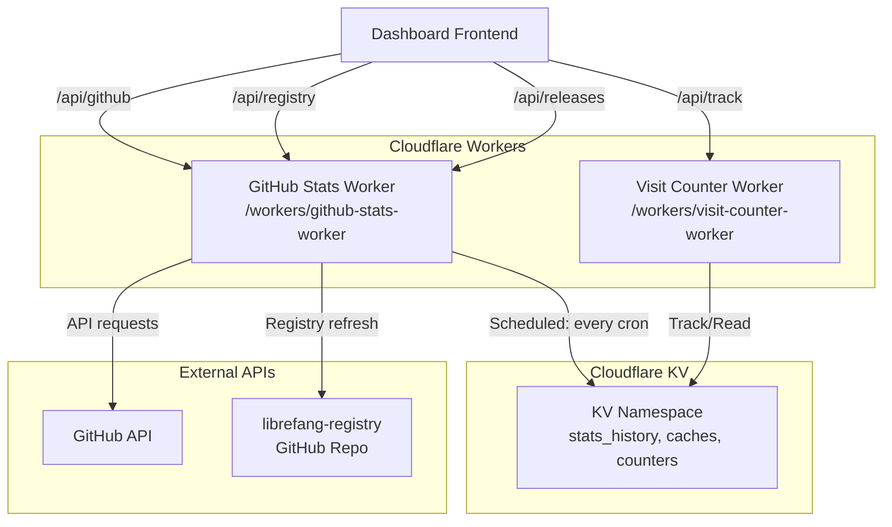

# Website — workers

# Website Workers Module

This module contains two Cloudflare Workers that power the librefang.ai website:

- **GitHub Stats Worker** — Serves repository statistics, releases, and registry metadata with intelligent caching
- **Visit Counter Worker** — Tracks page visits and provides aggregated analytics

Both workers use Cloudflare KV for persistence and CORS headers to support cross-origin requests from the dashboard.

## Architecture Overview



## GitHub Stats Worker

**File:** `web/workers/github-stats-worker/index.js`

This worker provides three API endpoints and two scheduled background tasks.

### API Endpoints

#### `GET /api/github`

Returns comprehensive repository statistics including current counts and historical data.

**Query Parameters:**
- `refresh=true` — Bypass cache and fetch fresh data from GitHub

**Response:**
```json
{
  "stars": 1234,
  "forks": 56,
  "issues": 78,
  "prs": 12,
  "lastUpdate": "2025-01-15T10:30:00Z",
  "createdAt": "2024-06-01T00:00:00Z",
  "downloads": 50000,
  "starHistory": [
    { "date": "2025-01-01", "stars": 1200, "forks": 54, "issues": 75, "prs": 10 },
    ...
  ]
}
```

The `starHistory` array contains the last 30 days of daily snapshots stored in `stats_history`.

#### `GET /api/registry`

Returns a directory listing of the librefang-registry repository. On-demand requests return minimal data (IDs and names only); the scheduled task populates full TOML metadata.

**Query Parameters:**
- `refresh=true` — Bypass cache

**Response:**
```json
{
  "hands": [{ "id": "...", "name": "...", "description": "", ... }],
  "channels": [{ "id": "...", "name": "...", "description": "", ... }],
  "handsCount": 25,
  "channelsCount": 12,
  "providersCount": 8,
  "integrationsCount": 15,
  "workflowsCount": 10,
  "agentsCount": 5,
  "pluginsCount": 20,
  "fetchedAt": "2025-01-15T12:00:00Z"
}
```

#### `GET /api/releases`

Returns the 20 most recent GitHub releases with download counts.

**Response:** Raw GitHub releases JSON array.

### Scheduled Tasks

These run via Cloudflare Cron Triggers on the worker.

#### `recordDailyStats`

Runs on a schedule to capture a daily snapshot of repository metrics:

1. Fetches current `stargazers_count`, `forks_count`, `open_issues_count` from GitHub API
2. Calculates open PR count by parsing the `link` header from the PRs endpoint
3. Reads existing `stats_history` blob from KV
4. Runs migration if needed (see below)
5. Updates or appends today's entry
6. Trims history to 90 days maximum
7. Writes updated blob back to KV

#### `refreshRegistryCache`

Runs periodically to refresh registry metadata:

1. Fetches directory listings for all registry categories
2. Compares counts against cached data — **skips TOML fetch if counts unchanged**
3. When counts differ, fetches full TOML details in batches of 10 to avoid subrequest limits
4. Parses TOML fields: `id`, `name`, `description`, `category`, `icon`, `tags`
5. Extracts i18n sections (`[i18n.zh]`, `[i18n.ja]`, etc.) for localized descriptions
6. Writes complete registry data to KV

This two-tier approach (lightweight directory listing on demand, full metadata on schedule) optimizes for both latency and detail.

### Caching Strategy

| Data | Cache Duration | KV Keys |
|------|---------------|---------|
| GitHub stats | 30 min | `github_stats`, `github_stats_time` |
| Releases | 30 min | `releases_data`, `releases_data_time` |
| Registry (listing) | 1 hour | `registry_data`, `registry_data_time` |
| Daily history | Written daily, kept 90 days | `stats_history` |

All responses include `Cache-Control: public, max-age=300` for CDN caching and `Access-Control-Allow-Origin: *` for cross-origin access.

### KV Storage Schema

**`stats_history`** — JSON blob containing up to 90 daily snapshots:
```json
[
  { "date": "2025-01-01", "stars": 1200, "forks": 54, "issues": 75, "prs": 10 },
  { "date": "2025-01-02", "stars": 1205, "forks": 55, "issues": 76, "prs": 11 }
]
```

**`stats_migration_done`** — Single flag key, value `"1"`, prevents re-running migration.

### Migration from Legacy Format

The worker migrates data from the old individual KV key format:
- `stars_YYYY-MM-DD`
- `forks_YYYY-MM-DD`
- `issues_YYYY-MM-DD`
- `prs_YYYY-MM-DD`

When `stats_history` has fewer than 7 entries, the migration scans the last 90 days of legacy keys and merges them into the blob. The `stats_migration_done` flag ensures this runs only once.

## Visit Counter Worker

**File:** `web/workers/visit-counter-worker/index.js`

A lightweight worker for tracking page visits using Cloudflare KV.

### API Endpoints

#### `POST /api/track`

Records a page visit. The request body is ignored; the worker uses `window.location.pathname` from the embedded script.

**Response:**
```json
{ "success": true, "total": 12345 }
```

#### `GET /api`

Returns current visit statistics.

**Response:**
```json
{ "total": 12345, "today": 234, "date": "2025-01-15" }
```

#### `GET /script.js`

Returns an inline tracking script for embedding in pages.

```javascript
(function() {
  var page = window.location.pathname || 'home';
  fetch('https://counter.librefang.ai/api/track', {
    method: 'POST',
    headers: { 'Content-Type': 'application/json' },
    body: JSON.stringify({ page: page }),
    keepalive: true
  }).catch(function() {});
})();
```

The `keepalive: true` option ensures the request completes even if the user navigates away.

### KV Storage Schema

**`total`** — Cumulative visit count across all time

**`today_YYYY-MM-DD`** — Daily visit count (one key per day)

## Environment Variables

Both workers expect these bindings in `wrangler.toml`:

| Binding | Type | Description |
|---------|------|-------------|
| `KV` | KV Namespace | Primary storage for GitHub stats worker |
| `VISIT_COUNTER` | KV Namespace | Storage for visit counter worker |
| `GITHUB_TOKEN` | Secret | Optional GitHub API token for higher rate limits |

## Integration Points

### Dashboard Frontend

The dashboard at `dashboard/src/api.ts` calls these worker endpoints:

- `handleGitHubStats` → `GET /api/github` — Populates the stats display and star history chart
- `handleRegistry` → `GET /api/registry` — Populates the registry browser
- `handleReleases` → `GET /api/releases` — Populates the releases page

### Embedded Tracking

Web pages include the visit counter script:

```html
<script src="https://counter.librefang.ai/script.js"></script>
```

This fires asynchronously on page load without affecting user experience. The `keepalive` flag ensures tracking survives page navigation.

## Rate Limiting Considerations

The GitHub API has strict rate limits (60 requests/hour for unauthenticated, 5000/hour with token). The caching strategy minimizes API calls:

- Stats and releases use 30-minute cache windows
- Registry uses 1-hour cache with smart refresh
- Scheduled tasks spread calls across time rather than bursting on user requests

Without a `GITHUB_TOKEN`, the worker falls back to unauthenticated limits, which should suffice for typical traffic patterns.