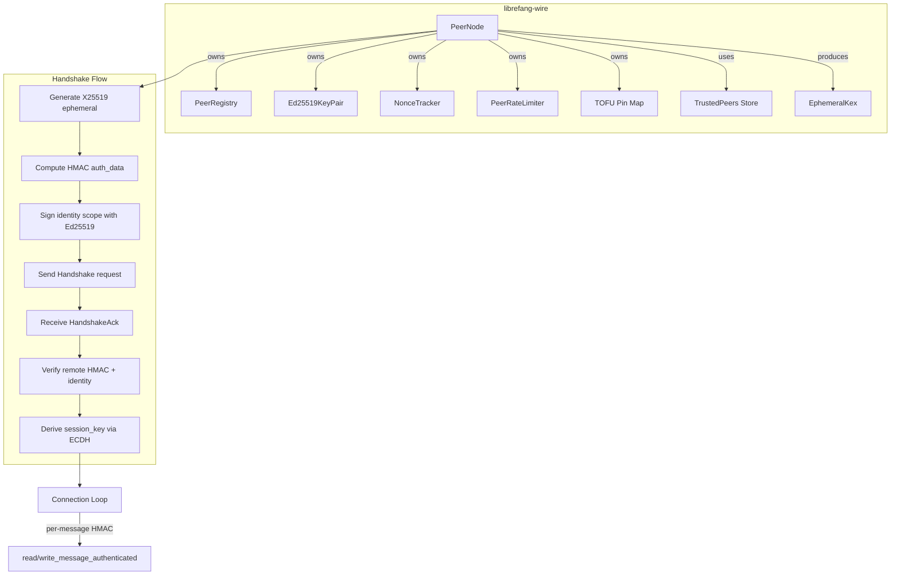
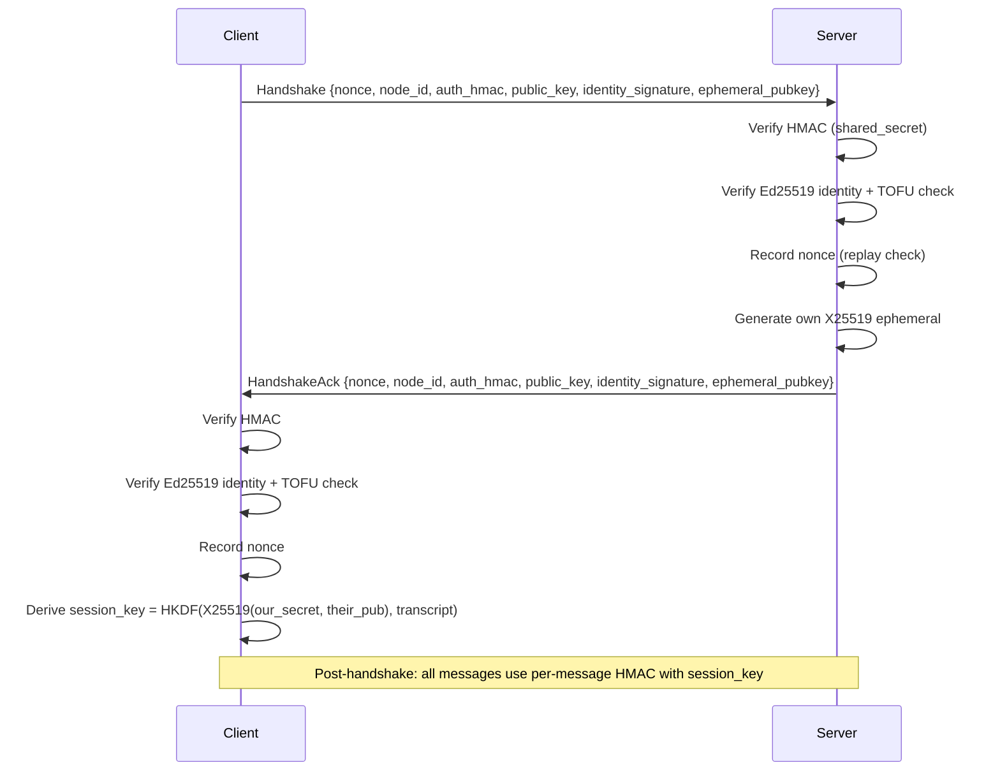

# Wire Protocol & Networking

# Wire Protocol & Networking (`librefang-wire`)

## Purpose

`librefang-wire` implements the **OFP (LibreFang Wire Protocol)** — the TCP-based, JSON-framed protocol for cross-machine agent discovery, authentication, and communication between LibreFang kernels. It handles everything from connection management and cryptographic handshake to per-message integrity and rate limiting.

OFP is a **plaintext** protocol by design. Authentication, integrity, and replay protection are provided in-crate; confidentiality (protection against passive observers) is delegated to the deployment overlay — WireGuard, Tailscale, SSH tunnels, or service-mesh mTLS. Do not add TLS termination to this crate without re-evaluating [the documented decision](https://docs.librefang.ai/architecture/ofp-wire) (closed #3874, closed PR #4001).

## Architecture Overview



## Security Model

OFP enforces **four** independent security layers. All four are required for a successful connection:

### Layer 1 — Network Admission (HMAC-SHA256)

Coarse "cluster password" gate. The handshake carries:

```
auth_hmac = HMAC-SHA256(shared_secret, nonce | sender_node_id | recipient_node_id)
```

The `recipient_node_id` binding (#3875) prevents a captured handshake from being replayed against a *different* federation node that shares the same `shared_secret`.

### Layer 2 — Per-Peer Identity (Ed25519, #3873)

Each node persists an Ed25519 keypair in `<data_dir>/peer_keypair.json`. The handshake carries the sender's public key plus an Ed25519 signature over the same auth-data string the HMAC covers. Recipients:

1. Verify the signature against the public key
2. TOFU-pin the public key to the sender's `node_id`
3. Reject subsequent handshakes claiming the same `node_id` with a different public key

Pins persist across restarts in `<data_dir>/trusted_peers.json`.

**Net effect**: a leaked `shared_secret` no longer lets an attacker impersonate a previously-pinned peer — they'd also need that node's private key file.

### Layer 3 — Forward Secrecy (X25519 ECDH, #4269)

Each handshake generates a fresh X25519 ephemeral keypair. Both peers exchange public halves inside the handshake messages (covered by the Ed25519 signature so an active MITM cannot substitute their own key). The session key is then derived as:

```
shared_point = X25519(local_ephemeral_secret, remote_ephemeral_public)
session_key = HKDF-SHA256(salt=transcript, ikm=shared_point, info="librefang-ofp/v1/session-key")
```

The ephemeral private key is dropped after derivation (`StaticSecret` zeroizes on drop), so future compromise of `shared_secret` or static Ed25519 keys cannot decrypt recorded past traffic.

### Layer 4 — Per-Message HMAC

Post-handshake, every message on the wire is framed as:

```
[4-byte big-endian length][JSON body][64-char hex HMAC]
```

The HMAC is computed over the JSON body using the session key. Messages with invalid HMACs are rejected as tampered or forged.

### Additional Protections

| Mechanism | Where | Purpose |
|---|---|---|
| Nonce replay tracking | `NonceTracker` in `peer.rs` | 5-minute window, 100k cap, amortized GC |
| Per-peer rate limiting | `PeerRateLimiter` in `peer.rs` | Configurable messages/minute + token budget/hour |
| Message size cap | `MAX_PEER_MESSAGE_BYTES` (64 KiB) | Prevents LLM budget drain via oversized payloads |
| Transport size cap | `MAX_MESSAGE_SIZE` (16 MiB) | General transport-level limit |
| TOFU pin cap | `MAX_PIN_ENTRIES` (100k) | Prevents unbounded memory growth from identity flooding |
| Downgrade rejection | `verify_and_pin_identity` | A peer previously seen with Ed25519 cannot drop back to HMAC-only |
| Low-order key rejection | `EphemeralKex::derive_session_key` | All-zero X25519 output is explicitly rejected |

## Backward Compatibility

All new fields in the handshake are `Option<String>` with `skip_serializing_if`:

- `public_key` / `identity_signature` — absent in pre-#3873 peers
- `ephemeral_pubkey` — absent in pre-#4269 peers

When both sides provide an ephemeral pubkey, ECDH-derived session key is used. When either side omits it, the legacy path is used:

```
session_key = HMAC-SHA256(shared_secret, our_nonce || their_nonce)
```

This allows rolling out the federation incrementally without breaking existing peers.

## Key Types

### `WireMessage` and Variants (`message.rs`)

The top-level envelope. Each message has a unique `id` and a `kind`:

| Variant | Tag | Purpose |
|---|---|---|
| `WireRequest::Handshake` | `"type":"request","method":"handshake"` | Initial identity exchange |
| `WireRequest::Discover` | `"type":"request","method":"discover"` | Agent search on remote peer |
| `WireRequest::AgentMessage` | `"type":"request","method":"agent_message"` | Send message to remote agent |
| `WireRequest::Ping` | `"type":"request","method":"ping"` | Liveness check |
| `WireResponse::HandshakeAck` | `"type":"response","method":"handshake_ack"` | Handshake acceptance |
| `WireResponse::AgentResponse` | `"type":"response","method":"agent_response"` | Agent reply |
| `WireResponse::Error` | `"type":"response","method":"error"` | Error with code + message |
| `WireNotification::AgentSpawned` | `"type":"notification","event":"agent_spawned"` | New agent on peer |
| `WireNotification::AgentTerminated` | `"type":"notification","event":"agent_terminated"` | Agent gone |
| `WireNotification::ShuttingDown` | `"type":"notification","event":"shutting_down"` | Peer shutting down |

**Forward compatibility** (#3544): `WireMessageKind::Unknown`, `WireRequest::Unknown`, `WireResponse::Unknown`, and `WireNotification::Unknown` are catch-all variants using `#[serde(other)]`. Unknown message types from newer protocol versions decode successfully and are silently dropped, keeping the TCP link alive.

### `PeerNode` (`peer.rs`)

The central actor. Owns the TCP listener, manages connections, performs handshakes, and routes messages.

```rust
// Start with Ed25519 identity (production):
let (node, task) = PeerNode::start_with_identity(
    config, registry, handle, Some(keypair), Some(trust_dir)
).await?;

// Start without identity (legacy / testing):
let (node, task) = PeerNode::start(config, registry, handle).await?;
```

**Key methods:**

| Method | Description |
|---|---|
| `start_with_identity` | Bind listener, hydrate TOFU pins from disk, start accept loop |
| `connect_to_peer_with_id` | Outbound connection with recipient-bound HMAC (#3875) |
| `connect_to_peer` | Outbound connection without recipient binding (bootstrap only) |
| `send_to_peer` | One-shot: connect, handshake, send agent message, read response |
| `identity_fingerprint` | SHA-256 fingerprint of local Ed25519 public key for OOB verification |
| `list_pinned_peers` | Snapshot of all TOFU pins with fingerprints |
| `pinned_peer_count` | Count of pinned identities (surfaced via `/api/network/status`) |

### `PeerHandle` Trait (`peer.rs`)

The kernel's integration point. Implement this trait to wire OFP into the rest of the system:

```rust
#[async_trait]
impl PeerHandle for MyKernel {
    fn local_agents(&self) -> Vec<RemoteAgentInfo> { /* ... */ }
    async fn handle_agent_message(&self, agent: &str, message: &str, sender: Option<&str>) -> Result<String, String> { /* ... */ }
    fn discover_agents(&self, query: &str) -> Vec<RemoteAgentInfo> { /* ... */ }
    fn uptime_secs(&self) -> u64 { /* ... */ }
}
```

### `PeerConfig` (`peer.rs`)

| Field | Default | Description |
|---|---|---|
| `listen_addr` | `"127.0.0.1:0"` | TCP bind address |
| `node_id` | Random UUID | Unique node identifier |
| `node_name` | `"librefang-node"` | Human-readable name |
| `shared_secret` | **required** | HMAC pre-shared key — OFP refuses to start if empty |
| `max_messages_per_peer_per_minute` | `60` | Per-peer rate limit; `0` disables |
| `max_llm_tokens_per_peer_per_hour` | `None` | Per-peer token budget; `None` disables |

### `Ed25519KeyPair` and `PeerKeyManager` (`keys.rs`)

`Ed25519KeyPair` wraps an Ed25519 signing key. Key operations:

- `generate()` — create a fresh keypair from OS CSPRNG
- `sign(data)` — returns base64(64-byte signature)
- `verifying_key()` — reconstruct the `VerifyingKey` from stored public bytes
- `fingerprint()` — SHA-256 of the base64 public key, hex-encoded

`PeerKeyManager` handles persistence at `<data_dir>/peer_keypair.json`. On load it:

1. Re-derives the public key from the stored seed and cross-checks against the stored public key (rejects tampered files)
2. Migrates PR-1 files (no `node_id` field) by minting a UUID and rewriting
3. Sets file permissions to `0600` on Unix (best-effort)

### `EphemeralKex` (`kex.rs`)

Represents one side of a per-handshake X25519 key exchange:

```rust
let our_kex = EphemeralKex::generate()?;          // fresh keypair
let our_pub_b64 = our_kex.public_b64();           // put in handshake message
// ... exchange pubkeys on the wire ...
let session_key = our_kex.derive_session_key(their_pub_b64, &transcript)?;
// our_kex is consumed (private key zeroized)
```

The `transcript` is built by `handshake_transcript(client_nonce, server_nonce)` — nonces concatenated in a fixed order (client first) so both sides produce the same salt regardless of who is calling.

### `NonceTracker` (`peer.rs`)

Thread-safe (`DashMap`-backed) replay detector. Uses a single `DashMap::entry()` call to avoid TOCTOU races. Key design decisions:

- **5-minute window** — handshake nonces are single-use UUIDs
- **100k entry cap** — prevents unbounded growth from flood attacks
- **Amortized GC** — `retain()` sweep only runs when the map hits 80% capacity, so an unauthenticated attacker cannot force O(n) scans on every connection attempt
- **Fails closed** — at capacity, new nonces are rejected rather than accepted without tracking

### `PeerRateLimiter` (`peer.rs`)

Two independent sliding-window limits per peer:

1. **Message rate**: configurable `max_messages_per_peer_per_minute` (default 60). Checked *before* any agent work is done. Excess messages get a 429 response.
2. **Token budget**: optional `max_llm_tokens_per_peer_per_hour`. Recorded *after* LLM completion (token cost is unknown upfront). Future TODO: wire actual token counts from `handle_agent_message`.

### `PeerRegistry` (`registry.rs`)

Tracks known peers and their agents. Thread-safe (`Arc<DashMap>`). Key operations: `add_peer`, `get_peer`, `connected_peers`, `mark_disconnected`, `add_agent`, `remove_agent`, `find_agents`.

## Handshake Protocol (Wire-Level)



The Ed25519 signature scope (#4269) covers both `auth_data` and the ephemeral pubkey:

```
scope = auth_data                          (legacy, no ephemeral)
scope = auth_data | "|" | ephemeral_pubkey (with ephemeral)
```

This binds the ephemeral key to the static identity, preventing an active MITM from substituting their own X25519 public key during the handshake.

## Framing

**Unauthenticated** (handshake only):
```
[4 bytes: big-endian JSON length][JSON body]
```

**Authenticated** (post-handshake):
```
[4 bytes: big-endian (JSON length + 64)][JSON body][64 bytes: hex HMAC-SHA256(session_key, JSON body)]
```

Functions: `encode_message`, `decode_message`, `decode_length` in `message.rs`. Authenticated I/O: `write_message_authenticated`, `read_message_authenticated` in `peer.rs`.

## Connection Lifecycle

1. **Accept** — `accept_loop` spawns one Tokio task per inbound TCP connection
2. **Handshake** — `handle_inbound` validates HMAC, identity, nonce, sends ack, derives session key
3. **Message loop** — `connection_loop` reads authenticated messages, dispatches to `handle_request_in_loop` or `handle_notification`
4. **Teardown** — on error or EOF, the peer is marked disconnected in the registry

## Integration with the Rest of the Codebase

- **Kernel** (`librefang-kernel`) implements `PeerHandle` to route remote agent messages to local agents
- **API layer** (`librefang-api`) surfaces `identity_fingerprint`, `pinned_peer_count`, and `list_pinned_peers` via `GET /api/network/status` and `GET /api/network/trusted-peers`
- **Configuration** — `shared_secret`, rate limits, and trust store directory come from `[network]` in `config.toml`
- **Manifest signing** (`librefang-types`) reuses `verifying_key()` from `Ed25519KeyPair` for artifact verification

## Common Patterns

### Starting a production node with full security

```rust
let mut key_mgr = PeerKeyManager::new(data_dir.clone());
let keypair = key_mgr.load_or_generate()?.clone();
let node_id = key_mgr.node_id().unwrap().to_string();

let config = PeerConfig {
    listen_addr: "0.0.0.0:7070".parse()?,
    node_id,
    node_name: hostname,
    shared_secret: config_file.shared_secret,
    max_messages_per_peer_per_minute: 60,
    max_llm_tokens_per_peer_per_hour: Some(100_000),
};

let (node, _task) = PeerNode::start_with_identity(
    config,
    registry,
    kernel_handle,
    Some(keypair),
    Some(data_dir),
).await?;
```

### Connecting to a known peer

```rust
// With recipient binding (prevents cross-node replay):
node.connect_to_peer_with_id(peer_addr, handle.clone(), "recipient-node-id").await?;

// Or send a one-shot agent message:
node.send_to_peer("remote-node-id", "coder", "Write a test", None, handle.clone()).await?;
```

### Broadcasting a notification

```rust
let errors = broadcast_notification(
    &registry,
    WireNotification::AgentSpawned { agent: info },
    &shared_secret,
).await;
for (node_id, err) in errors {
    warn!("Failed to notify {}: {}", node_id, err);
}
```

## Error Types

`WireError` covers all wire-protocol failures:

| Variant | When |
|---|---|
| `Io` | TCP read/write failures |
| `Json` | Malformed JSON frames |
| `HandshakeFailed` | HMAC mismatch, identity rejection, nonce replay, ECDH failure |
| `ConnectionClosed` | Peer disconnected (clean EOF) |
| `MessageTooLarge` | Frame exceeds 16 MiB |
| `VersionMismatch` | Incompatible protocol versions |

`KeyError` (in `keys.rs`) covers key operations: `Io`, `Serialization`, `InvalidFormat`, `Rng`, `BadSignature`.

## Protocol Versioning

The current protocol version is `PROTOCOL_VERSION = 1` (defined in `message.rs`).

The HKDF info string `"librefang-ofp/v1/session-key"` in `kex.rs` serves as a secondary versioning hook for session key derivation — bumping it on a breaking change prevents old clients and new servers from accidentally agreeing on a key.