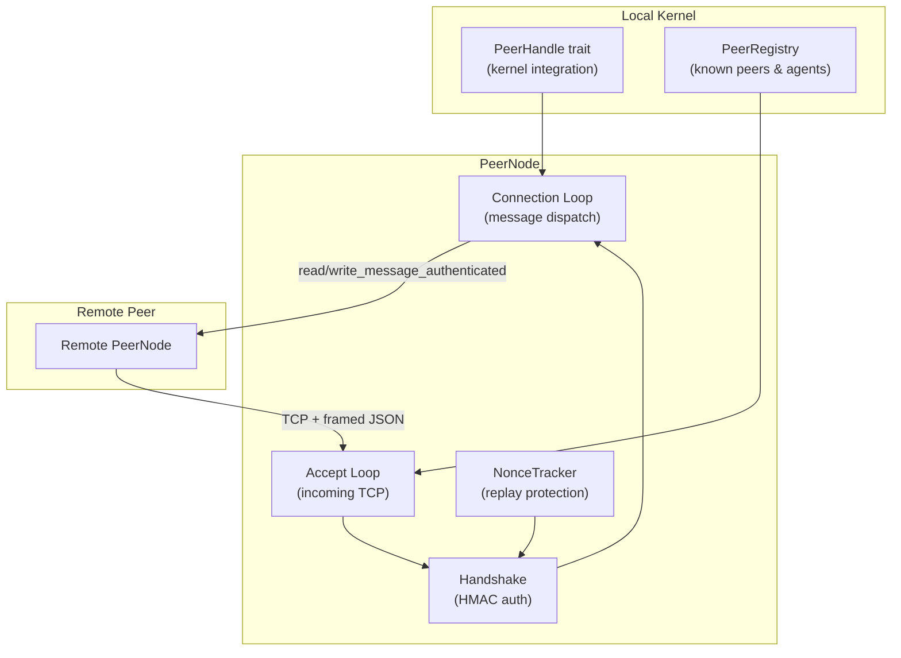

# Wire Protocol & Networking

# Wire Protocol & Networking (`librefang-wire`)

Cross-machine agent discovery, authentication, and communication over TCP using a length-framed JSON protocol called the **LibreFang Wire Protocol (OFP)**.

## Architecture



Every LibreFang kernel that wants to communicate across machines runs a `PeerNode`. Peers discover each other's agents, route messages to remote agents, and broadcast lifecycle notifications — all secured with HMAC-SHA256 authentication and replay-protected nonces.

## Wire Protocol Framing

All messages on the wire use a simple length-prefixed framing:

```
┌────────────────────┬──────────────────────────┐
│ 4 bytes (BE u32)   │ N bytes (JSON body)       │
│ length of JSON     │ WireMessage (serde JSON)  │
└────────────────────┴──────────────────────────┘
```

Post-handshake messages append a 64-character hex HMAC trailer:

```
┌──────────┬──────────────────┬──────────────────┐
│ 4 bytes  │ (N-64) bytes     │ 64 bytes          │
│ BE u32   │ JSON body        │ HMAC-SHA256 hex   │
└──────────┴──────────────────┴──────────────────┘
```

The maximum single message size is 16 MB (`MAX_MESSAGE_SIZE`).

Encoding and decoding are handled by three functions in `message.rs`:

- **`encode_message`** — serializes a `WireMessage` to `Vec<u8>` with the 4-byte length prefix
- **`decode_length`** — reads the length from a 4-byte header
- **`decode_message`** — parses the JSON body back into a `WireMessage`

For authenticated I/O after handshake, use `write_message_authenticated` / `read_message_authenticated` in `peer.rs`, which append and verify the HMAC trailer.

## Message Types

All messages share the `WireMessage` envelope with a unique `id` and a `kind` discriminated by an internal `type` tag:

```rust
pub struct WireMessage {
    pub id: String,
    pub kind: WireMessageKind,  // #[serde(flatten)]
}

pub enum WireMessageKind {
    Request(WireRequest),       // "type": "request"
    Response(WireResponse),     // "type": "response"
    Notification(WireNotification), // "type": "notification"
}
```

### Requests (`WireRequest`)

| Variant | Tag | Purpose |
|---------|-----|---------|
| `Handshake` | `"method": "handshake"` | Initial peer authentication and identity exchange |
| `Discover` | `"method": "discover"` | Search for agents matching a query string |
| `AgentMessage` | `"method": "agent_message"` | Send a message to a specific remote agent |
| `Ping` | `"method": "ping"` | Liveness check |

### Responses (`WireResponse`)

| Variant | Tag | Purpose |
|---------|-----|---------|
| `HandshakeAck` | `"method": "handshake_ack"` | Acknowledge handshake, exchange identity |
| `DiscoverResult` | `"method": "discover_result"` | Return matched agents |
| `AgentResponse` | `"method": "agent_response"` | Agent's reply text |
| `Pong` | `"method": "pong"` | Ping response with uptime |
| `Error` | `"method": "error"` | Error with code and message |

### Notifications (`WireNotification`)

One-way messages that do not expect a response:

| Variant | Event | Purpose |
|---------|-------|---------|
| `AgentSpawned` | `"event": "agent_spawned"` | A new agent came online on the peer |
| `AgentTerminated` | `"event": "agent_terminated"` | An agent was stopped |
| `ShuttingDown` | `"event": "shutting_down"` | Peer is going offline |

The current protocol version is `PROTOCOL_VERSION = 1`. Version mismatches are rejected during handshake.

## Authentication & Security

### Shared Secret Requirement

OFP **refuses to start** without a configured shared secret. If `PeerConfig::shared_secret` is empty, `PeerNode::start` returns `WireError::HandshakeFailed`.

### Handshake Flow

Every connection (inbound or outbound) must complete HMAC-authenticated handshake before any other request is accepted:

1. **Client sends `Handshake` request** with:
   - `nonce` — fresh UUID v4
   - `auth_hmac` — `HMAC-SHA256(shared_secret, nonce + node_id)` in hex

2. **Server verifies**:
   - Protocol version matches
   - Nonce has not been seen before (replay protection via `NonceTracker`)
   - HMAC is valid using constant-time comparison

3. **Server sends `HandshakeAck` response** with its own nonce and HMAC

4. **Client verifies** the ack's nonce and HMAC

5. Both sides derive a **per-session key**: `derive_session_key(shared_secret, our_nonce, their_nonce)` → `HMAC-SHA256(shared_secret, our_nonce + their_nonce)`

### Nonce Replay Protection

`NonceTracker` prevents replay attacks using a time-windowed `DashMap`:

- 5-minute window (300 seconds)
- 100,000 entry cap to prevent memory exhaustion under flood
- Atomic `check_and_record` using `DashMap::entry` — avoids a TOCTOU race where concurrent handshakes with the same replayed nonce could both pass
- Expired entries are garbage-collected on each insertion

### Per-Message Authentication

After handshake, all messages in the connection loop use `write_message_authenticated` / `read_message_authenticated`, which append and verify a per-message HMAC derived from the session key. Any tampering or forgery causes `WireError::HandshakeFailed` with a tamper message.

### Unauthenticated Rejection

Any message sent before completing handshake receives a `401` error response:

```
Error { code: 401, message: "Authentication required: complete HMAC handshake first" }
```

This applies to `Ping`, `Discover`, `AgentMessage`, and all other request types.

## PeerNode Lifecycle

### Starting a Node

```rust
let config = PeerConfig {
    listen_addr: "0.0.0.0:7010".parse()?,
    node_id: "my-kernel-1".to_string(),
    node_name: "Production Kernel".to_string(),
    shared_secret: "a-long-random-secret".to_string(),
};

let registry = PeerRegistry::new();
let handle: Arc<dyn PeerHandle> = Arc::new(MyKernelHandle);

let (node, task) = PeerNode::start(config, registry.clone(), handle).await?;
// node.local_addr() — actual bound address (useful with port 0)
// task — JoinHandle for the accept loop
```

`PeerNode::start` binds a TCP listener and spawns an accept loop. Each incoming connection is handled in its own tokio task.

### Connecting to a Peer

```rust
node.connect_to_peer(remote_addr, handle.clone()).await?;
```

This opens a TCP connection, performs the full HMAC handshake, registers the peer in the `PeerRegistry`, and spawns a connection loop task for ongoing message dispatch.

### Sending a Message to a Remote Agent

```rust
let response = node.send_to_peer(
    "remote-node-id",
    "coder",
    "Refactor the auth module",
    Some("orchestrator"),
    handle.clone(),
).await?;
```

`send_to_peer` opens a **new connection** to the target peer, performs a full HMAC handshake, sends the `AgentMessage`, reads the response, and closes the connection. This ensures each agent interaction is fully authenticated.

### Broadcasting Notifications

```rust
let errors = broadcast_notification(
    &registry,
    WireNotification::AgentSpawned { agent: info },
    &shared_secret,
).await;
```

Broadcasts a notification to all connected peers. Returns a list of `(node_id, WireError)` for any that failed.

## PeerRegistry

Thread-safe registry (`Arc<RwLock<HashMap<String, PeerEntry>>>`) tracking all known peers and their agents.

### Key Operations

| Method | Purpose |
|--------|---------|
| `add_peer(entry)` | Register/update a peer after handshake |
| `remove_peer(node_id)` | Remove a peer entirely |
| `mark_disconnected(node_id)` | Mark as disconnected (kept for reconnect) |
| `mark_connected(node_id)` | Restore a disconnected peer |
| `get_peer(node_id)` | Get a specific peer's snapshot |
| `connected_peers()` | All currently connected peers |
| `add_agent(node_id, agent)` | Add/update an agent on a peer |
| `remove_agent(node_id, agent_id)` | Remove an agent from a peer |
| `find_agents(query)` | Search agents by name, tags, or description |
| `all_remote_agents()` | All agents across all connected peers |

`find_agents` performs case-insensitive matching against agent name, description, and tags. It only searches agents on `PeerState::Connected` peers.

## PeerHandle Trait

The kernel implements `PeerHandle` to integrate with the wire protocol layer:

```rust
#[async_trait]
pub trait PeerHandle: Send + Sync + 'static {
    fn local_agents(&self) -> Vec<RemoteAgentInfo>;
    async fn handle_agent_message(
        &self, agent: &str, message: &str, sender: Option<&str>
    ) -> Result<String, String>;
    fn discover_agents(&self, query: &str) -> Vec<RemoteAgentInfo>;
    fn uptime_secs(&self) -> u64;
}
```

- **`local_agents`** — called during handshake and discovery to advertise local agents to remote peers
- **`handle_agent_message`** — called when a remote peer sends a message to a local agent; returns the agent's response text
- **`discover_agents`** — called to filter local agents by query string
- **`uptime_secs`** — called for `Pong` responses

## PeerConfig Fields

| Field | Default | Description |
|-------|---------|-------------|
| `listen_addr` | `"127.0.0.1:0"` | TCP bind address (port 0 = OS-assigned) |
| `node_id` | Random UUID v4 | Unique node identifier |
| `node_name` | `"librefang-node"` | Human-readable name |
| `shared_secret` | `""` (empty — **must be set**) | HMAC-SHA256 pre-shared key |

## Error Handling

`WireError` covers all failure modes:

| Variant | When |
|---------|------|
| `Io` | TCP read/write failures |
| `Json` | Message serialization/deserialization errors |
| `HandshakeFailed` | HMAC verification failure, nonce replay, missing secret |
| `ConnectionClosed` | Peer disconnected (unexpected EOF) |
| `MessageTooLarge` | Message exceeds 16 MB limit |
| `VersionMismatch` | Protocol version disagreement during handshake |

## Integration Points

External modules interact with this crate through:

- **`PeerRegistry`** — queried by the web UI (`src/routes/network.rs`), WebSocket handler (`librefang-api/src/ws`), and channel bridge to display peer counts, list peers, and show network status
- **`PeerNode::local_addr()`** — used by API server startup, OAuth flows, MCP runtime, and integration tests to discover the actual bound port
- **`PeerNode::registry()`** — provides registry access for composing higher-level network operations