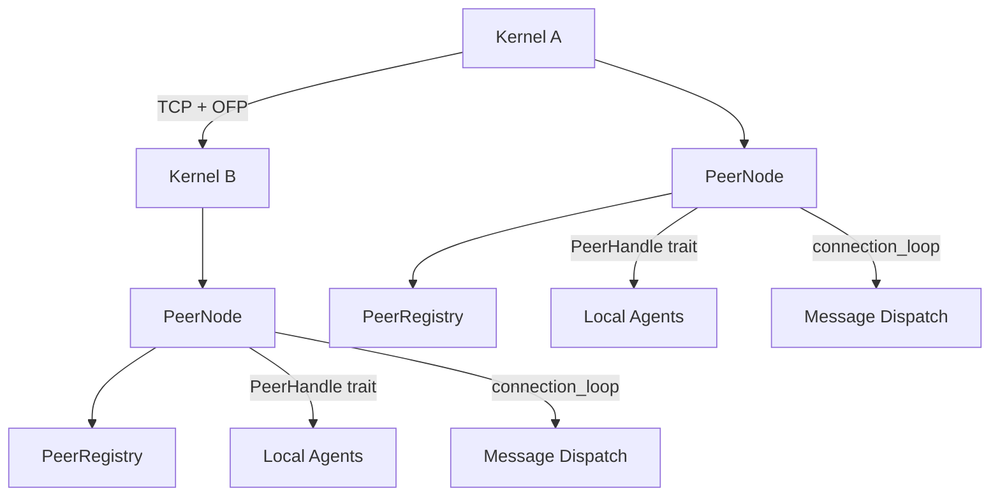
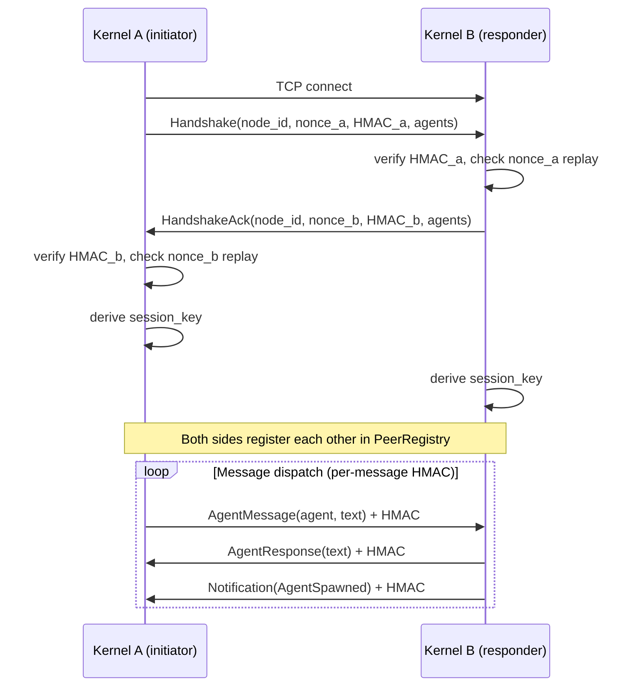

# Wire Protocol & Networking

# LibreFang Wire Protocol (OFP) — Agent-to-Agent Networking

The `librefang-wire` crate implements the LibreFang Wire Protocol (OFP), the networking layer that enables separate LibreFang kernels to discover each other's agents, authenticate connections, and exchange messages over TCP. Every cross-machine interaction — agent messaging, discovery queries, lifecycle notifications — flows through this module.

## Architecture



Each kernel runs a `PeerNode` that binds a TCP listener. When two kernels connect, they perform an HMAC-authenticated handshake, exchange their agent rosters, and enter a message dispatch loop. The `PeerHandle` trait is the integration point where the kernel plugs in its agent routing logic.

## Wire Protocol

All communication uses length-prefixed JSON frames over TCP.

### Framing

Every message on the wire has this structure:

```
[4 bytes: big-endian length of payload][JSON payload]
```

Post-handshake messages append a 64-character hex HMAC:

```
[4 bytes: big-endian length][JSON body][64 bytes: hex HMAC-SHA256]
```

The maximum message size is 16 MB (`MAX_MESSAGE_SIZE`). The functions `encode_message` / `decode_message` / `decode_length` in `message.rs` handle serialization, and `write_message` / `read_message` in `peer.rs` handle async TCP I/O for unauthenticated frames. The `_authenticated` variants handle HMAC-appended frames.

### Message Types

All messages are wrapped in a `WireMessage` envelope carrying a unique `id` and a `kind` discriminated by a `"type"` tag:

| Variant | Tag | Direction |
|---|---|---|
| `WireRequest` | `"request"` | Initiator → Responder |
| `WireResponse` | `"response"` | Responder → Initiator |
| `WireNotification` | `"notification"` | One-way, no response |

**Requests** are further discriminated by a `"method"` tag:

- `Handshake` — exchange peer identity, agents, and HMAC credentials
- `Discover` — search for agents matching a query
- `AgentMessage` — send a message to a specific remote agent
- `Ping` — liveness check

**Responses** use a matching `"method"` tag:

- `HandshakeAck` — confirms handshake with the responder's identity and HMAC
- `DiscoverResult` — returns matched `RemoteAgentInfo` entries
- `AgentResponse` — returns the target agent's reply text
- `Pong` — includes uptime in seconds
- `Error` — carries an error code and message

**Notifications** use an `"event"` tag and are fire-and-forget:

- `AgentSpawned` — a new agent is available on the peer
- `AgentTerminated` — an agent has stopped
- `ShuttingDown` — the peer is going offline

The current protocol version is `PROTOCOL_VERSION = 1`. A version mismatch during handshake immediately terminates the connection.

## Authentication & Security Model

OFP requires a pre-shared secret configured via `PeerConfig.shared_secret`. The `PeerNode::start` method refuses to boot if the secret is empty. Authentication operates at two layers:

### Handshake Authentication

Each side generates a random nonce (UUID v4) and computes:

```
HMAC-SHA256(shared_secret, nonce + node_id)
```

Both the request (`Handshake`) and response (`HandshakeAck`) carry `nonce` and `auth_hmac` fields. Each side independently verifies the other's HMAC using constant-time comparison (`subtle::ConstantTimeEq`). A failed HMAC results in an immediate connection drop.

### Nonce Replay Protection

The `NonceTracker` stores every nonce seen within a 5-minute sliding window. The `check_and_record` method uses `DashMap::entry` to atomically check and insert, preventing a TOCTOU race where concurrent connections with a replayed nonce could both pass. Once the tracker reaches 100,000 entries (the `max_entries` cap), it rejects new nonces to prevent memory exhaustion from flooding attacks.

### Session Key Derivation

After both HMACs verify, a per-session key is derived:

```rust
derive_session_key(shared_secret, our_nonce, their_nonce)
// = HMAC-SHA256(shared_secret, our_nonce + their_nonce)
```

Nonce order matters — the initiator and responder pass their own nonce first, so the derived keys are identical because `connect_to_peer` and `handle_inbound` both call `derive_session_key` with the client nonce first and the server nonce second.

### Per-Message Authentication

All post-handshake messages are wrapped with an appended HMAC computed over the JSON body using the session key. The `write_message_authenticated` and `read_message_authenticated` functions handle this transparently. If the HMAC does not match, the message is rejected as tampered or forged.

### Unauthenticated Rejection

Any message received before a completed handshake is rejected with an `Error` response (code 401). This includes `Ping`, `Discover`, and `AgentMessage` — the server enforces handshake-first.

## Key Components

### `PeerNode`

The core networking actor. Created via `PeerNode::start`, which binds a TCP listener and spawns an accept loop. Key methods:

- **`start(config, registry, handle)`** — Binds the listener, validates config, returns `(Arc<PeerNode>, JoinHandle)`.
- **`connect_to_peer(addr, handle)`** — Opens an outbound connection, performs the full HMAC handshake, registers the peer, and spawns a `connection_loop` task.
- **`send_to_peer(node_id, agent, message, sender, handle)`** — Opens a fresh connection to a known peer, handshakes, sends an `AgentMessage`, and returns the response text. Used for one-shot remote agent calls.
- **`local_addr()`** / **`node_id()`** / **`registry()`** — Accessors.

### `PeerHandle` Trait

The integration point for the kernel. The `PeerNode` calls these methods when handling inbound requests:

```rust
#[async_trait]
pub trait PeerHandle: Send + Sync + 'static {
    fn local_agents(&self) -> Vec<RemoteAgentInfo>;
    async fn handle_agent_message(&self, agent: &str, message: &str, sender: Option<&str>) -> Result<String, String>;
    fn discover_agents(&self, query: &str) -> Vec<RemoteAgentInfo>;
    fn uptime_secs(&self) -> u64;
}
```

The kernel implements `PeerHandle` to route incoming `AgentMessage` requests to its local agent system, provide agent listings for handshakes and discovery, and report uptime.

### `PeerRegistry`

A thread-safe (`Arc<RwLock<HashMap>>`) store of all known peers. Each `PeerEntry` records:

| Field | Purpose |
|---|---|
| `node_id` | Unique peer identifier |
| `node_name` | Human-readable name |
| `address` | `SocketAddr` for reconnection |
| `agents` | Advertised `RemoteAgentInfo` list |
| `state` | `Connected` or `Disconnected` |
| `connected_at` | Timestamp from `chrono::Utc` |
| `protocol_version` | Negotiated during handshake |

Key operations:

- **`add_peer`** / **`remove_peer`** — Register or remove a peer entry.
- **`mark_disconnected`** / **`mark_connected`** — Toggle state without removing the entry (supports reconnect scenarios).
- **`add_agent`** / **`remove_agent`** — Update a peer's agent list (used when processing `AgentSpawned` / `AgentTerminated` notifications).
- **`find_agents(query)`** — Searches across all connected peers, matching against agent name, description, and tags (case-insensitive). Returns `Vec<RemoteAgent>` which includes the owning `peer_node_id`.
- **`connected_peers()`** / **`all_peers()`** — Snapshot of peers filtered by state.
- **`connected_count()`** / **`total_count()`** — Quick counts.

### `NonceTracker`

Concurrent replay-detection using a `DashMap<String, Instant>`. Expired entries (older than 5 minutes) are garbage-collected on each `check_and_record` call. The atomic entry API prevents race conditions — exactly one concurrent caller can win for a given nonce.

### Error Handling

`WireError` covers all failure modes:

- `Io` / `Json` — underlying I/O or serialization errors
- `HandshakeFailed` — HMAC failure, nonce replay, rejected auth
- `ConnectionClosed` — clean EOF
- `MessageTooLarge` — exceeded 16 MB limit
- `VersionMismatch` — protocol version disagreement

## Connection Lifecycle



1. **Connect** — The initiator opens a TCP connection to the responder's listen address.
2. **Handshake** — Both sides exchange identity, agent lists, nonces, and HMACs. Either side can reject on HMAC failure or version mismatch.
3. **Session key** — Both derive an identical session key from the two nonces and the shared secret.
4. **Dispatch loop** — The `connection_loop` function reads authenticated messages, dispatches requests to `PeerHandle`, forwards notifications to the `PeerRegistry`, and writes authenticated responses.
5. **Teardown** — On disconnect or error, the peer is marked `Disconnected` in the registry (not removed, to support reconnect).

### Broadcasting Notifications

`broadcast_notification` sends a one-way notification to all connected peers. It opens a fresh TCP connection per peer, derives a per-message key from a fresh nonce, and writes a single authenticated frame. Any errors are collected and returned to the caller.

## Configuration

`PeerConfig` controls the local node:

| Field | Default | Description |
|---|---|---|
| `listen_addr` | `"127.0.0.1:0"` | Bind address (port 0 = OS-assigned) |
| `node_id` | Random UUID | Unique node identifier |
| `node_name` | `"librefang-node"` | Human-readable name |
| `shared_secret` | `""` (must be set) | Pre-shared key for HMAC auth |

The shared secret must be identical on all peers that need to communicate. The config is typically loaded from `[network]` section in `config.toml`.

## Integration with the Rest of LibreFang

The wire module is consumed by several other crates:

- **`librefang-api`** — Uses `PeerRegistry::all_peers` and `connected_count` in `/network` routes and WebSocket handlers to display peer status.
- **`librefang-cli`** — References `registry` and `local_addr` during initialization.
- **`librefang-desktop`** and other crates — Call `local_addr` for test server setup and OAuth redirect binding.

The kernel implements `PeerHandle` and passes it to `PeerNode::start`. From that point, inbound OFP requests are automatically routed through the kernel's agent system.