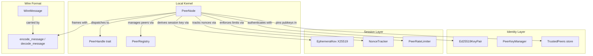
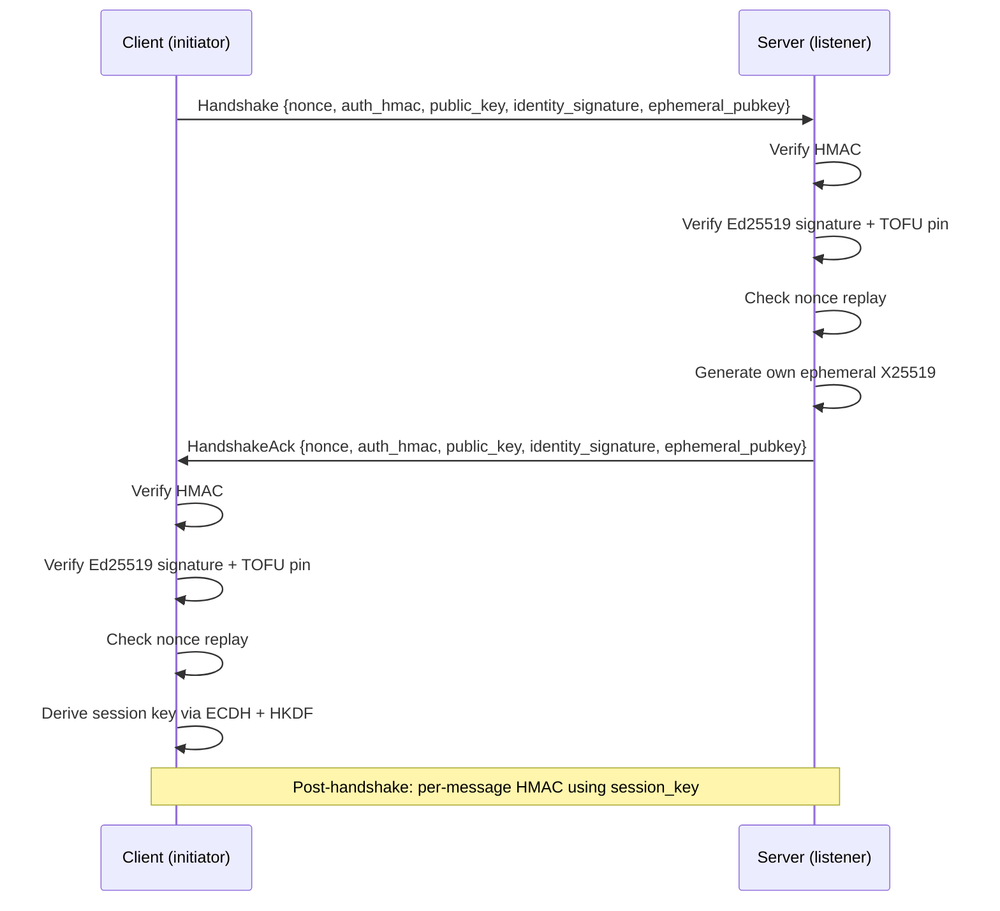

# Wire Protocol & Networking

# LibreFang Wire Protocol (OFP)

Agent-to-agent networking over TCP. Provides cross-machine discovery, authentication, and communication using length-prefixed JSON frames.

## Architecture Overview


```mermaid
graph TD
    subgraph "Local Kernel"
        PH[PeerHandle trait]
        PN[PeerNode]
        PR[PeerRegistry]
    end

    subgraph "Identity Layer"
        KP[Ed25519KeyPair]
        PM[PeerKeyManager]
        TP[TrustedPeers store]
    end

    subgraph "Session Layer"
        KEX[EphemeralKex X25519]
        NT[NonceTracker]
        RL[PeerRateLimiter]
    end

    subgraph "Wire Format"
        WM[WireMessage]
        ENC[encode_message / decode_message]
    end

    PN -->|authenticates with| KP
    PN -->|pins pubkeys in| TP
    PN -->|derives session key via| KEX
    PN -->|tracks nonces via| NT
    PN -->|enforces limits via| RL
    PN -->|manages peers via| PR
    PN -->|dispatches to| PH
    PN -->|frames with| ENC
    WM -->|carried by| ENC
```

## Wire Format

Every OFP frame on TCP is: **4-byte big-endian length + JSON body**.

Post-handshake frames append a **64-character hex HMAC-SHA256** after the JSON body. The HMAC covers the JSON bytes using the session key derived during handshake.

```
Unauthenticated:  [len: u32 BE][JSON]
Authenticated:    [len: u32 BE][JSON][HMAC hex: 64 bytes]
```

Maximum frame size is 16 MB (`MAX_MESSAGE_SIZE`). Agent message payloads are further capped at 64 KiB (`MAX_PEER_MESSAGE_BYTES`) to prevent LLM budget drain by federated peers.

### Message Types

`WireMessage` is the envelope, containing an `id` (UUID string) and a `WireMessageKind`:

| Kind | Tag | Purpose |
|------|-----|---------|
| `Request` | `"request"` | RPC-style requests with responses |
| `Response` | `"response"` | Replies to requests |
| `Notification` | `"notification"` | One-way events, no response |
| `Unknown` | (any other) | Forward-compat fallback, silently dropped |

Requests use `#[serde(tag = "method")]` to discriminate: `handshake`, `discover`, `agent_message`, `ping`. Responses use the same scheme: `handshake_ack`, `discover_result`, `agent_response`, `pong`, `error`.

**Forward compatibility** — `#[serde(other)]` arms on all enums mean unknown `type`/`method`/`event` values decode successfully instead of rejecting the frame. This keeps TCP links alive across protocol version skew (#3544). The `classify_unknown` function peeks the raw JSON to extract the unknown tag and emits a `wire::compat` warn for operator visibility.

Use `encode_message` / `decode_message` for serialization, `write_message` / `read_message` for async I/O, and `write_message_authenticated` / `read_message_authenticated` for HMAC-verified I/O.

## Authentication Model

Two independent layers, both required:

### Layer 1: Network Admission (HMAC-SHA256)

Coarse "do you know the cluster password" gate. The `shared_secret` from `[network]` config is used to compute:

```
auth_data = "{nonce}|{sender_node_id}|{recipient_node_id}"
auth_hmac = HMAC-SHA256(shared_secret, auth_data)
```

Including both node IDs prevents cross-node replay (#3875) — a captured handshake targeting node A cannot be replayed against node B even if both share the same `shared_secret`.

Verification is constant-time via `subtle::ConstantTimeEq`.

### Layer 2: Per-Peer Identity (Ed25519, #3873)

Each node persists an Ed25519 keypair at `<data_dir>/peer_keypair.json`. During handshake, the sender includes `public_key` and `identity_signature` fields. The signature covers the same `auth_data` string as the HMAC (plus the ephemeral pubkey when present — see below).

Recipients verify the signature and **TOFU-pin** the public key to the sender's `node_id`. Subsequent handshakes from that `node_id` must present the same public key or are rejected. Pins are persisted in `<data_dir>/trusted_peers.json` and survive daemon restarts.

**Downgrade protection** — if a node previously authenticated with Ed25519 but now omits the identity fields, the connection is rejected. This prevents an attacker with `shared_secret` from stripping the identity layer.

The pin map is bounded at 100,000 entries (`MAX_PIN_ENTRIES`) to prevent memory exhaustion from fresh `node_id` flooding.

## Session Key Derivation

### Legacy Path

```
session_key = HMAC-SHA256(shared_secret, our_nonce + their_nonce)
```

Used when either peer omits the `ephemeral_pubkey` field (backward compatibility with pre-#4269 peers).

### Ephemeral X25519 Path (#4269)

Both peers generate a per-handshake X25519 keypair via `EphemeralKex::generate()`. Public halves are exchanged in the handshake's `ephemeral_pubkey` field (covered by the Ed25519 signature, preventing MITM substitution). Session key derivation:

```
shared_point = X25519(local_secret, remote_pubkey)
transcript   = "{client_nonce}|{server_nonce}"  (fixed order)
session_key  = HKDF-SHA256(salt=transcript, ikm=shared_point, info="librefang-ofp/v1/session-key")
```

Result is a 64-character hex string. The `EphemeralKex` struct is consumed and dropped after derivation; `StaticSecret` zeroizes on drop.

**Properties gained:**
- Forward secrecy — ephemeral private keys are discarded after handshake
- `shared_secret` leak no longer breaks message integrity — session key is independent of it
- Transcript binding — different nonces produce different keys even with the same ephemeral pair

All-zero shared point (low-order public key attack) is explicitly rejected.

## Handshake Flow


```mermaid
sequenceDiagram
    participant C as Client (initiator)
    participant S as Server (listener)

    C->>S: Handshake {nonce, auth_hmac, public_key, identity_signature, ephemeral_pubkey}
    S->>S: Verify HMAC
    S->>S: Verify Ed25519 signature + TOFU pin
    S->>S: Check nonce replay
    S->>S: Generate own ephemeral X25519
    S->>C: HandshakeAck {nonce, auth_hmac, public_key, identity_signature, ephemeral_pubkey}
    C->>C: Verify HMAC
    C->>C: Verify Ed25519 signature + TOFU pin
    C->>C: Check nonce replay
    C->>C: Derive session key via ECDH + HKDF
    Note over C,S: Post-handshake: per-message HMAC using session_key
```

Ordering matters:
1. HMAC is verified **before** recording the nonce (#3880) — unauthenticated TCP clients cannot fill nonce capacity
2. Ed25519 identity is verified after HMAC but before nonce recording
3. Nonce recording happens last — only fully authenticated handshakes consume nonce slots

## Identity Persistence — `PeerKeyManager`

Loads or generates an Ed25519 keypair from `<data_dir>/peer_keypair.json`. The file stores:

```json
{
  "public_key": "<base64 32 bytes>",
  "private_key": "<base64 32 bytes>",
  "node_id": "<UUID>"
}
```

On load, the public key is re-derived from the private seed and cross-checked against the stored value. Mismatch is rejected (`KeyError::InvalidFormat`).

**Migration** — PR-1 files lack the `node_id` field. `load_or_generate` mints a fresh UUID and rewrites the file so subsequent restarts see a stable identity.

File permissions are best-effort tightened to 0600 on Unix.

## TOFU Pin Persistence — `TrustedPeers`

`trusted_peers::TrustedPeers` backs the in-memory pin map to `<data_dir>/trusted_peers.json`. At startup, `start_with_identity` hydrates pins from this file (capped at `MAX_PIN_ENTRIES`). New pins are written to disk after in-memory insertion; disk write failure is logged but does not roll back the in-memory pin.

## Replay Protection — `NonceTracker`

`DashMap<String, Instant>` with a 5-minute window and 100,000 entry cap. `check_and_record` is atomic (single `DashMap::entry` call, no TOCTOU). Garbage collection runs only when the map reaches 80% capacity — amortized to avoid O(n) sweeps on every unauthenticated connection attempt.

## Rate Limiting — `PeerRateLimiter`

Two independent per-peer limits:

| Limit | Default | Window |
|-------|---------|--------|
| Message rate | 60/min | 60 seconds |
| Token budget | None (unlimited) | 3600 seconds |

Configured via `PeerConfig::max_messages_per_peer_per_minute` and `PeerConfig::max_llm_tokens_per_peer_per_hour`. Excess messages receive a 429 error before reaching the LLM pipeline. Token budget is checked after each LLM turn (cost is unknown beforehand).

## Peer Registry

`PeerRegistry` tracks known peers in a `DashMap<String, PeerEntry>`. Each `PeerEntry` holds:

- `node_id`, `node_name`, `address` (`SocketAddr`)
- `agents: Vec<RemoteAgentInfo>` — agents advertised by this peer
- `state: PeerState` — `Connected` or `Disconnected`
- `connected_at`, `protocol_version`

Registry methods: `add_peer`, `get_peer`, `connected_peers`, `mark_disconnected`, `find_agents` (query across all peers), `add_agent` / `remove_agent` (for notification-driven updates).

## Connection Lifecycle

### Outbound (`connect_to_peer_with_id`)

1. TCP connect to remote address
2. Build handshake with HMAC + Ed25519 signature + X25519 ephemeral
3. Write `Handshake` request, read `HandshakeAck` response
4. Verify HMAC, verify identity + TOFU pin, check nonce, derive session key
5. Register peer in registry
6. Spawn Tokio task running `connection_loop`

### Inbound (`accept_loop` → `handle_inbound`)

1. Accept TCP connection
2. Read `Handshake` request
3. Verify HMAC, verify identity + TOFU pin, check nonce
4. Generate own X25519 ephemeral (only if client sent one)
5. Write `HandshakeAck` response
6. Derive session key
7. Register peer, spawn `connection_loop`

### Message Loop (`connection_loop`)

Read-authenticate-dispatch cycle:
- **Requests** — dispatched through `PeerHandle` trait; responses are HMAC-signed and written back
- **Notifications** — handled directly (`AgentSpawned` → `registry.add_agent`, `AgentTerminated` → `registry.remove_agent`, `ShuttingDown` → `registry.mark_disconnected`)
- **Unknown** — silently dropped (forward compat); raw tag already logged by `read_message_observed`

## Integration Points

### `PeerHandle` Trait

The kernel implements this trait to wire OFP into the agent system:

```rust
#[async_trait]
pub trait PeerHandle: Send + Sync + 'static {
    fn local_agents(&self) -> Vec<RemoteAgentInfo>;
    async fn handle_agent_message(&self, agent: &str, message: &str, sender: Option<&str>) -> Result<String, String>;
    fn discover_agents(&self, query: &str) -> Vec<RemoteAgentInfo>;
    fn uptime_secs(&self) -> u64;
}
```

### Startup

Production startup uses `PeerNode::start_with_identity`, passing the `Ed25519KeyPair` from `PeerKeyManager::load_or_generate` and the trust store directory. Legacy `PeerNode::start` (HMAC-only) exists for backward compatibility.

### Operator Endpoints

- `GET /api/network/status` — exposes `identity_fingerprint` for out-of-band verification, `pinned_peer_count`
- `GET /api/network/trusted-peers` — full snapshot of pinned `(node_id, public_key, fingerprint)` triples via `list_pinned_peers()`

### Broadcasting

`broadcast_notification` sends a one-way notification to all connected peers with per-peer HMAC authentication.

## Wire Confidentiality Note

OFP frames are **plaintext**. Authentication, integrity, and replay protection are provided by the crate. Confidentiality must come from the deployment layer (WireGuard, Tailscale, SSH tunnel, service-mesh mTLS). Do not add TLS termination without re-evaluating the decision documented at the architecture docs (#3874, #4001).

## Error Handling

`WireError` variants:

| Variant | When |
|---------|------|
| `Io` | TCP read/write failures |
| `Json` | Malformed JSON frames |
| `HandshakeFailed` | HMAC failure, identity mismatch, nonce replay, version mismatch |
| `ConnectionClosed` | Peer disconnected (clean EOF) |
| `MessageTooLarge` | Frame exceeds 16 MB |
| `VersionMismatch` | `protocol_version` disagrees |