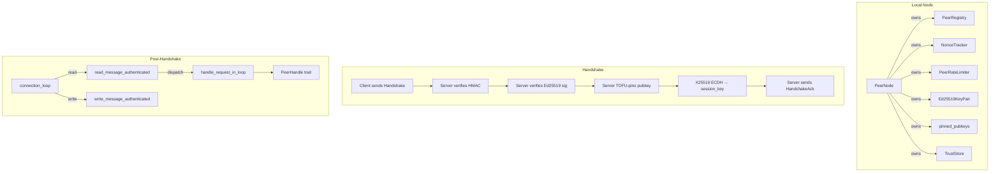
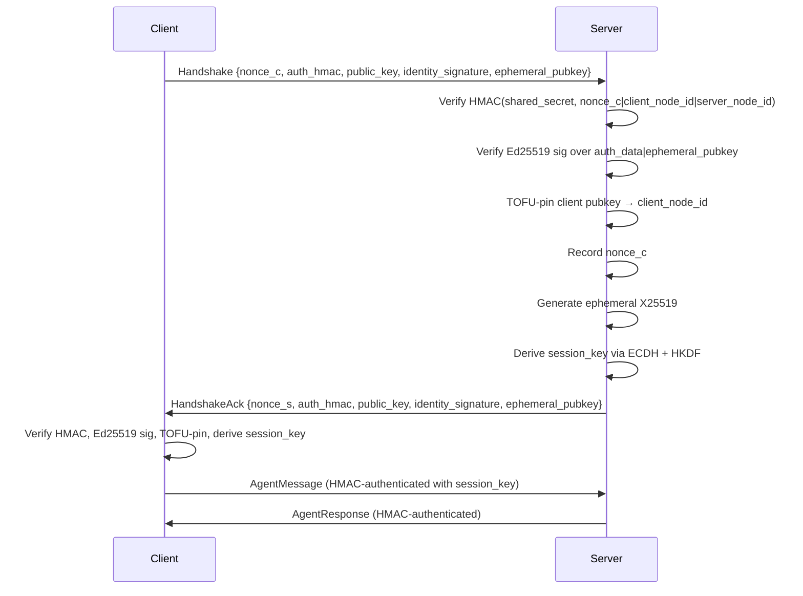

# Wire Protocol & Networking

# Wire Protocol & Networking (`librefang-wire`)

Inter-node TCP communication for LibreFang federation. Provides peer discovery, mutual authentication, agent message routing, and forward-secrecy key exchange over a JSON-framed binary protocol called OFP.

## Architecture Overview


```mermaid
graph TD
    subgraph "Local Node"
        PN[PeerNode] -->|owns| PR[PeerRegistry]
        PN -->|owns| NT[NonceTracker]
        PN -->|owns| RL[PeerRateLimiter]
        PN -->|owns| KP[Ed25519KeyPair]
        PN -->|owns| PP[pinned_pubkeys]
        PN -->|owns| TS[TrustStore]
    end

    subgraph "Handshake"
        H1[Client sends Handshake] --> H2[Server verifies HMAC]
        H2 --> H3[Server verifies Ed25519 sig]
        H3 --> H4[Server TOFU-pins pubkey]
        H4 --> H5[X25519 ECDH → session_key]
        H5 --> H6[Server sends HandshakeAck]
    end

    subgraph "Post-Handshake"
        CL[connection_loop] -->|read| RMA[read_message_authenticated]
        CL -->|write| WMA[write_message_authenticated]
        RMA -->|dispatch| HR[handle_request_in_loop]
        HR --> PH[PeerHandle trait]
    end
```

## Authentication Model

Two independent layers, both required:

**Layer 1 — Network admission (HMAC-SHA256).** Every handshake carries `auth_hmac = HMAC-SHA256(shared_secret, nonce|sender_node_id|recipient_node_id)`. The `recipient_node_id` binding prevents a captured handshake from being replayed against a different federation peer that shares the same `shared_secret` (#3875). This is the coarse "cluster password" gate.

**Layer 2 — Per-peer identity (Ed25519, #3873).** Every node persists an Ed25519 keypair in `<data_dir>/peer_keypair.json`. The handshake carries the sender's public key plus an Ed25519 signature over the auth-data string. Recipients verify the signature and TOFU-pin (`Trust On First Use`) the public key to the sender's `node_id`. Subsequent handshakes from the same `node_id` must present the same public key or are rejected.

A leaked `shared_secret` alone no longer enables identity impersonation — the attacker also needs the target node's private key. They can open a connection under a fresh `node_id` (admission is symmetric) but cannot pretend to be an existing identity.

Operators verify fingerprints out-of-band via `GET /api/network/status` (`identity_fingerprint`).

## Session Key Derivation

Post-handshake messages are authenticated with per-message HMAC under a session key. Two derivation paths exist:

### Modern path (X25519 ECDH, #4269)

When both peers include `ephemeral_pubkey` in the handshake:

1. Each side generates a fresh `EphemeralKex` (X25519 keypair)
2. Public halves are exchanged inside the handshake messages (covered by the Ed25519 signature, preventing MITM substitution)
3. Each side computes `shared_point = X25519(local_secret, remote_pubkey)`
4. `session_key = HKDF-SHA256(salt=handshake_transcript, ikm=shared_point, info=b"librefang-ofp/v1/session-key")`
5. The `EphemeralKex` is dropped — `StaticSecret` zeroizes on drop

Properties:
- **Forward secrecy** — ephemeral private keys are destroyed after handshake; future key leaks cannot decrypt recorded traffic
- **Independent of `shared_secret`** — stealing it no longer enables in-flight message forgery
- All-zero shared point is rejected (low-order public key attack)

### Legacy fallback

When either peer omits `ephemeral_pubkey` (backwards compatibility during rollout):

`session_key = HMAC-SHA256(shared_secret, our_nonce || their_nonce)`

### Handshake transcript

`handshake_transcript(client_nonce, server_nonce)` concatenates nonces in a fixed order (`client|server`) regardless of which side calls it. This ensures both peers derive identical salt even when the same ephemeral pair is reused across different sessions.

## Wire Framing

```
Unauthenticated frame:
┌──────────────┬────────────────────┐
│ 4 bytes BE   │ JSON body          │
│ msg length   │                    │
└──────────────┴────────────────────┘

Authenticated frame (post-handshake):
┌──────────────┬────────────────────┬──────────────────┐
│ 4 bytes BE   │ JSON body          │ 64-byte hex HMAC  │
│ frame length │                    │                   │
└──────────────┴────────────────────┴──────────────────┘
```

Maximum frame size: 16 MB (`MAX_MESSAGE_SIZE`). Agent message payloads are capped at 64 KiB (`MAX_PEER_MESSAGE_BYTES`) before reaching the LLM pipeline.

## Key Components

### `PeerNode` (`peer.rs`)

The central networking actor. Owns a TCP listener, performs handshakes, and runs per-connection dispatch loops.

**Construction:**
- `PeerNode::start(config, registry, handle)` — legacy, HMAC-only identity
- `PeerNode::start_with_identity(config, registry, handle, keypair, trust_store_dir)` — preferred, binds Ed25519 identity

Both return `(Arc<PeerNode>, JoinHandle<()>)`. The `JoinHandle` drives the accept loop.

**Inbound flow** (`accept_loop` → `handle_inbound`):
1. Accept TCP connection
2. Read `WireRequest::Handshake`
3. Verify HMAC, verify Ed25519 identity + TOFU pin, record nonce
4. Generate ephemeral X25519 (if client did), derive session key
5. Send `WireResponse::HandshakeAck`
6. Enter `connection_loop`

**Outbound flow** (`connect_to_peer_with_id` / `send_to_peer`):
1. Connect TCP
2. Generate nonce + ephemeral X25519
3. Send `WireRequest::Handshake`
4. Read `WireResponse::HandshakeAck`
5. Verify HMAC, verify identity, derive session key
6. Enter `connection_loop` (or send single `AgentMessage` + read response for `send_to_peer`)

### `PeerHandle` trait (`peer.rs`)

The kernel's integration point. The kernel implements these methods to route remote requests to local agents:

```rust
#[async_trait]
pub trait PeerHandle: Send + Sync + 'static {
    fn local_agents(&self) -> Vec<RemoteAgentInfo>;
    async fn handle_agent_message(&self, agent: &str, message: &str, sender: Option<&str>) -> Result<String, String>;
    fn discover_agents(&self, query: &str) -> Vec<RemoteAgentInfo>;
    fn uptime_secs(&self) -> u64;
}
```

### `EphemeralKex` (`kex.rs`)

Per-handshake X25519 keypair. Generate with `EphemeralKex::generate()`, extract the base64 public key with `public_b64()`, then consume with `derive_session_key(remote_pubkey_b64, transcript)` which performs ECDH + HKDF and returns a hex-encoded 32-byte key. The struct takes ownership of `self` to encourage immediate dropping.

### `Ed25519KeyPair` and `PeerKeyManager` (`keys.rs`)

- `Ed25519KeyPair` — in-memory signing/verification. `sign(data)` returns base64 signature. `fingerprint()` returns SHA-256 of the public key (for out-of-band comparison).
- `PeerKeyManager` — loads or generates the persisted keypair at `<data_dir>/peer_keypair.json`. Migrates PR-1 format files (missing `node_id`) by minting a UUID and rewriting. File permissions are tightened to 0600 on Unix.

### `NonceTracker` (`peer.rs`)

Prevents handshake replay. 5-minute sliding window, 100k entry cap, amortized GC (sweeps only at 80% capacity to avoid O(n) per-insertion cost that an unauthenticated attacker could trigger). Nonce recording happens **after** HMAC verification (#3880) so an attacker without `shared_secret` cannot fill the tracker.

### `PeerRateLimiter` (`peer.rs`)

Two independent per-peer limits for `AgentMessage` requests:
- **Message rate**: `max_messages_per_peer_per_minute` (default 60). Rejection returns HTTP 429.
- **Token budget**: `max_llm_tokens_per_peer_per_hour` (default: unlimited). Recorded after LLM call completion since token cost is unknown beforehand.

### `PeerRegistry` (`registry.rs`)

Concurrent peer/agent tracking. `DashMap`-backed; peers move between `Connected`/`Disconnected` states.

### `TrustedPeers` (`trusted_peers.rs`)

Persistent backing for TOFU pins. JSON file at `<data_dir>/trusted_peers.json`. Loaded at startup to hydrate the in-memory pin map; new pins are written through on first contact. In-memory pins are retained even if disk write fails (degrades gracefully).

### Message types (`message.rs`)

`WireMessage` envelope with `WireMessageKind` discriminated by `type` field:

| Kind | Tag | Variants |
|------|-----|----------|
| `Request` | `"type":"request"` | `Handshake`, `Discover`, `AgentMessage`, `Ping`, `Unknown` |
| `Response` | `"type":"response"` | `HandshakeAck`, `DiscoverResult`, `AgentResponse`, `Pong`, `Error`, `Unknown` |
| `Notification` | `"type":"notification"` | `AgentSpawned`, `AgentTerminated`, `ShuttingDown`, `Unknown` |

All enums use `#[serde(other)]` for forward compatibility (#3544) — unknown tags decode into `Unknown` variants so the TCP link stays alive across protocol version skew.

`classify_unknown()` peeks the raw JSON tag from the body and returns `UnknownTag { level, raw_tag }` for observability. The connection loop emits `wire::compat` warnings with the peer ID, message ID, and offending tag.

## Handshake Sequence


```mermaid
sequenceDiagram
    participant C as Client
    participant S as Server

    C->>S: Handshake {nonce_c, auth_hmac, public_key, identity_signature, ephemeral_pubkey}
    S->>S: Verify HMAC(shared_secret, nonce_c|client_node_id|server_node_id)
    S->>S: Verify Ed25519 sig over auth_data|ephemeral_pubkey
    S->>S: TOFU-pin client pubkey → client_node_id
    S->>S: Record nonce_c
    S->>S: Generate ephemeral X25519
    S->>S: Derive session_key via ECDH + HKDF
    S->>C: HandshakeAck {nonce_s, auth_hmac, public_key, identity_signature, ephemeral_pubkey}
    C->>C: Verify HMAC, Ed25519 sig, TOFU-pin, derive session_key
    C->>S: AgentMessage (HMAC-authenticated with session_key)
    S->>C: AgentResponse (HMAC-authenticated)
```

The Ed25519 identity signature scope covers `auth_data | "|" | ephemeral_pubkey` when an ephemeral is present (#4269), binding the ephemeral to the static identity. This prevents an active MITM from substituting their own ephemeral public key.

## Security Properties Summary

| Threat | Mitigation | Issue |
|--------|-----------|-------|
| `shared_secret` leak → impersonation | Ed25519 TOFU pinning | #3873 |
| Cross-node replay | HMAC binds `recipient_node_id` | #3875 |
| Handshake nonce replay | `NonceTracker`, 5-min window, post-HMAC recording | #3880 |
| Recorded traffic decryption | X25519 forward secrecy | #4269 |
| `shared_secret` leak → message forgery | ECDH-derived session key independent of `shared_secret` | #4269 |
| LLM budget drain by federated peer | `MAX_PEER_MESSAGE_BYTES`, `PeerRateLimiter` | #3876 |
| Low-order X25519 attack | All-zero shared point rejection | #4269 |
| Downgrade (Ed25519 → HMAC-only) | Rejected if TOFU pin exists for that node | #3873 |
| Protocol version skew | `serde(other)` Unknown variants, `wire::compat` logging | #3544 |
| TOFU pin map exhaustion | Hard cap at 100k entries | #3873 |

## Confidentiality Note

OFP frames are **plaintext** on the wire. Authentication, integrity, and replay protection are provided by this crate; confidentiality must come from the deployment layer (WireGuard, Tailscale, SSH tunnel, service-mesh mTLS). Do not add TLS inside this crate without re-evaluating the decision documented at the OFP wire architecture page (closed #3874, #4001).

## Configuration (`PeerConfig`)

| Field | Default | Description |
|-------|---------|-------------|
| `listen_addr` | `127.0.0.1:0` | TCP bind address (port 0 = OS-assigned) |
| `node_id` | Random UUID | Unique node identifier |
| `node_name` | `"librefang-node"` | Human-readable name |
| `shared_secret` | **required** | HMAC pre-shared key; OFP refuses to start if empty |
| `max_messages_per_peer_per_minute` | 60 | Per-peer `AgentMessage` rate limit; 0 = unlimited |
| `max_llm_tokens_per_peer_per_hour` | `None` | Per-peer hourly LLM token budget; `None` = unlimited |

## Extending the Protocol

**Adding a new request method:** Add a variant to `WireRequest` with `#[serde(rename = "method_name")]`. Handle it in `handle_request_in_loop`. The `Unknown` catch-all ensures older peers won't crash when receiving the new method — they'll log it under `wire::compat` and continue.

**Changing session key derivation:** Bump `HKDF_INFO` in `kex.rs`. Old and new clients will derive different keys and the handshake will fail cleanly rather than agreeing on a wrong key. The `ephemeral_pubkey` field is `Option<String>` on the wire; set it to `None` during rollout to fall back to the legacy path.

**Adding a new notification event:** Add a variant to `WireNotification`. No response is expected, so the dispatch is fire-and-forget. Unknown events from future peers land in `WireNotification::Unknown` with a `wire::compat` log.