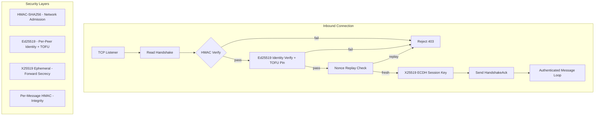

# Wire Protocol & P2P

# Wire Protocol & P2P (`librefang-wire`)

Agent-to-agent networking over TCP using a JSON-RPC framed protocol. Provides cross-machine discovery, authentication, and message dispatch between LibreFang kernel instances.

## Architecture Overview



## Authentication Model

Every connection requires two independent authentication layers:

### Layer 1: Network Admission (HMAC-SHA256)

Coarse "do you have the cluster password" gate. Both sides compute `HMAC-SHA256(shared_secret, nonce | sender_node_id | recipient_node_id)` and verify each other's value. The `recipient_node_id` binding prevents a captured handshake from being replayed against a *different* federation peer that shares the same `shared_secret` (#3875). Requires `shared_secret` in `[network]` config — OFP refuses to start without it.

### Layer 2: Per-Peer Identity (Ed25519, #3873)

Each node persists an Ed25519 keypair in `<data_dir>/peer_keypair.json` via `PeerKeyManager`. The handshake carries the sender's public key plus an Ed25519 signature over the same auth-data string the HMAC covers. Recipients verify the signature and TOFU-pin the public key to the sender's `node_id`. Subsequent handshakes claiming the same `node_id` must present the same public key or are rejected.

Net effect: a leaked `shared_secret` no longer lets an attacker impersonate a previously-pinned peer — they also need that node's private key. They can still connect under a fresh `node_id` (admission is symmetric) but cannot pretend to be an existing identity.

## Wire Confidentiality

OFP frames are **plaintext** on the wire. Authentication, integrity, and replay protection are provided in this crate; confidentiality must come from the deployment layer (WireGuard / Tailscale / SSH tunnel / service-mesh mTLS). Do not add TLS termination inside this crate without re-evaluating the decision documented at `docs.librefang.ai/architecture/ofp-wire` (#3874, #4001).

## Key Components

### `EphemeralKex` (`kex.rs`)

Per-handshake X25519 key exchange that provides forward secrecy (#4269). Both peers generate a fresh ephemeral keypair, exchange public halves inside the handshake messages (covered by the Ed25519 identity signature so MITM cannot substitute), then ECDH to produce a shared point. HKDF-SHA256 over that point yields the session key.

**Properties:**
- **Forward secrecy** — ephemeral private keys are dropped after handshake (`StaticSecret` zeroizes on drop). A future leak of `shared_secret` or static Ed25519 private key cannot decrypt recorded past traffic.
- **Decoupled from `shared_secret`** — the symmetric session key is independent. Stealing `shared_secret` bypasses the admission gate but cannot forge in-flight HMACs on sessions the attacker didn't actively MITM.
- **All-zero rejection** — the module explicitly rejects the all-zero X25519 shared point (low-order public key attack), which `x25519_dalek` does not reject by default.

**Backward compatibility:** `ephemeral_pubkey` is `Option<String>` on the wire. When either side omits it, the kernel falls back to `derive_session_key(shared_secret, nonces)`.

The HKDF info string `librefang-ofp/v1/session-key` is the protocol-versioning hook — change it on a breaking session-key derivation change so old and new clients cannot accidentally agree on a key.

### `Ed25519KeyPair` and `PeerKeyManager` (`keys.rs`)

Per-node Ed25519 identity. `PeerKeyManager` loads or generates the keypair from `<data_dir>/peer_keypair.json`, which stores both halves (base64) plus a `node_id` UUID. The `node_id` field was added in PR-3; files from PR-1 are automatically migrated by minting a fresh UUID and rewriting the file.

**Key methods:**
- `Ed25519KeyPair::generate()` — fresh keypair from OS CSPRNG
- `Ed25519KeyPair::sign(data)` — returns base64(64-byte signature)
- `verify_signature(public_key, data, signature)` — standalone verification
- `fingerprint_of_pubkey(public_key)` — SHA-256 of the base64 public key, hex-encoded, for out-of-band verification
- `PeerKeyManager::load_or_generate()` — idempotent load-or-create; cross-checks that the stored public key matches the private key seed (detects tampered files)

On Unix, the keypair file permissions are set to 0600 on write (best-effort, non-fatal).

### Wire Message Types (`message.rs`)

All communication uses JSON-framed messages over TCP with a 4-byte big-endian length prefix.

**Envelope:** `WireMessage { id, kind: WireMessageKind }`

**Message kinds:**
- `WireRequest::Handshake` — identity exchange; carries `node_id`, `agents`, `nonce`, `auth_hmac`, optional `public_key`/`identity_signature` (Ed25519), optional `ephemeral_pubkey` (X25519)
- `WireRequest::Discover` — agent search by query string
- `WireRequest::AgentMessage` — send text to a specific remote agent
- `WireRequest::Ping` — liveness check
- `WireResponse::HandshakeAck` — handshake acceptance with the same security fields
- `WireResponse::DiscoverResult` — list of matching `RemoteAgentInfo`
- `WireResponse::AgentResponse` — agent reply text
- `WireResponse::Pong` — uptime in seconds
- `WireResponse::Error` — error code + message
- `WireNotification` — one-way: `AgentSpawned`, `AgentTerminated`, `ShuttingDown`

**Forward compatibility:** All enums include `#[serde(other)] Unknown` arms. Unknown message types from newer protocol versions decode successfully so the TCP link stays alive (#3544). The `classify_unknown` function inspects the raw JSON to extract the unrecognized tag string for structured logging on the `wire::compat` target.

**Framing:** `encode_message` produces `[4-byte BE length][JSON]`. `decode_length` + `decode_message` parse it back. Maximum message size is 16 MB (`MAX_MESSAGE_SIZE`).

### `PeerNode` (`peer.rs`)

The local network endpoint. Binds a TCP listener, accepts incoming connections, performs handshakes, and enters message dispatch loops.

**Construction:** Use `PeerNode::start_with_identity(config, registry, handle, keypair, trust_store_dir)` for full Ed25519 identity, or `PeerNode::start(...)` for legacy HMAC-only mode.

**Handshake flow (outbound, `connect_to_peer_with_id`):**
1. Generate UUID nonce and X25519 ephemeral keypair
2. Compute `auth_data = "{nonce}|{our_node_id}|{recipient_node_id}"`
3. Sign `auth_data` (with ephemeral pubkey appended) using Ed25519
4. Send `WireRequest::Handshake` with HMAC, pubkey, signature, ephemeral
5. Read `HandshakeAck`, verify its HMAC, verify its Ed25519 identity, check nonce for replay
6. Derive session key via X25519 ECDH (or legacy fallback)
7. Enter authenticated message loop

**Handshake flow (inbound, `handle_inbound`):**
1. Read handshake, verify HMAC **before** recording nonce (#3880)
2. Verify Ed25519 identity, enforce TOFU pin
3. Record nonce (post-HMAC to prevent unauthenticated nonce flooding)
4. Generate server-side ephemeral (only if client sent one)
5. Send `HandshakeAck` with own HMAC, identity, ephemeral
6. Derive session key, enter authenticated message loop

**Security enforcement points:**
- Unauthenticated non-handshake messages are rejected with 401
- `MAX_PEER_MESSAGE_BYTES` (64 KiB) caps agent message payloads before they reach the LLM pipeline
- Non-replayable nonces: 5-minute window, 100k entry cap, amortized GC at 80% capacity
- Per-message HMAC on all post-handshake frames

### `NonceTracker`

Prevents handshake replay attacks. Uses `DashMap` for lock-free concurrent access. Nonces older than 5 minutes are garbage-collected. The map is capped at 100,000 entries to prevent unbounded growth. GC sweeps are amortized — they only trigger when the map reaches 80% capacity, avoiding an O(n) scan on every insert that an unauthenticated attacker could exploit.

### `PeerRateLimiter`

Per-peer rate limiting for `AgentMessage` requests (#3876):
- **Message rate:** max N messages per peer per minute (default 60)
- **Token budget:** optional cumulative LLM token cap per peer per hour

Both counters use `DashMap` for safe sharing across Tokio tasks. Message rate is checked before work begins; token budget is recorded after the LLM turn completes (cost is unknown beforehand).

### TOFU Pin Map

`PeerNode` maintains an in-memory `HashMap<String, String>` mapping `node_id → base64 public key`. Bounded at `MAX_PIN_ENTRIES` (100,000). When a `trust_store_dir` is provided, every new pin is also persisted via `TrustedPeers` so pins survive restarts.

**Pin behavior:**
- First contact with `(Some(pk), Some(sig))`: pin `pk` to `node_id`
- Subsequent contact with same `node_id` but different `pk`: reject (mismatch)
- `(None, None)` from a node that previously presented identity: reject (downgrade attack)
- `(Some, None)` or `(None, Some)`: reject (partial fields)

### Session Key Derivation

Two paths, selected by whether both peers provided an ephemeral X25519 public key:

1. **ECDH path** (`EphemeralKex::derive_session_key`): X25519 Diffie-Hellman → HKDF-SHA256 with `handshake_transcript(client_nonce, server_nonce)` as salt and `librefang-ofp/v1/session-key` as info. Result is hex(32 bytes).

2. **Legacy path** (`derive_session_key`): `HMAC-SHA256(shared_secret, our_nonce || their_nonce)`. Used for backward compatibility with peers that don't send `ephemeral_pubkey`.

The `handshake_transcript` function concatenates `client_nonce|server_nonce` in fixed order (client first, server second) regardless of which side calls it.

### Per-Message Authentication

Post-handshake messages use an extended frame format: `[4-byte BE length][JSON body][64-byte hex HMAC]`. The HMAC covers the JSON body using the session key. Both `write_message_authenticated` and `read_message_authenticated_observed` handle this format. HMAC comparison uses constant-time equality via `subtle::ConstantTimeEq`.

### `PeerHandle` Trait

The kernel implements this trait to handle incoming remote requests:
- `local_agents()` — return agent list for handshake/discovery
- `handle_agent_message(agent, message, sender)` — route to local agent, return response
- `discover_agents(query)` — search local agents
- `uptime_secs()` — node uptime

### Identity Fingerprint Verification

`PeerNode::identity_fingerprint()` returns the SHA-256 fingerprint of this node's Ed25519 public key (or `None` in HMAC-only mode). Operators compare this out-of-band with the remote peer via `GET /api/network/status` (`identity_fingerprint` field) before trusting a TOFU pin.

`PeerNode::list_pinned_peers()` returns all `(node_id, public_key, fingerprint)` triples sorted by node ID for the `GET /api/network/trusted-peers` endpoint.

## Wire Format Examples

**Handshake (request):**
```json
{
  "id": "uuid",
  "type": "request",
  "method": "handshake",
  "node_id": "node-abc",
  "node_name": "my-kernel",
  "protocol_version": 1,
  "agents": [{"id": "...", "name": "coder", "description": "...", "tags": [], "tools": [], "state": "running"}],
  "nonce": "uuid",
  "auth_hmac": "hex-hmac",
  "public_key": "base64-ed25519-pubkey",
  "identity_signature": "base64-ed25519-sig",
  "ephemeral_pubkey": "base64-x25519-pubkey"
}
```

**Authenticated frame (post-handshake):**
```
[00 00 01 2C]  (4-byte BE length = 300)
[...JSON body...]
[...64 hex chars of HMAC-SHA256(session_key, JSON body)...]
```

## Error Handling

`WireError` covers IO, JSON parse failures, handshake failures (HMAC/identity/replay/nonce-cap), connection closure, oversized messages, and protocol version mismatches. Errors during persistence of trust pins are logged but do not roll back in-memory pins — the in-memory mismatch check remains functional even if disk writes fail.

## Configuration

`PeerConfig` fields relevant to wire protocol behavior:

| Field | Default | Description |
|-------|---------|-------------|
| `listen_addr` | `127.0.0.1:0` | TCP bind address |
| `shared_secret` | (required) | HMAC admission key — OFP refuses to start if empty |
| `max_messages_per_peer_per_minute` | 60 | Per-peer AgentMessage rate limit; 0 disables |
| `max_llm_tokens_per_peer_per_hour` | None | Per-peer cumulative LLM token budget; None disables |

## Dependencies on External Crates

- `x25519_dalek` — X25519 ECDH
- `ed25519_dalek` — Ed25519 signing/verification
- `hkdf` + `sha2` — HKDF-SHA256 for session key derivation
- `hmac` — HMAC-SHA256 for admission gate and per-message integrity
- `dashmap` — concurrent maps for nonce tracker, rate limiter, pin map
- `subtle` — constant-time comparison for HMAC verification