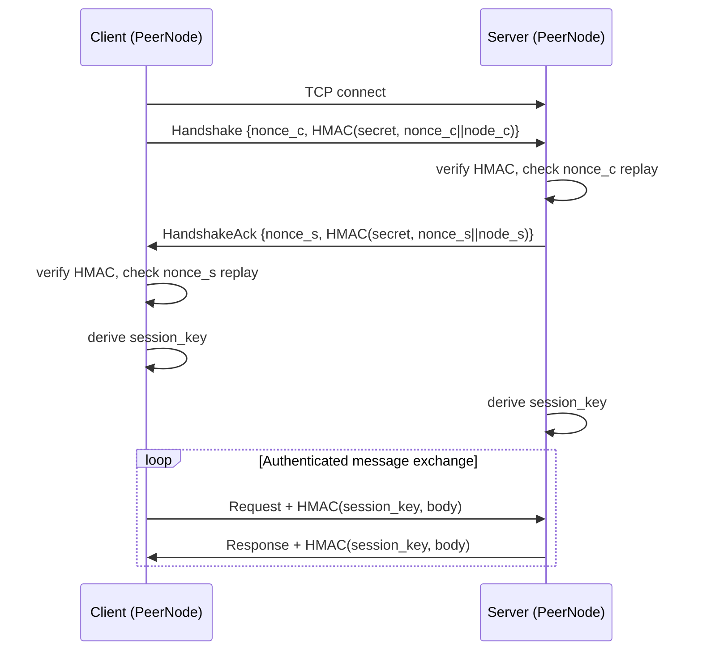

# Wire Protocol

# Wire Protocol (`librefang-wire`)

Agent-to-agent networking over TCP using the LibreFang Wire Protocol (OFP). Enables cross-machine discovery, authentication, and message routing between LibreFang kernels.

## Wire Format

Every message on the wire uses a length-prefixed JSON frame:

```
┌────────────────────┬──────────────────────────┐
│  4 bytes (BE u32)  │     JSON payload          │
│  length of payload │     (WireMessage)         │
└────────────────────┴──────────────────────────┘
```

After the HMAC handshake completes, post-handshake frames append a 64-character hex HMAC:

```
┌──────────┬──────────────┬─────────────────────┐
│ 4B len   │  JSON body   │  64-byte hex HMAC   │
│ (total)  │              │  HMAC(key, body)     │
└──────────┴──────────────┴─────────────────────┘
```

The length field covers both the JSON body and the trailing HMAC. Maximum message size is 16 MB (`MAX_MESSAGE_SIZE`).

Encoding/decoding is handled by `encode_message`, `decode_length`, and `decode_message` in the `message` module. The `peer` module provides async I/O wrappers: `write_message`, `read_message`, `write_message_authenticated`, and `read_message_authenticated`.

## Authentication & Security Model

OFP mandates authentication — it refuses to start without a configured `shared_secret`. The protocol has three layers of protection:

### 1. HMAC Handshake

Every connection begins with a mutual HMAC-authenticated handshake. Both sides generate a random nonce and compute:

```
HMAC-SHA256(shared_secret, nonce || node_id)
```

The initiator sends a `Handshake` request containing its nonce and HMAC. The responder verifies the HMAC, checks the nonce for replay, then replies with a `HandshakeAck` containing its own nonce and HMAC. The initiator then verifies that response.

Any connection that sends a non-`Handshake` message as its first frame is rejected with a `401` error and the connection is dropped.

### 2. Nonce Replay Protection

`NonceTracker` records every nonce seen within a 5-minute sliding window. It uses `DashMap::entry` for atomic check-and-insert, preventing TOCTOU races where concurrent connections could both pass a `contains_key` check before either inserts. The tracker has a hard cap of 100,000 entries — under flood conditions it fails closed rather than growing unbounded.

### 3. Per-Session and Per-Message HMAC

After the handshake, both sides derive a session key:

```rust
session_key = HMAC-SHA256(shared_secret, client_nonce || server_nonce)
```

Nonce order matters — the client's nonce comes first regardless of which side is computing the key. All subsequent messages on that connection are framed with a trailing HMAC over the JSON body, verified on read. Tampered or forged messages are rejected.

## Connection Lifecycle



### Inbound connections (accept loop)

`PeerNode::start` binds a `TcpListener` and spawns an accept loop. For each incoming connection, `handle_inbound` reads the handshake, verifies the HMAC and nonce, sends a `HandshakeAck`, derives the session key, then enters the `connection_loop`.

### Outbound connections

`connect_to_peer` opens a TCP connection, sends a handshake, verifies the `HandshakeAck`, and spawns a background task running `connection_loop`. The remote peer is registered in the local `PeerRegistry`.

`send_to_peer` is a one-shot variant: it opens a connection, performs the full handshake, sends a single `AgentMessage`, reads the response, and closes. It does not keep the connection alive.

## Message Types

The `WireMessage` envelope carries a unique `id` and a `WireMessageKind`:

| Kind | Tag | Description |
|------|-----|-------------|
| `WireRequest::Handshake` | `"handshake"` | Initial authentication exchange |
| `WireRequest::Discover` | `"discover"` | Query remote agents by name/tag/description |
| `WireRequest::AgentMessage` | `"agent_message"` | Send text to a remote agent, receive response |
| `WireRequest::Ping` | `"ping"` | Liveness check |
| `WireResponse::HandshakeAck` | `"handshake_ack"` | Accept handshake, exchange identity |
| `WireResponse::DiscoverResult` | `"discover_result"` | List of matching agents |
| `WireResponse::AgentResponse` | `"agent_response"` | Agent's text reply |
| `WireResponse::Pong` | `"pong"` | Liveness reply with uptime |
| `WireResponse::Error` | `"error"` | Error with code and message |
| `WireNotification::AgentSpawned` | `"agent_spawned"` | New agent available on peer |
| `WireNotification::AgentTerminated` | `"agent_terminated"` | Agent no longer available |
| `WireNotification::ShuttingDown` | `"shutting_down"` | Peer is going offline |

All types use `#[serde(tag = "...")]` for discriminant serialization — requests use `"method"`, responses use `"method"`, and notifications use `"event"`. The outer `WireMessageKind` uses `#[serde(tag = "type")]`.

Agent metadata is carried in `RemoteAgentInfo`: `id`, `name`, `description`, `tags`, `tools`, and `state`.

## PeerNode

`PeerNode` is the main networking entry point. It owns the listener, configuration, registry reference, nonce tracker, and session key state.

### Creation

```rust
let (node, task_handle) = PeerNode::start(config, registry, handle).await?;
```

`start` validates that `shared_secret` is non-empty, binds the listener, and spawns the accept loop. It returns an `Arc<PeerNode>` and the `JoinHandle` for the accept task.

### Key methods

| Method | Purpose |
|--------|---------|
| `local_addr()` | Returns the actual bound address (useful when binding to port 0) |
| `node_id()` | This node's unique identifier |
| `registry()` | Access the `PeerRegistry` |
| `connect_to_peer(addr, handle)` | Establish outbound connection with full handshake |
| `send_to_peer(node_id, agent, message, sender, handle)` | One-shot agent message to a known peer |

## PeerHandle Trait

The kernel implements `PeerHandle` to bridge the wire protocol with local agent infrastructure:

```rust
#[async_trait]
pub trait PeerHandle: Send + Sync + 'static {
    fn local_agents(&self) -> Vec<RemoteAgentInfo>;
    async fn handle_agent_message(&self, agent: &str, message: &str, sender: Option<&str>) -> Result<String, String>;
    fn discover_agents(&self, query: &str) -> Vec<RemoteAgentInfo>;
    fn uptime_secs(&self) -> u64;
}
```

- `local_agents` — called during handshake and discovery to advertise this node's agents
- `handle_agent_message` — routes incoming remote messages to local agents
- `discover_agents` — searches local agents matching a query string (name, tags, description)
- `uptime_secs` — included in `Pong` responses

## PeerRegistry

Thread-safe (`RwLock<HashMap<...>>`) store for known peers. Thread safety is managed internally — consumers receive `Clone` copies of `PeerEntry` values.

### Peer states

- **Connected** — handshake completed, eligible for message routing
- **Disconnected** — connection lost, entry retained for reconnection

Disconnected peers are excluded from `find_agents` and `connected_peers` but remain in `all_peers`.

### Agent management

The registry tracks agents per-peer. `find_agents` searches across all connected peers, matching against name, tags, and description (case-insensitive). Results are returned as `RemoteAgent` structs pairing the agent info with the owning `peer_node_id`.

`add_agent` and `remove_agent` support incremental updates driven by `AgentSpawned` / `AgentTerminated` notifications received in the connection loop.

### Key methods

| Method | Returns |
|--------|---------|
| `add_peer(entry)` | Register/update a peer |
| `remove_peer(node_id)` | Remove entirely |
| `mark_disconnected(node_id)` | Set state without removing |
| `mark_connected(node_id)` | Restore to connected |
| `get_peer(node_id)` | Single peer snapshot |
| `connected_peers()` | All peers in Connected state |
| `find_agents(query)` | Cross-peer agent search |
| `all_remote_agents()` | Every agent on every connected peer |
| `connected_count()` / `total_count()` | Counts |

## Broadcasting

`broadcast_notification` sends a one-shot notification to all connected peers. For each peer it opens a fresh TCP connection, derives a per-message key from the shared secret and a fresh nonce, writes the authenticated message, and closes. Failures are collected and returned — the caller decides how to handle them.

## Integration Points

The kernel (`src/kernel/mod.rs`) calls `start_ofp_node` to create a `PeerNode` with a `PeerConfig` populated from the application configuration. The kernel implements `PeerHandle` to route wire messages into the local agent system.

The HTTP API exposes network status through `src/routes/network.rs`, reading `registry().connected_count()`, `total_count()`, `local_addr()`, and `all_peers()`. The WebSocket layer (`librefang-api/src/ws`) also reads `all_peers()` for channel bridge output.