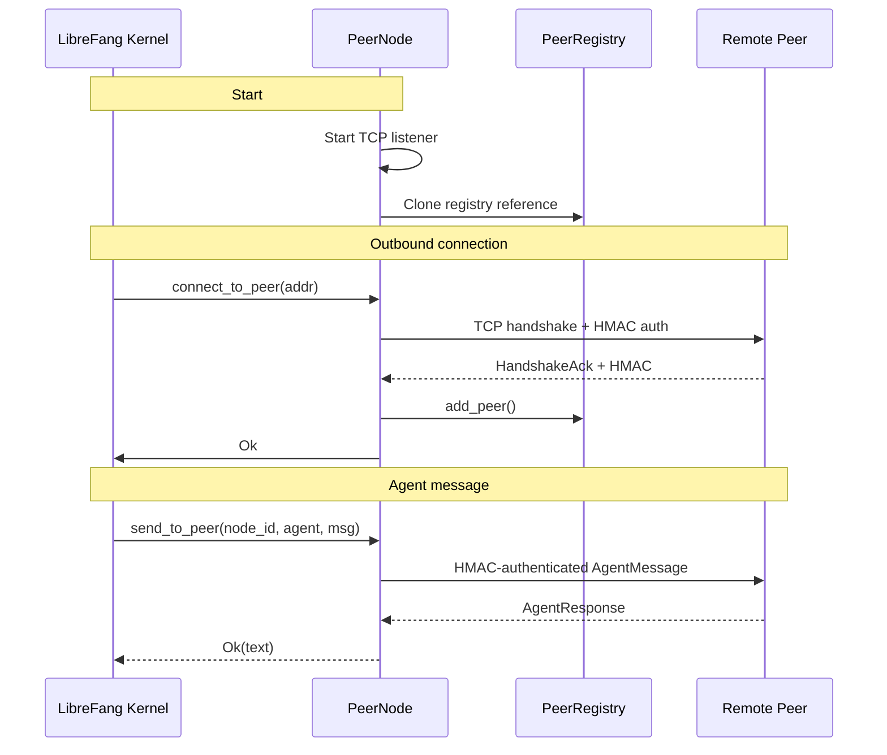

# Wire Protocol

# LibreFang Wire Protocol (OFP)

The `librefang-wire` crate implements **OFP** (OpenFang Protocol), LibreFang's agent-to-agent networking layer. It provides cross-machine peer discovery, HMAC-authenticated handshake, and reliable message exchange over TCP connections.

## Overview

OFP enables LibreFang kernels to:

- **Discover agents** running on remote peers via text queries
- **Route messages** to specific agents on remote machines
- **Track peer state** and their advertised agents in real-time
- **Broadcast notifications** when agents spawn, terminate, or the peer shuts down

All communication uses JSON-framed messages over TCP with HMAC-SHA256 authentication and replay-attack protection.

## Architecture



### Component Responsibilities

| Component | Responsibility |
|-----------|----------------|
| `PeerNode` | TCP listener, inbound/outbound connections, message dispatch |
| `PeerRegistry` | Thread-safe storage for known peers and their agents |
| `PeerHandle` | Trait bridging wire protocol to the kernel's agent runtime |
| `WireMessage` | JSON-enveloped protocol messages with typed variants |

## Message Protocol

### Framing

Every message on the wire follows this format:

```
[4-byte big-endian length][JSON body][64-byte HMAC (post-handshake only)]
```

The 4-byte length prefix indicates the total frame size. During authenticated sessions (post-handshake), a 64-character hex HMAC follows the JSON body.

### Message Types

#### Requests

| Method | Purpose |
|--------|---------|
| `handshake` | Exchange identity, protocol version, and agent list with HMAC auth |
| `discover` | Search remote peers for agents matching a query |
| `agent_message` | Send a message to a specific agent and await a response |
| `ping` | Liveness check |

#### Responses

| Method | Purpose |
|--------|---------|
| `handshake_ack` | Acknowledge successful handshake, return identity and agents |
| `discover_result` | Return agents matching a discovery query |
| `agent_response` | Agent's reply to an `agent_message` |
| `pong` | Liveness response with uptime |
| `error` | Generic error with code and message |

#### Notifications (one-way)

| Event | Trigger |
|-------|---------|
| `agent_spawned` | New agent started on the peer |
| `agent_terminated` | Agent terminated on the peer |
| `shutting_down` | Peer is going offline |

### Example: Discovery Flow

```json
// Request
{"id": "req-1", "type": "request", "method": "discover", "query": "coder"}

// Response
{"id": "req-1", "type": "response", "method": "discover_result", "agents": [
  {"id": "a1", "name": "coder", "description": "Coding assistant", "tags": ["code"], "tools": ["file_write"], "state": "running"}
]}
```

## PeerNode

`PeerNode` is the central actor — it binds a TCP socket, accepts inbound connections, and initiates outbound connections to known peers.

### Starting a PeerNode

```rust
use librefang_wire::{PeerConfig, PeerNode, PeerRegistry};

let config = PeerConfig {
    listen_addr: "0.0.0.0:0".parse()?,
    node_id: "my-kernel-1".to_string(),
    node_name: "production-kernel".to_string(),
    shared_secret: "...".to_string(), // Required
};

let registry = PeerRegistry::new();
let handle: Arc<dyn PeerHandle> = /* your implementation */;

let (node, accept_task) = PeerNode::start(config, registry, handle).await?;
println!("Listening on {}", node.local_addr());
```

### Connecting to a Peer

```rust
node.connect_to_peer(remote_addr, handle.clone()).await?;
```

### Sending Messages to Remote Agents

```rust
let response = node
    .send_to_peer("node-id-of-remote", "coder", "Write a function", None, handle.clone())
    .await?;
```

## PeerHandle Trait

The `PeerHandle` trait abstracts the kernel's agent runtime, allowing the wire protocol to route messages to local agents:

```rust
use async_trait::async_trait;
use librefang_wire::{PeerHandle, RemoteAgentInfo};

struct MyHandle;

#[async_trait]
impl PeerHandle for MyHandle {
    fn local_agents(&self) -> Vec<RemoteAgentInfo> {
        // Return agents available on this kernel
    }

    async fn handle_agent_message(
        &self,
        agent: &str,
        message: &str,
        sender: Option<&str>,
    ) -> Result<String, String> {
        // Route message to local agent, return response
    }

    fn discover_agents(&self, query: &str) -> Vec<RemoteAgentInfo> {
        // Search local agents matching query
    }

    fn uptime_secs(&self) -> u64 {
        // Return node uptime for Pong
    }
}
```

## PeerRegistry

`PeerRegistry` is a thread-safe, concurrent registry tracking all known peers and their advertised agents:

```rust
use librefang_wire::{PeerRegistry, PeerEntry, PeerState};

// Add a peer after successful handshake
registry.add_peer(PeerEntry { ... });

// Mark peer disconnected (retains entry for reconnect)
registry.mark_disconnected("node-id");

// Find agents across all connected peers
let agents = registry.find_agents("coder");

// Iterate all remote agents
for remote in registry.all_remote_agents() {
    println!("{} on {}: {}", remote.info.name, remote.peer_node_id, remote.info.description);
}
```

### Agent Discovery

The registry searches across connected peers' agent name, description, and tags:

```rust
// Returns RemoteAgent { peer_node_id, info }
let coders = registry.find_agents("code"); // Matches "coder", "code-reviewer", etc.
```

## Security

OFP implements defense-in-depth with multiple authentication layers:

### Handshake Authentication

On connection establishment, both parties perform mutual HMAC-SHA256 authentication:

```
1. Each party generates a random nonce (UUID)
2. Compute HMAC = HMAC-SHA256(shared_secret, nonce + node_id)
3. Exchange handshakes containing: node_id, node_name, protocol_version, agents, nonce, auth_hmac
4. Verify the peer's HMAC using their nonce + our node_id
```

### Replay Attack Prevention

`NonceTracker` maintains a 5-minute sliding window of seen nonces. Any nonce reused within the window is rejected as a replay attempt:

```rust
let tracker = NonceTracker::new();
tracker.check_and_record("unique-nonce-123")?; // Ok
tracker.check_and_record("unique-nonce-123")?; // Err: "Nonce replay detected"
```

### Per-Session Key Derivation

After successful handshake, both parties derive a unique session key:

```rust
let session_key = derive_session_key(shared_secret, our_nonce, their_nonce);
// Result: HMAC-SHA256(shared_secret, our_nonce + their_nonce)
```

### Per-Message Authentication

Post-handshake messages include a 64-byte HMAC appended to the frame:

```
[4-byte length][JSON body][64-byte HMAC]
```

The HMAC covers only the JSON body, preventing tampering or forgery of individual messages.

### Constant-Time Comparison

HMAC verification uses `subtle::ConstantTimeEq` to prevent timing attacks:

```rust
fn hmac_verify(secret: &str, data: &[u8], signature: &str) -> bool {
    let expected = hmac_sign(secret, data);
    subtle::ConstantTimeEq::ct_eq(expected.as_bytes(), signature.as_bytes()).into()
}
```

### Rejecting Unauthenticated Requests

Any message received before a successful handshake is rejected with HTTP 401-equivalent error:

```rust
WireResponse::Error { code: 401, message: "Authentication required: complete HMAC handshake first" }
```

## Integration Points

### Used By

| Module | Usage |
|--------|-------|
| `librefang-api` | Network status endpoints, WebSocket command routing |
| `librefang-desktop` | Desktop server initialization |
| `librefang-runtime` | OAuth flows, MCP server, telemetry |
| `librefang-cli` | Tracing initialization |

### Key Methods Consumed

From `PeerNode`:
- `local_addr()` — Get bound TCP address
- `node_id()` — Get this node's unique ID
- `registry()` — Access the peer registry

From `PeerRegistry`:
- `connected_count()` / `total_count()` — Peer counts
- `all_peers()` / `connected_peers()` — Peer listings
- `find_agents()` / `all_remote_agents()` — Agent discovery

## Configuration

OFP requires a shared secret for HMAC authentication. Configure via `config.toml`:

```toml
[network]
shared_secret = "your-256-bit-pre-shared-key"
```

The protocol refuses to start without a configured secret.

## Error Handling

| Error | Meaning |
|-------|---------|
| `Io` | TCP socket error |
| `Json` | Malformed message body |
| `HandshakeFailed` | Authentication or protocol error during handshake |
| `ConnectionClosed` | Peer closed the connection |
| `MessageTooLarge` | Frame exceeds 16 MB limit |
| `VersionMismatch` | Protocol version incompatibility |

## Limits

| Limit | Value |
|-------|-------|
| Maximum message size | 16 MB |
| Nonce replay window | 5 minutes |
| Protocol version | 1 |