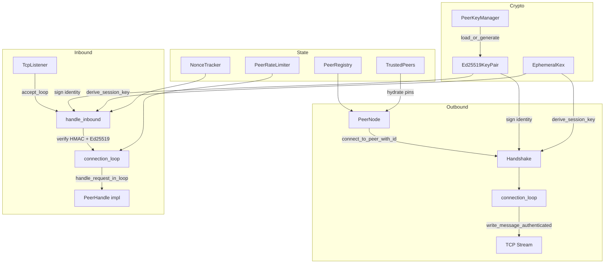
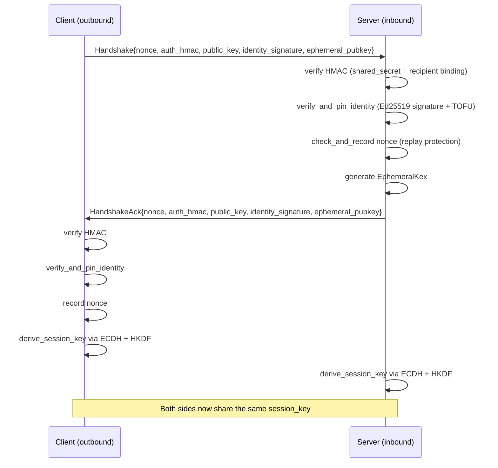

# Wire Protocol

# Wire Protocol (`librefang-wire`)

Agent-to-agent networking for LibreFang kernel federation. Provides cross-machine discovery, authentication, and communication over TCP using a length-prefixed JSON-RPC framed protocol.

## Architecture


```mermaid
graph TD
    subgraph "Outbound"
        A[PeerNode] -->|connect_to_peer_with_id| B[Handshake]
        B --> C[connection_loop]
        C -->|write_message_authenticated| D[TCP Stream]
    end
    subgraph "Inbound"
        E[TcpListener] -->|accept_loop| F[handle_inbound]
        F -->|verify HMAC + Ed25519| G[connection_loop]
        G -->|handle_request_in_loop| H[PeerHandle impl]
    end
    subgraph "Crypto"
        I[Ed25519KeyPair] -->|sign identity| B
        I -->|sign identity| F
        J[EphemeralKex] -->|derive_session_key| B
        J -->|derive_session_key| F
        K[PeerKeyManager] -->|load_or_generate| I
    end
    subgraph "State"
        L[PeerRegistry] --> A
        M[NonceTracker] --> F
        N[PeerRateLimiter] --> G
        O[TrustedPeers] -->|hydrate pins| A
    end
```

## Authentication Model

Every OFP connection requires a handshake that enforces two independent authentication layers:

### Layer 1 — Network Admission (HMAC-SHA256)

The `shared_secret` (set in `[network] shared_secret` in `config.toml`) acts as a cluster-wide password. During the handshake, each side computes:

```
HMAC-SHA256(shared_secret, nonce | sender_node_id | recipient_node_id)
```

The `recipient_node_id` binding (#3875) prevents a captured handshake from being replayed against a *different* federation peer that shares the same `shared_secret`.

### Layer 2 — Per-Peer Identity (Ed25519, #3873)

Each node persists an Ed25519 keypair in `<data_dir>/peer_keypair.json` via `PeerKeyManager`. The handshake carries the sender's public key plus an Ed25519 signature over the auth-data scope. Recipients verify the signature and TOFU-pin the public key to the sender's `node_id`. Subsequent handshakes claiming the same `node_id` must present the same public key or are rejected.

This means a leaked `shared_secret` no longer lets an attacker impersonate a previously-pinned peer — they would also need that node's private key file.

### Forward Secrecy (X25519 ECDH, #4269)

Each handshake generates a fresh X25519 keypair via `EphemeralKex`. Both peers exchange public halves inside the handshake messages (covered by the Ed25519 signature so an active MITM cannot substitute their own key). The session key is then derived via HKDF-SHA256 over the ECDH shared point, completely independent of `shared_secret`.

The ephemeral private keys are dropped after the handshake (`StaticSecret` zeroizes on drop), so future compromise of `shared_secret` or static Ed25519 keys cannot decrypt recorded past traffic.

### Backward Compatibility

All identity and KEX fields are `Option<String>` on the wire. When either side omits them, the connection falls back to legacy HMAC-only authentication or the old `derive_session_key(shared_secret, nonces)` derivation path. This allows rolling federation upgrades without breaking existing peers.

## Wire Format

All communication uses length-prefixed JSON over TCP:

```
[4 bytes: big-endian length][JSON body]
```

Post-handshake messages append a 64-character hex HMAC:

```
[4 bytes: big-endian length][JSON body][64 hex chars: HMAC-SHA256(session_key, JSON body)]
```

Maximum message size is 16 MB (`MAX_MESSAGE_SIZE`). Agent message payloads are capped at 64 KiB (`MAX_PEER_MESSAGE_BYTES`) to prevent a federated peer from draining the receiver's LLM budget.

## Key Types

### `WireMessage` — Envelope

Top-level wrapper containing a unique `id` and a `WireMessageKind` discriminated by a `"type"` JSON tag: `"request"`, `"response"`, `"notification"`, or an unknown forward-compat fallback.

### `WireRequest` — Request Methods

Tagged by `"method"` field:

| Method | Purpose | Security Notes |
|--------|---------|---------------|
| `handshake` | Exchange identity, negotiate session | Must be the first message on any connection |
| `discover` | Search remote agents by query | Requires completed handshake |
| `agent_message` | Send a message to a remote agent | Rate-limited per peer; payload capped at 64 KiB |
| `ping` | Liveness check | — |

### `WireResponse` — Response Methods

Includes `handshake_ack`, `discover_result`, `agent_response`, `pong`, and `error`.

### `WireNotification` — One-Way Events

`agent_spawned`, `agent_terminated`, `shutting_down`. No response expected.

### Forward Compatibility (#3544)

All enums include `#[serde(other)]` `Unknown` arms. Unknown message types decode successfully so the TCP link stays alive during protocol version skew. `classify_unknown()` inspects the raw JSON to extract the unrecognized tag for structured logging on the `wire::compat` target, giving operators visibility into which peer is sending unknown variants.

## Key Components

### `PeerNode` — TCP Endpoint

Binds a local `TcpListener` and manages both inbound and outbound connections. Constructed via `start_with_identity()`:

```rust
let (node, accept_handle) = PeerNode::start_with_identity(
    config,           // PeerConfig with listen_addr, shared_secret, rate limits
    registry,         // PeerRegistry for tracking connected peers
    handle,           // Arc<dyn PeerHandle> — kernel's request handler
    Some(keypair),    // Option<Ed25519KeyPair> — None for legacy HMAC-only mode
    Some(data_dir),   // Trust store directory for persistent TOFU pins
).await?;
```

**Connection lifecycle:**

1. **Handshake** — Both sides exchange nonces, HMAC auth, Ed25519 identity, and X25519 ephemeral pubkeys
2. **Session key derivation** — ECDH + HKDF when both peers provided ephemeral keys; legacy `HMAC(shared_secret, nonces)` otherwise
3. **Message loop** — Per-message HMAC verification; requests dispatched to `PeerHandle`; notifications update the `PeerRegistry`

### `PeerHandle` — Kernel Integration Point

Trait implemented by the kernel to handle incoming remote requests:

```rust
#[async_trait]
pub trait PeerHandle: Send + Sync + 'static {
    fn local_agents(&self) -> Vec<RemoteAgentInfo>;
    async fn handle_agent_message(&self, agent: &str, message: &str, sender: Option<&str>) -> Result<String, String>;
    fn discover_agents(&self, query: &str) -> Vec<RemoteAgentInfo>;
    fn uptime_secs(&self) -> u64;
}
```

### `PeerKeyManager` — Identity Persistence

Loads or generates an Ed25519 keypair at `<data_dir>/peer_keypair.json`. The file stores both the keypair and a stable `node_id` (UUID) so daemon restarts resume under the same identity. Key properties:

- **Cross-checks** the stored public key against the re-derived public key on load — tampered files are rejected
- **Migrates** PR-1 files (no `node_id` field) by minting a UUID and rewriting the file
- **File permissions** tightened to 0600 on Unix (best-effort, non-fatal)
- The private key seed is `#[serde(skip)]` on `Ed25519KeyPair` itself — persistence goes through `PersistedKeyPair` to avoid the bug where the private key was silently dropped during serialization

### `EphemeralKex` — Per-Handshake Key Exchange

Generates a fresh X25519 keypair via `EphemeralKex::generate()`. After both peers exchange public keys:

```rust
let transcript = handshake_transcript(client_nonce, server_nonce); // deterministic order
let session_key = our_kex.derive_session_key(remote_pubkey_b64, &transcript)?;
```

`handshake_transcript()` concatenates `client_nonce + "|" + server_nonce` in fixed order (client first, server second, regardless of which side is calling) to produce the HKDF salt. The HKDF info string `b"librefang-ofp/v1/session-key"` serves as a protocol versioning hook — changing it prevents old and new clients from accidentally agreeing on a key.

### `NonceTracker` — Replay Protection

Time-windowed (5-minute) tracker using `DashMap` with amortized garbage collection. The `check_and_record()` method atomically checks for duplicates and inserts new nonces in a single `DashMap::entry()` call, avoiding TOCTOU races between concurrent handshakes.

**DoS mitigation:** GC sweeps only run when the map reaches 80% of the 100k entry cap, preventing an unauthenticated attacker from forcing O(n) full-map scans on every connection attempt. Hard cap at 100k entries causes the tracker to fail closed under flood.

**Ordering invariant (#3880):** Nonces are recorded *after* HMAC verification, not before. This prevents an attacker who doesn't know `shared_secret` from filling nonce capacity.

### `PeerRateLimiter` — Per-Peer Resource Protection (#3876)

Two independent limits enforced per authenticated peer:

| Limit | Default | Scope |
|-------|---------|-------|
| Message rate | 60/min | `AgentMessage` requests per peer |
| Token budget | None | Cumulative LLM tokens per peer per hour |

Message rate is checked *before* any LLM work. Token budget is recorded *after* the LLM turn completes (cost is unknown beforehand). Both use rolling time windows stored in `DashMap`.

### `TrustedPeers` — Persistent TOFU Pin Store

On-disk backing for the in-memory pin map at `<data_dir>/trusted_peers.json`. Hydrated at startup via `PeerNode::start_with_identity()`. New pins are written to disk after being accepted in-memory; disk write failures are logged but do not roll back the in-memory pin.

The in-memory map is capped at `MAX_PIN_ENTRIES` (100k). Once full, new pins are refused but existing mismatch-detection continues working.

### `PeerRegistry` — Connected Peer State

Thread-safe registry (backed by `DashMap`) tracking connected peers, their agents, and connection state. Used by `PeerNode` for lookups during `send_to_peer()` and `broadcast_notification()`.

## Handshake Execution Flow


```mermaid
sequenceDiagram
    participant C as Client (outbound)
    participant S as Server (inbound)
    C->>S: Handshake{nonce, auth_hmac, public_key, identity_signature, ephemeral_pubkey}
    S->>S: verify HMAC (shared_secret + recipient binding)
    S->>S: verify_and_pin_identity (Ed25519 signature + TOFU)
    S->>S: check_and_record nonce (replay protection)
    S->>S: generate EphemeralKex
    S->>C: HandshakeAck{nonce, auth_hmac, public_key, identity_signature, ephemeral_pubkey}
    C->>C: verify HMAC
    C->>C: verify_and_pin_identity
    C->>C: record nonce
    C->>C: derive_session_key via ECDH + HKDF
    S->>S: derive_session_key via ECDH + HKDF
    Note over C,S: Both sides now share the same session_key
```

## Sending Messages to Remote Agents

`PeerNode::send_to_peer()` opens a fresh TCP connection, performs the full handshake, sends the agent message with per-message HMAC, reads the authenticated response, and tears down the connection. This is intentionally stateless — each call is a complete session.

## Broadcasting Notifications

`broadcast_notification()` sends a one-way `WireNotification` to all currently connected peers (from `PeerRegistry::connected_peers()`). Each message is authenticated with the session key. Failures are collected and returned to the caller; they do not halt delivery to remaining peers.

## Error Handling

`WireError` covers IO failures, JSON parse errors, handshake rejections, message size violations, and protocol version mismatches. Security-relevant handshake failures (bad HMAC, bad Ed25519 signature, TOFU mismatch, nonce replay) all result in the connection being dropped with an appropriate error response sent to the remote peer.

## Wire Confidentiality

OFP frames are **plaintext** on the wire. This is by design — authentication, integrity, and replay protection are provided by the HMAC + Ed25519 layers. Confidentiality must come from the deployment overlay (WireGuard, TLS tunnel, service-mesh mTLS, etc.). Do not add TLS termination inside this crate without re-evaluating the decision documented at the project architecture docs.

## Configuration

`PeerConfig` fields:

| Field | Default | Notes |
|-------|---------|-------|
| `listen_addr` | `127.0.0.1:0` | Ephemeral port when 0 |
| `node_id` | Random UUID | Stable identity from `PeerKeyManager` |
| `node_name` | `"librefang-node"` | Human-readable label |
| `shared_secret` | **required** | OFP refuses to start if empty |
| `max_messages_per_peer_per_minute` | 60 | 0 disables |
| `max_llm_tokens_per_peer_per_hour` | None | Per-peer cumulative token cap |

## Security Properties Summary

| Threat | Mitigation |
|--------|-----------|
| `shared_secret` leak → impersonate another node | Ed25519 TOFU pinning (#3873) |
| `shared_secret` leak → forge in-flight messages | Ephemeral X25519 session keys (#4269) |
| Passive observer decrypts recorded traffic | Forward secrecy from ephemeral KEX (#4269) |
| Captured handshake replayed to different peer | Recipient-bound HMAC auth-data (#3875) |
| Nonce replay within same peer | `NonceTracker` with 5-minute window |
| Flood of nonces fills memory | Amortized GC + 100k hard cap |
| Federated peer drains LLM budget | Per-peer message rate + payload size cap (#3876) |
| Downgrade attack (dropping Ed25519 after pin) | Downgrade rejection — pinned peers must keep identity |
| Active MITM substitutes ephemeral pubkey | Ephemeral bound to Ed25519 signature scope |
| Protocol version skew drops messages | Forward-compat `Unknown` arms with structured logging |