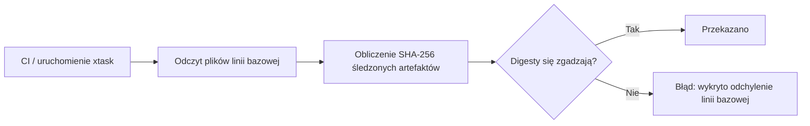

# xtask — linie bazowe

# xtask/baselines

Stałe sumy kontrolne SHA-256 dla krytycznych, tworzonych ręcznie artefaktów w repozytorium. Te linie bazowe służą jako mechanizm wykrywania manipulacji: gdy plik źródłowy jest celowo zmodyfikowany, jego odpowiednia linia bazowa musi zostać zaktualizowana w tym samym commicie. Niezamierzone lub ciche odchylenia powodują błąd weryfikacji w CI.

## Pliki

| Plik linii bazowej | Śledzony artefakt | Przeznaczenie |
|---|---|---|
| `agent.sha256` | `examples/custom-agent/agent.toml` | Referencyjna definicja agenta dostarczana jako przykład dla użytkowników |
| `config.sha256` | `librefang.toml.example` | Udokumentowany przykładowy plik konfiguracyjny wykorzystywany przez użytkowników |
| `openapi.sha256` | `openapi.json` | Maszynowo czytelna umowa API |

Każdy plik `.sha256` podąża za standardowym formatem `coreutils`:

```
<64-znakowy-digest-szesnastkowy>  <ścieżka-względna>
```

## Jak to działa

Te pliki to **czyste dane** — nie ma w tym module żadnego kodu wykonywalnego, żadnych importów i żadnego grafu wywołań w czasie wykonywania. Są one wykorzystywane przez weryfikator (zazwyczaj wywoływany z warstwy automatyzacji `xtask` lub zadania CI), który:

1. Odczytuje artefakt ze ścieżki zapisanej w linii bazowej.
2. Oblicza jego digest SHA-256.
3. Porównuje obliczony digest ze stałym digestem.
4. Powoduje błąd buildu/sprawdzenia, jeśli różnią się.



## Aktualizacja linii bazowych

Gdy celowo modyfikujesz którykolwiek ze śledzonych artefaktów, wygeneruj ponownie odpowiednią linię bazową:

```sh
sha256sum examples/custom-agent/agent.toml > xtask/baselines/agent.sha256
sha256sum librefang.toml.example > xtask/baselines/config.sha256
sha256sum openapi.json > xtask/baselines/openapi.sha256
```

Zatwierdź zaktualizowany plik `.sha256` razem ze zmianą artefaktu, aby recenzenci mogli zweryfikować, że modyfikacja była celowa.

## Relacja z resztą bazy kodu

- **`xtask/`** — Nadrzędny szkielet automatyzacji. Zadania xtask koordynują buildy, testy i sprawdzenia. Weryfikator wykorzystujący te linie bazowe znajduje się tutaj (lub jest stąd wywoływany).
- **`examples/custom-agent/agent.toml`** — Szablon, który użytkownicy kopiują i dostosowują. Odchylenie linii bazowej może wskazywać na przypadkową edycję udokumentowanego punktu wyjścia.
- **`librefang.toml.example`** — Kanoniczny przykład schematu konfiguracji aplikacji. Zmiany należy dokładnie sprawdzić, ponieważ użytkownicy wzorują na tym pliku własne konfiguracje.
- **`openapi.json`** — Publiczna specyfikacja API. Ochrona linii bazowej zapewnia, że zmiany schematu są zawsze widoczne podczas przeglądu kodu.

## Kiedy dodać nową linię bazową

Dodaj nowy plik `.sha256`, gdy:

- Nowy niekodowy artefakt (szablon konfiguracji, plik specyfikacji, fixture) staje się krytyczny dla użytkowników lub CI.
- Istniejący plik zaczyna być przetwarzany przez parser lub generator kodu, gdzie ciche zmiany mogłyby powodować trudne do debugowania błędy.

**Nie** dodawaj linii bazowych dla plików, które są generowane automatycznie, wynikami buildu lub już objęte tagami/wersjami kontroli wersji — te mają własny mechanizm zapewnienia integralności.
