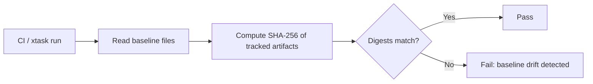

# xtask — baselines

# xtask/baselines

Pinned SHA-256 checksums for critical, human-authored artifacts in the repository. These baselines serve as a tamper-detection mechanism: when a source file is intentionally modified, its corresponding baseline must be updated in the same commit. Unintended or silent drift triggers a verification failure in CI.

## Files

| Baseline File | Tracked Artifact | Purpose |
|---|---|---|
| `agent.sha256` | `examples/custom-agent/agent.toml` | Reference agent definition shipped as a user-facing example |
| `config.sha256` | `librefang.toml.example` | Documented example configuration consumed by users |
| `openapi.sha256` | `openapi.json` | Machine-readable API contract |

Each `.sha256` file follows the standard `coreutils` format:

```
<64-hex-char-digest>  <relative-path>
```

## How It Works

These files are **pure data** — there is no executable code, no imports, and no runtime call graph in this module. They are consumed by a verifier (typically invoked from the `xtask` automation layer or a CI job) that:

1. Reads the artifact at the path recorded in the baseline.
2. Computes its SHA-256 digest.
3. Compares the computed digest against the pinned digest.
4. Fails the build/check if they differ.



## Updating Baselines

When you intentionally modify any of the tracked artifacts, regenerate the corresponding baseline:

```sh
sha256sum examples/custom-agent/agent.toml > xtask/baselines/agent.sha256
sha256sum librefang.toml.example > xtask/baselines/config.sha256
sha256sum openapi.json > xtask/baselines/openapi.sha256
```

Commit the updated `.sha256` file alongside the artifact change so reviewers can verify the modification was deliberate.

## Relationship to the Rest of the Codebase

- **`xtask/`** — The parent automation harness. xtask tasks orchestrate builds, tests, and checks. The verifier that consumes these baselines lives (or is invoked from) here.
- **`examples/custom-agent/agent.toml`** — A template users copy and adapt. Baseline drift here might indicate an accidental edit to a documented starting point.
- **`librefang.toml.example`** — The canonical example of the application's configuration schema. Changes should be reviewed carefully because users pattern their own configs on this file.
- **`openapi.json`** — The public API specification. Baseline protection ensures that schema changes are always visible in code review.

## When to Add a New Baseline

Add a new `.sha256` file when:

- A new non-code artifact (config template, spec file, fixture) becomes load-bearing for users or CI.
- An existing file starts being consumed by a parser or code generator where silent changes could cause hard-to-debug failures.

Do **not** add baselines for files that are auto-generated, build outputs, or already covered by version control tags/releases — those have their own integrity story.