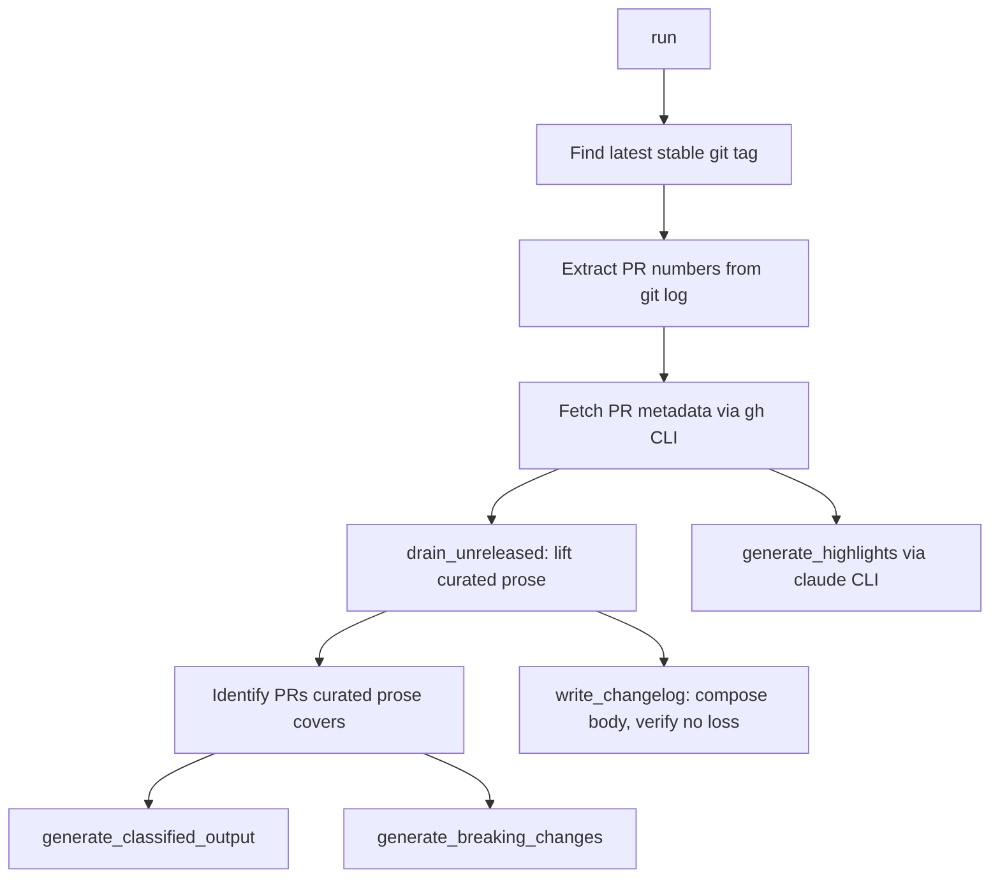

# xtask — src

# xtask — Workspace Development Tasks

The `xtask` crate is a Cargo workspace member that serves as the project's task runner. Each source file implements one `cargo xtask <subcommand>` entry point. The pattern replaces ad-hoc shell scripts with type-checked Rust, giving every development workflow — from benchmarking to release cutting — a single, discoverable CLI surface.

## Architecture

```
cargo xtask <command> [args]
        │
        ├── common::repo_root()          ← resolves the workspace root once
        │
        ├── api_docs     ← OpenAPI → Swagger UI HTML
        ├── bench        ← criterion baselines, throttling detection
        ├── build-timings ← cargo --timings parsing, regression diffing
        ├── build-web    ← pnpm builds for dashboard/web/docs
        ├── changelog    ← PR extraction, fragment folding, release notes
        └── ...          ← ci, clean-all, deps, dev, dist, release, etc.
```

Every subcommand follows the same contract:
- Accept a `clap::Parser` args struct
- Resolve the workspace root via `crate::common::repo_root()`
- Shell out to external tools (`cargo`, `pnpm`, `gh`, `claude`, `git`) as needed
- Return `Result<(), Box<dyn std::error::Error>>` so `main` can propagate failures

---

## Subcommand Reference

### `api_docs` — OpenAPI Documentation Generator

Generates a standalone Swagger UI HTML page from the workspace's `openapi.json`.

**Entry point:** `api_docs::run(ApiDocsArgs)`

| Flag | Default | Description |
|------|---------|-------------|
| `--output` | `api-docs` | Output directory (relative to repo root) |
| `--open` | — | Open the generated page in a browser |
| `--refresh` | — | Regenerate `openapi.json` via `cargo test -p librefang-api -- openapi_spec` before building docs |

The spec file is located by `find_openapi_spec`, which checks three candidate paths in order: repo root, `crates/librefang-api/`, and `docs/`. The generated `index.html` references `openapi.json` via CDN-hosted Swagger UI bundle, and the spec is copied alongside it.

### `bench` — Criterion Benchmark Runner

**Entry point:** `bench::run(BenchArgs)`

| Flag | Description |
|------|-------------|
| `--name` | Filter to a specific benchmark by name |
| `--save-baseline` | Save results under a named criterion baseline |
| `--baseline` | Compare against a previously saved baseline |
| `--open` | Open the HTML report after completion |

**Throttling awareness:** `bench` calls `local_check_mode::detect()` to probe CPU and memory resources. When running on a throttled host (low-spec CI or local dev machine), it emits a warning that benchmark numbers are unreliable. Critically, it does **not** apply throttled cargo settings (`jobs=1`, `codegen-units=1`) — those settings corrupt benchmark results. Criterion arguments are forwarded after `--`.

### `build-timings` / `compare-build-timings` — Compile-Time Regression Tracking

**Entry points:** `build_timings::run_collect(BuildTimingsArgs)` and `build_timings::run_compare(CompareBuildTimingsArgs)`

#### Collection

Runs `cargo build --workspace --timings`, then parses the generated HTML report to extract per-crate self-compile times. The parser handles two cargo report formats:

1. **Literal array:** `const UNIT_DATA = [...]` — walked with bracket-depth tracking to handle `]` inside string values.
2. **JSON.parse form:** `const UNIT_DATA = JSON.parse('...')` — un-escapes JS single-quoted string literals.

Each crate's total is the **sum of all its units** (lib, tests, benches, integration tests). This aggregation is intentional: individual units shift around as tests are added or split, but the per-package total remains a stable signal.

Snapshots are written to `bench-results/build-timings/<git-sha>.json` as sorted JSON objects with 3-decimal-place rounding, keeping git diffs minimal.

#### Comparison

Diffs the newest snapshot against `bench-results/build-timings/baseline.json`. Key behaviors:

- Crates with baseline compile time ≤ 0.5s are skipped (small absolute deltas produce meaningless percentages).
- Exits non-zero when any crate regresses beyond the threshold (default 10%).
- Designed for a **soft CI alert** (`continue-on-error: true`), not a blocking gate.
- Returns exit 0 with a notice when no baseline exists yet, so the first weekly run can seed it.

### `build-web` — Frontend Build Orchestrator

**Entry point:** `build_web::run(BuildWebArgs)`

| Flag | Description |
|------|-------------|
| `--dashboard` | Build only `crates/librefang-api/dashboard` |
| `--web` | Build only `web/` |
| `--docs` | Build only `docs/` |

With no flags, builds all three. Each target runs `pnpm install --frozen-lockfile` followed by `pnpm run build`, timed with an `Instant` stopwatch. Directories without a `package.json` are silently skipped.

---

## `changelog` — Release Notes Generation

The most complex subcommand. It assembles a dated `## [VERSION]` section in `CHANGELOG.md` from three sources:

1. **Curated `[Unreleased]` prose** — hand-written bullets contributors add under `## [Unreleased]`
2. **Generated PR entries** — titles fetched via `gh` CLI, classified by conventional-commit prefix
3. **`changelog.d/` fragments** — per-PR markdown files folded in before the release is cut

### `cargo xtask changelog <version>`

**Entry point:** `changelog::run(ChangelogArgs)`



#### PR Extraction and Classification

`parse_pr_numbers` walks `git log --oneline` output and takes only the **last** `(#N)` per line — GitHub squash merges append the PR reference as the trailing `(#N)`, and any earlier `#N` is a cross-reference to an unrelated issue or prior PR.

Each PR title is classified by conventional-commit prefix:

| Prefix | Category |
|--------|----------|
| `feat` | Added |
| `fix` | Fixed |
| `refactor` | Changed |
| `perf` | Performance |
| `docs`/`doc` | Documentation |
| `chore`, `ci`, `build`, `test`, `style` | Maintenance |
| `revert` | Reverted |
| *(other)* | Other |

**Primary categories** (Added, Fixed, Changed, Performance) render above the fold. Secondary categories (Documentation, Maintenance, Reverted, Other) are collapsed into a `<details>` block to keep the release view scannable.

#### Curated Prose Handling

The `## [Unreleased]` section is drained via `drain_unreleased`: its body is lifted out verbatim (preserving subsection order and heading text), leaving behind an empty `## [Unreleased]` heading that survives the release so in-flight PRs can still append to it.

Which PRs the curated prose documents determines which generated entries are suppressed — a PR documented by hand-written prose must not also appear as a generated title line. PR reference extraction from curated bullets uses the **last `(#N)` group on the last non-empty line** of each bullet, handling:
- Multi-PR groups: `(#6594, #6595)`
- Trailing bare cross-references: `(#6492): ... (the latter via #6441)` credits `#6492`, not `#6441`
- Unreferenced bullets fail open **per bullet**: the bullet's own PR keeps its generated line, but does not disarm suppression for bullets that did carry references.

#### No-Loss Guards

Two independent guards prevent silent prose loss:

1. **`verify_no_curated_bullet_lost`** — runs before every write. Compares whole bullet blocks (marker line + all continuation lines) against the composed body. A `## [` in column 0 inside a bullet continuation truncates what `drain_unreleased` sees; this guard scans to the next *dated* heading instead and catches the truncation.

2. **`prose_dropped_by_regeneration`** — fires when re-cutting a release for a version that already has a `## [VERSION]` section. After the first run drains `[Unreleased]`, a second run's `verify_no_curated_bullet_lost` is blind (it derives its expectation from the now-empty section). This second guard checks the existing `## [VERSION]` section for attributed bullets the regenerated body would drop.

Both guards **abort before writing anything**. The file is left untouched.

#### Highlights Generation

`generate_highlights` feeds the breaking-changes block plus the full classified output to the `claude` CLI (model `claude-sonnet-4-6`). It returns `None` on any failure — missing CLI, non-zero exit, empty response — and never gates the release. Highlights are deliberately generated from the **full** PR list, not the deduped one, so the summarizer sees the changes someone cared enough to write about.

### `cargo xtask collect-fragments`

**Entry point:** `changelog::collect_fragments(CollectFragmentsArgs)` → `collect_fragments_in`

Folds every `changelog.d/<section>/*.md` fragment into `## [Unreleased]`, then deletes the consumed files.

#### Fragment Directories

```rust
const FRAGMENT_SECTIONS: &[(&str, &str)] = &[
    ("added", "Added"),
    ("fixed", "Fixed"),
    ("changed", "Changed"),
    ("security", "Security"),
    ("documentation", "Documentation"),
];
```

The directory names are a cross-language contract with `scripts/check-changelog-attribution.py`. The test `fragment_sections_match_the_python_validator` enforces that both lists agree — a section added only to the Rust side would cause the Python validator to reject valid fragments, while a section added only to the validator would let fragments pass review then silently vanish at assembly time.

#### Fragment Rendering

`render_fragment_bullet` converts a fragment body into a CHANGELOG bullet:
- Leading/trailing blank lines stripped
- First line gains the `- ` marker
- A leading list marker (`- `, `* `, `+ `) the author wrote anyway is stripped to avoid `- - Fix foo`
- Unindented continuation lines gain two-space indent; already-indented lines are copied verbatim

Fragments are sorted by filename before assembly to ensure deterministic output regardless of filesystem `read_dir` order. Consumed fragments are deleted after the CHANGELOG is written; if a deletion fails, the error names the survivor so the operator can recover by hand — otherwise the next run would fold the same bullet in twice.

#### Folding Mechanics

`fold_fragments` appends fragment bullets to existing `### ` subsections under `[Unreleased]`, creating missing subsections at their canonical position. The canonical order is defined by `FRAGMENT_SECTIONS`: Added, Fixed, Changed, Security, Documentation. Unrecognised section directories (e.g., `changelog.d/fix/`) trigger a warning but are left in place, not deleted — the per-PR attribution gate is what rejects them before they reach a release.

---

## Shared Utilities

### `common::repo_root()`

Called by every subcommand to resolve the workspace root. All path construction branches from this single anchor point.

### `local_check_mode`

Probes host resources (`detect_cpus`, memory) and exposes a `LocalCheckMode` enum. `detect()` returns `(mode, probe)` where mode is `Full` or `Throttled`. Used by `bench` to warn about unreliable numbers. `apply_for_subcommand` injects throttled cargo settings (`jobs=1`, `codegen-units=1`) for compilation-heavy tasks — but explicitly **not** for benchmarks.

---

## Testing

The `changelog` module carries the most extensive test suite in `xtask`. Tests use a `TmpTree` RAII guard that creates an isolated scratch directory with `CHANGELOG.md` and the five `changelog.d/` section directories, cleaning up on drop. A process-wide atomic counter (`SEQ`) prevents parallel test threads from sharing directories.

Two tests run against the **repo's own `CHANGELOG.md`** (read-only):
- `drains_the_repos_own_unreleased_section_without_tripping_the_guard` — exercises the drain against 160+ real hand-written bullets
- `folds_into_the_repos_own_changelog` — folds a probe fragment into the real file's `[Unreleased]` section

Both use `repo_changelog_with_populated_unreleased`, which reconstitutes the pre-release shape on release branches where `[Unreleased]` has already been drained.

The `build_timings` module tests the two cargo report formats and snapshot roundtrip serialization in a temp directory.