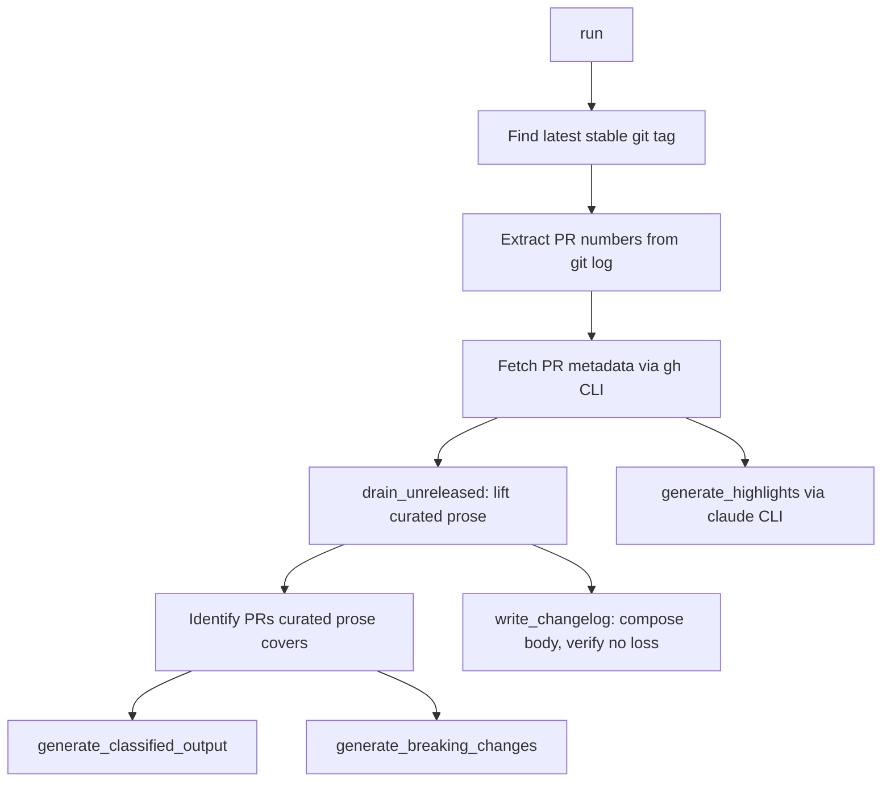

# xtask — src

# xtask — Zadania Rozwojowe Workspace

Kratek `xtask` jest członkiem workspace Cargo pełniącym rolę uruchamiacza zadań projektu. Każdy plik źródłowy implementuje jeden punkt wejścia `cargo xtask <podkomenda>`. Ten wzorzec zastępuje doraźne skrypty powłoki sprawdzanym typowo Rustem, nadając każdemu przepływowi pracy rozwojowej — od benchmarków po tworzenie wydań — pojedynczą, łatwą do odkrycia powierzchnię CLI.

## Architektura

```
cargo xtask <polecenie> [argumenty]
        │
        ├── common::repo_root()          ← resolves the workspace root once
        │
        ├── api_docs     ← OpenAPI → Swagger UI HTML
        ├── bench        ← punkt odniesienia criterion, wykrywanie dławienia
        ├── build-timings ← analiza cargo --timings, porównywanie regresji
        ├── build-web    ← kompilacje pnpm dla dashboard/web/docs
        ├── changelog    ← ekstrakcja PR, składanie fragmentów, notki wydania
        └── ...          ← ci, clean-all, deps, dev, dist, release itd.
```

Każda podkomenda podąża za tym samym kontraktem:
- Akceptuje strukturę argumentów `clap::Parser`
- Rozwiązuje katalog główny workspace poprzez `crate::common::repo_root()`
- Wywołuje zewnętrzne narzędzia (`cargo`, `pnpm`, `gh`, `claude`, `git`) w razie potrzeby
- Zwraca `Result<(), Box<dyn std::error::Error>>`, aby `main` mógł propagować błędy

---

## Podręcznik Podkomend

### `api_docs` — Generator Dokumentacji OpenAPI

Generuje samodzielny plik HTML Swagger UI na podstawie `openapi.json` workspace.

**Punkt wejścia:** `api_docs::run(ApiDocsArgs)`

| Flaga | Domyślnie | Opis |
|-------|-----------|-----|
| `--output` | `api-docs` | Katalog wyjściowy (względem katalogu głównego repozytorium) |
| `--open` | — | Otwórz wygenerowaną stronę w przeglądarce |
| `--refresh` | — | Przegeneruj `openapi.json` poprzez `cargo test -p librefang-api -- openapi_spec` przed zbudowaniem dokumentacji |

Plik specyfikacji jest lokalizowany przez `find_openapi_spec`, który sprawdza trzy kandydujące ścieżki po kolei: katalog główny repozytorium, `crates/librefang-api/` oraz `docs/`. Wygenerowany `index.html` odwołuje się do `openapi.json` za pomocą pakietu Swagger UI hostowanego przez CDN, a specyfikacja jest kopiowana obok niego.

### `bench` — Uruchamiacz Benchmarków Criterion

**Punkt wejścia:** `bench::run(BenchArgs)`

| Flaga | Opis |
|-------|-----|
| `--name` | Filtruj do konkretnego benchmarku po nazwie |
| `--save-baseline` | Zapisz wyniki pod nazwanym punktem odniesienia criterion |
| `--baseline` | Porównaj z wcześniej zapisanym punktem odniesienia |
| `--open` | Otwórz raport HTML po zakończeniu |

**Świadomość dławienia:** `bench` wywołuje `local_check_mode::detect()`, aby sprawdzić zasoby CPU i pamięci. Podczas uruchamiania na zdławionym hoście (niskospecyfikacyjne CI lub lokalna maszyna deweloperska), emituje ostrzeżenie, że wyniki benchmarków są niewiarygodne. Co kluczowe, **nie** aplikuje dławionych ustawień cargo (`jobs=1`, `codegen-units=1`) — te ustawienia psują wyniki benchmarków. Argumenty criterion są przekazywane po `--`.

### `build-timings` / `compare-build-timings` — Śledzenie Regresji Czasu Kompilacji

**Punkty wejścia:** `build_timings::run_collect(BuildTimingsArgs)` oraz `build_timings::run_compare(CompareBuildTimingsArgs)`

#### Zbieranie

Uruchamia `cargo build --workspace --timings`, a następnie analizuje wygenerowany raport HTML, aby wyodrębnić czas samodzielnej kompilacji dla każdej kratki. Analizator obsługuje dwa formaty raportów cargo:

1. **Tablica dosłowna:** `const UNIT_DATA = [...]` — przechodzona ze śledzeniem głębokości nawiasów, aby obsłużyć `]` wewnątrz wartości łańcuchowych.
2. **Forma JSON.parse:** `const UNIT_DATA = JSON.parse('...')` — odwraca escaping jednocudzysłowych literałów łańcuchowych JS.

Suma dla każdej kratki to **suma wszystkich jej jednostek** (lib, testy, benchmarke, testy integracyjne). Ta agregacja jest celowa: poszczególne jednostki przesuwają się w miarę dodawania lub dzielenia testów, ale suma per-pakiet pozostaje stabilnym sygnałem.

Migawki są zapisywane do `bench-results/build-timings/<git-sha>.json` jako posortowane obiekty JSON z zaokrągleniem do 3 miejsc po przecinku, co minimalizuje gitty diffy.

#### Porównanie

Różnicuje najnowszą migawkę względem `bench-results/build-timings/baseline.json`. Kluczowe zachowania:

- Kratki z punktem odniesienia czasu kompilacji ≤ 0,5 s są pomijane (małe delty bezwzględne dają bezsensowne procenty).
- Zwraca niezerowy kod wyjścia, gdy jakakolwiek kratka ulega regresji powyżej progu (domyślnie 10%).
- Zaprojektowane jako **miękki alert CI** (`continue-on-error: true`), a nie blokująca brama.
- Zwraca kod wyjścia 0 z powiadomieniem, gdy punkt odniesienia nie istnieje jeszcze, aby pierwszy tygodniowy przebieg mógł go zainicjować.

### `build-web` — Orkiestrator Kompilacji Frontendu

**Punkt wejścia:** `build_web::run(BuildWebArgs)`

| Flaga | Opis |
|-------|-----|
| `--dashboard` | Zbuduj tylko `crates/librefang-api/dashboard` |
| `--web` | Zbuduj tylko `web/` |
| `--docs` | Zbuduj tylko `docs/` |

Bez flag buduje wszystkie trzy. Każdy cel uruchamia `pnpm install --frozen-lockfile`, po czym `pnpm run build`, mierzone stoperem `Instant`. Katalogi bez `package.json` są po cichu pomijane.

---

## `changelog` — Generowanie Notek Wydania

Najbardziej złożona podkomenda. Składa datowaną sekcję `## [WERSJA]` w `CHANGELOG.md` z trzech źródeł:

1. **Kuratowane prozy `[Unreleased]`** — ręcznie pisane punkty dodawane przez współtwórców pod `## [Unreleased]`
2. **Generowane wpisy PR** — tytuły pobierane przez CLI `gh`, klasyfikowane według prefiksu conventional-commit
3. **Fragmenty `changelog.d/`** — pliki markdown per PR składane przed wydaniem wersji

### `cargo xtask changelog <wersja>`

**Punkt wejścia:** `changelog::run(ChangelogArgs)`



#### Ekstrakcja i Klasyfikacja PR

`parse_pr_numbers` przechodzi przez wynik `git log --oneline` i pobiera tylko **ostatnie** `(#N)` z każdej linii — GitHub squash-merges dodaje odniesienie do PR jako końcowe `(#N)`, a każde wcześniejsze `#N` jest odniesieniem do niezwiązanego issue lub wcześniejszego PR.

Każdy tytuł PR jest klasyfikowany według prefiksu conventional-commit:

| Prefiks | Kategoria |
|---------|-----------|
| `feat` | Dodano |
| `fix` | Naprawiono |
| `refactor` | Zmieniono |
| `perf` | Wydajność |
| `docs`/`doc` | Dokumentacja |
| `chore`, `ci`, `build`, `test`, `style` | Utrzymanie |
| `revert` | Cofnięto |
| *(inne)* | Pozostałe |

**Kategorie główne** (Dodano, Naprawiono, Zmieniono, Wydajność) są renderowane powyżej zgięcia. Kategorie poboczne (Dokumentacja, Utrzymanie, Cofnięto, Pozostałe) są zwijane do bloku `<details>`, aby widok wydania pozostawał czytelny.

#### Obsługa Kuratowanej Prozy

Sekcja `## [Unreleased]` jest opróżniana poprzez `drain_unreleased`: jej treść jest podnoszona dosłownie (z zachowaniem kolejności podsekcji i tekstu nagłówków), zostawiając pusty nagłówek `## [Unreleased]`, który przetrwa wydanie, aby PR w toku mogły nadal do niego dołączać.

Od tego, które PR dokumentuje skuratkowana proza, zależy, które generowane wpisy są pomijane — PR udokumentowany ręcznie nie może jednocześnie pojawić się jako generowana linia tytułu. Ekstrakcja odniesień do PR z kuratowanych punktów używa **ostatniej grupy `(#N)` na ostatniej niepustej linii** każdego punktu, obsługując:
- Grupy wielo-PR: `(#6594, #6595)`
- Kończące gołe odnośniki krzyżowe: `(#6492): ... (the latter via #6441)` przypisuje `#6492`, nie `#6441`
- Punkty bez odniesień zawodzą otwarcie **per punkt**: własny PR punktu zachowuje swoją generowaną linię, ale nie wyłącza pomijania dla punktów, które niosły odnośniki.

#### Zabezpieczenia Przed Utratą

Dwa niezależne zabezpieczenia zapobiegają cichej utracie prozy:

1. **`verify_no_curated_bullet_lost`** — uruchamia się przed każdym zapisem. Porównuje całe bloki punktów (linia znacznika + wszystkie linie kontynuacji) ze skomponowaną treścią. `## [` w kolumnie 0 wewnątrz kontynuacji punktu obcina to, co widzi `drain_unreleased`; to zabezpieczenie skanuje do następnego *datowanego* nagłówka i wyłapuje obcięcie.

2. **`prose_dropped_by_regeneration`** — aktywuje się podczas ponownego wycinania wydania dla wersji, która ma już sekcję `## [WERSJA]`. Po pierwszym przebiegu opróżniającym `[Unreleased]`, `verify_no_curated_bullet_lost` drugiego przebiegu jest ślepy (pochodzi jego oczekiwanie z teraz pustej sekcji). To drugie zabezpieczenie sprawdza istniejącą sekcję `## [WERSJA]` pod kątem przypisanych punktów, które zregenerowana treść odrzuciłaby.

Oba zabezpieczenia **przerywają przed zapisaniem czegokolwiek**. Plik pozostaje nietknięty.

#### Generowanie Podsumowań

`generate_highlights` przekazuje blok zmian łamiących kompatybilność oraz pełny sklasyfikowany wynik do CLI `claude` (model `claude-sonnet-4-6`). Zwraca `None` w przypadku jakiejkolwiek awarii — brak CLI, niezerowy kod wyjścia, pusta odpowiedź — i nigdy nie blokuje wydania. Podsumowania są celowo generowane z **pełnej** listy PR, nie z dedupowanej, aby podsumowujący widział zmiany, na których ktoś wystarczająco mu zależało, by o nich pisać.

### `cargo xtask collect-fragments`

**Punkt wejścia:** `changelog::collect_fragments(CollectFragmentsArgs)` → `collect_fragments_in`

Składa każdy fragment `changelog.d/<sekcja>/*.md` do `## [Unreleased]`, a następnie usuwa zużyte pliki.

#### Katalogi Fragmentów

```rust
const FRAGMENT_SECTIONS: &[(&str, &str)] = &[
    ("added", "Added"),
    ("fixed", "Fixed"),
    ("changed", "Changed"),
    ("security", "Security"),
    ("documentation", "Documentation"),
];
```

Nazwy katalogów stanowią kontrakt między językami z `scripts/check-changelog-attribution.py`. Test `fragment_sections_match_the_python_validator` wymusza zgodność obu list — sekcja dodana tylko po stronie Rust spowodowałaby, że walidator Pythona odrzuciłby prawidłowe fragmenty, podczas gdy sekcja dodana tylko do walidatora pozwalałaby fragmentom przejść rewizję, a potem cichutko zniknąć w czasie składania.

#### Renderowanie Fragmentów

`render_fragment_bullet` konwertuje treść fragmentu na punkt CHANGELOG:
- Usuwane początkowe/końcowe puste linie
- Pierwsza linia zyskuje znacznik `- `
- Wiodący znacznik listy (`- `, `* `, `+ `), który autor i tak napisał, jest usuwany, aby uniknąć `- - Napraw foo`
- Niezindentowane linie kontynuacji zyskują dwuspacjowe wcięcie; już zindentowane linie są kopiowane dosłownie

Fragmenty są sortowane według nazwy pliku przed składaniem, aby zapewnić deterministyczny wynik niezależnie od kolejności `read_dir` systemu plików. Zużyte fragmenty są usuwane po zapisaniu CHANGELOG; jeśli usunięcie się nie powiedzie, błąd nazywa ocalałego, aby operator mógł odzyskać ręcznie — w przeciwnym razie następny przebieg złożyłby ten sam punkt podwójnie.

#### Mechanika Składania

`fold_fragments` dołącza punkty fragmentów do istniejących podsekcji `### ` pod `[Unreleased]`, tworząc brakujące podsekcje w ich kanonicznej pozycji. Kanoniczna kolejność jest zdefiniowana przez `FRAGMENT_SECTIONS`: Added, Fixed, Changed, Security, Documentation. Nierozpoznane katalogi sekcji (np. `changelog.d/fix/`) wyzwalają ostrzeżenie, ale pozostają na miejscu, nieusunięte — per-PR brama atrybucji jest tym, co je odrzuca, zanim dotrą do wydania.

---

## Narzędzia Współdzielone

### `common::repo_root()`

Wywoływane przez każdą podkomendę do rozwiązania katalogu głównego workspace. Cała konstrukcja ścieżek rozgałęzia się od tego pojedynczego punktu kotwicy.

### `local_check_mode`

Bada zasoby hosta (`detect_cpus`, pamięć) i eksponuje enum `LocalCheckMode`. `detect()` zwraca `(mode, probe)`, gdzie mode to `Full` lub `Throttled`. Wykorzystywane przez `bench` do ostrzegania o niewiarygodnych liczbach. `apply_for_subcommand` wstrzykuje dławione ustawienia cargo (`jobs=1`, `codegen-units=1`) dla zadań obciążonych kompilacją — ale wyraźnie **nie** dla benchmarków.

---

## Testowanie

Moduł `changelog` nosi najbardziej rozbudowany zestaw testów w `xtask`. Testy używają stražnika RAII `TmpTree`, który tworzy odizolowany katalog roboczy z `CHANGELOG.md` i pięcioma katalogami sekcji `changelog.d/`, sprzątając przy dropie. Atomowy licznik procesowy (`SEQ`) zapobiega współdzieleniu katalogów przez równoległe wątki testowe.

Dwa testy uruchamiają się przeciwko **własnemu `CHANGELOG.md` repozytorium** (tylko do odczytu):
- `drains_the_repos_own_unreleased_section_without_tripping_the_guard` — wykonuje opróżnienie na 160+ rzeczywistych ręcznie pisanych punktach
- `folds_into_the_repos_own_changelog` — składa fragment sondy w sekcję `[Unreleased]` rzeczywistego pliku

Oba używają `repo_changelog_with_populated_unreleased`, który rekonstruuje kształt przed wydaniem na gałęziach wydania, gdzie `[Unreleased]` został już opróżniony.

Moduł `build_timings` testuje dwa formaty raportów cargo oraz serializację rundtrip migawek w katalogu tymczasowym.
