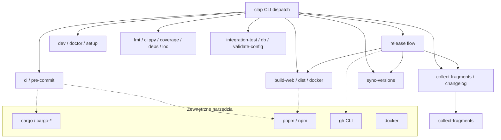
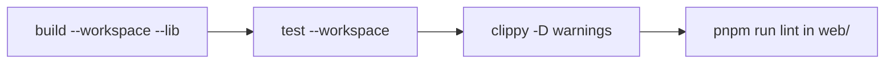

# xtask — xtask

# xtask — Automatyzacja budowania LibreFang

## Przegląd

`xtask` to samodzielny binarny program w Rust, który zapewnia wieloplatformową automatyzację budowania dla obszaru roboczego LibreFang. Zastępuje kolekcję rozproszonych skryptów powłoki (`scripts/release.sh`, `scripts/sync-versions.sh`, `scripts/generate-changelog.sh` i kilka ręcznych przepływów pracy) jednym, typowanym interfejsem CLI zbudowanym na `clap`.

Plik binarny znajduje się w `xtask/` i jest wywoływany za pomocą `cargo xtask <polecenie>`. Nie jest publikowany w żadnym rejestrze — istnieje wyłącznie jako narzędzie dla deweloperów i CI w tym obszarze roboczym.

## Zasady projektowe

- **Pojedynczy punkt wejścia**: każde zadanie automatyzacji jest podpoleceniem `cargo xtask`, więc współtwórcy muszą pamiętać tylko jedną przestrzeń nazw poleceń.
- **Fail-fast**: polecenia w stylu CI (`ci`, `release`, `pre-commit`) przerywają działanie przy pierwszym nieudanym kroku, zamiast maskować częściowe błędy.
- **Świadome zależności**: polecenia wymagające zewnętrznych narzędzi (`gh`, `pnpm`, `lychee`, `cargo-llvm-cov`) albo instalują je automatycznie, albo degradują się z wyraźnym komunikatem.
- **Niejinteraktywne domyślnie w CI**: kluczowe polecenia akceptują flagi (`--no-confirm`, `--no-push`, `--dry-run`), co czyni je bezpiecznymi dla zautomatyzowanych potoków.

## Architektura



## Zależności

| Crate | Przeznaczenie |
|-------|--------------|
| `clap` | Analiza argumentów CLI z makrami derive i obsługą zmiennych środowiskowych |
| `serde_json` | Analiza JSON dla `package.json`, `tauri.conf.json` |
| `toml_edit` | Edycja TOML zachowująca format dla `Cargo.toml`, plików konfiguracyjnych |
| `regex` | Dopasowywanie wzorców dla ciągów wersji, klasyfikacji PR-ów |
| `chrono` | Datowanie/nadawanie znaczników wersji dla wydań CalVer |
| `base64` / `sha2` | Narzędzia sum kontrolnych i kodowania |
| `sysinfo` | Badanie RAM/CPU dla heurystyk autothrottle (`LIBREFANG_LOCAL_CHECK_MODE`, issue #3301) |
| `librefang-import` | Lokalny crate obszaru roboczego, używany przez polecenie `migrate` |

**Uwaga o `sysinfo`**: przypięty do wersji `0.39` z domyślnymi funkcjami wyłączonymi. Potrzebna jest tylko sonda `system` (nie dyski/sieci/procesy). Linia `0.39.x` jest najnowszą kompatybilną z MSRV obszaru roboczego (`rustc 1.94.1`); `sysinfo 0.40+` wymaga `rustc 1.95`.

## Odniesienie do poleceń

### Przepływ wydania

Polecenie `release` to najbardziej złożona orkiestracja. Łańcuchuje wiele podpoleceń:

1. **`collect-fragments`** — składa wpisy z `changelog.d/` w `## [Unreleased]`
2. **`changelog`** — generuje nową sekcję z datą ze scalonych PR-ów
3. **`sync-versions`** — aktualizuje CalVer we wszystkich manifeście pakietów
4. **`build-web`** — buduje wszystkie cele frontendowe
5. **Commit + tag** — tworzy commit wersji i tag git
6. **Push + PR** — wypycha gałąź i tworzy PR przez `gh`

Warunki wstępne: musisz być na `main`, czyste drzewo robocze, dostępne CLI `gh`.

```bash
cargo xtask release --version 2026.3.2214 --no-confirm   # CI
cargo xtask release                                      # interaktywny
cargo xtask release --no-push                            # lokalny dry run
```

### Lokalne CI (`ci`)

Replikuje potok CI lokalnie z uporządkowanymi krokami fail-fast:



Flagi `--no-test`, `--no-web` i `--release` pozwalają zawęzić zakres uruchomienia.

### System fragmentów changeloga

Współtwórcy piszą indywidualne pliki markdown w katalogu `changelog.d/<sekcja>/` zamiast edytować wspólny blok `## [Unreleased]`. To eliminuje konflikty scalania w `CHANGELOG.md`.

**Sekcje** (uporządkowane tak, jak się pojawiają): Dodano, Naprawiono, Zmieniono, Bezpieczeństwo, Dokumentacja.

**Zasady składania** (`collect-fragments`):
- Punktory w ramach sekcji są uporządkowane wg nazwy pliku — deterministycznie niezależnie od kolejności odczytu systemu plików.
- Istniejące podsekcje `### ` są dołączane, nigdy nie zastępowane.
- Fragmenty w nierozpoznanych katalogach pozostają na swoim miejscu z ostrzeżeniem; bramka `scripts/check-changelog-attribution.py` wymusza to per-PR.
- Jeśli nie można usunąć pliku fragmentu po złożeniu, pozostałe usunięcia nadal trwają, a następnie polecenie kończy się niepowodzeniem, wymieniając ocalałe. `CHANGELOG.md` jest w tym momencie już zapisany, więc ponowne uruchomienie wymaga ręcznego czyszczenia w celu uniknięcia duplikatów.

No-op (exit 0), gdy `changelog.d/` nie istnieje lub jest pusty.

### Synchronizacja wersji (`sync-versions`)

Aktualizuje CalVer w różnych ekosystemach pakietów:

| Cel | Uwagi o formacie |
|-----|-----------------|
| `Cargo.toml` (workspace) | Bezpośrednia edycja przez `toml_edit` |
| `sdk/javascript/package.json` | `serde_json` |
| `sdk/python/setup.py` | Konwersja PEP 440: `-beta1` → `b1` |
| `sdk/rust/Cargo.toml` + `README.md` | Ciąg wersji w dwóch plikach |
| `packages/whatsapp-gateway/package.json` | `serde_json` |
| `crates/librefang-desktop/tauri.conf.json` | Kodowanie kompatybilne z MSI |

### Budowanie frontendu (`build-web`)

Buduje jeden lub wszystkie z trzech celów frontendowych przez `pnpm`:

- **Dashboard**: `crates/librefang-api/dashboard/` (React)
- **Web**: `web/` (Vite + React)
- **Docs**: `docs/` (Next.js)

Pomija cele bez `package.json`.

### Testy integracyjne (`integration-test`)

Uruchamia demona, odpytuje endpointy API, opcjonalnie testuje ścieżkę LLM, a następnie czyści proces.

Sekwencja testów:
1. `GET /api/health`
2. `GET /api/agents`
3. `GET /api/budget`
4. `GET /api/network/status`
5. `POST /api/agents/{id}/message` (pomijane z `--skip-llm`)
6. Weryfikacja delty budżetu po wywołaniu LLM

Domyślny binarny: `target/release/librefang`.

### Dystrybucja (`dist`, `docker`, `publish-sdks`)

- **`dist`**: Cross-kompiluje binaria wydania dla linux (x86_64, aarch64), macOS (x86_64, aarch64) i Windows (x86_64). Tworzy archiwa `.tar.gz` (unix) i `.zip` (Windows). Obsługuje `--cross` dla toolchainu `cross`.
- **`docker`**: Buduje `ghcr.io/librefang/librefang` z `./Dockerfile`. Opcjonalnie `--push` do GHCR, tagowanie `--latest`, budowanie per platforma.
- **`publish-sdks`**: Publikuje do npm, PyPI i crates.io. `--dry-run` weryfikuje poświadczenia i manifesty bez przesyłania.

### Migracja (`migrate`)

Importuje agentów z zewnętrznych frameworków przy użyciu crate'u obszaru roboczego `librefang-import`.

Obsługiwane źródła: `openclaw`, `openfang`.

```bash
cargo xtask migrate --source openclaw --source-dir ./data --dry-run
```

### Środowisko deweloperskie

| Polecenie | Przeznaczenie |
|-----------|--------------|
| `setup` | Pierwsze uruchomienie dla nowych współtwórców: sprawdza narzędzia, instaluje hooki, pobiera zależności, uruchamia `pnpm install` |
| `dev` | Uruchamia demona + serwer deweloperski dashboardu razem; Ctrl+C zatrzymuje oba |
| `doctor` | Głęboka diagnostyka: toolchain, porty, stan demona, konfiguracja, klucze API |
| `db` | Inspekcja, kopia zapasowa lub reset bazy danych (demon musi być zatrzymany do resetu) |
| `validate-config` | Analizuje i weryfikuje `~/.librefang/config.toml` |

### Jakość kodu

| Polecenie | Co robi |
|-----------|---------|
| `fmt` | Zunifikowany check formatowania (`cargo fmt` + `prettier`); `--fix` automatycznie naprawia |
| `pre-commit` | Uruchamia fmt + clippy + test jako bramkę pre-commit |
| `coverage` | Generuje raporty przez `cargo-llvm-cov`; automatycznie instaluje narzędzie |
| `deps` | Audyt bezpieczeństwa + sprawdzenie nieaktualnych; automatycznie instaluje `cargo-audit` i `cargo-outdated` |
| `license-check` | Zgodność licencyjna przez `cargo-deny` lub rezerwę `cargo metadata` |
| `check-links` | Weryfikacja linków przez `lychee` lub wbudowany sprawdzacz linków względnych |
| `bench` | Runner benchmarków Criterion z porównaniem do linii bazowej |
| `loc` | Statystyki kodu i rozkład per crate |
| `update-deps` | Partchowa aktualizacja zależności (Rust + web) |
| `codegen` | Regeneruje `openapi.json` z adnotacji utoipa |
| `api-docs` | Generuje samodzielny HTML Swagger UI ze specyfikacji OpenAPI |
| `clean-all` | Głębokie czyszczenie `target/`, `node_modules/`, `.next/`, `dist/` |

## Relacja z resztą obszaru roboczego

`xtask` to liść w grafie zależności — zależy od crate'ów obszaru roboczego, ale nic od niego nie zależy. Jego punkty połączenia to:

- **`librefang-import`** (zależność ścieżkowa): napędza polecenie `migrate`.
- **Workspace `Cargo.toml`**: odczytuje i zapisuje wersję obszaru roboczego przez `toml_edit`.
- **`web/`, `docs/`, `crates/librefang-api/dashboard/`**: wywoływane przez podprocesy `pnpm`.
- **`scripts/check-changelog-attribution.py`**: uzupełniająca bramka uruchamiana per-PR; `xtask` nie duplikuje tego sprawdzenia, ale szanuje jego ograniczenia podczas składania fragmentów.
- **Potoki CI**: wywołują `cargo xtask ci`, `cargo xtask dist`, `cargo xtask docker` itd. jako kanoniczne kroki budowania.

## Integracja autothrottle

Zależność `sysinfo` napędza autothrottle dla `LIBREFANG_LOCAL_CHECK_MODE` (issue #3301). Podczas lokalnego uruchamiania sprawdzan w stylu CI narzędzie bada dostępny RAM i CPU, aby zdecydować, czy równoleglić, czy szeregowac kroki. To zachowanie lokalne xtask — żaden produkcyjny crate nie używa `sysinfo`.

## Uwagi o MSRV

`sysinfo` jest wiążącym ograniczeniem dla minimalnej obsługiwanej wersji Rust obszaru roboczego. Obszar roboczy przypina `rust-version = "1.94.1"` w głównym `Cargo.toml`. Każda przyszła aktualizacja `sysinfo` powyżej `0.39.x` musi być skoordynowana z podwyższeniem MSRV, ponieważ `sysinfo 0.40+` wymaga `rustc 1.95`.
