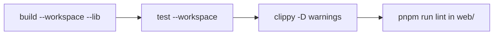

# xtask — xtask

# xtask — LibreFang Build Automation

## Overview

`xtask` is a standalone Rust binary that provides cross-platform build automation for the LibreFang workspace. It replaces a collection of scattered shell scripts (`scripts/release.sh`, `scripts/sync-versions.sh`, `scripts/generate-changelog.sh`, and several manual workflows) with a single, typed CLI built on `clap`.

The binary lives at `xtask/` and is invoked via `cargo xtask <command>`. It is not published to any registry — it exists solely as a developer and CI tool within this workspace.

## Design Principles

- **Single entry point**: every automation task is a subcommand of `cargo xtask`, so contributors only need to remember one command namespace.
- **Fail-fast**: CI-style commands (`ci`, `release`, `pre-commit`) abort on the first failing step rather than masking partial failures.
- **Dependency-aware**: commands that need external tools (`gh`, `pnpm`, `lychee`, `cargo-llvm-cov`) either auto-install them or degrade gracefully with a clear message.
- **Non-interactive by default in CI**: key commands accept flags (`--no-confirm`, `--no-push`, `--dry-run`) that make them safe for automated pipelines.

## Architecture


## Dependencies

| Crate | Purpose |
|-------|---------|
| `clap` | CLI argument parsing with derive macros and env var support |
| `serde_json` | JSON parsing for `package.json`, `tauri.conf.json` |
| `toml_edit` | Loss-preserving TOML editing for `Cargo.toml`, config files |
| `regex` | Pattern matching for version strings, PR classification |
| `chrono` | Date/version stamping for CalVer releases |
| `base64` / `sha2` | Checksum and encoding utilities |
| `sysinfo` | RAM/CPU probing for auto-throttle heuristics (`LIBREFANG_LOCAL_CHECK_MODE`, issue #3301) |
| `librefang-import` | Local workspace crate, used by the `migrate` command |

**Note on `sysinfo`**: pinned at `0.39` with default features disabled. Only the `system` probe is needed (not disks/networks/processes). The `0.39.x` line is the newest compatible with the workspace MSRV of `rustc 1.94.1`; `sysinfo 0.40+` requires `rustc 1.95`.

## Command Reference

### Release Workflow

The `release` command is the most complex orchestration. It chains multiple subcommands together:

1. **`collect-fragments`** — folds `changelog.d/` entries into `## [Unreleased]`
2. **`changelog`** — generates a new dated section from merged PRs
3. **`sync-versions`** — bumps CalVer across all package manifests
4. **`build-web`** — builds all frontend targets
5. **Commit + tag** — creates a version commit and git tag
6. **Push + PR** — pushes the branch and creates a PR via `gh`

Preconditions: must be on `main`, clean worktree, `gh` CLI available.

```bash
cargo xtask release --version 2026.3.2214 --no-confirm   # CI
cargo xtask release                                      # interactive
cargo xtask release --no-push                            # local dry run
```

### Local CI (`ci`)

Replicates the CI pipeline locally with ordered, fail-fast steps:



Flags `--no-test`, `--no-web`, and `--release` allow scoping the run.

### Changelog Fragment System

Contributors write individual markdown files under `changelog.d/<section>/` rather than editing the shared `## [Unreleased]` block. This eliminates merge conflicts on `CHANGELOG.md`.

**Sections** (ordered as they appear): Added, Fixed, Changed, Security, Documentation.

**Assembly rules** (`collect-fragments`):
- Bullets within a section are ordered by filename — deterministic regardless of filesystem read order.
- Existing `### ` subsections are appended to, never replaced.
- Fragments in unrecognized directories are left in place with a warning; the gate `scripts/check-changelog-attribution.py` enforces this per-PR.
- If a fragment file cannot be deleted after folding, remaining deletions still proceed, then the command fails naming survivors. `CHANGELOG.md` is already written at that point, so re-running requires manual cleanup to avoid duplicate entries.

No-op (exit 0) when `changelog.d/` is absent or empty.

### Version Sync (`sync-versions`)

Updates CalVer across heterogeneous package ecosystems:

| Target | Format Notes |
|--------|-------------|
| `Cargo.toml` (workspace) | Direct edit via `toml_edit` |
| `sdk/javascript/package.json` | `serde_json` |
| `sdk/python/setup.py` | PEP 440 conversion: `-beta1` → `b1` |
| `sdk/rust/Cargo.toml` + `README.md` | Version string in two files |
| `packages/whatsapp-gateway/package.json` | `serde_json` |
| `crates/librefang-desktop/tauri.conf.json` | MSI-compatible encoding |

### Frontend Builds (`build-web`)

Builds one or all of three frontend targets via `pnpm`:

- **Dashboard**: `crates/librefang-api/dashboard/` (React)
- **Web**: `web/` (Vite + React)
- **Docs**: `docs/` (Next.js)

Skips targets without a `package.json`.

### Integration Testing (`integration-test`)

Boots the daemon, probes API endpoints, optionally exercises the LLM path, then cleans up the process.

Test sequence:
1. `GET /api/health`
2. `GET /api/agents`
3. `GET /api/budget`
4. `GET /api/network/status`
5. `POST /api/agents/{id}/message` (skipped with `--skip-llm`)
6. Budget delta verification after LLM call

Default binary: `target/release/librefang`.

### Distribution (`dist`, `docker`, `publish-sdks`)

- **`dist`**: Cross-compiles release binaries for linux (x86_64, aarch64), macOS (x86_64, aarch64), and Windows (x86_64). Produces `.tar.gz` (unix) and `.zip` (Windows) archives. Supports `--cross` for `cross` toolchain.
- **`docker`**: Builds `ghcr.io/librefang/librefang` from `./Dockerfile`. Optional `--push` to GHCR, `--latest` tagging, platform-specific builds.
- **`publish-sdks`**: Publishes to npm, PyPI, and crates.io. `--dry-run` validates credentials and manifests without uploading.

### Migration (`migrate`)

Imports agents from external frameworks using the workspace crate `librefang-import`.

Supported sources: `openclaw`, `openfang`.

```bash
cargo xtask migrate --source openclaw --source-dir ./data --dry-run
```

### Developer Environment

| Command | Purpose |
|---------|---------|
| `setup` | First-time contributor setup: checks tools, installs hooks, fetches deps, runs `pnpm install` |
| `dev` | Starts daemon + dashboard dev server together; Ctrl+C stops both |
| `doctor` | Deep diagnostics: toolchain, ports, daemon health, config, API keys |
| `db` | Database inspection, backup, or reset (daemon must be stopped for reset) |
| `validate-config` | Parses and validates `~/.librefang/config.toml` |

### Code Quality

| Command | What it does |
|---------|-------------|
| `fmt` | Unified format check (`cargo fmt` + `prettier`); `--fix` auto-fixes |
| `pre-commit` | Runs fmt + clippy + test as a pre-commit gate |
| `coverage` | Generates reports via `cargo-llvm-cov`; auto-installs the tool |
| `deps` | Security audit + outdated check; auto-installs `cargo-audit` and `cargo-outdated` |
| `license-check` | License compliance via `cargo-deny` or `cargo metadata` fallback |
| `check-links` | Link validation via `lychee` or built-in relative-link checker |
| `bench` | Criterion benchmark runner with baseline comparison |
| `loc` | Code statistics and per-crate breakdown |
| `update-deps` | Batch dependency updates (Rust + web) |
| `codegen` | Regenerates `openapi.json` from utoipa annotations |
| `api-docs` | Generates standalone Swagger UI HTML from the OpenAPI spec |
| `clean-all` | Deep clean of `target/`, `node_modules/`, `.next/`, `dist/` |

## Relationship to the Rest of the Workspace

`xtask` is a leaf node in the dependency graph — it depends on workspace crates but nothing depends on it. Its connection points are:

- **`librefang-import`** (path dependency): powers the `migrate` command.
- **Workspace `Cargo.toml`**: reads and writes the workspace version via `toml_edit`.
- **`web/`, `docs/`, `crates/librefang-api/dashboard/`**: invoked via `pnpm` subprocess calls.
- **`scripts/check-changelog-attribution.py`**: complementary gate that runs per-PR; `xtask` does not duplicate this check but respects its constraints during fragment assembly.
- **CI pipelines**: call `cargo xtask ci`, `cargo xtask dist`, `cargo xtask docker`, etc. as the canonical build steps.

## Auto-Throttle Integration

The `sysinfo` dependency powers an auto-throttle for `LIBREFANG_LOCAL_CHECK_MODE` (issue #3301). When running CI-like checks locally, the tool probes available RAM and CPU to decide whether to parallelize or serialize steps. This is xtask-local behavior — no production crate uses `sysinfo`.

## MSRV Considerations

`sysinfo` is the binding constraint on the workspace's minimum supported Rust version. The workspace pins `rust-version = "1.94.1"` in the root `Cargo.toml`. Any future bump of `sysinfo` beyond `0.39.x` must be coordinated with an MSRV bump, since `sysinfo 0.40+` requires `rustc 1.95`.