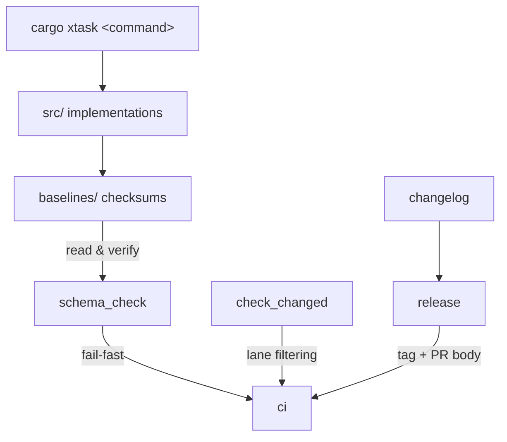

# xtask

# xtask — Build Automation

## Purpose

`xtask` is the workspace's single task runner — a non-published Rust binary invoked as `cargo xtask <command>`. It replaces ad-hoc shell scripts with type-checked, discoverable CLI subcommands covering everything from benchmarking to release cutting. Every contributor and CI pipeline goes through the same entry point.

## Module Layout

| Sub-module | Role |
|---|---|
| [xtask](xtask.md) | Design principles, invocation model, and the fail-fast CI philosophy. |
| [src](src.md) | One file per subcommand — the actual implementations (`bench`, `ci`, `release`, `changelog`, `schema_check`, etc.). |
| [baselines](baselines.md) | Pinned SHA-256 digests for human-authored artifacts (`agent.toml`, `librefang.toml.example`, `openapi.json`). |

The [src](src.md) module contains the code; the [baselines](baselines.md) directory holds the checksum data that commands like `schema_check` read and verify at runtime. The top-level [xtask](xtask.md) document defines the conventions both follow.

## Key Workflows

Several development workflows chain across sub-modules:

- **CI checks** — [`ci`](src.md) runs [`check_changed`](src.md) to determine which lanes (crates, docs, web) are affected, then conditionally executes formatting, clippy, tests, and baseline verification.
- **Release cutting** — [`release`](src.md) orchestrates tag discovery, changelog folding via [`changelog`](src.md), PR body generation, and ensures baseline files stay consistent.
- **Baseline integrity** — Any commit touching a tracked artifact must also update its corresponding `.sha256` in [baselines](baselines.md); [`schema_check`](src.md) enforces this in CI.
- **Dependency updates** — [`update_deps`](src.md) refreshes both Rust and web dependencies, while [`deps`](src.md) runs audit checks.

The unifying principle: one typed CLI surface, fail-fast semantics, and baseline-protected artifacts — so that every automation path is reproducible locally and in CI.