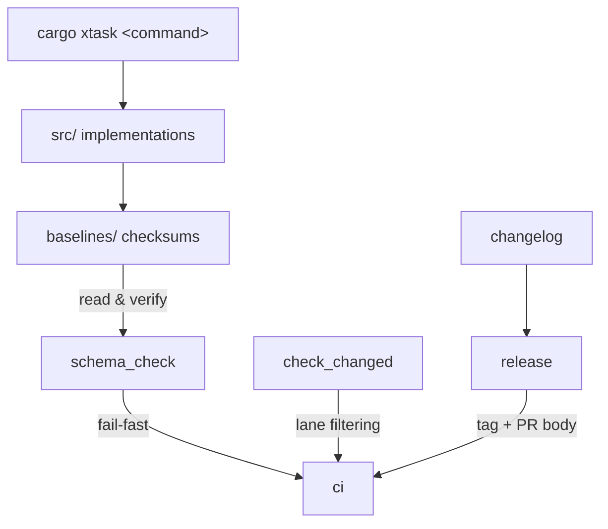

# xtask

# xtask — Automatyzacja budowania

## Cel

`xtask` to jedyny runner zadań w przestrzeni roboczej — niepublikowany binarium Rust wywoływany jako `cargo xtask <command>`. Zastępuje doraźne skrypty powłoki typowanymi, odkrywalnymi podkomendami CLI obejmującymi wszystko od benchmarków po tworzenie wydań. Każdy współtwórca i potok CI przechodzi przez ten sam punkt wejścia.

## Układ modułów

| Podmoduł | Rola |
|---|---|
| [xtask](xtask.md) | Zasady projektowania, model wywołań i filozofia fail-fast w CI. |
| [src](src.md) | Jeden plik na podkomendę — rzeczywiste implementacje (`bench`, `ci`, `release`, `changelog`, `schema_check` itd.). |
| [baselines](baselines.md) | Przypięte skróty SHA-256 dla artefaktów tworzonych ręcznie (`agent.toml`, `librefang.toml.example`, `openapi.json`). |

Moduł [src](src.md) zawiera kod; katalog [baselines](baselines.md) przechowuje dane sum kontrolnych, które komendy takie jak `schema_check` odczytują i weryfikują w czasie wykonywania. Dokument najwyższego poziomu [xtask](xtask.md) określa konwencje, które oba przestrzegają.

## Kluczowe przepływy pracy

Kilka przepływów pracy deweloperskich łączy się między podmodułami:

- **Kontrole CI** — [`ci`](src.md) uruchamia [`check_changed`](src.md), aby określić, które ścieżki (crates, docs, web) są dotknięte, a następnie warunkowo wykonuje formatowanie, clippy, testy i weryfikację linii bazowych.
- **Tworzenie wydań** — [`release`](src.md) koordynuje wykrywanie tagów, składanie changeloga przez [`changelog`](src.md), generowanie treści PR i dba o spójność plików linii bazowych.
- **Integralność linii bazowych** — Każdy commit dotykający śledzonego artefaktu musi również zaktualizować odpowiadający mu `.sha256` w [baselines](baselines.md); [`schema_check`](src.md) wymusza to w CI.
- **Aktualizacje zależności** — [`update_deps`](src.md) odświeża zarówno zależności Rust, jak i web, podczas gdy [`deps`](src.md) przeprowadza kontrole audytowe.

Nadrzędna zasada: jedna typowana powierzchnia CLI, semantyka fail-fast i artefakty chronione przez linie bazowe — dzięki czemu każda ścieżka automatyzacji jest powtarzalna lokalnie i w CI.
